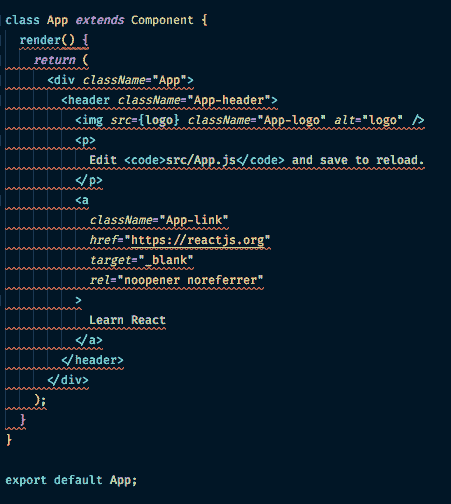

# 如何使用 Create React 应用程序设置 ESLint，TypeScript，Prettier

> 原文：<https://dev.to/benweiser/how-to-set-up-eslint-typescript-prettier-with-create-react-app-3675>

注意:https://github.com/facebook/create-react-app/issues/6475 3.0 将包括 TS 林挺和 ESLint，[T1】](https://github.com/facebook/create-react-app/issues/6475)

我最近了解到，TSLint 很快就要被废弃了(暗示悲伤的小提琴曲)，但是有很好的理由，因为 JS/TS 社区开始围绕一组公共的核心技术进行聚合。如果你有兴趣了解这些原因，Palantir(ts lint 的创建者)在这里为你准备了一篇精彩的文章。

唉，是时候让我把我的小型个人项目转向打字了。在过去的一年里，我一直是全职的 TypeScript 开发人员，我发现我非常想念它，即使是在较小的 JavaScript 项目中。我过去常常选择普通的 JS 来降低复杂性，但是现在我的 TypeScript 知识使得在最简单的项目上进行配置变得相当容易。更不用说 Create React App 的最新版本支持开箱即用的 TypeScript 集成了！

过去我已经建立了 TSLint 好几次，但是知道 ESLint 是 TypeScript 林挺的未来，我决定试一试。设置并不像我所希望的那样简单，因为目前事情处于不断变化的状态，由于缺乏文档，这带来了一些挑战，所以我决定在这里记录。

本文假设您使用的是 ESLint 自带的最新版本的 CRA。

首先，让我们安装或开发依赖项

```
npm i -D @types/react @typescript-eslint/eslint-plugin @typescript-eslint/parser eslint-config-prettier eslint-config-react eslint-plugin-prettier prettier 
```

Enter fullscreen mode Exit fullscreen mode

package.json 中的 devDependecies 现在应该是这样的，

```
 "devDependencies":  {  "@typescript-eslint/eslint-plugin":  "^1.6.0",  "@typescript-eslint/parser":  "^1.6.0",  "eslint-config-prettier":  "^4.1.0",  "eslint-config-react":  "^1.1.7",  "eslint-plugin-prettier":  "^3.0.1",  "prettier":  "^1.16.4"  } 
```

Enter fullscreen mode Exit fullscreen mode

现在在您的项目根目录下创建两个文件(与您的 src 文件夹在同一层)。

```
.eslintignore
.eslintrc.json 
```

Enter fullscreen mode Exit fullscreen mode

您可能会看到一些教程使用`.yml`或`.js`配置，而一些教程可能会完全排除一个`.eslintignore`，并在其节点 js 脚本中使用模式匹配来排除某些文件夹。所有这些方法都是有效的，您决定使用哪一种确实是一个偏好问题。

在你的. eslintrc.json 中添加

```
{  "extends":  [  "eslint:recommended",  "plugin:react/recommended",  "plugin:@typescript-eslint/recommended",  "prettier/@typescript-eslint",  "plugin:prettier/recommended"  ],  "plugins":  ["react",  "@typescript-eslint",  "prettier"],  "env":  {  "browser":  true,  "jasmine":  true,  "jest":  true  },  "rules":  {  "prettier/prettier":  ["error",  {  "singleQuote":  true  }]  },  "settings":  {  "react":  {  "pragma":  "React",  "version":  "detect"  }  },  "parser":  "@typescript-eslint/parser"  } 
```

Enter fullscreen mode Exit fullscreen mode

在你的。添加任何不想链接的路径。在我的例子中，我想排除我的测试文件夹和与 CRA
打包在一起的服务工作者

```
src/registerServiceWorker.js
src/**/__tests__/** 
```

Enter fullscreen mode Exit fullscreen mode

在您的`package.json`文件中，我们将添加一个新的脚本文件，它将允许我们运行我们的 linter。在你的反应脚本`start`、`build`和`test`旁边添加

```
"lint:fix":  "eslint './src/**/*.{ts,tsx}'", 
```

Enter fullscreen mode Exit fullscreen mode

假设我们已经构建了一个全新的 Create React App 项目，我们的下一步是创建我们的第一个 TypeScript 文件。继续将`App.js`重命名为`App.tsx`，并在您的终端中运行`npm start`。CRA 将检测这是一个 TypeScript 项目，并自动为您添加一个 tsconfig.json 文件。运行`npm run lint`将会在你的终端窗口中得到你的 linted 代码的输出。如果您使用 VSCode，请安装 ESLint 扩展，以便在编辑器中高亮显示。现在打开你的`App.tsx`文件，它看起来应该是这样的
[](https://res.cloudinary.com/practicaldev/image/fetch/s--9t-PdmuU--/c_limit%2Cf_auto%2Cfl_progressive%2Cq_auto%2Cw_880/https://thepracticaldev.s3.amazonaws.com/i/pv59ia1mea1moau70pzy.png) 
将你的鼠标悬停在`render`方法上应该会显示两个特定于 TypeScript 的 ESLint 错误。

```
Missing accessibility modifier on method definition render.eslint(@typescript-eslint/explicit-member-accessibility)
Missing return type on function.eslint(@typescript-eslint/explicit-function-return-type) 
```

Enter fullscreen mode Exit fullscreen mode

在编辑器中突出显示将让您知道您的代码是否违反了配置的 linter 规则，而不必显式运行`lint`脚本。如果我们想禁用这些规则，我们可以添加

```
 "@typescript-eslint/explicit-member-accessibility":  0,  "@typescript-eslint/explicit-function-return-type":  0, 
```

Enter fullscreen mode Exit fullscreen mode

到我们在`eslintrc.json`中的规则配置。在这里，我们可以禁用规则、启用新规则以及自定义我们已扩展的默认配置。在某些情况下，某些林挺问题可以通过在`npm run lint`后添加`--fix`来自动纠正。

如果在您的`settings.json`中使用 VSCode，添加以下内容以启用保存时自动修复，

```
 "eslint.validate":  [  "javascript",  "javascriptreact",  {  "language":  "typescript",  "autoFix":  true  },  {  "language":  "typescriptreact",  "autoFix":  true  }  ], 
```

Enter fullscreen mode Exit fullscreen mode