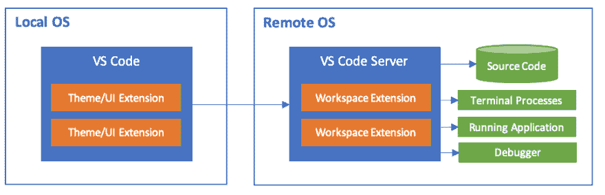

# 如何在 Windows 上设置完整的 Linux 桌面环境

> 原文：<https://dev.to/ihorklymenok/how-to-setup-full-linux-desktop-environment-on-windows-30mk>

我认为由于 Linux 的能力，每个 web 开发者迟早都会选择它。有人转到 macOS，有人继续使用 Linux，但是这篇文章是关于如何在 Windows 中使用 Linux 的全部功能，而不要在系统之间切换。

## 内容:

*   VS 代码远程扩展
*   没有痛苦的 Ubuntu VM
*   接下来会是什么？

## VS 代码远程扩展

本周，VS 代码团队展示了与您的远程环境交互的新方式。扩展使您能够打开容器、远程机器或 WSL 中的任何文件夹。这意味着您不再依赖于您主机系统。

当您连接到远程环境时，您将获得自动补全、调试器、git 和其他优秀工具的全面支持，这些工具安装在您的主机上，性能良好。在 VS Code 的网站上，很少有关于这种交互如何工作的图片:

您不需要在本地远程环境之间复制/粘贴文件，也不需要等待`npm install`完成执行。你只需要在你习惯的环境中连接并开始工作。

您可以在那里获得更多信息:

*   [远程扩展的正式文档](https://code.visualstudio.com/docs/remote/remote-overview)
*   [什么是 WSL](https://docs.microsoft.com/en-us/windows/wsl/about)

## Ubuntu VM 无痛苦

在过去两年的工作中，我的主要系统是 Ubuntu。我喜欢我在那里拥有的所有东西:shell 脚本的自动化、node 和 python 的原生感觉、易于设置、snap packages、docker 等等。但是在我家里，我安装了 Windows，老实说，它没有 Ubuntu 那样适合开发。我尝试了不同的方法来创建不错的开发环境，但是在每一种方法中我都遇到了一些麻烦，这剥夺了我舒适地工作和思考任务的机会。

因此，当我读到 VS 代码中的远程体验时，我想到了解决方案:完整的 Linux VM，能够连接到那里并以我喜欢的方式工作。

分步指南:

1.  为 Hyper-V 用户下载并安装 VirtualBox
    :相信我，你将有机会毫无痛苦地使用 Linux 版本的 docker

2.  下载并安装 travel
    简而言之，travel 是一个命令行界面，它可以让你在几分钟内完成所有你需要的设置

3.  我建议您为虚拟机创建单独的文件夹

    *   在单独的文件夹类型`vagrant init ubuntu/bionic64`中，它将下载并安装最小的 Ubuntu 镜像。此外，它还将创建存储所有虚拟机配置的`Vagrantfile`。
    *   `vagrant up`启动虚拟机

在这一步，工作完成了一半。现在你应该安装 OpenSSH 客户端，VS 代码内部人员和远程开发扩展包

1.  [用 PowerShell 安装 OpenSSH】](https://docs.microsoft.com/en-us/windows-server/administration/openssh/openssh_install_firstuse#installing-openssh-with-powershell)

2.  [安装 VS 代码内部人员](https://code.visualstudio.com/insiders/)

3.  [在 VS 代码中安装远程开发扩展包](https://marketplace.visualstudio.com/items?itemName=ms-vscode-remote.vscode-remote-extensionpack)

现在我们拥有了“远程”开发所需的一切。

1.  从带有`Vagrantfile`类型`vagrant ssh-config`
    的文件夹中，您将看到我们可以通过 VS 代码连接到我们的虚拟机的配置

2.  在由扩展提供的新远程屏幕中，通过复制粘贴从上一步接收的配置来配置到 VM 的连接。

3.  点击“连接”,瞧——你进入了虚拟机。安装所有需要的依赖项，创建/克隆您的项目，并在真正的 Linux 环境中做您需要的事情。

VS 代码远程可用的全部指令和附加功能[此处](https://code.visualstudio.com/docs/remote/ssh)

## 接下来会是什么？

5 月 6 日，微软宣布了第二代 WSL，它将支持完整的 Linux 内核 4.19。这意味着从 6 月底开始，我们不再需要内部版本，甚至不再需要虚拟机开销。所有的东西都将是健壮的和本土的。
查看关于 WSL2 [这里](https://devblogs.microsoft.com/commandline/announcing-wsl-2/)

感谢大家的关注。