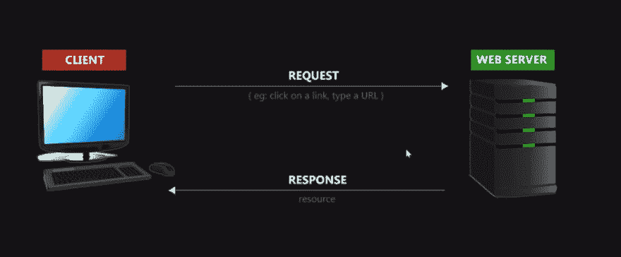
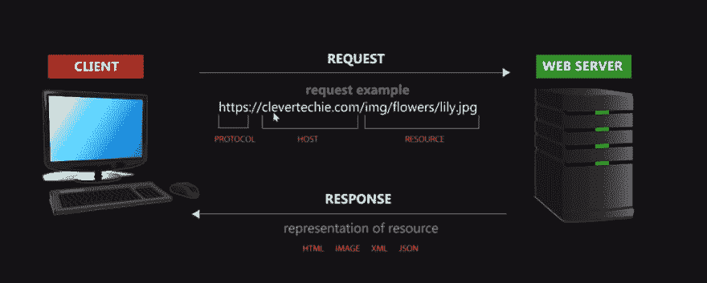
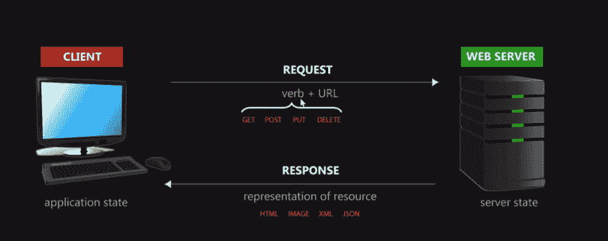

# 如何开始 REST API & RESTful Web 服务测试

> 原文：<https://dev.to/dohertykornelia/how-to-start-with-rest-api--restful-web-service-testing--2d1h>

## REST API & RESTful web 服务讲解

REST API，代表表述性状态转移应用程序编程接口。当您第一次开始理解 REST API 时，可能会遇到一些最简单的问题，确切地说，什么被表示，什么是状态，什么被传输。所以在这篇文章中，让我们分别看看这些单词，了解它们的意思。

单词“representations”意味着资源表示的转移，资源可以是互联网上可以命名的任何东西，如用户列表或照片、评论、帖子、文章、页面、视频、书籍、简介等列表。为了理解我们如何准确地获得资源的表示，您需要看看每个人如何与网页、客户机-服务器模型和 HTTP。这是 HTTP 协议:

每次你在浏览器中输入一个 URL，你就向 web 服务器发送了一个请求，web 服务器用一个资源作为响应。这里需要理解的重要一点是，每次你在浏览器中键入一个 URL 或者点击一个网页链接，你都是在从一个 web 服务器发送一个对特定资源的请求。web 服务器响应请求，并以正式的网页或资源的任何格式将资源发送到浏览器。要理解的第二个要点是，web 服务器实际上并不交付资源。它并没有向您发送它所拥有的数据库，而是以一种可读的格式表示该资源，例如 HTML 或 image。想想实际的资源，位于 web 服务器数据库或存储在 web 服务器硬盘上的物理事物，以及这些资源的副本表示，这些副本可以是人类可读的格式，如 HTML 或 image，也可以是程序员易于使用的格式，如 JSON 和 XML。把整个网络想象成一堆资源也是有帮助的。当我们点击一个链接或键入一个 URL 时，我们总是请求资源，难怪 URL 代表统一资源定位器。

那么“国家”这个词是什么意思呢？举个例子，每当我单击一个链接时，应用程序的状态就会发生变化，我会看到另一个资源，这是一个包含该资源所有其他内容的页面。当我点击所有这些不同的页面时，应用程序状态不断地从一个状态变化到下一个状态。当资源从 web 服务器传输过来时，我们发送一个对资源的请求，然后我们得到一个返回的表示，以及呈现的资源的任何格式。这就是“转移”一词的含义。然而，当我们单击下一个链接并转到另一个页面时，它也可以指应用程序状态的转移。

## 使用工具实现 REST API & RESTful web 服务测试

到目前为止，我已经使用了很多工具来处理 REST API 测试，其中一些真的很神奇，包括 Postman，Katalon Studio，JMeter，放心。如果您想要自动化 API 测试，但还没有测试工具，也没有任何资金支持，我强烈推荐 Katalon Studio，因为该工具是一个完全免费的强大功能的完整包。

如果你想了解更多，这里有一个关于如何用 Katalon Studio 测试 REST API & RESTful web 服务的分步教程[https://testautomationresources . com/API-testing/REST-API-RESTful-we b-services-testing/](https://testautomationresources.com/api-testing/rest-api-restful-web-services-testing/)