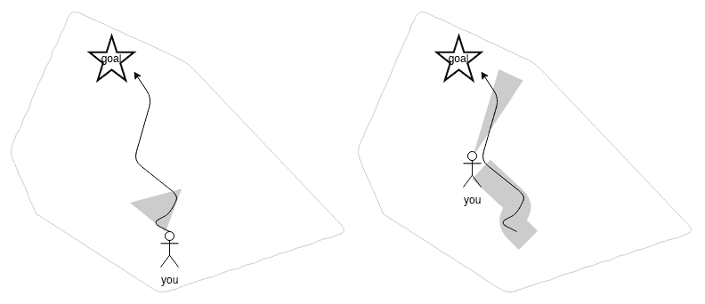
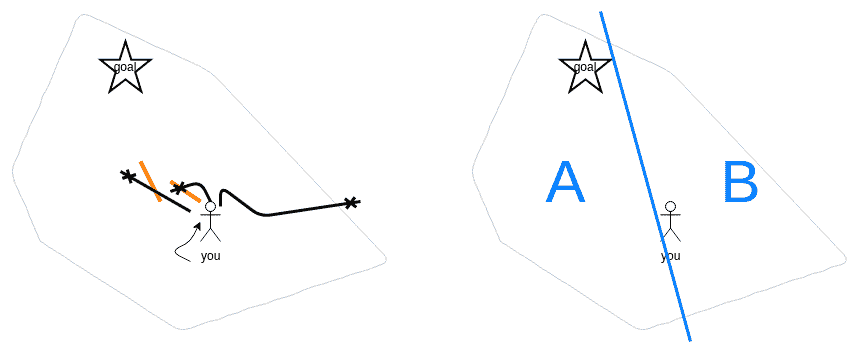

# 如何停止戳并开始结构化调试

> 原文：<https://dev.to/skurfuerst/how-to-stop-poking-and-start-structured-debugging-3e5g>

这篇文章解释了为什么结构化调试很难；并介绍了一种使这一过程更加简单的方法。然而，在此之前，我们首先需要介绍一个关于软件开发的基本心智模型，这将作为我们后面的类比。

## 一个心智模型:我们如何开发软件

通常，当我们开始在一个现有的更大的应用程序中开发时，我觉得这个过程就像是在探索一个未知的岛屿。开始时，我们只是粗略地知道我们想要归档什么，但是我们还不知道如何达到这个目标。我们必须首先探索我们附近的环境。

然后，我们走几步，边走边调整我们的路线。起初，我们迈出的步伐相当小；但是，随着我们对我们的岛屿(由你身后的大灰色区域描绘)了解越来越多，步子会变得越来越大，从而能够对系统的行为做出更正确的假设。

因此，随着时间的推移，我们正在提高我们的开发速度，因为我们的假设越来越好；因此，我们可以一次进行多个步骤，然后通过再次尝试应用程序来一起验证它们。当我们开始调试时，这将成为一个问题。

在现有的大型应用程序中进行开发就像是在一个以前未标明的岛屿上绘制地图。

## 调试意外行为

当一个意想不到的行为发生时，我经常看到人们四处打探；经常在重新运行应用程序之前立刻改变各种参数。基本上，当我们将高效软件开发的思想(见上文)应用于调试时，就会发生这种情况——但是这将我们引向了一条完全错误的道路。

我们基本上认为“*我们知道系统将如何运转*”——因此，我们一下子走得太远了；碰壁(用橙色表示)无法引导我们找到解决方案。当这些路线中的一条不起作用时，我们从头开始，重新尝试一个不同的方向——然而在另一个方向上又走得太远了。问题:**通过这样做，我们不再了解我们系统的任何新东西**(我们只是变得困惑)。

我们需要应用另一种思维来解决这个调试挑战。让我们假设一下，当我们遇到一个违反我们假设的行为时，我们对我们的软件一无所知。那我们怎么能进步呢？

## 解决方法:设计实验；运行它；分析；重复

我们可以假设我们的系统是一个不透明的黑盒子，这是我们无法理解的。现在，让我们用科学家会做的事情来更好地理解它:

1.  **设计一个实验**，将问题空间分成 50%左右，以确定我们的意外行为是位于问题空间的左半部分还是右半部分。这个实验返回明确的答案是很重要的(没有假设和概率)。这在上图中用蓝线和 A/B 部分描述。
2.  **运行实验**。
3.  **分析实验结果**。现在，您应该清楚地知道您的意外行为发生在问题空间的哪个部分。
4.  **重复新的实验**，再次将问题空间的相关部分一分为二。

当然，即使这样做，也可能发生实验失败而没有产生好结果的情况。然后，你需要明白这已经发生了，设计一个新的实验，基本上是丢弃旧的实验。

## 实用提示

*   设计好的实验*是上述过程*中最难的部分。
*   设计好的实验*需要一些经验；*随着时间的推移，你会发现这变得越来越容易。
*   当你开始设计实验时，你应该*明确地写下实验的假设*，它应该被证实或证伪。此外，写下实验设置。
*   对于由多个粗糙组件组成的系统，通常创建一个实验来隔离哪个组件对意外行为负责是一个好的开始，因此首先在组件边界处对分是一个好的开始。对于客户端-服务器 webapps，这意味着首先要弄清楚是应用程序的客户端部分还是应用程序的服务器端部分对意外行为负责。

## 关闭思绪

基本上，开发的时候，你想尽可能从系统上了解；所以我称之为*白盒思维*。另一方面，在调试时，你经常需要*黑箱思维*。在两者之间切换通常很困难；我希望这篇文章能让这变得简单一点。

期待您的反馈，

塞巴斯蒂安

PS:这非常类似于 *git 二等分*的行为:如果您需要弄清楚某个回归何时进入您的代码库，您可以使用它来识别自从问题存在以来的提交。
PPS:本文首次发表于[我们公司的博客](https://sandstorm.de/de/blog/post/how-to-stop-poking-and-start-structured-debugging.html)。