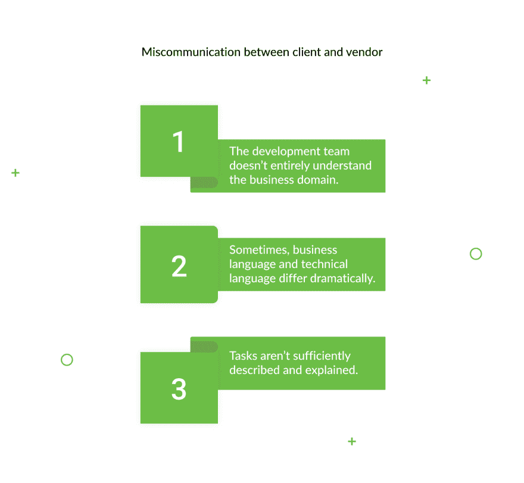
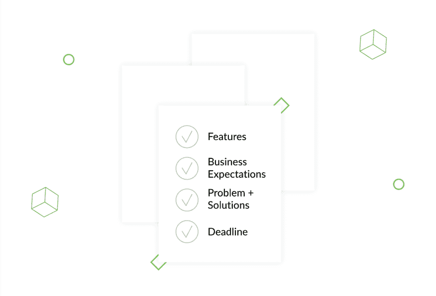
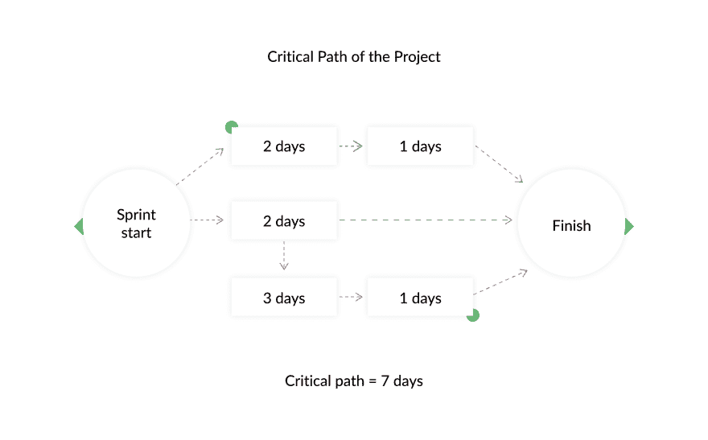
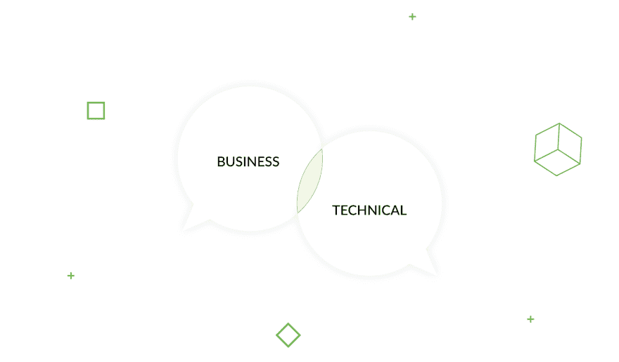
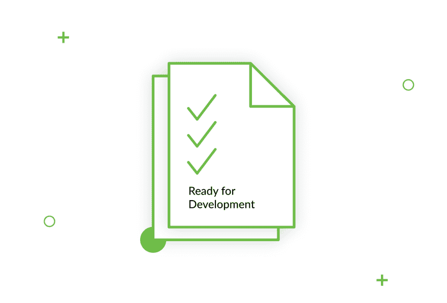
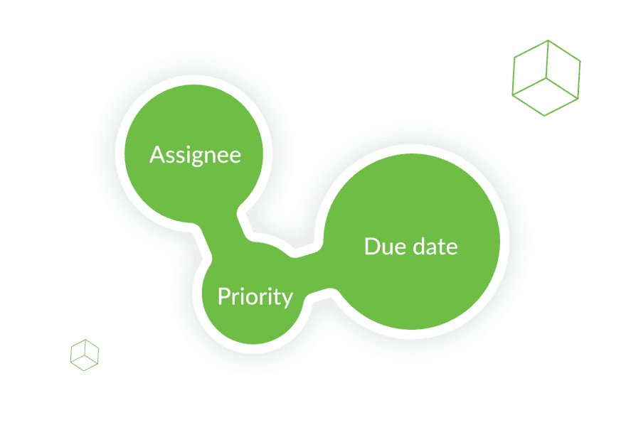
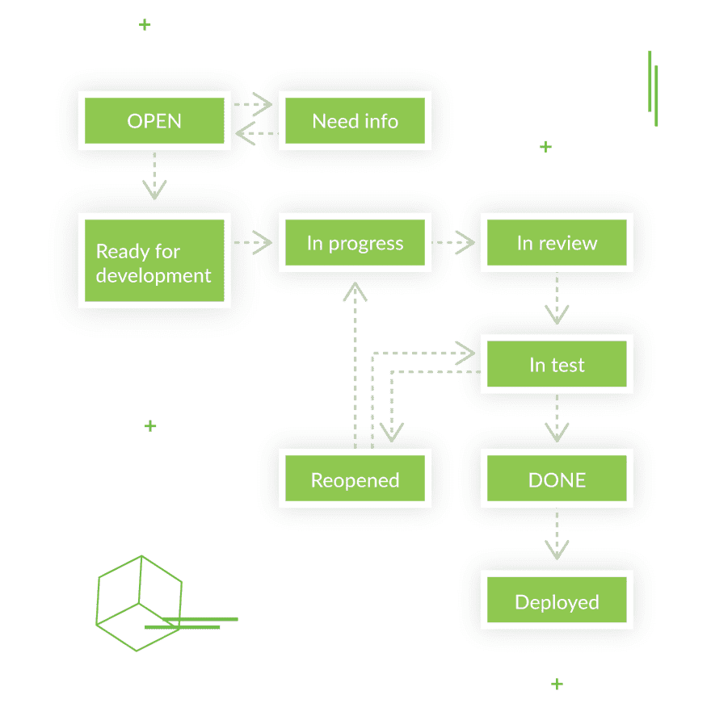

# 如何成功地设置任务并提高开发团队的生产力

> 原文：<https://dev.to/django_stars/how-to-successfully-set-tasks-and-boost-your-development-team-s-productivity-48eg>

有一句谚语说“去我不知道的地方，拿我不知道的东西”，通常，最具讽刺意味的是，这描述了一个糟糕的任务——一些我们都太了解并且不得不经历不止一次的事情。但是，在从事各种复杂程度的项目三年多之后，我已经发展了一些特殊的组织技能和深入的团队工作知识。因此，[我和](https://djangostars.com/case-studies/molo/)一起工作的开发团队已经准备好比以往更高效地工作。

## 错误设置任务的陷阱

任何团队内部的沟通都是其最重要的支柱之一。团队成员共同努力的结果取决于他们对部分流程、想法和建议的讨论程度。但最重要的是最初任务的沟通方式。**清晰、透明的任务更容易理解，这意味着团队可以更快地开始工作，而不是在过程中浪费大量时间问问题。**此外，如果每个人都明白他们的角色是什么，以及他们正在开发产品的哪一部分，那么到时候将这些部分放在一起会更容易。除此之外，**c**T5】立即传达某项任务或整个产品的价值会提高团队精神和积极性。

如果你把开发团队想象成一块珍贵的手表，[每个成员都是有价值的一部分。](https://djangostars.com/blog/form-successful-development-team/)为了让腕表正常工作，所有部件都应各就各位，各司其职。和人在一起有点复杂，但是原理是一样的。交流有助于人类机制的运转。**如果你把任务安排好** **，**如果说得清楚而有逻辑，你的手表，我的意思是，**你的团队将在未来的岁月里很好地为你服务并忠诚。**T9】

事实是，在设定任务时，沟通不畅是一个比我们想象的更大的问题。根据项目管理协会的[数据](https://www.pmi.org/-/media/pmi/documents/public/pdf/learning/thought-leadership/pulse/the-essential-role-of-communications.pdf)，不成功的沟通导致五分之一的项目失败。

### 沟通不畅的原因和后果

可悲的是，**有些业务人员**，产品负责人或业务分析师**为开发团队编写任务，他们甚至不知道自己有沟通问题。**即使是经验丰富的商人也会偶尔成为官僚主义和延伸的等级制度的牺牲品。**有时候，产品负责人根本没有充分发挥他们的作用。产品负责人应该是业务部门和开发团队之间的纽带。他们的主要任务是将业务方面要求的所有特性保存在一个地方，并将产品需求传达给开发人员。然而，这并不总是像预期的那样发生。**

如果是这种情况，有两种可能。要么是产品所有者甚至没有意识到沟通任务中的问题，要么是这种复杂的过程是他们开展业务的通常方式。

然而，我们都不得不面对这样一个事实:沟通不畅的目标会导致开发团队内部的压力和紧张，而错误或不合理的任务往往需要更多的努力(和金钱)才能完成。导致超出预算和截止日期(这也可能导致罚款)。当然，我们浪费了大量的时间一遍又一遍地解释需求。

让我们仔细看看到底发生了什么。可能导致开发团队和客户之间沟通不畅的潜在问题是什么？大部分可以大致分为三个子问题:

在我们确定了这三个方向之后，就更容易理解客户到底可以做些什么来更好地为他们合作的开发团队设置任务，从而节省时间、金钱和精力。最重要的是，记住哪里有问题，哪里就有解决方案。

## 如何正确设置任务

那么，如果 ***开发团队不知道他们必须合作的领域*** 的来龙去脉，你会怎么做？

### 介绍项目

在启动开发流程之前，**开始合作，向**展示未来产品的一系列功能。详细描述它将解决什么问题，以及它的业务期望。**举例说明竞争对手并设定截止日期**，如果有的话。这些可以是向利益相关者承诺的，也可以是与专业展览相关的。*

例如，如果六个月后有一个你肯定想参加的创业展，让开发人员知道，并提前为开发团队设定你的范围，让他们有足够的时间工作。T3】

有了这些信息，开发团队可以在早期阶段就开始有效地开发架构解决方案，这可以帮助他们了解需要多少时间，应该使用什么方法，以及看到他们的工作对业务的价值。

### 提供业务路线图

这将有助于定义一个更合理、更一致的发展方法。最重要的是，它将帮助开发人员**理解所有特性必须实现的顺序**，它们如何协同工作，以及它们的依赖关系是什么——是相互依赖、并行执行，还是重要的契约。*

例如，如果你在做任何需要与 *银行*、*或支付系统整合的事情，请记住，银行是相当官僚的，所以不要指望很快签署所有必要的合同。如果您正在开发一个复杂的银行服务解决方案，文书工作会极大地影响截止日期。*

### 找到共同语言

**商务语言和技术语言是不同的。**当与开发团队合作时，你能做些什么来防止这破坏你的沟通？

无论开发人员在他们的领域有多优秀，理解客户的一些需求对他们来说都是一个挑战。尤其是如果他们使用的**是该产品将要使用的领域中非常具体的术语。**作为一个开发公司的客户，或者与开发公司一起工作的产品负责人，你应该记住这一点，并保持简单。任务应该用每个人都能理解的语言来写。或者，如果你觉得没有办法绕过这些术语，双方必须就你在项目中要使用的词汇达成一致。

如果在所有这些之后，仍然有不清楚的问题，开发团队可以将他们的问题发送给客户。重要的是要让他们**表达清晰、专业****，以及使用商业术语和短语，如“我/我们理解正确吗，那个…，或者”...达成共识”。在任何情况下，客户都不应该因为不懂专业术语而感到自卑。但是如果双方都找到了理解，并且开发团队完全理解客户的业务需求，他们甚至可以提出更好的方法来满足这些需求。然而，这只有在开放和基于信任的交流条件下才能实现。**

 **### 组织沟通

作为这一部分的总结，我们建议**将所有的通信放在一个地方。**这将有助于你保持所有的讨论有序，易于查找，因此不会丢失任何东西。这样，如果一个团队成员、团队之外的人，或者可能是项目的新成员想要深入研究，他们将有**权限访问与项目相关的所有信息。**最后，如果有人离开项目并带走了他们所有的聊天记录和信件，维护一个项目的信息来源可以防止你的团队丢失数据。

糟糕的任务解释可能是最常见的问题，它将成功置于风险之中，不仅在与(远程)开发团队合作或管理中，而且在任何类型的风险投资中。在软件开发中，有一个为开发做好准备的概念。本质上，这描述了开发团队和产品所有者之间关于什么是完整的任务描述的协议，这样团队就可以开始工作了。

至此，我们已经讨论了很多不该做的事情，所以是时候开始讨论为开发人员编写任务的该做的事情了。正确的结构是什么？一个解释清楚且完整的任务实际上是什么样子的？

## 有效设置需要记住的任务类型

**一个有结构的、专注于重要的任务更容易把握和实现。**这就是为什么，我认为，对于团队来说，提前确定他们将要处理的任务的类型和内容是很重要的。

在我看来，有三种类型的任务:开发新功能、修复漏洞和调查。这些都有自己鲜明的特点。为了保持一个良好的任务结构，把注意力集中在这些事情上，集中在真正重要的事情上。

有许多制定任务的方法，但它们的共同目标是**详细描述功能并提供有价值的信息。**它们通常包括:

*   标题——对任务的简明扼要的描述，回答了什么问题？在哪里？什么时候？
*   描述——任务主体和要达到的实际目标。
*   *奖金！*–有助于理解描述的补充:
    *   带有任务标记的截图
    *   对应用程序其他部分的依赖和影响
    *   存储有公式的文件(如果是计算)
    *   一个可点击的原型展示了如何在页面间导航
    *   竞争对手的链接

**If you have to report a bug**, these tasks require slightly different information. You have to state explicitly what went wrong, where, when, and under which circumstances. To keep it clear and transparent, use these parts:

*   Title–这部分和(a)一样——简而言之，你说发生了什么，在哪里，什么时候。
*   描述。除了复制的步骤，完美的描述包含
*   经历过 bug 的用户数据，以及 bug 的环境；
*   事件发生的时间；T3】
*   A 该特定应用的典型附加条件；T3】
*   预期和实际结果；T3】
*   L 油墨原始要求、截图等...T3】

不是所有的客户都意识到一份好的 bug 报告的重要性。因此，他们不会花时间写下繁殖的步骤。有时，他们只是不理解一个详细任务的价值，但仍然尽快修复 bug。然而，这只会导致相反的结果——一个没有被充分描述的 bug，最终需要花费很长时间来被调查、复制，并最终被修复。当客户没有意识到 bug 的环境或确切位置的重要性时，可能会出现另一个问题。这时，客户可以通过简单地发送按钮的截屏来报告有问题的按钮，而不是显示 URL、计算机屏幕上的时间等的整个屏幕。这些数据会大大增加修复时间。为了节省大家的时间，双方应该就提前报告 bug 的流程进行讨论并达成一致。

**秒杀是要调查的任务。**峰值的结果是基于所进行的研究接收到有价值的信息。当客户需要决定与什么系统集成时，应该进行一定的分析，以便做出最佳决策。这就是调查任务——尖峰——存在的原因。像这样的任务产生的不是代码行，而是数据，客户可以根据这些数据做出明智的决策或准备下一步的开发。

## 关于设置任务的一般建议和提示

就像生活中的许多事情一样，微小的细节也能带来巨大的不同。类似地，**有一些功能可以帮助每个人更清楚地了解任务**，并保持整个开发过程透明有序。

T4】

1.  **受托人**——被分配任务并负责完成的人。客户可以向其咨询有关该流程特定部分的问题的人。
2.  **优先级**–通过设置任务优先级和减少不必要的沟通来优化开发流程。客户必须决定在给定的时刻什么功能和什么任务对他们更重要。
3.  **截止日期**——当然，团队必须知道分配给任务的时间框架——尤其是在任务没有被预先决定或同意的情况下。

为了帮助所有参与者了解每个人在任何给定时间所处的位置，包含每个任务的状态更新是很重要的。我们推荐一个统一的状态描述——三个阶段，如有必要，可细分为子阶段。这将有助于保持透明度，并对正在发生的事情有一个总体的了解:

**第一阶段。**制定业务需求。

**第二阶段。**发展过程。

**第三阶段。**被客户接受并部署。

如果你深入了解这些步骤的细节，它看起来就像这样:

当你开始一个项目时，你需要有关产品的信息。一旦所有的需求都完成了，任务就可以开始开发了。从“待办事项”中的任务，您可以继续查看该任务。经过测试后，它要么完成并准备好部署，要么重新打开进行改进，只有在完成时，才标记为准备好部署。

## 沟通是金

所有这些都证明，任何项目都需要客户和实现者、项目业主和供应商之间有条理的沟通和清晰的理解。糟糕的任务解释和模糊的需求会阻碍任何项目，大大延迟产品部署并显著增加开发成本。

为了避免任何可能的误解，双方都必须意识到未来可能的棘手问题，并提前讨论解决。通过确定项目中要使用的词汇，你可以清除任何可能引起问题的术语。最后，讨论最后期限和其他可能的限制是至关重要的。在所有这些之上，应该有一个讨论过的有效的任务结构，以及报告应用程序中的错误的方法。这看起来似乎没什么，但最终这将使客户和开发团队的体验尽可能的顺畅。

*由 Nataliia Peterheria 撰写，她是 [Django Stars](https://djangostars.com/blog/) 的项目经理。在姜戈明星博客上阅读原文。***