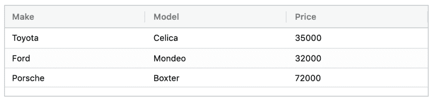
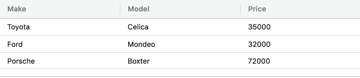

# 如何用 react-testing-library 测试实现细节

> 原文：<https://dev.to/mcrowder65/how-to-test-implementation-details-with-react-testing-library-4bln>

如果你正在使用 enzyme 来测试你的 react 组件，你应该考虑尽快切换到 react-testing-library，它的 API 是直观的，易于使用的，并且它鼓励以你的最终用户使用你的应用程序的方式来编写测试。

也就是说，当您使用 react-testing-library 编写测试时，它并不直接公开测试组件实现细节的方法，因为您的用户并不关心您使用的是无状态功能组件、有状态功能组件(带钩子的组件)还是类组件。有了 enzyme，测试实现细节变得很容易，这也鼓励了工程师们...测试实现细节。

我有一个奇怪的场景，在那里测试实现细节是有意义的，但我只知道如何用 enzyme 这样做，所以我发了一条推文列出了我的担忧，对此 react-testing-library 的作者 Kent C. Dodds 立即回复说我可以通过使用 refs 来测试实现细节。此处提供推文:[https://twitter.com/mcrowder65/status/1100587157264187392](https://twitter.com/mcrowder65/status/1100587157264187392)

所以我开始寻找如何实现这一点！

我在工作中遇到的具体用例是 ag-grid，所以我也想在这里重现，让我们用下面的代码呈现一个简单的网格:

```
import React from "react";
import { AgGridReact } from "ag-grid-react";
import "ag-grid-community/dist/styles/ag-grid.css";
import "ag-grid-community/dist/styles/ag-theme-balham.css";
import CellEditor from "./custom-cell";

function App() {
  const columnDefs = [
    {
      headerName: "Make",
      field: "make",
      cellEditorFramework: CellEditor,
      editable: true
    },
    {
      headerName: "Model",
      field: "model",
      cellEditorFramework: CellEditor,
      editable: true
    },
    {
      headerName: "Price",
      field: "price",
      cellEditorFramework: CellEditor,
      editable: true
    }
  ];
  const rowData = [
    {
      make: "Toyota",
      model: "Celica",
      price: 35000
    },
    {
      make: "Ford",
      model: "Mondeo",
      price: 32000
    },
    {
      make: "Porsche",
      model: "Boxter",
      price: 72000
    }
  ];

  return (
    <div
      className="ag-theme-balham"
      style={{
        height: "130px",
        width: "600px"
      }}
    >
      <AgGridReact columnDefs={columnDefs} rowData={rowData} />
    </div>
  );
}

export default App; 
```

这就产生了以下:
[](https://res.cloudinary.com/practicaldev/image/fetch/s--ndpMl2Yu--/c_limit%2Cf_auto%2Cfl_progressive%2Cq_auto%2Cw_880/https://thepracticaldev.s3.amazonaws.com/i/vmsn6xgq0kpsauc58rxe.png)

如果你看一下`columnDefs`，你会注意到我添加了`cellEditorFramework`，这允许我在这里添加我自己的自定义单元格编辑器。让我们看看自定义单元格编辑器。

```
import React from "react";
import { TextField } from "@material-ui/core";

class CellEditor extends React.Component {
  state = {
    value: this.props.value
  };
  getValue() {
    return this.state.value;
  }

  handleChange = event => {
    this.setState({ value: event.target.value });
  };

  render() {
    return <TextField value={this.state.value} onChange={this.handleChange} />;
  }
}

export default CellEditor; 
```

您会注意到，我们只是设置本地状态值，它采用初始属性值并同步到本地状态。但是如果你仔细观察，你会注意到这里的一件事，`getValue`是完全不必要的，它不提供任何价值！让我们来看看当我移除`getValue`开始编辑时，ag-grid 现在做了什么:

[](https://res.cloudinary.com/practicaldev/image/fetch/s--abzh2AmG--/c_limit%2Cf_auto%2Cfl_progressive%2Cq_66%2Cw_880/https://thepracticaldev.s3.amazonaws.com/i/xrpcutqbn6njoutupg5i.gif)

一旦我们完成编辑，该值就会消失！这是因为 ag-grid 调用 getValue 来获取最终值。一旦我们完成了编辑，它不知道该值存储在 state 中。因此，有三件事必须做，以确保这个代码的工作。

1.  重新添加 getValue。
2.  像这样添加一个 jsdoc:

```
 /**
   * Ag-grid calls this function to get the final value once everything is updated.
   * DO NOT DELETE
   * @returns {String|Number} this.state.value
   */
  getValue() {
    return this.state.value;
  } 
```

1.  创建一个测试`getValue()`返回`this.state.value`的单元测试，让我们编写这个单元测试吧！

如果你读了这条推特，你会注意到 Kent 说，“你可以用 react-testing-library 在你的测试中使用一个 ref。”，那就这么办吧。

在 custom-cell.test.js 中:

```
import React from "react";
import { render } from "react-testing-library";
import CustomCell from "../custom-cell";

test("that getData returns this.state.data", () => {
  const ref = React.createRef();
  render(<CustomCell ref={ref} />);
  expect(ref.current.getValue()).toEqual(ref.current.state.value);
}); 
```

现在我们知道了，如果有人因为某种原因把`getValue`去掉，它就会失效，你就被保护了。

同样，在极少数情况下，你需要这样做，所以请三思，甚至三次，你是否应该这样做。

这里有源代码:[https://github . com/mcrowder 65/RTL-测试-实现-详情](https://github.com/mcrowder65/rtl-testing-implementation-details)