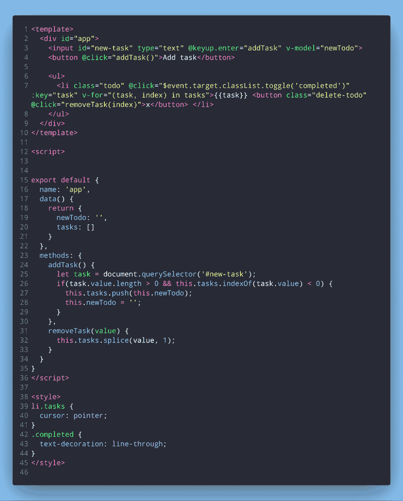
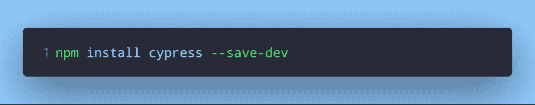
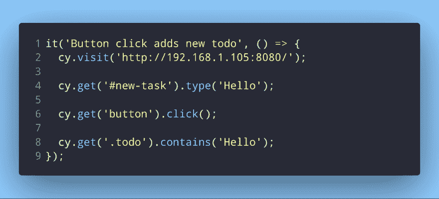
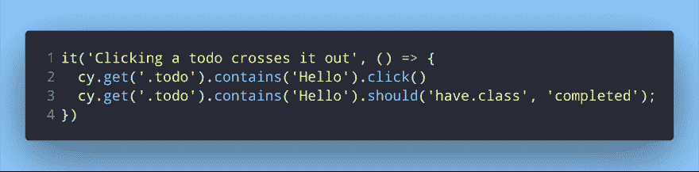
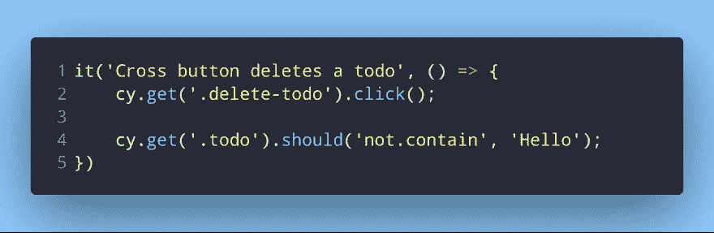
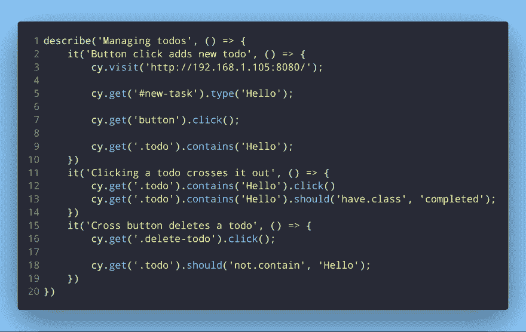

# 如何用流行的 Cypress 框架测试 Vue 应用

> 原文：<https://dev.to/napoleon039/how-to-test-vue-apps-with-the-popular-cypress-framework-4jfg>

## 简介

本文解释了如何使用 Cypress 测试 Vuejs 应用程序。用 Vuejs 创建的一个简单的 todo 应用程序就是一个例子。

本文没有深入讨论用 Cypress 进行测试，Cypress 文档是更好的资源。不是简单地解释 Cypress 和它是如何工作的，而是使用一个工作的(简单但有点实用的)应用程序来展示 Cypress 如何与 Vuejs 一起使用。

Cypress 有很多使用起来很神奇的特性。但同时，它也是一把双刃剑。当寻找完美的断言来创建适当的测试时，这些丰富的特性有时会使人困惑，所以我解释了当我寻找在测试中使用的适当条件时的一些思考过程。

该应用程序将不会被广泛测试。仅测试基本功能，足以确保基本功能正常工作。

## 设置应用程序

由于本文的重点是编写测试，我们不会在创建应用程序本身上花费太多时间。这是一个简单的 todo 应用程序，所以我只给了它基本的功能——添加任务、删除任务和删除任务。还有一些附加功能，比如不能添加空任务和不能添加重复任务。如果你愿意，你可以重构它，使它也能够处理重复的任务。

这是 todo 应用程序的代码。非常简约，没有太多造型。但是它是有效的，这就是我们开始编写测试所需要的。所以让我们开始写测试吧。我们必须先安装赛普拉斯。

## 安装和架设柏树

要使用 npm 安装 Cypress:

现在我们已经安装了 Cypress 作为开发依赖项，我们可以开始编写测试了。如果你是第一次使用 Cypress，那么按照文档中的步骤操作。

当在一个项目中第一次启动 Cypress 时，它将为我们创建大量的测试来帮助我们开始。我们并不真的需要这些，所以可以删除它们。

安装 Cypress 后，将创建一个同名的新文件夹，其中也有一些我提到的测试文件夹。尽管删除所有这些测试和文件夹是好的，但是保留一个名为`integration`的文件夹。这是因为 Cypress 会在这个文件夹中查找测试。我试图在这个文件夹之外创建一个测试文件，但是它没有出现在 Cypress UI 中。我不确定我是否错过了什么，或者是否有一个解决的方法。如果有人知道这件事，请在下面的评论中告诉我🙂

至于测试文件的命名，尽管 Cypress 文档似乎将所有的示例文件都命名为`something_spec.js`(意味着它们都以`_spec.js`结尾)，但这并不是必须的。只要是 JavaScript 文件就可以随便命名。确保使用有意义的名字，而不是随意的名字。如果你有一个命名系统，那就太好了！

## 写作测试

应用程序已准备好，Cypress 已安装并设置好。现在是时候开始编写我们的测试了。

我们将编写的第一个测试是检查是否添加了 todo。查看应用程序代码，我们可以在输入字段中编写我们的任务，单击一个按钮，我们的任务就会被添加到一个无序列表中。因此，我们可以通过在输入框中书写并点击按钮来创建 todos。

我之前用 Jest 为我的 Vue 应用编写测试，还在上面给[写了一篇文章](https://dev.to/napoleon039/a-guide-to-writing-awesome-unit-tests-for-the-first-time-2lb9)。在编写这个测试时，我使用了与编写 Jest 测试相同的思维过程。说正经的，Vue 组件是导入的，然后我们挂载它，如此等等。然而，在赛普拉斯，我找不到这样的东西。直到我看到一个用了`visit()`的例子。我马上去了控制台，用`npm run serve`启动了 app。这个命令是针对 Vue 3.x 的，所以如果你使用 Vue 2.x，那就是`npm run start`。因为我可以使用 localhost 在我的浏览器上访问应用程序，所以我使用那个地址作为`cy.visit()`。

酷！Cypress 可以访问应用程序页面，就像我正在访问它一样。所以现在剩下的就是选择输入字段，输入一个任务，然后点击一个按钮。

`it`是大多数测试库用来编写测试用例的术语。你可以阅读[我的文章](https://dev.to/napoleon039/a-guide-to-writing-awesome-unit-tests-for-the-first-time-2lb9)，在那里我会做更多的解释。

在这里，我们通过 localhost 访问应用程序，使用`cy.get()`找到输入字段，并开始在里面输入内容。要输入一些东西，我们只需将`cy.type()`链接到`cy.get()`。然后我们*用同样的方法得到*按钮，并通过链接`cy.click()`点击它。现在剩下的就是检查 todo 是否真的被添加到列表中。

我首先想到的是获取整个列表，但是后来意识到我们只是检查我们创建的任务是否已经被添加。因为我们只检查那个，所以我使用了`cy.get()`来查找包含我们的任务的列表元素。

现在看起来很容易，不是吗？这是你第一次测试赛普拉斯！！

让我们不要停在这里，继续前进。我们的第二个测试是检查点击任务是否会把它划掉。

在第一次测试中，我们已经访问了应用程序页面并创建了一个 todo，所以这次我们要做的就是单击它并检查它是否被越过。点击它，我们*得到*，就像我们在第一次测试中使用`cy.get()`一样。然后我们确保通过链接`cy.contains()`来指定我们正在寻找的任务。接下来，我们像点击按钮一样点击它，链接`cy.click()`。

最后，为了检查它是否被划掉，我们再次获取特定的任务，然后断言它具有`completed`的类。

如果你再看看我们的应用程序代码，我们已经写了一些 CSS，用一个类`completed`给元素，一个删除线的文本装饰。您可以更彻底地进行测试，而不是检查任务是否实际应用了 CSS。这将确保测试即使在由于某种原因添加了`completed`的类但没有应用 CSS 的情况下也能工作。您可以在 Cypress 文档中搜索合适的断言。这将是导航文档的一个很好的练习。

现在进行最后的测试，我们将检查一个任务是否可以通过点击一个按钮来删除。

这次的测试相当小。我们使用`cy.get()`和链接`click()`得到按钮。最后，我们得到特定的任务，并断言它不包含任务内容。至此，我们已经完成了所有的测试，并确保应用程序的基本功能正常工作。

以下是我们在一个地方编写的所有测试:

## 结论

你可能已经注意到，我们只与 HTML 元素交互，在测试中甚至没有接触过任何 Vuejs，尽管我们的整个应用程序都是用 Vue 编写的。那是因为柏树就是那样做的。以 Jest 为例，与 Vue 应用程序相比，你可以为 React 应用程序编写不同的测试。在我看来，我认为 Cypress 是独立于任何特定框架的。不管你是在你的应用中使用基于组件的方法，使用服务器，还是让它无服务器，Cypress 都被设计成在你的浏览器中运行时测试你的应用。它模拟了普通用户在实际使用您的应用程序时的行为。您不必导入或安装任何组件。

也就是说，我们已经完成了所有的测试。我们创建了一个最小的 todo 应用程序，并使用 Cypress 为它编写了测试。Cypress 为测试提供了一些非常酷的工具和特性。如果你还没有尝试过，你就错过了。