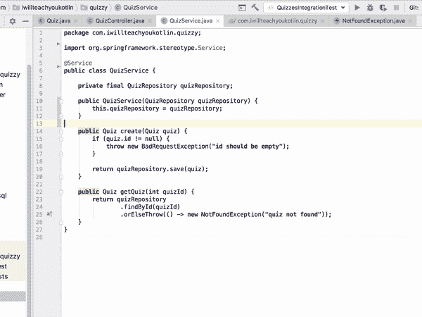
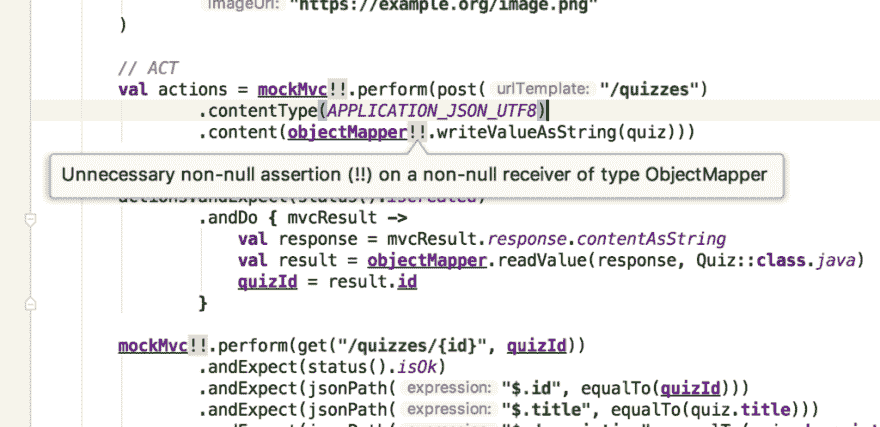
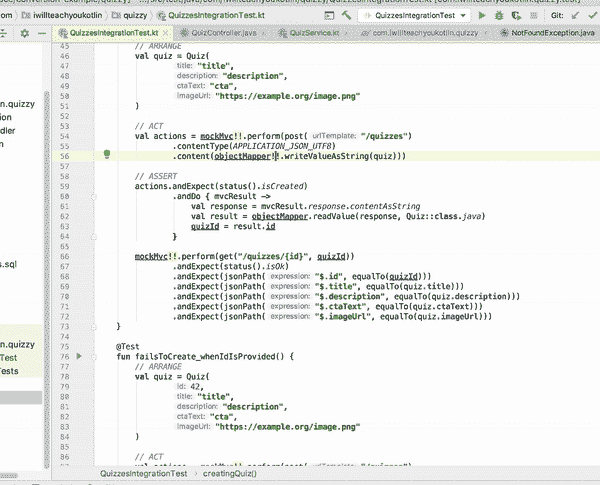
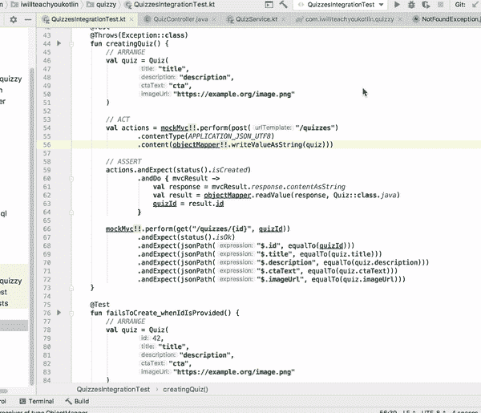
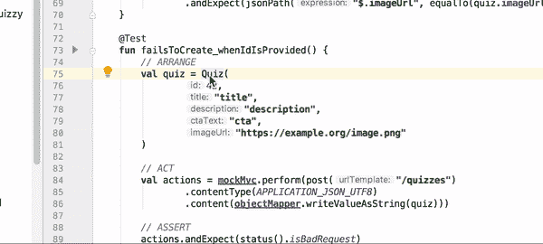
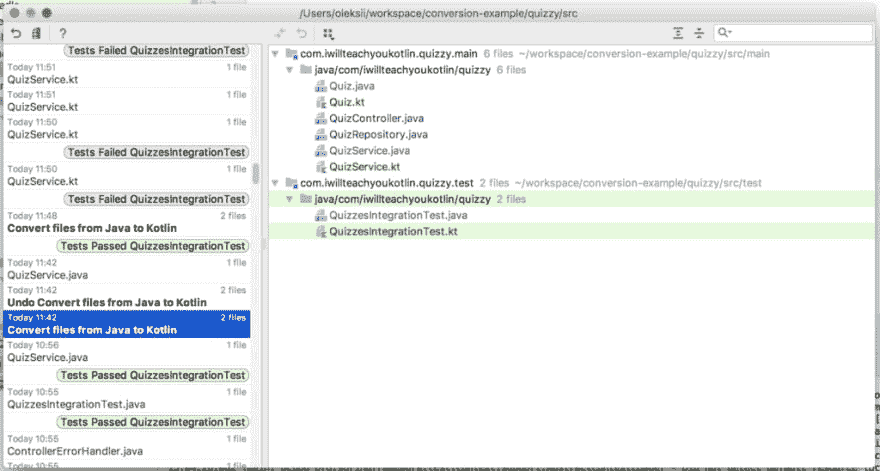
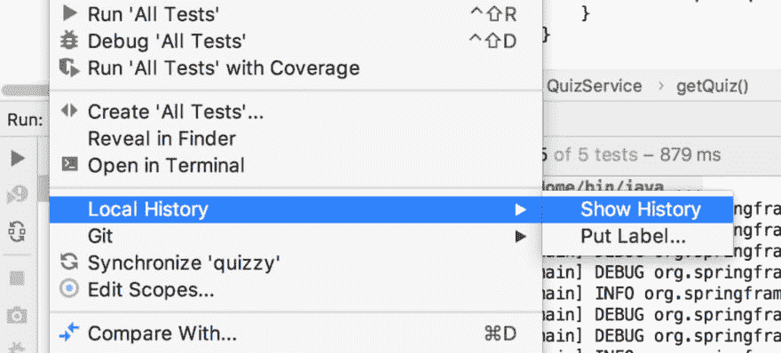
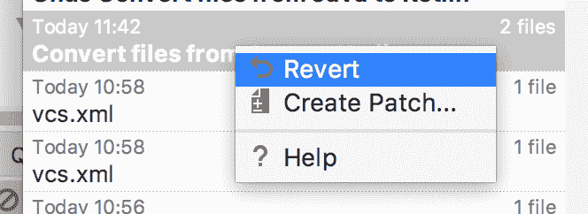

# 如何在 Java 后端代码库中无风险地试用 Kotlin

> 原文：<https://dev.to/waterlink/how-to-try-kotlin-in-java-backend-codebase-without-risk-1ecc>

谁听说过这种可爱而令人震惊的编程语言 Kotlin，并想在真正的后端项目中尝试一下，但却做不到？

这很常见。团队讨论说每个人都想使用 Kotlin，他们仍然决定用 Java 创建新的代码库。你和你的同事们担心这将会出问题，对吗？

你有这样的感觉是正确的，因为你还没有足够的信心做出改变。如果整个团队仍然在学习这项新技术，并且有一个意想不到的挑战，几个星期都没有人能解决，那该怎么办？

现在，你可能已经很投入这个项目了，你的后端代码库都是冗长的 Java，你会想:“我现在不可能尝试 Kotlin！直到下一个…”

*错了。*

等待下一次机会是没有意义的，因为很有可能结果还是一样！

现在，如果我告诉你，你仍然可以在这个代码库中与你的队友一起试用 Kotlin，没有任何风险，也没有任何附加条件，会怎么样？

让我解释一下。

## 混合 Java 和 Kotlin 代码

有了 Kotlin 的 100%双向互操作性，就有可能轻松地混合 Java 和 Kotlin 代码。

这意味着，你可以把一个文件从 Java 转换成 Kotlin，感受一下它的样子。一切都会像以前一样。

现在，如果我告诉你，这样的转换是一个热键呢？

让我举个例子。假设您的 Java 后端应用程序中有这个简单的服务类:

```
// QuizService.java
package com.iwillteachyoukotlin.quizzy;

import org.springframework.stereotype.Service;

@Service
public class QuizService {

    private final QuizRepository quizRepository;

    public QuizService(QuizRepository quizRepository) {
        this.quizRepository = quizRepository;
    }

    public Quiz create(Quiz quiz) {
        if (quiz.id != null) {
            throw new BadRequestException("id should be empty");
        }

        return quizRepository.save(quiz);
    }

    public Quiz getQuiz(int quizId) {
        return quizRepository
                .findById(quizId)
                .orElseThrow(() -> new NotFoundException("quiz not found"));
    }
} 
```

Enter fullscreen mode Exit fullscreen mode

现在，你可以按下`CMD+ALT+SHIFT+K`(或`CTRL+ALT+SHIFT+K`)，或者你可以使用`Convert Java File to Kotlin File`动作:

[](https://res.cloudinary.com/practicaldev/image/fetch/s--AkLHoOL_--/c_limit%2Cf_auto%2Cfl_progressive%2Cq_66%2Cw_880/https://iwillteachyoukotlin.com/wp-content/uploads/2019/01/how-to-try-kotlin-simple-conversion.gif)

结果是下面的代码。注意在 Kotlin:
中构造函数和字段定义是如何合并成一个声明的

```
// QuizService.kt
package com.iwillteachyoukotlin.quizzy

import org.springframework.stereotype.Service

@Service
class QuizService(private val quizRepository: QuizRepository) {

    fun create(quiz: Quiz): Quiz {
        if (quiz.id != null) {
            throw BadRequestException("id should be empty")
        }

        return quizRepository.save(quiz)
    }

    fun getQuiz(quizId: Int): Quiz {
        return quizRepository
                .findById(quizId)
                .orElseThrow { NotFoundException("quiz not found") }
    }
} 
```

Enter fullscreen mode Exit fullscreen mode

> Lombok 用户注意:
> 
> 在转换为 Kotlin 之前，请对该文件使用 Delombok。

当然，在运行这段代码之前，您需要在构建工具中添加 Kotlin 支持:

## 给 Gradle 添加 Kotlin 支持

*(注意:如果你正在使用 Maven，请参考本指南的*

适当添加一个 Gradle 插件:

```
plugins {
    id "org.jetbrains.kotlin.jvm" version "1.3.11"
} 
```

Enter fullscreen mode Exit fullscreen mode

> Spring Boot 用户注意:
> 
> 你需要添加这个插件，这样 Kotlin 类就会在需要的地方自动打开，这样 Spring Boot 就可以对它们使用反射:
> 
> ```
> id "org.jetbrains.kotlin.plugin.spring" version "1.3.11" 
> ```
> 
> 如果您使用 JPA/Hibernate 实体，您将需要这个插件:
> 
> ```
> id "org.jetbrains.kotlin.plugin.jpa" version "1.3.11" 
> ```
> 
> 这将为您的实体添加默认构造函数。

此外，您需要添加对 Kotlin 标准库和反射库的依赖:

```
dependencies {
    implementation "org.jetbrains.kotlin:kotlin-stdlib-jdk8"
    implementation "org.jetbrains.kotlin:kotlin-reflect"
    // …
} 
```

Enter fullscreen mode Exit fullscreen mode

现在，您在 Java 文件的海洋中找到了一个 Kotlin 文件。Java 类调用这个 Kotlin 代码，这个 Kotlin 代码调用 Java 代码。

这一切都很完美。所有测试都通过了！

现在，简单的自动转换是可以的，但还不足以真正利用 Kotlin 的功能。

## 1。使用 Elvis 运算符代替大多数空支票

如果你在任何地方有空检查，那么`returns`或`throws`是一个异常，例如:

```
fun update(quiz: Quiz): Quiz {
    if (quiz.id == null) {
        throw BadRequestException("id should not be empty")
    }

    return quizRepository.save(quiz)
} 
```

Enter fullscreen mode Exit fullscreen mode

这些空检查`throw`或`return`通常被称为守护`if`语句。在科特林，这些可以用“猫王”操作符`?:` :
更简洁地完成

```
fun update(quiz: Quiz): Quiz {
    quiz.id ?: throw BadRequestException("id should not be empty")

    return quizRepository.save(quiz)
} 
```

Enter fullscreen mode Exit fullscreen mode

## 2。将`Optional` s 转换为可空

另一个可以用 Kotlin 简化的例子是`Optional`类型的用法:

```
fun getQuiz(quizId: Int): Quiz {
    return quizRepository
            .findById(quizId)
            .orElseThrow { NotFoundException("quiz not found") }
} 
```

Enter fullscreen mode Exit fullscreen mode

这里，我们将使用我们的存储库的另一个方法，返回一个找到的对象或`null` :

```
fun getQuiz(quizId: Int): Quiz {
    return quizRepository.findByIdOrNull(quizId)
            ?: throw NotFoundException("quiz not found")
} 
```

Enter fullscreen mode Exit fullscreen mode

如您所见，这里我们也使用了 Elvis 操作符。很方便，不是吗？

## 3。让 JUnit 测试名称更易读

让我们假设上面的应用程序在其集成测试套件中进行了这个测试:

```
@Test
public void failsToCreate_whenIdIsProvided() throws Exception {
    // ARRANGE
    final Quiz quiz = new Quiz(
            42,
            "title",
            "description",
            "cta",
            "https://example.org/image.png"
    );

    // ACT
    final ResultActions actions = mockMvc.perform(post("/quizzes")
            .contentType(APPLICATION_JSON_UTF8)
            .content(objectMapper.writeValueAsString(quiz)));

    // ASSERT
    actions.andExpect(status().isBadRequest())
            .andExpect(jsonPath("$.message", equalTo("id should be empty")));
} 
```

Enter fullscreen mode Exit fullscreen mode

现在，在自动转换到 Kotlin 后，它看起来会像这样:

```
@Test
@Throws(Exception::class)
fun failsToCreate_whenIdIsProvided() {
    // ARRANGE
    val quiz = Quiz(
            42,
            "title",
            "description",
            "cta",
            "https://example.org/image.png"
    )

    // ACT
    val actions = mockMvc!!.perform(post("/quizzes")
            .contentType(APPLICATION_JSON_UTF8)
            .content(objectMapper!!.writeValueAsString(quiz)))

    // ASSERT
    actions.andExpect(status().isBadRequest)
            .andExpect(jsonPath("$.message", equalTo("id should be empty")))
} 
```

Enter fullscreen mode Exit fullscreen mode

首先，我们可以立即扔掉这个`@Throws`注释。在科特林基本没用。

现在，我们可以在方法名中使用人类可读的语句，使用反斜线:

```
@Test
fun `create quiz - fails to create when id is provided`() {
    // …
} 
```

Enter fullscreen mode Exit fullscreen mode

我的大致结构是:“{方法名或用例名}-{预期结果}当{条件}”

## 4。使用`lateinit`代替可空

如果后来提供了某些东西(比如依赖注入，或者在测试套件的设置部分初始化)，您应该使用`lateinit`来代替。干净多了。

看，这段代码是自动转换的结果:

```
@SpringBootTest
@RunWith(SpringRunner::class)
class QuizzesIntegrationTest {

    @Autowired
    private val context: WebApplicationContext? = null

    @Autowired
    private val objectMapper: ObjectMapper? = null

    private var mockMvc: MockMvc? = null

    private var quizId: Int = 0

    @Before
    fun setUp() {
        mockMvc = MockMvcBuilders
                .webAppContextSetup(context!!)
                .build()
    }

    // …

} 
```

Enter fullscreen mode Exit fullscreen mode

所有这些字段都在以后初始化，在第一次使用之前，所以我们可以告诉编译器:

```
@Autowired
private lateinit var context: WebApplicationContext

@Autowired
private lateinit var objectMapper: ObjectMapper

private lateinit var mockMvc: MockMvc

private var quizId: Int = 0 
```

Enter fullscreen mode Exit fullscreen mode

现在的问题是，所有这些可空值都在测试套件中用`!!`操作符不安全地展开了:

[](https://res.cloudinary.com/practicaldev/image/fetch/s--WCk2ZC_8--/c_limit%2Cf_auto%2Cfl_progressive%2Cq_auto%2Cw_880/https://iwillteachyoukotlin.com/wp-content/uploads/2019/01/how-to-try-kotlin-unnecessary-non-null-assertion-1024x497.png)

当然，我们可以手动修复它们，但这些是工具应该为我们修复的事情。

他们做到了，看:

[](https://res.cloudinary.com/practicaldev/image/fetch/s--bhFxvWqe--/c_limit%2Cf_auto%2Cfl_progressive%2Cq_66%2Cw_880/https://iwillteachyoukotlin.com/wp-content/uploads/2019/01/how-to-try-kotlin-remove-unnecessary-non-null-assertion.gif)

尽管如此，仔细检查每一次事件还是很烦人的。所以我们应该对整个文件进行代码清理:

[](https://res.cloudinary.com/practicaldev/image/fetch/s--Q345Mx9f--/c_limit%2Cf_auto%2Cfl_progressive%2Cq_66%2Cw_880/https://iwillteachyoukotlin.com/wp-content/uploads/2019/01/how-to-try-kotlin-code-cleanup.gif)

## 5。使用命名参数以提高可读性

现在，你可以看到这段代码:

```
// ARRANGE
val quiz = Quiz(
        42,
        "title",
        "description",
        "cta",
        "https://example.org/image.png"
) 
```

Enter fullscreen mode Exit fullscreen mode

如果我们使用命名参数，我们可以使代码更具描述性，如下所示:

[](https://res.cloudinary.com/practicaldev/image/fetch/s--2UJ237uv--/c_limit%2Cf_auto%2Cfl_progressive%2Cq_66%2Cw_880/https://iwillteachyoukotlin.com/wp-content/uploads/2019/01/how-to-try-kotlin-add-names-to-call.gif)

现在，你会得到这个可爱的可读的代码片段。同样，当你传递参数时，你可以根据自己的意愿重新排序，因为这样更有意义。

```
// ARRANGE
val quiz = Quiz(
        id = 42,
        title = "title",
        description = "description",
        ctaText = "cta",
        imageUrl = "https://example.org/image.png"
) 
```

Enter fullscreen mode Exit fullscreen mode

不幸的是，为了使这个特性工作，类`Quiz`不能是 Java 类，它必须在 Kotlin 中，所以我们必须将下面的实体转换成 Kotlin:

```
@Entity(name = "quizzes")
@Data
@RequiredArgsConstructor
@AllArgsConstructor
@JsonIgnoreProperties({"hibernateLazyInitializer"})
public class Quiz {
    @Id
    @GeneratedValue
    public Integer id = null;

    public final String title;
    public final String description;
    public final String ctaText;
    public final String imageUrl;

    Quiz() {
        title = "";
        description = "";
        ctaText = "";
        imageUrl = "";
    }
} 
```

Enter fullscreen mode Exit fullscreen mode

这是完全(自动+手动)转换的结果:

```
@Entity(name = "quizzes")
@JsonIgnoreProperties("hibernateLazyInitializer")
data class Quiz(
        @Id
        @GeneratedValue
        var id: Int? = null,

        val title: String,
        val description: String,
        val ctaText: String,
        val imageUrl: String
) 
```

Enter fullscreen mode Exit fullscreen mode

正如你所看到的，我们去掉了所有 Lombok 的东西，现在使用了一个`data class`,因为它可以做你需要从实体中得到的大部分事情。

## 6+。你还有很多可以改进的地方！

如果你想了解更多关于 Kotlin 代码看起来有多好，我强烈推荐[浏览 Kotlin Koans](https://play.kotlinlang.org/koans/overview) 。

您可以在浏览器中这样做，如果愿意，也可以在 IDE 中这样做。

现在，记住，在这篇文章的开始，我已经承诺了“没有风险”的部分，不是吗？

## 没有任何风险的尝试

现在，如果我决定不切换到 Kotlin(例如，因为我仍然需要说服我的同事)，我可以使用 IDE 的`Local History`功能及时回到我开始玩 Kotlin 的时候:

[](https://res.cloudinary.com/practicaldev/image/fetch/s--Y94kowtU--/c_limit%2Cf_auto%2Cfl_progressive%2Cq_auto%2Cw_880/https://iwillteachyoukotlin.com/wp-content/uploads/2019/01/how-to-try-kotlin-local-history-1024x548.png)

要在 IntelliJ 中打开该工具，您可以在项目结构工具中使用整个项目上下文菜单。这里有一个选项`Local History > Show History`:

[](https://res.cloudinary.com/practicaldev/image/fetch/s--cPie50r1--/c_limit%2Cf_auto%2Cfl_progressive%2Cq_auto%2Cw_880/https://iwillteachyoukotlin.com/wp-content/uploads/2019/01/how-to-try-kotlin-local-history-menu-1024x463.png)

当您找到开始弹奏 Kotlin 的位置时，您可以恢复到第一个与 Kotlin 相关的更改，例如:

[](https://res.cloudinary.com/practicaldev/image/fetch/s--RgKXr7hp--/c_limit%2Cf_auto%2Cfl_progressive%2Cq_auto%2Cw_880/https://iwillteachyoukotlin.com/wp-content/uploads/2019/01/how-to-try-kotlin-local-history-revert.png)

现在，没有一个 Kotlin 文件，所有的测试都通过了。如果你搞砸了某件事，并且已经有一段时间没有在 Git 中提交了，这通常是一个很方便的特性。

> 这是否激起了你对科特林的好奇心？
> 
> 我已经写了一个 4 部分(共 350 页)“[终极教程:Kotlin](https://iwillteachyoukotlin.com) 入门”(+更多即将到来)，你可以通过成为我每月简讯的成员获得免费的奖金。
> 
> 除了 Kotlin，它还有很多好东西，比如 TDD、干净的代码、软件架构、业务影响、5 个为什么、验收标准、人物角色等等。
> 
> —在此注册并[开始学习如何构建成熟的 Kotlin 应用](https://iwillteachyoukotlin.com)！

## 谢谢，求求你！

非常感谢您阅读这篇文章！我希望你喜欢它。请在评论中告诉我你对此的看法！

此外，与你认为可能从中受益的朋友和同事分享这篇文章会让我更开心。或者你可以在你最喜欢的社交媒体上分享它！

欢迎你来[阅读我关于科特林的博客](https://iwillteachyoukotlin.com/blog/)，以及[我关于 TDD 和最佳软件工程实践的博客](http://www.tddfellow.com/)。

让我们在 LinkedIn 上联系吧:我每周发布简短的更新，关于软件开发人员的生产力和快乐、团队合作、心理健康，以及一些关于科特林的信息。

如果你想听更多我的观点，请在 Twitter 上关注我。

* * *

最初发表于 [iwillteachyoukotlin 博客](https://iwillteachyoukotlin.com/2019/01/16/how-to-try-kotlin-in-java-backend-codebase-without-risk/)。