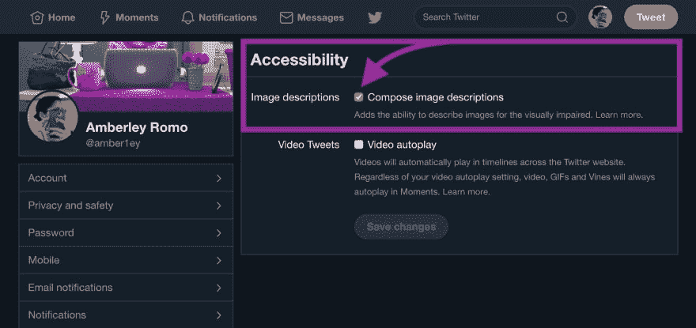
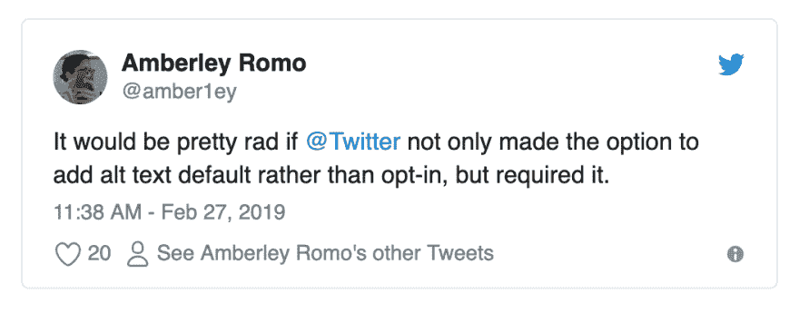
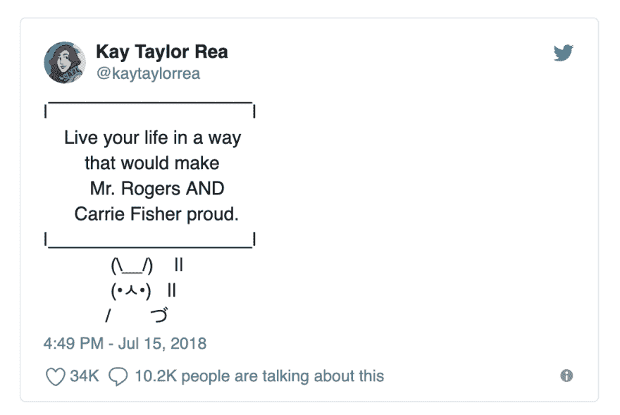

# 如何在推特上考虑可访问性

> 原文：<https://dev.to/amberleyjohanna/how-to-tweet-with-accessibility-in-mind-2e1m>

在考虑可访问性的情况下，为我自己整理一些关于推特的建议。我希望其他人会觉得这很有帮助。

*还不熟悉“替代文本”或“屏幕阅读器”？查看这篇文章末尾的“术语”解释部分。*

快速链接/章节概述:

1.  [(先决条件)启用替代文本](#prerequisite-enable-alt-text)。
2.  [为图像提供有意义的替代文本](#provide-meaningful-alt-text-for-images)。
3.  [为动画 gif 提供直接的“替代文本”](#provide-alt-text-directly-in-tweets-containing-animated-gifs)。
4.  [对多词标签使用 camel case 或 pascal case】。](#use-camel-case-or-pascal-case-for-multi-word-hashtags)
5.  考虑你对标点和符号的使用。

## (先决条件)启用 alt 文本。

Twitter 支持为图像提供替代文本。此时，您仍然必须显式地选择加入，以将它作为一个“特性”公开。若要选择加入，[请访问您的 Twitter 设置](https://twitter.com/settings/accessibility)中的可访问性选项卡，并启用“撰写图片描述”。

我仍然希望有一天 Twitter 默认启用这个选项(或者甚至要求启用)，而不是让它选择加入。

## 为图像提供有意义的替代文本

当你写替换文字时，想象你正在向坐在你桌子对面的朋友描述图片。想想你会如何描述它，以便在没有看到图像的情况下传达推文的全部含义。

1.  语境决定一切。根据上下文的不同，同一个图像可能会有不同的适当替代文本。(还是那句话，想想向朋友描述。)
2.  不要不必要地啰嗦。尽可能简洁地表达完整的观点。
3.  避免“的形象”或“图形的…”。这个上下文由``标签隐式提供。将其包含在备选文本中是多余的。
4.  在替换文本的末尾放置一个句点(`.`)。这会让屏幕阅读器“喘口气”

### Alt 文本示例:

*   来自 [@RobotHugsComic](https://twitter.com/RobotHugsComic) 的这个[很棒的 Twitter 帖子](https://twitter.com/RobotHugsComic/status/949324467993497600)为与推文相关的图片提供了一些有效的替代文本。
*   [WebAIM](https://webaim.org/) 也对[alt 文本中上下文的重要性](https://webaim.org/techniques/alttext/#context)和[alt 文本错误的例子](https://webaim.org/articles/gonewild/#alttext)有很好的指导。

## 在包含动画 gif 的推文中直接提供“替代文本”

我用引号将“替代文本”括起来，因为目前你不能在 Twitter 上为动画 gif 提供替代文本(如在文字`alt`属性中)。许多人目前直接在包含 gif 的推文内容中提供替代文本:

## 多词 hashtags 使用 camel 大小写或 pascal 大小写。

在 camel 的情况下，单词是连在一起的，没有空格。第一个字母是小写的，每增加一个单词都以大写字母开头。(例如。、iPhone、易贝)。Pascal case 是 camel case 的子集，其中第一个单词也是大写的。

Camel 或 pascal 封装的散列标签对于屏幕阅读器来说更易读，对于视力正常的用户来说也更易读。

*   `#ThisIsPascalCase`
*   `#thisIsCamelCase`
*   `#thisislowercase`

## 考虑你使用的标点和符号。

不久前,“签名兔”迷因还很流行。一条 tweet 将包括一个 ASCII 兔子，拿着一个标志，传统上是大写的文本。在屏幕阅读器上阅读这类文本内容...令人讨厌。

(*这条推文是一个例子，并不打算叫出高音喇叭。我选择这个只是因为它是我个人的最爱之一。*)

下面是一个屏幕录制视频，演示如何使用 Mac 的内置屏幕阅读器“VoiceOver”大声朗读这条推文:

[https://www.youtube.com/embed/8tCYIrhV5SI](https://www.youtube.com/embed/8tCYIrhV5SI)

在这种情况下，考虑一下大声朗读的推文内容对某人来说听起来是什么样的。在这种情况下，一个更好的想法可能是将迷因作为一个图像，并带有适当的替代文本。

这包括表情符号。[引用阿德里安·罗塞利的话](http://adrianroselli.com/2018/01/improving-your-tweet-accessibility.html#Emoji):

> 一般来说，避免过多的表情符号。理解不同的屏幕设置和尺寸可能会使它们难以被看到，并且不同的文化背景(和上下文)会改变它们的含义。但除此之外，它们在屏幕阅读器中只是冗长的。

不仅在 tweet 文本中考虑这一点，而且在您的 Twitter 显示名称中也考虑这一点:

## 养成习惯！

我花了一点时间养成考虑所有这些事情的习惯，而且我离完美还很远。我要在这里链接的一个东西是 [Please Caption！Twitter bot 帐户，如果我忘记包含替代文本，它会礼貌地提醒我。可悲的是，](https://twitter.com/PleaseCaption) [Twitter 已经改变了机器人的工作方式](https://twitter.com/PleaseCaption/status/1128326464879853569)(显然)而且(希望是暂时的？？)死了。

## 术语

如果你不熟悉的话，可以参考这篇文章中的一些重要术语。

### 替代文字

替代文本为非文本内容提供文本替代。文本由屏幕阅读器阅读，而不是图像。它将图像的内容和功能传达给那些依靠非视觉方式浏览网页的用户(盲人用户、弱视用户、有认知障碍的用户、聋哑用户等)。

替代文本是:

*   由屏幕阅读器大声朗读，
*   如果文件未加载，则在浏览器中代替图像显示，
*   可被搜索引擎抓取，因此可被搜索引擎索引。

[了解关于替代文本](https://webaim.org/techniques/alttext/)的更多信息。

### 屏幕阅读器

屏幕阅读器是一种将数字文本转换成合成语音的软件程序。

[了解更多关于屏幕阅读器的信息](https://webaim.org/techniques/screenreader/)。

## 什锦相关链接

*   [提高你的推文可访问性](http://adrianroselli.com/2018/01/improving-your-tweet-accessibility.html)作者[阿德里安·罗塞利](https://twitter.com/aardrian)。
*   Twitter 有替代文本！(附带一些说明)作者[阿德里安·罗塞利](https://twitter.com/aardrian)。
*   [撰写重要的替代文本](https://www.a11ywithlindsey.com/blog/writing-alternative-text-matters)作者[林赛·科帕奇](https://twitter.com/LittleKope/)。
*   [你需要知道的关于社交媒体包容性设计的一切](https://blog.hootsuite.com/inclusive-design-social-media/)来自 [Hootsuite 博客](https://twitter.com/hootsuite)。