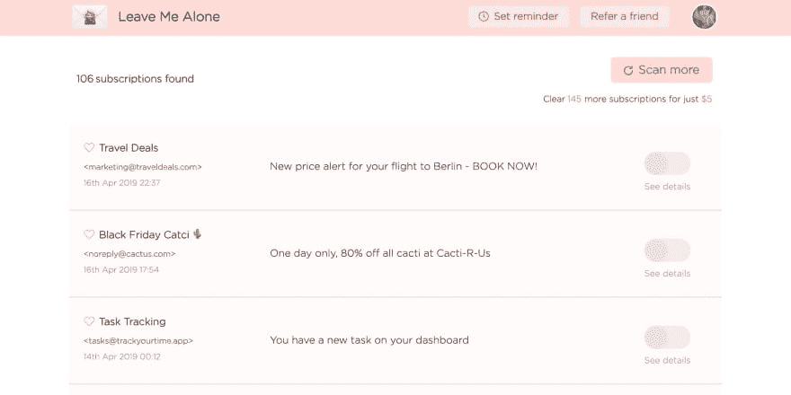
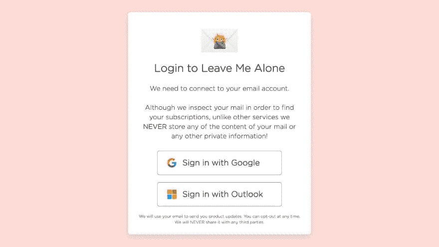
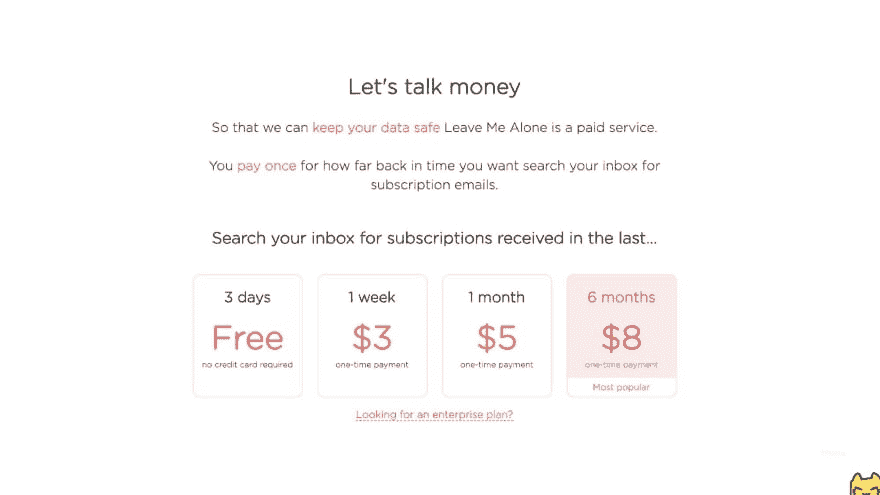
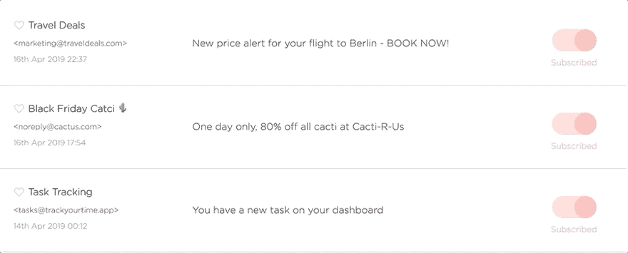
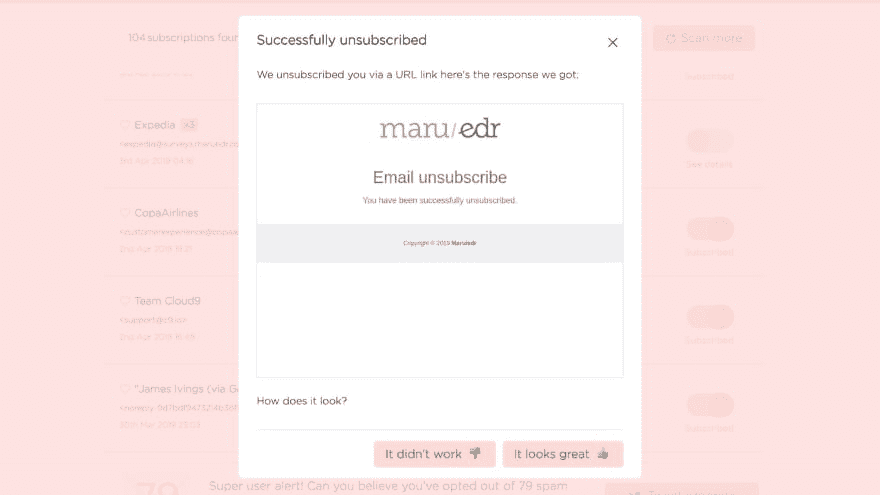
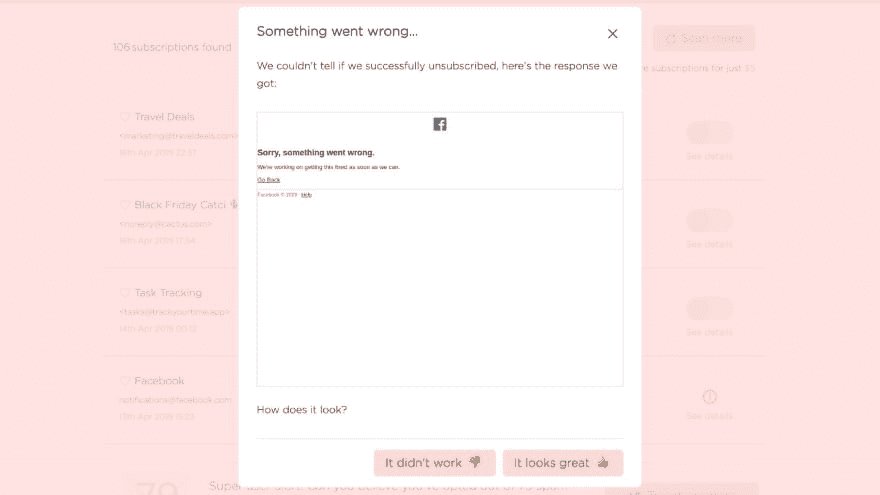
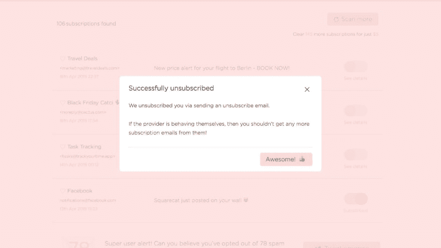

# 如何在 Gmail 和 Outlook 中使用“别管我”取消订阅垃圾邮件

> 原文：<https://dev.to/dinkydani21/how-to-unsubscribe-from-spam-emails-in-gmail-and-outlook-51h4>

管理电子邮件是对时间和生产力的巨大消耗。垃圾邮件每天困扰着我们大多数人，想要退订那些你不想要的邮件并不容易。

这就是为什么我们创造了[别管我](https://leavemealone.xyz)。它使得在一个地方看到所有的垃圾邮件、时事通讯和订阅邮件变得非常简单，只需点击一下就可以取消订阅。

以下是如何使用“别管我”清除你的 Gmail 或 Outlook 中的垃圾邮件。

## 入门

1.  只需[连接你的 Gmail 或 Outlook 账户](https://leavemealone.xyz/login)就可以了

     

    <figcaption>用谷歌或 Outlook 登录</figcaption>

2.  扫描收件箱，查找过去 1 周、1 个月或 6 个月收到的垃圾邮件。你扫描的时间越长，你能清除的垃圾邮件就越多！也可以免费扫描过去 3 天。请耐心等待，如果您的收件箱很大，这可能需要几分钟时间！

     

    <figcaption>购买扫描</figcaption>

3.  扫描完成后，您可以开始退订。只需点击您不想再收到的电子邮件，我们会为您处理其余的邮件。

     

    <figcaption>开始切换！</figcaption>

## 它是如何工作的？

我们从不阅读您的任何电子邮件的内容，但我们确实可以访问一些元数据——您通常不会看到的有关电子邮件的信息。该元数据包含关于如何取消订阅我们可以使用的邮件列表的信息。

大多数情况下，电子邮件的底部都有一个链接，你可以点击它取消订阅。这个链接通常在元数据中，我们可以用它来取消订阅。

 

<figcaption>使用退订链接成功退订</figcaption>

当您点击退订时，我们会使用该链接将您从邮件列表中删除，并通过分析退订页面的截图来确定成功率。我们通常可以判断它是否有效，但如果我们不确定，我们会让您知道并询问它是否有效，以便您仍然可以手动取消订阅，并告诉我们哪里出错了。

有时没有退订链接，或者发件人没有将链接添加到他们的电子邮件中。在这些情况下，我们也可以向发件人发送电子邮件，请他们取消您的订阅。

如果发件人表现良好，你就不会再收到他们的邮件了！

 

<figcaption>使用 mailto 成功退订</figcaption>

我们会掩护你的。你只需点击取消订阅按钮，我们会想出最好的办法把你从邮件列表中删除。

## 我为什么要用别管我？

尽管不是独一无二的，但《别烦我》在两个主要方面与我们的竞争对手不同:

1.  当我们扫描你的收件箱时，我们绝不会将你的任何数据用于营销目的([有报道称 Unroll.me 曾将用户数据出售给优步](https://www.nytimes.com/2017/04/24/technology/personal-data-firm-slice-unroll-me-backlash-uber.html))。因为我们从不存储任何电子邮件信息，所以即使我们想这样做，我们也做不到，当然我们也没有这样做！
2.  我们实际上是让你退订这些列表，而不仅仅是把它们扔进垃圾箱或贴上标签。这些订阅永远消失了，即使你决定停止使用我们的服务，你的收件箱也会保持干净。

[别管我](https://leavemealone.xyz)是一项付费服务(这样你就知道我们不需要出售你的数据来维持运营)，但我们已经尽可能保持我们的定价公平合理。

* * *

如果您有任何问题或建议，我们很乐意听取您的意见——您可以通过 [Twitter](https://twitter.com/leavemealoneapp) 或[联系我们，发送电子邮件给我们](leavemealone@squarecat.io)。

感谢阅读！