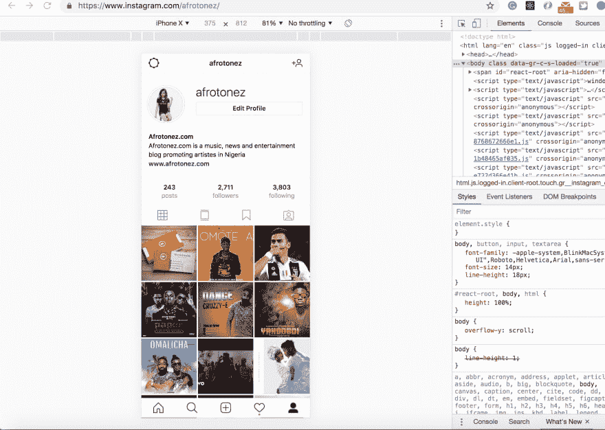
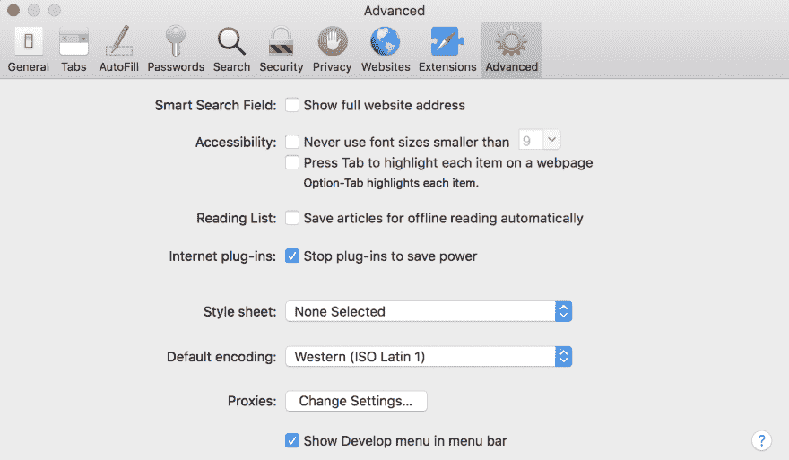

# 如何通过浏览器将图片上传到 Instagram

> 原文：<https://dev.to/ekpangmichael/how-to-upload-pictures-to-instagram-via-the-browser-34h3>

有时候你想从笔记本电脑上传一张照片到 Instagram，但是 Instagram 不允许你通过浏览器上传。

我发现了这个窍门，它能让你达到目的

## 遵循以下步骤

### 使用 Chrome 浏览器

1.  右键单击您的浏览器并选择 inspect(从下拉列表中选择您选择的电话)

2.  打开[https://www.instagram.com](https://www.instagram.com)
    它将打开 Instagram 的移动版，允许你上传图片，找到下面的加号[+]图标，然后嘣...您可以通过浏览器
     上传您的图片

### 使用 Safari 浏览器

1.  点击菜单栏上的首选项，选择高级标签
2.  选中“在菜单栏中显示开发菜单”
3.  打开[https://www.instagram.com](https://www.instagram.com)
4.  点击菜单栏上的开发，转到用户代理并选择您选择的手机这将打开 Instagram 的移动版本，然后你可以通过浏览器上传图片和视频