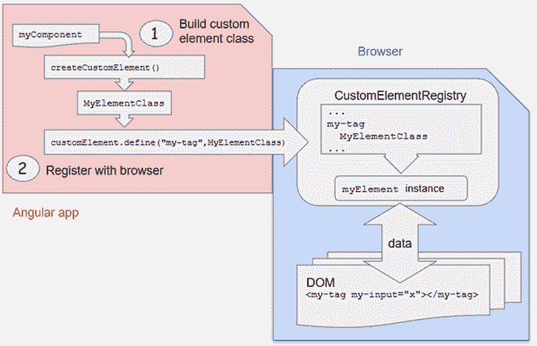
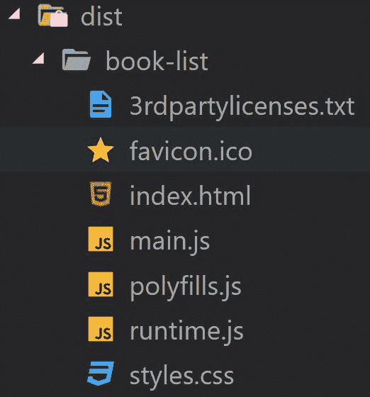

# 如何在 React 中使用角度组件

> 原文：<https://dev.to/yashints/how-to-use-an-angular-component-in-react-e7m>

## 角元素

自从 [Angular 6](https://blog.angular.io/version-6-of-angular-now-available-cc56b0efa7a4) 以来，团队发布了`Angular Elements`，它允许你通过将角度组件注册为*定制组件*，在现有的角度应用中引导角度组件。

这为那些习惯于争论 Angular vs React 优越性的 web 开发人员提供了大量的机会。一些人认为 Angular 适合开发企业应用程序，而另一些人则更喜欢 React，因为它的速度和软件包大小。与此同时，Angular 团队一直在努力将这一功能引入 V6 版本，让 Angular 爱好者创建自定义组件，这些组件不仅可以在其他框架中使用，还可以轻松创建独立的小部件，甚至可以在简单的 HTML 页面中使用，例如 SharePoint。

结果组件将像 React 应用程序的 web 组件一样，像任何其他 HTML 组件一样，如`button`或`input`。另外，最后我有一些时间来玩这些概念，并准备好一个快速演示，正如预期的那样非常简单。所以让我们开始吧。

出于本文的目的，我将在 **Angular** 中创建一个图书列表组件，它接受图书列表并在页面中显示它们。这个组件被移植到一个 **React** 应用程序中，该应用程序将把图书列表作为道具发送给它。一旦一本书被添加到卡片上，这些变化就会传播到 **React** 应用程序。

从较高的层面来看，以下是描述文档中的解决方案的图片:

[](https://res.cloudinary.com/practicaldev/image/fetch/s--uxQN_j_o--/c_limit%2Cf_auto%2Cfl_progressive%2Cq_auto%2Cw_880/https://angular.io/generatimg/guide/elements/createElement.png)

## 创建你的角度分量

首先，让我们使用 Angular CLI 创建一个新的 Angular 应用程序:

```
ng new book-list 
```

Enter fullscreen mode Exit fullscreen mode

您可以删除默认的应用程序组件，并创建一个名为 book list:
的新组件

```
ng g c book-list 
```

Enter fullscreen mode Exit fullscreen mode

**注意**:我在这里使用 Angular CLI 的简写命令(g 代表生成，c 代表组件)，更多信息请访问[的文档](https://github.com/angular/angular-cli/wiki)。

因为我们想要评估 Angular 和 React 应用程序之间的通信，所以我们将传递图书列表作为输入。为了反过来测试，我们将输出定义为一个`EventEmitter`,每当从列表中选择一本书时就会被触发。所以组件代码看起来应该是这样的:

```
import { Component, Input, Output, EventEmitter } from '@angular/core'

@Component({
  selector: 'book-list',
  templateUrl: './book-list.component.html',
  styleUrls: ['./book-list.component.css'],
})
export class BookListComponent {
  public bookList: any[]

  @Input('books')
  set books(books: string) {
    this.bookList = JSON.parse(books)
  }

  @Output('bookSelected') bookSelected = new EventEmitter<any>()

  constructor() {}

  selected(book: any) {
    this.bookSelected.emit(JSON.stringify(book))
  }
} 
```

Enter fullscreen mode Exit fullscreen mode

**注意:**目前将数组这样的复杂对象传入 web 组件是有争议的(可以使用 JavaScript 设置属性值，也可以只使用属性)。为了简单起见，在本文中我们只传递一个`JSON`字符串。

HTML 非常简单:

```
<h1>List of recent books</h1>

<div *ngFor="let book of bookList">
  <strong>{{book.name}}</strong>
  <p>{{book.description}}</p>
  <label class="container"
    >Add to card <input type="checkbox" (change)="selected(book)" />
    <span class="checkmark"></span>
  </label>
</div> 
```

Enter fullscreen mode Exit fullscreen mode

### 将组件作为元素引导

现在我们已经创建了我们的组件，是时候引导我们的组件作为一个角度元素:

```
import { BrowserModule } from '@angular/platform-browser'
import { NgModule, Injector } from '@angular/core'
import { createCustomElement } from '@angular/elements'
import { BookListComponent } from './book-list/book-list.component'

@NgModule({
  declarations: [BookListComponent],
  imports: [BrowserModule],
  providers: [],
  bootstrap: [],
  entryComponents: [BookListComponent],
})
export class AppModule {
  constructor(private injector: Injector) {
    const customElement = createCustomElement(BookListComponent, { injector })
    customElements.define('book-list', customElement)
  }

  ngDoBootstrap() {}
} 
```

Enter fullscreen mode Exit fullscreen mode

为了从图书列表组件创建一个定制元素，我们应该调用新的`createCustomElement`方法，该方法不会将新创建的组件插入到 *CustomElementRegistry* 中，因此使用`AppModule`构造函数来手动完成。也许在未来这将会自动发生，但在那之前我们的工作就是去做。

此时，元素已经准备好了。是时候构建我们的元素了:

```
ng build --prod --output-hashing none 
```

Enter fullscreen mode Exit fullscreen mode

如果你现在看一下你的`dist/book-list`文件夹，你应该看到为你生成的三个 JS 文件，`main.js`、`polyfills.js`、`runtime.js`。

[](https://res.cloudinary.com/practicaldev/image/fetch/s--F29Efy9u--/c_limit%2Cf_auto%2Cfl_progressive%2Cq_auto%2Cw_880/https://thepracticaldev.s3.amazonaws.com/i/ogrecmuw4vxktbveplk5.jpg)

## 在 React 应用程序中托管我们的图书列表

是时候创建我们的 React 应用程序了。我们可以从使用 React CLI 创建一个开始:

```
npx create-react-app react-host 
```

Enter fullscreen mode Exit fullscreen mode

当命令完成时，您应该有初始的 React 应用程序模板设置。如果你从 *react-host* 文件夹中运行`npm start`，你应该会看到默认的应用程序:

[](https://res.cloudinary.com/practicaldev/image/fetch/s--dRrBqAvQ--/c_limit%2Cf_auto%2Cfl_progressive%2Cq_auto%2Cw_880/https://thepracticaldev.s3.amazonaws.com/i/tcq7d6plqisgmg5msxky.jpg)

我们可以将 Angular CLI 创建的三个文件复制到 React 应用程序的 public 文件夹中，并在`index.html`中引用它们(您可以设置项目，将 Angular 元素导出为`npm`包，并在 React 应用程序中使用它，我只是在这里放松一下🙃).

```
<body>
  <noscript> You need to enable JavaScript to run this app. </noscript>
  <div id="root"></div>

  <script type="text/javascript" src="./book-list/runtime.js"></script>
  <script type="text/javascript" src="./book-list/polyfills.js"></script>
  <script type="text/javascript" src="./book-list/main.js"></script>
</body> 
```

Enter fullscreen mode Exit fullscreen mode

### 使用图书列表组件

现在我们已经准备好了一切，让我们从修改我们的应用程序组件开始，添加一个图书列表，这样我们就可以把它传递给我们的图书列表:

```
constructor(props){
  super(props)
  this.state = {
    books: [
      {
        name: '10% Happier',
        description: `Practicing meditation and mindfulness
          will make you at least 10 percent happier.`
      },
      {
        name: 'The 10X Rule',
        description: `The biggest mistake most people
          make in life is not setting goals high enough.`
      },
      {
        name: 'A Short Guide to a Happy Life',
        description: `The only thing you have that nobody
          else has is control of your life.`
      }
    ]
  };
} 
```

Enter fullscreen mode Exit fullscreen mode

现在我们可以使用我们的图书列表组件并将图书作为属性传递下去:

```
render() {
  return (
    <div className="App">
      <header className="App-header">
        
        <h1 className="App-title">Welcome to React</h1>
      </header> 
      <div className="book-list">
        <book-list ref={elem => this.nv = elem}
          books={JSON.stringify(this.state.books)}></book-list>
      </div>
      <div className="selected-books">
        <h1>Shopping card</h1>
        {this.renderSelectedBooks()}
      </div>
    </div>
  );
} 
```

Enter fullscreen mode Exit fullscreen mode

**注意:**正如我上面提到的，我们需要向我们的定制组件传递一个字符串，否则它将不会接收到正确的数据。

我们用了一个方法来渲染选中的书，我们来定义一下:

```
renderSelectedBooks() {
    return(
      <div>
        {
          this.state.selectedBooks.map(function(book, index){
            return <div><strong key={ index }>{book.name}</strong></div>;
          })
        }
      </div>
    )
  } 
```

Enter fullscreen mode Exit fullscreen mode

我在这里使用内部状态，但是请注意，这不是一个 React 帖子，我在这里没有遵循任何最佳实践。

我们还使用了一个名为`nv`的变量来引用组件。我们将向它添加一个事件监听器，它监听`bookSelected`事件并调用一个方法来处理该事件。

```
componentDidMount() {
  this.nv.addEventListener("bookSelected", this.handleBookSelected);
} 
```

Enter fullscreen mode Exit fullscreen mode

**警告:**事件的名称应该与您在定义角度元素时使用的事件名称相匹配。

让我们在事件处理器中初始化我们的状态:

```
handleBookSelected = event => {
  const book = JSON.parse(event.detail)
  let selectedBookList = []

  if (this.state.selectedBooks.find(x => x.name === book.name)) {
    selectedBookList = this.state.selectedBooks.filter(
      x => x.name !== book.name
    )
  } else {
    selectedBookList = [...this.state.selectedBooks, book]
  }

  this.setState({
    ...this.state,
    selectedBooks: [...selectedBookList],
  })
} 
```

Enter fullscreen mode Exit fullscreen mode

上面的代码看起来有点忙，但是很简单。我们首先检查这本书是否已经被选中，如果是，就删除它。如果书不在选择的列表中，我们添加它并更新状态。一旦状态被更新，React 将重新加载页面并显示更新后的所选书籍。

如果您现在运行该应用程序，您应该会看到如下屏幕:

[https://www.youtube.com/embed/tqFLgTwMyPw](https://www.youtube.com/embed/tqFLgTwMyPw)

就这样，你在 React 应用程序中正式运行了一个**角度元素**，它们相处得非常好😁🔥💯。

你可以在我的 GitHub 库上找到源代码[。](https://github.com/yashints/AngularInsideReact)

现在去创造令人敬畏的东西吧👊🏻。