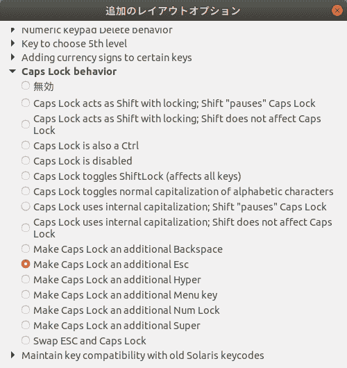

# 如何在 ubuntu 18 上使用 Caps Lock 键作为 ESC

> 原文：<https://dev.to/yuyabu/how-to-use-caps-lock-key-as-esc-on-ubuntu-18-1g7l>

出于以下原因，您应该更换 Caps Lock 键。

*   1.大写锁定键易于从原位推动。
*   2.如今，我们需要很少的时间来使用大写锁定。
*   3 .如果从原位按下 ESC 键，您将更有效地使用 vim。

让我们试试。

1 .获取 gnome-tweak-tool

```
sudo apt install gnome-tweak-tool 
```

2 .启动 gnome-tweak-tool。

[](https://res.cloudinary.com/practicaldev/image/fetch/s--u8SCWNm9--/c_limit%2Cf_auto%2Cfl_progressive%2Cq_auto%2Cw_880/https://thepracticaldev.s3.amazonaws.com/i/3zzkfbxxlxvqgl8r8bmm.png)

选择“大写锁定行为”和“使大写锁定成为附加的 ESC 键”

3.重启 ubuntu。

设置过程已经结束。现在，你的大写锁定键是 ESC。

感谢阅读我的帖子。