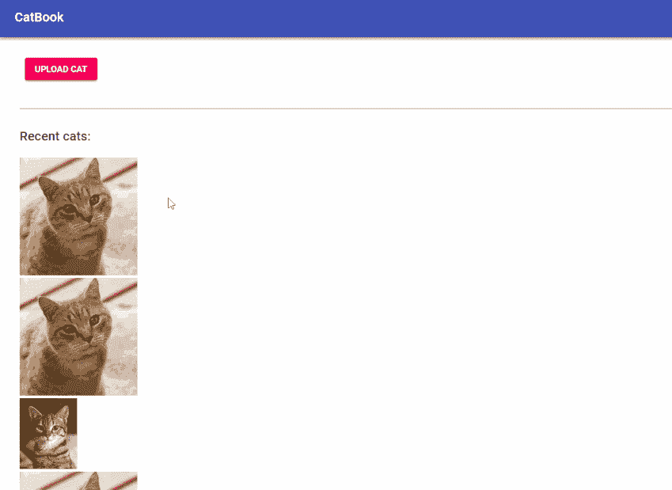
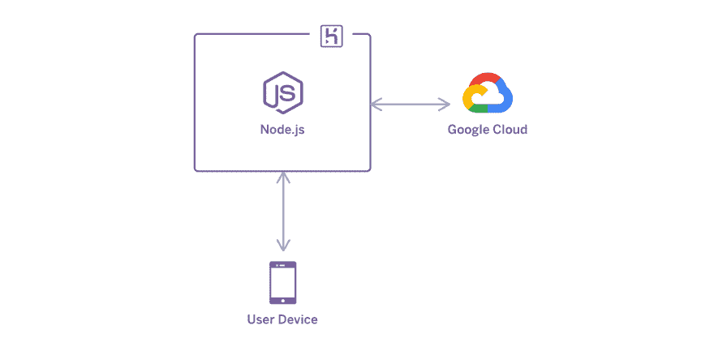
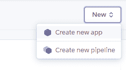
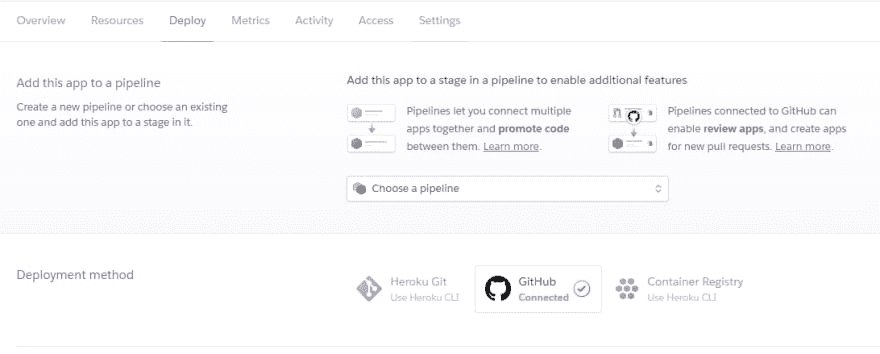
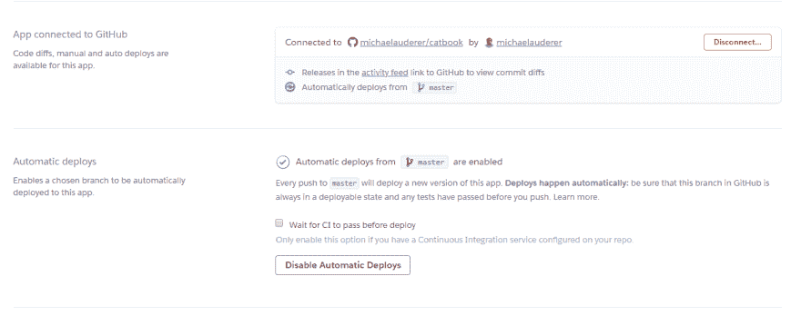
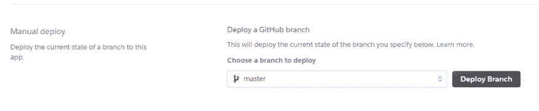
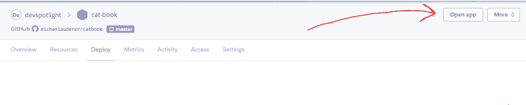
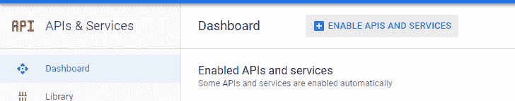
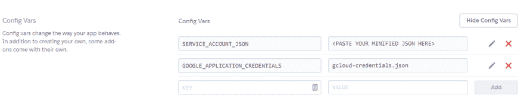

# 如何利用计算机视觉自动过滤图像

> 原文：<https://dev.to/heroku/how-to-use-computer-vision-to-automatically-filter-images-3g7k>

虽然图像识别对人类来说似乎是一项简单的任务，但它实际上是一个非常复杂的过程。计算机已经可以“看到”图像，因为它们存储了构成完整图像的每个微小像素的数据。然而，识别这些数据中的模式并创建一个可快速搜索的常见模式记忆是极其困难的。

幸运的是，[谷歌云](https://cloud.google.com/)提供了一个非常简单的 [API 来使用计算机视觉检测图像](https://cloud.google.com/vision/)的内容。这有助于对图像进行分类、识别文本，甚至是调节内容，以防止不适当的图像发布到您的网站上。在这篇文章中，我们将快速建立 cat book——一个图片分享网站，只允许有猫的图片，不允许有狗！

## 能养猫吗？

猫很牛逼。让我们建立一个应用程序，人们可以上传他们的猫的照片…但是如果有人上传一只狗呢？手动调整我们的上传，只包含猫会过于耗时。为了解决这个问题，我们将使用计算机视觉来检测每个上传的内容，并拒绝除猫以外的任何内容。在本教程中，我们将向您展示如何快速构建一个时尚的现代界面，使用计算机视觉自动调节图像。

[](https://res.cloudinary.com/practicaldev/image/fetch/s--a0tEhno---/c_limit%2Cf_auto%2Cfl_progressive%2Cq_66%2Cw_880/https://thepracticaldev.s3.amazonaws.com/i/19lbxefcfh2gbchj7khx.gif)

用户可以将猫的图片上传到 CatBook，但不能上传狗的图片，即使它们真的很“可爱”。

自己尝试完成的项目演示。

这里是 GitHub 上的代码。

## 项目设置

为了构建 CatBook，我们将使用 React、Node.js、Heroku 和 Google Cloud。我们将使用 Heroku 托管一个简单的 Node.js + Express web 服务器，该服务器连接到 Google Cloud 以实现云视觉。虽然我们可以使用 AppEngine，但 Heroku 可以让应用程序以最少的设置快速运行。只需将代码更新推送到 GitHub，它就会自动更新您的应用程序！这对于一个小项目来说非常好，并且允许你在开发和测试的时候快速迭代。如果 CatBook 起飞，那么它也可以为数百万猫爱好者扩展！

[](https://res.cloudinary.com/practicaldev/image/fetch/s--QMB1q9hf--/c_limit%2Cf_auto%2Cfl_progressive%2Cq_auto%2Cw_880/https://thepracticaldev.s3.amazonaws.com/i/k0vnv1jrs8aec9bwyc21.png)

<figcaption>Diagram displaying the network connections involved in CatBook.</figcaption>

## 从一个基本的“Hello World”App 开始

首先，我们将创建一个基本的“Hello World”应用程序来获取我们的项目依赖项和应用程序安装设置。之后我们会添加前端和后端。首先为 CatBook 创建一个新目录。我们将使用一个 [monorepo 文件结构](https://danluu.com/monorepo/)，因此客户机和服务器文件都将位于同一个存储库中。运行该文件夹中的`git init`和`npm init -y`生成 repo 和 package.json 文件。接下来，通过运行`npx create-react-app client`引导一个基本的 React 项目。这将在`client`子文件夹中设置 React，这是我们应用程序的前端所在的位置。

```
# create catbook folder and cd into it
mkdir catbook && cd $_
# initialize project
git init
npm init -y
# create react app
npx create-react-app client 
```

现在我们将建立一个基本的静态服务器。首先创建一个名为`server`的文件夹。初始化 package.json 并安装下面的依赖项。其中一些直到本文的后面才会用到，但是我们不妨现在就安装它们。

```
# cd out of the client directory
cd ..

# make the server folder and cd into it
mkdir server && cd $_

# initialize package.json
npm init -y

# install dependencies
npm i express dotenv multer @google-cloud/vision 
```

让我们用 Express 创建一个静态服务器来服务我们的 React 应用程序。在服务器文件夹中创建一个名为`index.js`的文件，并添加以下代码。在本地，我们将使用端口 8080 上的服务器进行开发，但是 Heroku 会通过 port 环境变量自动分配一个端口。为了处理这两种情况，我们要么使用环境变量(如果存在的话),要么默认使用端口 8080。

*T2`/server/index.js`*

```
const express = require('express');

const app = express();

app.use(express.static(path.join(__dirname, '../client/build')));

// start the server
const port = process.env.PORT || 8080;
app.listen(port, () => console.log(`Hello world! Listening on port ${port}`)); 
```

我们还将为服务器创建一个启动脚本来运行这个文件。打开服务器的 package.json 并添加一个启动脚本，如下所示:

*T2`/server/package.json`*

```
"scripts":  {  "start":  "node index.js",  "test":  "echo \"Error: no test specified\" && exit 1"  }, 
```

现在，在我们测试之前，我们需要构建 React 应用程序。首先将 cd 放入客户端文件夹，然后运行`npm run build`来构建应用程序。当它完成构建时，我们可以运行我们的 express 服务器并在`localhost:8080`上测试它。

```
cd ../client
npm run build
cd ../server
npm start
# Hello world! Server now listening on localhost:8080 
```

如果您看到 React starter 页面，那么您已经准备好部署这个初始应用程序了！首先，创建一个 [GitHub 库](https://github.com/new)并把你的项目推给它。现在，让我们创建一个 Heroku 应用程序，并从这个存储库设置自动部署。

从 [Heroku 仪表盘](https://dashboard.heroku.com/)的右上角，点击**新建>创建新 app** 。

[](https://res.cloudinary.com/practicaldev/image/fetch/s--bNW5AeCX--/c_limit%2Cf_auto%2Cfl_progressive%2Cq_auto%2Cw_880/https://thepracticaldev.s3.amazonaws.com/i/582euwzmkz2koi0mmcm0.png)

给你的应用取一个合适的名字，然后从**部署**选项卡中，选择 GitHub 作为**部署方法**。

[](https://res.cloudinary.com/practicaldev/image/fetch/s--oryKYHeF--/c_limit%2Cf_auto%2Cfl_progressive%2Cq_auto%2Cw_880/https://thepracticaldev.s3.amazonaws.com/i/c1h8gz5kjlnlvtgjv735.png)

在下一节中，搜索您的 GitHub 存储库，并选择它连接到您的 Heroku 应用程序。然后，在下面的部分中，单击“**启用自动部署**”。现在，当您将提交推送到您的主分支时，Heroku 将自动部署您的应用程序的最新版本！这允许您的主分支作为您的应用程序的单一真实来源——实时版本始终代表主分支中的代码。不需要担心到底部署了哪些代码。

[](https://res.cloudinary.com/practicaldev/image/fetch/s--g2bVt9lg--/c_limit%2Cf_auto%2Cfl_progressive%2Cq_auto%2Cw_880/https://thepracticaldev.s3.amazonaws.com/i/8whh5dbjdjaq9nixxmif.png)

现在，为了使我们已经推送的代码生效，在最后的手动部署部分点击**部署分支**。

[](https://res.cloudinary.com/practicaldev/image/fetch/s--EssLtgBV--/c_limit%2Cf_auto%2Cfl_progressive%2Cq_auto%2Cw_880/https://thepracticaldev.s3.amazonaws.com/i/1luhjngtg8tv5s4ym90p.png)

现在，在你的 Heroku 应用的右上角，点击**打开应用**。这将打开一个新的标签到你的网站的网址！

[](https://res.cloudinary.com/practicaldev/image/fetch/s--gwsQ2Z_c--/c_limit%2Cf_auto%2Cfl_progressive%2Cq_auto%2Cw_880/https://thepracticaldev.s3.amazonaws.com/i/ydg6z40epo1ih2ttdoyb.png)

现在我们有了一个 Heroku 应用程序，可以从 GitHub 自动部署，我们可以简单地将更改推送到我们的存储库，这样它们就可以在我们的实时站点上自动更新。

## 设置谷歌云视觉 API

为了让 CatBook 工作，我们需要构建一个后端来接受图像上传并连接到 Google Cloud 进行图像识别。在本节中，我们将设置 Google Cloud Vision API，并构建一个服务器来处理图像上传，以及发送回所有最新的 cat 上传。

### 谷歌云

首先，[创建一个新的谷歌云项目](https://console.cloud.google.com/projectcreate)。在侧边栏中，点击**API&服务**，然后点击页面顶部的**启用 API 和服务**。

[](https://res.cloudinary.com/practicaldev/image/fetch/s--vJXAvBim--/c_limit%2Cf_auto%2Cfl_progressive%2Cq_auto%2Cw_880/https://thepracticaldev.s3.amazonaws.com/i/y6hda69zeuxb109cs3xg.png)

<figcaption>© Google LLC All rights reserved. Google Cloud is a trademark of Google LLC.</figcaption>

这是您可以在 Google Cloud 项目中启用各种 API 和服务的地方。搜索“视觉”点击**云视觉 API** ，然后点击**启用**。

[](https://res.cloudinary.com/practicaldev/image/fetch/s--QnncwdI5--/c_limit%2Cf_auto%2Cfl_progressive%2Cq_auto%2Cw_880/https://thepracticaldev.s3.amazonaws.com/i/big6s4qav5ln8toknvzk.png)

<figcaption>© Google LLC All rights reserved. Google Cloud is a trademark of Google LLC.</figcaption>

现在，这个项目启用了 Cloud Vision API。云控制台的最后一步是创建服务帐户密钥。这将验证我们的 Node.js 服务器，以访问我们的 Google Cloud 项目中的 API。为此，请转到[创建服务帐户密钥](https://console.cloud.google.com/apis/credentials/serviceaccountkey)页面。从服务帐户下拉列表中选择**新服务帐户**，然后为其命名。从**角色**下拉列表中选择**项目>所有者**。确保**键类型**设置为 **JSON** ，然后点击**创建**。

[](https://res.cloudinary.com/practicaldev/image/fetch/s--6bGzcPh2--/c_limit%2Cf_auto%2Cfl_progressive%2Cq_auto%2Cw_880/https://thepracticaldev.s3.amazonaws.com/i/mvb8pfh7l9p48mescm68.png)

<figcaption>© Google LLC All rights reserved. Google Cloud is a trademark of Google LLC.</figcaption>

这会将一个 JSON 文件下载到您的计算机上。然而，最好不要把这个文件存储在我们的存储库中。相反，我们会将其转换为一个**环境变量**，并通过我们 Heroku 应用程序的设置来设置它。这允许我们将凭证放在存储库之外，并且它还提供了一种无需重新部署整个应用程序就可以轻松更改凭证的方法。

首先，运行`npx minify-json /path/to/service-account-key.json`。这将把文件缩成一行。然后，打开文件并复制缩小的 JSON。在您的服务器文件夹中创建一个名为`.env`的文件，粘贴缩小的 json 作为第一个值:

*T2`/server/.env`*

```
SERVICE_ACCOUNT_JSON=<PASTE YOUR MINIFIED JSON HERE>
GOOGLE_APPLICATION_CREDENTIALS=gcloud-credentials.json 
```

现在，转到 Heroku 应用仪表板，打开设置选项卡。在**配置变量**部分，点击**显示配置变量**。您可以在这里为 Heroku 应用程序添加环境变量。添加与您刚刚添加到`.env`文件相同的键/值。

[](https://res.cloudinary.com/practicaldev/image/fetch/s--J5sXGm3c--/c_limit%2Cf_auto%2Cfl_progressive%2Cq_auto%2Cw_880/https://thepracticaldev.s3.amazonaws.com/i/voa1iu1cpbtze3opyhl8.png)

一切就绪！现在我们将在开发过程中使用我们的本地`.env`文件，而在生产中使用 Heroku 配置变量。在这个例子中，我们使用相同的变量。然而，在一个活动的项目中，这使得拥有各种环境、数据库连接、凭证等等用于开发、登台和生产变得非常容易。

## 用节点创建一个后端服务器

有了我们的凭证，我们就可以开始构建应用程序的核心了！打开`server/index.js`文件。为了本文简单起见，我们将只在服务器上使用这个文件。

在文件的顶部，我们需要初始化 dotenv 来读取我们的`.env`文件，如果它存在的话。

```
// load environment variables from .env file, if it exists
require('dotenv').config(); 
```

现在，让我们导入我们需要的所有东西。我们也[承诺](https://hackernoon.com/node8s-util-promisify-is-so-freakin-awesome-1d90c184bf44)一些文件系统函数，使我们的代码在以后变得更干净。

```
// import dependencies
const path = require('path');
const util = require('util');
const fs = require('fs');
const express = require('express');
const multer = require('multer');
const { ImageAnnotatorClient } = require('@google-cloud/vision');

// promisify the filesystem functions we need
const readdirAsync = util.promisify(fs.readdir);
const statAsync = util.promisify(fs.stat);
const unlinkAsync = util.promisify(fs.unlink); 
```

现在，由于 Google Cloud SDK 需要一个 JSON 文件进行身份验证，我们需要将环境变量中的服务帐户密钥写到服务器上的一个文件中。确保使用同步版本`writeFileSync`，因为这需要在启动服务器之前完成。

```
fs.writeFileSync(path.join(__dirname, 'gcloud-credentials.json'), process.env.SERVICE_ACCOUNT_JSON);

// create Cloud Vision client
const visionClient = new ImageAnnotatorClient(); 
```

接下来，让我们初始化一个 [Express app](http://expressjs.com/) 并创建一个上传文件夹。然后我们将配置 [multer](https://www.npmjs.com/package/multer) 来使用这个上传文件夹进行文件上传，这是稍后在我们的 post 请求处理程序中使用的中间件。

```
// create express app
const app = express();

// define path for file uploads
const uploadPath = path.join(__dirname, 'uploads');

// create the upload folder if it doesn't exist
if (!fs.existsSync(uploadPath)) {
 fs.mkdirSync(uploadPath);
}

// configure multer to use the uploads folder
const upload = multer({ dest: 'uploads/' }); 
```

现在是时候设置我们的 post 请求处理程序了。该处理程序将负责上传图像，将它们发送到 Google Cloud Vision 客户端，并且仅当它们是猫时才存储它们。如果图像不是一只猫，处理程序就会发回一个错误。

```
// handle post requests with images to the /upload path
app.post('/api/upload', upload.single('image'), async (req, res) => {
 try {
   if (!req.file) {
     res.sendStatus(500);
     return;
   }

   // get the file path uploaded via multer
   const filePath = req.file.path;

   // send the image to gcloud for label detection
   const results = await visionClient.labelDetection(filePath);

   // pull label data out of the response from google
   const labels = results[0].labelAnnotations.map(x => x.description.toLowerCase());

   // check if we can has cat
   const hazCat = labels.includes('cat');

   if (hazCat) {
     res.status(201).json({ message: 'Thanx 4 has cat.' });
   } else {
     // remove the non-cat from our server
     await unlinkAsync(filePath);
     res.status(400).json({ message: 'No has cat!' });
   }
 } catch (err) {
   console.error(err);
   res.sendStatus(500);
 }
}); 
```

现在我们将能够上传猫到服务器，但这是猫书，所以我们也想显示猫的饲料！首先，我们需要一个 get 请求处理程序来检索单只猫。这是一个简单的功能，只需根据 cat ID 从服务器发回一个文件。

```
// handle requests to individual cats
app.get('/api/cats/:id', (req, res) => {
 const { id } = req.params;
 const catPath = path.join(uploadPath, id);
 res.sendFile(catPath);
}); 
```

接下来，我们需要一种方法来获取最新的猫的饲料。我们将把最近上传到服务器的 20 只猫发送回去。为此，编写另一个 get 请求处理程序来检索“cat feed”。

```
// handle get requests to retrieve the last uploaded cat
app.get('/api/cats', async (req, res) => {
 try {
   // read our uploads directory for files
   const files = await readdirAsync(uploadPath);

   // read file stats asyncronously
   const stats = await Promise.all(
     files.map(filename =>
       statAsync(path.join(uploadPath, filename))
         .then(stat => ({ filename, stat }))
     )
   );

   // sort files chronologically and slice the last 20
   const cats = stats
     .sort((a, b) => a.stat.mtime.getTime() - b.stat.mtime.getTime())
     .map(stat => stat.filename)

   res.status(200).json({ cats, message: 'Here r catz' });
 } catch (err) {
   console.error(err);
   // if there's an error, just send an empty array
   res.status(500).json({ cats: [], message: 'Internal server error' });
 }
}); 
```

最后，用我们之前为构建的 react 站点提供服务并监听适当端口的代码结束服务器。

```
// serve static frontend from all other routes
app.use(express.static(path.join(__dirname, '../client/build')));

// start the server
const port = process.env.PORT || 8080;
app.listen(port, () => console.log(`Server listening on port ${port}`)); 
```

就是这样！我们的服务器已经准备就绪。继续下一步，我们建立我们的前端。如果你想测试到目前为止的服务器，你可以使用 [Postman](https://www.getpostman.com/) 轻松测试出这些端点。

## 在 React 中构建前端

我们有一个后端，所以现在是时候为 CatBook 构建一个漂亮的前端了。将目录改回客户端文件夹，并安装两个依赖项:`http-proxy-middleware`，我们将使用它进行开发，以及 [reactstrap](https://reactstrap.github.io/) ，它将使构建一个漂亮的界面变得容易。我们还将删除 src 文件夹中的所有演示文件，因为我们将从头开始创建自己的演示文件。

```
cd ../client
npm i http-proxy-middleware reactstrap bootstrap
rm src/* 
```

现在我们先从 [`/client/src/index.jsx`](https://github.com/michaelauderer/catbook/blob/master/client/src/index.jsx) 中的自举反应开始。按照[的说明，通过将引导程序导入到 index.jsx 文件来设置 reactstrap](https://reactstrap.github.io/) 。

我们还需要创建一个代理文件， [`/client/src/setupProxy.js`](https://github.com/michaelauderer/catbook/blob/master/client/src/setupProxy.js) 。这个文件告诉 react-scripts 将任何对/api 路由的请求代理回在 localhost:8080 上运行的服务器。这只会影响开发，但是为了让我们的 API 调用在本地工作，这一点很重要！

现在我们将在 [`/client/src/index.css`](https://github.com/michaelauderer/catbook/blob/master/client/src/index.css) 中添加一些基本的 CSS。我们几乎不需要太多，尽管在 react 中有更好的方式来使用样式(比如[样式组件](https://www.styled-components.com/)或[镭](https://formidable.com/open-source/radium/))，但这些都超出了本教程的范围。“crossed”类将在后面使用，以表明不允许狗(和其他非猫)进入！；)

现在，我们需要一个按钮来点击上传我们的猫！我们将创建一个 UploadButton 组件，它接受一个`loading`属性，使其在加载时被禁用。这将在上传猫(或禁止非猫)的同时给用户提供一些不错的反馈！

*T2`/client/src/upload-button.jsx`*

```
import React, { PureComponent } from 'react';
import { Button } from 'reactstrap';

class UploadButton extends PureComponent {
 fileInputRef = React.createRef();

 handleClick = () => {
   this.fileInputRef.current.click();
 }

 render() {
   const { children, loading } = this.props;

   return (
     <div>
       <input
         ref={this.fileInputRef}
         accept="image/*"
         style={{display: 'none '}}
         type="file"
         onChange={this.props.onUpload}
       />
       <Button
         color="primary"
         disabled={loading}
         onClick={this.handleClick}
       >
         {children}
       </Button>
     </div>
   )
 }
}

export default UploadButton; 
```

现在，是时候创建我们前端应用程序的主体了。App 组件将处理所有的 API 调用，并显示 CatBook 的主要内容。首先，从导入我们需要的东西开始，包括我们新创建的 UploadButton 组件，并设置 App 组件的一些状态。

*T2`/client/src/app.jsx`*

```
import React, { Component } from 'react';
import { Nav, NavItem, NavLink, Navbar, NavbarBrand } from 'reactstrap';
import UploadButton from './upload-button';

class App extends Component {
 state = {
   loading: false,
   success: null,
   message: '',
   preview: null,
   cats: []
 }; 
```

我们将给这个组件一个从服务器获取猫的函数。这将从`/api/cats`端点获取最新的 20 只猫的列表，然后单独获取每张图片并将其转换到组件状态。我们还将在组件挂载时运行这个函数。

```
 componentWillMount() {
   this.fetchCats();
 }

 fetchCat = (id) => {
   return new Promise(async (resolve) => {
     // fetch the cat image from our server
     const res = await fetch(`/api/cats/${id}`);
     const catBlob = await res.blob();
     // create an object URL to display in an  element
     const url = URL.createObjectURL(catBlob);
     // shift the cat into state
     this.setState(prevState => ({
       cats: [{ id, url }, ...prevState.cats]
     }), resolve);
   })
 };

 fetchCats = () => {
   this.setState({ cats: [] }, async () => {
     const res = await fetch('/api/cats');
     const { cats } = await res.json();
     for (const cat of cats) {
       await this.fetchCat(cat);
     }
   })
 }; 
```

现在我们可以接收猫，但我们需要一个功能来上传它们。这个处理程序将在我们的 UploadButton 的`onUpload`事件道具中使用，当一个文件被选中时触发。在这里，我们从选定的文件创建一些 FormData，将状态更新为 loading(对于 UploadButton 上的 loading 微调器)，并将文件发送到服务器。如果文件不是一只猫，我们将把它显示为一个删除的预览，告诉用户他或她不能上传狗(或其他非猫)！

```
 handleUpload = async (event) => {
   const file = event.currentTarget.files[0];
   const formData = new FormData();

   // show loading spinner
   this.setState({ loading: true, preview: null, message: '' });

   // add the file to the form data
   formData.append('image', file);

   try {
     // send the form data to our server
     const res = await fetch('/api/upload', {
       method: 'POST',
       body: formData
     });

     // parse the server response as json
     const { message } = await res.json();
     // we should receive a 201 response if successful
     const success = res.status === 201;
     this.setState({ success, message });

     // read the uploaded file
     const reader = new FileReader();
     reader.onload = (e) => {
       console.log(e.target.result);
       if (success) {
         // shift the uploaded cat onto the state
         this.setState(prevState => ({
           cats: [{ id: prevState.cats.length, url: e.target.result }, ...prevState.cats]
         }));
       } else {
         this.setState({ preview: e.target.result });
       }
     }
     reader.readAsDataURL(file);

   } catch (err) {
     console.error(err);
   }

   // hide loading spinner
   this.setState({ loading: false });
 }; 
```

最后但同样重要的是，我们的应用程序组件的 render 函数将所有内容放在一起，并将所有适当的状态值绑定到页面。

```
 return (
     <>
       <Navbar color="light" light>
         <NavbarBrand href="/">CatBook</NavbarBrand>
         <Nav>
           <NavItem>
             <NavLink href="https://github.com/michaelauderer/catbook" target="_blank">GitHub</NavLink>
           </NavItem>
         </Nav>
       </Navbar>
       <div style={{ padding: 32 }}>
         {message && <h6>{message}</h6>}
         {preview && (
           <div className="crossed">
             
           </div>
         )}
         <UploadButton
           onUpload={this.handleUpload}
           loading={loading}
           success={success}
         >
           Upload Cat
         </UploadButton>
         <br />
         <br />
         <hr />
         <br />
         <h6>Recent cats:</h6>
         <br />
         {cats.map(cat => (
           <div key={cat.id}>
             
           </div>
         ))}
       </div>
     </>
   );
 }
}

export default App; 
```

恭喜你！我们现在已经建立了一个功能齐全的猫书，包括正面和背面。将这些更改提交给 GitHub，观察它通过 Heroku 自动部署。非常方便！

## 保护我们的猫

如果我们想更进一步，我们可以给我们的系统增加额外的安全性。这将有助于防止那些邪恶的狗攻击我们的系统。Heroku 提供与 GCP 的点对点 VPN 连接。我们可以将服务器置于安全的 VPN 连接之后，而不是暴露在开放的互联网中。实际上，这意味着我们的 Heroku dyno 和 GCP 路由在同一个内部网络上。如果我们想用额外的服务器或 API 来扩展我们的 GCP 足迹，我们可以安全地做到这一点，而不需要管理面向公众的服务器的复杂性。这使得您可以同时使用 Heroku 和 GCP，即使对于有敏感数据或严格合规要求的应用程序。

## 结论

计算机视觉是一个极其强大的工具，它正在改变计算机与周围世界的交互方式。CatBook 真的只是开始；你可以把这个入门项目做一些修改，把它变成完全不同的东西！Heroku 使得自动部署直接连接到 GitHub 库的快速和可伸缩的应用程序变得简单。[了解更多关于 Heroku](https://heroku.com/home) 的信息，打造您的下一个伟大项目。