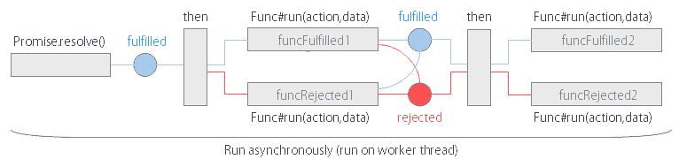
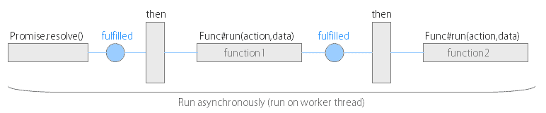
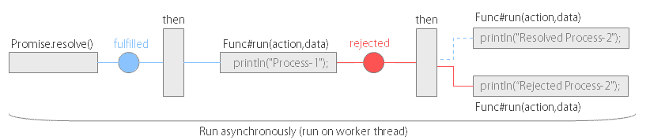
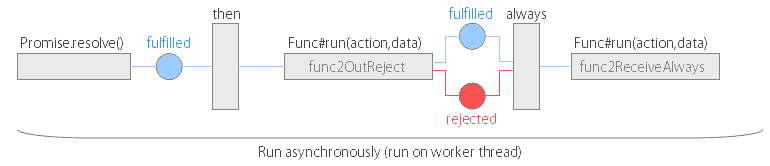
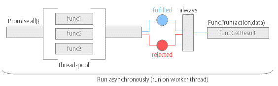

# 如何在 Java 中使用 Promise

> 原文：<https://dev.to/riversun/how-to-use-promise-in-java-4kf7>

我为 java 开发了一个 promise 库，让我来介绍一下。

# 概述

*   你可以像 JavaScript 的 **[Promise](https://developer.mozilla.org/en-US/docs/Web/JavaScript/Reference/Global_Objects/Promise)** 一样轻松控制异步操作。
*   支持同步和异步执行。
*   本文给出的所有例子都在这里。[https://github.com/riversun/java-promise-examples](https://github.com/riversun/java-promise-examples)

# 快看

**用 Javascript 写承诺**

JavaScript 中使用 promise 的一个典型例子是:

```
Promise.resolve('foo')
    .then(function (data) {
        return new Promise(function (resolve, reject) {
            setTimeout(function () {
                const newData = data + 'bar';
                resolve(newData);
            }, 1);
        });
    })
    .then(function (data) {
        return new Promise(function (resolve, reject) {
            console.log(data);
        });
    });
console.log("Promise in JavaScript"); 
```

Enter fullscreen mode Exit fullscreen mode

**用 java 写承诺——承诺**

用 **java 写同样的东西——promise**

```
import org.riversun.promise.Promise;
public class Example {

    public static void main(String[] args) {
        Promise.resolve("foo")
                .then(new Promise((action, data) -> {
                    new Thread(() -> {
                        String newData = data + "bar";
                        action.resolve(newData);
                    }).start();
                }))
                .then(new Promise((action, data) -> {
                    System.out.println(data);
                    action.resolve();
                }))
                .start();
        System.out.println("Promise in Java");
    }
} 
```

Enter fullscreen mode Exit fullscreen mode

**语法:**

是的，你可以用类似 JavaScript 的语法写如下:

```
Promise.resolve()
        .then(new Promise(funcFulfilled1), new Promise(funcRejected1))
        .then(new Promise(functionFulfilled2), new Promise(functionRejected2))
        .start(); 
```

Enter fullscreen mode Exit fullscreen mode

[](https://res.cloudinary.com/practicaldev/image/fetch/s--3_qjeXL0--/c_limit%2Cf_auto%2Cfl_progressive%2Cq_auto%2Cw_880/https://user-images.githubusercontent.com/11747460/56907143-a11fa380-6ade-11e9-9d23-195cce2c1543.png)

# 依赖关系

**胃**

```
<dependency>
    <groupId>org.riversun</groupId>
    <artifactId>java-promise</artifactId>
    <version>1.1.0</version>
</dependency> 
```

Enter fullscreen mode Exit fullscreen mode

【T0 度】T2

```
compile group: 'org.riversun', name: 'java-promise', version: '1.1.0' 
```

Enter fullscreen mode Exit fullscreen mode

# 快速启动

### 通过连锁“然后”依次执行

*   使用 **Promise.then()** 进行链式操作。
*   把你的逻辑写在 **Func.run(action，data)** 里。
*   通过**承诺开始运行。启动**并异步运行**(在工作线程上运行)**
***   调用 **action.resolve** 使承诺**变为履行**状态，并将**结果**传递给下一个 then**

```
public class Example00 {

    public static void main(String[] args) {

        Func function1 = (action, data) -> {
            new Thread(() -> {
                System.out.println("Process-1");
                try {
                    Thread.sleep(500);
                } catch (InterruptedException e) {}
                //Specify result value.(Any type can be specified)
                action.resolve("Result-1");
            }).start();
        };

        Func function2 = (action, data) -> {
            System.out.println("Process-2 result=" + data);
            action.resolve();
        };

        Promise.resolve()
                .then(new Promise(function1))
                .then(new Promise(function2))
                .start();// start Promise operation

        System.out.println("Hello,Promise");
    }
} 
```

Enter fullscreen mode Exit fullscreen mode

**示意图:**
[](https://res.cloudinary.com/practicaldev/image/fetch/s--mkiNWDxd--/c_limit%2Cf_auto%2Cfl_progressive%2Cq_auto%2Cw_880/https://user-images.githubusercontent.com/11747460/56915517-acc89580-6af1-11e9-9ab2-c4274e8675ed.png)

**结果:**

```
Hello,Promise
Process-1
Process-1 result=Result-1 
```

Enter fullscreen mode Exit fullscreen mode

**提示**

只写`Promise.then(func)`也可以。

```
Promise.resolve()
        .then(function1)
        .then(function2)
        .start();// start Promise operation 
```

Enter fullscreen mode Exit fullscreen mode

# 描述

### 什么是 **Func** ？

**Func** 是一个 java 接口，相当于 JavaScript 的**函数**，用于**#然后**
的参数

```
public interface Func {
    public void run(Action action, Object data) throws Exception;
} 
```

Enter fullscreen mode Exit fullscreen mode

可以像 JavaScript 函数一样写 **Func** 。

我想展示实现 **Func** 类的两种方法。

1)以正常方式写 **Func** 对象。

```
Func function = new Func() {
    @Override
    public void run(Action action, Object data) throws Exception {
        System.out.println("Process");//write your logic
        action.resolve();
    }
}; 
```

Enter fullscreen mode Exit fullscreen mode

No.2)使用 lambda 表达式编写 **Func** 对象。

```
Func function = (action, data) -> {
    System.out.println("Process");//write your logic
    action.resolve();
}; 
```

Enter fullscreen mode Exit fullscreen mode

### 什么是**动作**？

动作对象是 **Func#run** 方法的一个参数。

*   调用 **action.resolve(【履行值】)**使承诺的状态**履行**，并带结果(**履行值**)进入下一个处理(届时指定)。

```
action.resolve("Success"); 
```

Enter fullscreen mode Exit fullscreen mode

*   调用 **action.reject(【拒绝原因】)**使承诺的状态**被拒绝**，并带着结果(**拒绝原因**)继续下一步处理(届时指定)。

```
action.reject("Failure"); 
```

Enter fullscreen mode Exit fullscreen mode

*   参数是可选的，可以调用 **action.resolve()** 或 **action.reject()**

```
action.resolve();//Argument can be omitted 
```

Enter fullscreen mode Exit fullscreen mode

# 用法

### 拒绝

如果 **action.reject()** 被调用，或者在执行 **Func.run()** 时抛出**异常**，那么**拒绝**状态被设置为承诺，并且 **onRejected** 函数被指定给**，那么**被调用。

*   呼叫`action.reject`

```
Func function = (action, data) -> {
  action.reject("Failure");
}; 
```

Enter fullscreen mode Exit fullscreen mode

*   抛出异常

```
Func function = (action, data) -> {
  throw new Exception("something");
}; 
```

Enter fullscreen mode Exit fullscreen mode

我们来看看 **Promise.then()** 方法，
T3**promise . then()**的**第二个自变量**可以设置为一个 **Func** 来接收**拒绝**的结果当接收到**然后**的结果时。

*   **语法**

    用法`Promise.then(onFulfilled[, onRejected]);`

*   **onFulfilled** 是一个 **Func** 对象，如果承诺实现了就调用。

    你可以接收前一次执行**【已完成】**的结果作为一个名为**数据**的参数。

*   **onRejected** 是一个 **Func** 对象，在承诺被拒绝时调用。

    你可以接收上一次执行**【拒绝】**的结果(主要是对象是异常的)作为一个名为**数据**的参数。

```
//Rejection
public class ExampleRejection {
    public static void main(String[] args) {
        Promise.resolve()
                .then((action, data) -> {
                    System.out.println("Process-1");
                    action.reject();
                })
                .then(
                        // call when resolved
                        (action, data) -> {
                            System.out.println("Resolved Process-2");
                            action.resolve();
                        },
                        // call when rejected
                        (action, data) -> {
                            System.out.println("Rejected Process-2");
                            action.resolve();
                        })
                .start();// start Promise operation

        System.out.println("Hello,Promise");
    }
} 
```

Enter fullscreen mode Exit fullscreen mode

**图表:**

[](https://res.cloudinary.com/practicaldev/image/fetch/s--xvqUnyj---/c_limit%2Cf_auto%2Cfl_progressive%2Cq_auto%2Cw_880/https://user-images.githubusercontent.com/11747460/56916023-efd73880-6af2-11e9-8f92-fae5eff48e32.png)

**结果:**

```
Hello,Promise
Process-1
Rejected Process-2 
```

Enter fullscreen mode Exit fullscreen mode

### 言出必行

**Promise.always()** 总是同时收到**履行**和**拒绝**的结果。

```
public class ExampleAlways {

    public static void main(String[] args) {
        Func func2OutReject = (action, data) -> {
            action.reject("I send REJECT");
            //action.resolve("I send RESOLVE");
        };
        Func func2ReceiveAlways = (action, data) -> {
            System.out.println("Received:" + data);
            action.resolve();
        };
        Promise.resolve()
                .then(func2OutReject)
                .always(func2ReceiveAlways)
                .start();
    }
} 
```

Enter fullscreen mode Exit fullscreen mode

**示意图:**
[](https://res.cloudinary.com/practicaldev/image/fetch/s--A88FAkb9--/c_limit%2Cf_auto%2Cfl_progressive%2Cq_auto%2Cw_880/https://user-images.githubusercontent.com/11747460/56918747-d1c10680-6af9-11e9-886b-2e7949d1114c.png)

**结果**

```
Received:I send REJECT 
```

Enter fullscreen mode Exit fullscreen mode

### 许诺一切

同时执行多个承诺，在所有执行完成后，用 then 进行下一个处理

*   同时执行多个承诺，并等待所有执行完成后再继续。
*   如果都以 resolve 结束，执行结果将按照调用的顺序存储为 **java.util.List** 。
*   如果只有一个拒绝，当拒绝发生时，将拒绝原因存储在结果中，然后继续下一个“然后”。

```
import java.util.List;

import org.riversun.promise.Func;
import org.riversun.promise.Promise;

public class ExampleAll {
    public static void main(String[] args) {
        Func func1 = (action, data) -> {
            Promise.sleep(1000);
            System.out.println("func1 running");
            action.resolve("func1-result");
        };
        Func func2 = (action, data) -> {
            Promise.sleep(500);
            System.out.println("func2 running");
            action.resolve("func2-result");
        };
        Func func3 = (action, data) -> {
            Promise.sleep(1500);
            System.out.println("func3 running");
            action.resolve("func3-result");
        };
        Func funcGetResult = (action, data) -> {
            List<Object> resultList = (List<Object>) data;
            for (int i = 0; i < resultList.size(); i++) {
                Object o = resultList.get(i);
                System.out.println("No." + (i + 1) + " result is " + o);
            }
            action.resolve();
        };
        Promise.all(func1, func2, func3)
                .always(funcGetResult)
                .start();
    }
} 
```

Enter fullscreen mode Exit fullscreen mode

**示意图:**
[](https://res.cloudinary.com/practicaldev/image/fetch/s--SL4Jdb-j--/c_limit%2Cf_auto%2Cfl_progressive%2Cq_auto%2Cw_880/https://user-images.githubusercontent.com/11747460/57029142-d6adc380-6c7b-11e9-9e15-ddb84dad0d24.png)

**结果:**

```
func2 running
func1 running
func3 running
No.1 result is func1-result
No.2 result is func2-result
No.3 result is func3-result 
```

Enter fullscreen mode Exit fullscreen mode

### 穿线

也可以对指定的执行者执行承诺处理。
注意如果使用自己的执行程序，记得用完后关机。如果你使用你自己的执行程序，它将会自动关闭**而不是**

在 Promise.all，
中至少要使用一个工作线程，还有一个线程用于整体异步执行，因此总共需要两个或更多线程。

```
public class Example {

    public static void main(String[] args) {

        final ExecutorService myExecutor = Executors.newFixedThreadPool(5);

        Func func1 = (action, data) -> {
            System.out.println("func1 on " + Thread.currentThread().getName());
            action.resolve();
        };

        Func func2 = (action, data) -> {
            System.out.println("func2 on " + Thread.currentThread().getName());
            action.resolve();
        };

        Func func3 = (action, data) -> {
            System.out.println("func3 on " + Thread.currentThread().getName());
            action.resolve();
        };

        Promise.all(myExecutor, func1, func2, func3)
                .then((action, data) -> {
                    System.out.println("final process on " + Thread.currentThread().getName());
                    myExecutor.shutdown();//If you use your own executor, remember to shut it down after use
                    action.resolve();
                })
                .start();
    }
} 
```

Enter fullscreen mode Exit fullscreen mode

**结果:**

```
func1 on pool-1-thread-2
func2 on pool-1-thread-3
func3 on pool-1-thread-4
final process on pool-1-thread-1 
```

Enter fullscreen mode Exit fullscreen mode

# 同步承诺

SyncPromise，顾名思义，就是同步承诺。

当 Promise 异步执行时，SyncPromise 在被“then”链接时不移动下一个。

其他所有特征都与诺言相同。

```
public class Example02 {

    public static void main(String[] args) {
        Func func1 = (action, data) -> {
            new Thread(() -> {
                System.out.println("Process-1");
                action.resolve();
            }).start();

        };
        Func func2 = (action, data) -> {
            new Thread(() -> {
                System.out.println("Process-2");
                action.resolve();
            }).start();

        };
        SyncPromise.resolve()
                .then(func1)
                .then(func2)
                .start();
        System.out.println("Hello,Promise");
    }
} 
```

Enter fullscreen mode Exit fullscreen mode

**结果:**

```
Process-1
Process-2
Hello,Promise 
```

Enter fullscreen mode Exit fullscreen mode

即使 **func1** 和 **func2** 在一个线程中执行，

`System.out.println("Hello,Promise")`总是在那之后执行。因为 **SyncPromise** 是同步执行的。**