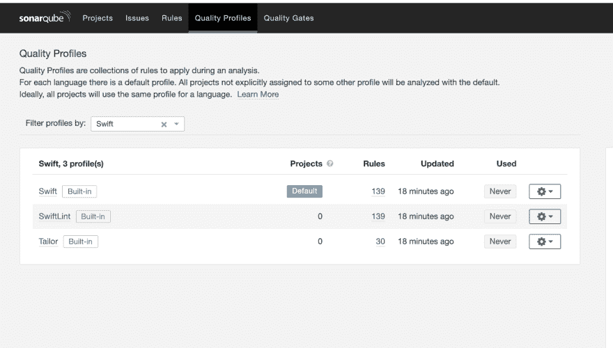
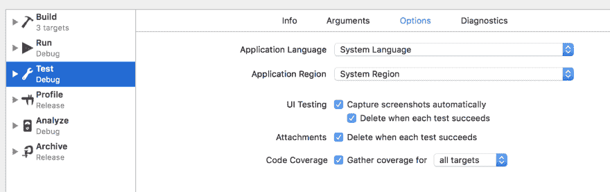

# 如何在 Swift 项目中使用 Sonarqube

> 原文：<https://dev.to/onmyway133/how-to-use-sonarqube-in-swift-projects-5db5>

## 安装 Sonarqube

[https://docs . sonar qube . org/latest/setup/get-started-2-minutes/](https://docs.sonarqube.org/latest/setup/get-started-2-minutes/)

*   下载苹果电脑版 sonar qube[https://www.sonarqube.org/downloads/](https://www.sonarqube.org/downloads/)
*   放入`~/sonarqube`
*   运行本地主机服务器`~/sonarqube/bin/macosx-universal-64/sonar.sh console`
*   用`admin/admin`登录`http://localhost:9000`
*   创建新项目

## 安装声纳扫描仪

[https://docs . sonar cube . org/display/SCAN/Analyzing+with+sonar cube+Scanner](https://docs.sonarqube.org/display/SCAN/Analyzing+with+SonarQube+Scanner)

*   macOS 64 位下载
*   放入`~/sonarscanner`
*   导出`PATH=$PATH:/Users/khoa/sonarscanner/bin`
*   转到项目，创建`sonar-project.properties`

```
# must be unique in a given SonarQube instance
sonar.projectKey=my-app
# this is the name and version displayed in the SonarQube UI. Was mandatory prior to SonarQube 6.1.
sonar.projectName=My App
sonar.projectVersion=1.0

# Path is relative to the sonar-project.properties file. Replace "\" by "/" on Windows.
# This property is optional if sonar.modules is set. 
sonar.sources=.

# Encoding of the source code. Default is default system encoding
#sonar.sourceEncoding=UTF-8 
```

*   运行`sonar-scanner`

## 安装 swift 插件

[https://github.com/Backelite/sonar-swift](https://github.com/Backelite/sonar-swift)

*   下载 jar 文件[https://github.com/Backelite/sonar-swift/releases](https://github.com/Backelite/sonar-swift/releases)
*   跟随[https://docs.sonarqube.org/latest/setup/install-plugin/](https://docs.sonarqube.org/latest/setup/install-plugin/)
*   将 jar 文件放入`~/sonarqube/extensions/plugins`
*   重启服务器
*   将 run-sonar-swift . sh[https://github . com/back elite/sonar-swift/blob/develop/sonar-swift-plugin/src/main/shell/run-sonar-swift . sh](https://github.com/Backelite/sonar-swift/blob/develop/sonar-swift-plugin/src/main/shell/run-sonar-swift.sh)复制到项目文件夹
*   转到质量配置文件[http://localhost:9000/profiles？language=swift](http://localhost:9000/profiles?language=swift)

[](https://res.cloudinary.com/practicaldev/image/fetch/s--5fkb1yD8--/c_limit%2Cf_auto%2Cfl_progressive%2Cq_auto%2Cw_880/https://user-images.githubusercontent.com/2284279/56885533-ed320000-6a6c-11e9-8550-7b24487a0a45.png)

## 运行-声纳-swift.sh

*   更新 sonar-project.properties

```
sonar.swift.appScheme=MyApp Staging
sonar.swift.project=MyApp.xcodeproj
sonar.swift.workspace=MyApp.xcworkspace
sonar.swift.simulator=platform=iOS Simulator,name=iPhone Xʀ 
```

*   运行`chmod +x run-sonar-swift.sh`
*   运行`./run-sonar-swift.sh`

## 故障排除

### 失败，错误代码:64【https://github.com/Backelite/sonar-swift/issues/222 T2】

运行`./run-sonar-swift.sh`时

```
xcodebuild: error: ''MyApp.xcodeproj'' does not exist.
2019-04-29 12:10:17.486 defaults[4134:569992]
Domain CFBundleShortVersionString does not exist
.Extracting Xcode project informationxcodebuild: error: option 'Destination' requires at least one parameter of the form 'key=value' 
```

👉`sonar-project.properties`中去掉引号
👉修改 run-sonar-swift.sh，把这些加在`Check for mandatory parameters`段之前

用双引号括起来

```
projectFile="\"$projectFile\""
workspaceFile="\"$workspaceFile\""
appScheme="\"$appScheme\""
destinationSimulator="\"$destinationSimulator\"" 
```

😢不工作
👉需要创建一个不带空格的方案名

### 错误代码 65

👉在 Xcode 项目中指定团队

### 目的地

需要双引号

`destinationSimulator="\"$destinationSimulator\""`

使用等号`=`

```
-destination="$destinationSimulator" 
```

代替空格“”

```
-destination "$destinationSimulator" 
```

### 度量“文件”不应由传感器计算

当运行`sonar-scanner`[https://github.com/Backelite/sonar-swift/issues/212](https://github.com/Backelite/sonar-swift/issues/212)T3】

```
11:01:14.406 INFO: Sensor JaCoCo XML Report Importer [jacoco]
11:01:14.409 DEBUG: No reports found
11:01:14.409 INFO: Sensor JaCoCo XML Report Importer [jacoco] (done) | time=3ms
11:01:14.409 INFO: Sensor SwiftLint [backelitesonarswiftplugin]
11:01:14.417 INFO: Sensor SwiftLint [backelitesonarswiftplugin] (done) | time=8ms
11:01:14.417 INFO: Sensor Tailor [backelitesonarswiftplugin]
11:01:14.418 INFO: Sensor Tailor [backelitesonarswiftplugin] (done) | time=1ms
11:01:14.418 INFO: Sensor OCLint [backelitesonarswiftplugin]
11:01:14.419 INFO: Sensor OCLint [backelitesonarswiftplugin] (done) | time=1ms
11:01:14.419 INFO: Sensor FauxPas [backelitesonarswiftplugin]
11:01:14.419 INFO: Sensor FauxPas [backelitesonarswiftplugin] (done) | time=0ms
11:01:14.419 INFO: Sensor Swift Squid [backelitesonarswiftplugin]
11:01:14.526 INFO: ------------------------------------------------------------------------
11:01:14.526 INFO: EXECUTION FAILURE
11:01:14.526 INFO: ------------------------------------------------------------------------
11:01:14.527 INFO: Total time: 6.180s
11:01:14.603 INFO: Final Memory: 25M/566M
11:01:14.603 INFO: ------------------------------------------------------------------------
11:01:14.603 ERROR: Error during SonarQube Scanner execution
java.lang.UnsupportedOperationException: Metric 'files' should not be computed by a Sensor
    at org.sonar.scanner.sensor.DefaultSensorStorage.saveMeasure(DefaultSensorStorage.java:168) 
```

👉安装 maven[https://maven.apache.org/download.cgi](https://maven.apache.org/download.cgi)T8】编辑`ObjectiveCSquidSensor.java`和`SwiftSquidSensor`，删除线用`CoreMetrics.FILES`T9】运行`export PATH=$PATH:/Users/khoa/apache-maven/bin`T10】运行`./build-and-deploy.sh`T11】或`~/apache-maven/bin/mvn clean install`

🎉构建的 jar 在`sonar-swift-plugin/target/backelite-sonar-swift-plugin-0.4.4.jar`中，复制回`extensions/plugins`

### 如何启用 SwiftLint 作为默认配置文件🤔

👉需要关闭当前声纳标签并重启服务器

### 测试失败:无法附加数据库

修改`run-sonar-swift.sh`将`-UseModernBuildSystem=NO`添加到`buildCmd+=(-destination`

### 找不到覆盖目录

👉启用方案->测试中的覆盖选项

[](https://res.cloudinary.com/practicaldev/image/fetch/s--fmiOPP4W--/c_limit%2Cf_auto%2Cfl_progressive%2Cq_auto%2Cw_880/https://github.com/SlatherOrg/slather/raw/master/README_Images/test_scheme.png)

可选:申报`.slather.yml`文件[https://github.com/SlatherOrg/slather](https://github.com/SlatherOrg/slather)

### 无法执行 SonarQube

```
14:53:23.251 ERROR: Error during SonarQube Scanner execution
org.sonarsource.scanner.api.internal.ScannerException: Unable to execute SonarQube
    at org.sonarsource.scanner.api.internal.IsolatedLauncherFactory.lambda$createLauncher$0(IsolatedLauncherFactory.java:85) 
```

👉启动声纳服务器

* * *

支持我的应用程序

*   [推送 Hero -测试推送通知的纯 Swift 原生 macOS 应用](https://www.producthunt.com/posts/push-hero-2)
*   [快速访问-在 Mac 菜单栏中组织文件](https://www.producthunt.com/posts/quick-access)
*   [帧记录器-带帧记录器 gif 和视频](https://www.producthunt.com/posts/frame-recorder)
*   [其他应用](https://onmyway133.github.io/projects/)

❤️❤️😇😍🤘❤️❤️