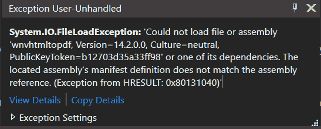
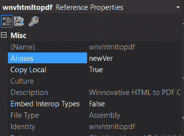

# 如何在同一项目中使用同一 DLL 的两个版本

> 原文：<https://dev.to/johnnymakestuff/how-to-use-two-versions-of-the-same-dll-in-the-same-project-31db>

当使用第三方库时，有时他们会发布一个新版本。有时，新版本打破了旧版本的某些功能，但也增加了您需要的功能。所以你发现自己不得不使用同一个库中旧版本的一种方法和新版本的另一种方法。

## 问题

这里有两个问题:

1.  它不会编译。两个库具有相同的名称空间，导致编译器无法处理的二义性。

[](https://res.cloudinary.com/practicaldev/image/fetch/s--ArmC-yV8--/c_limit%2Cf_auto%2Cfl_progressive%2Cq_auto%2Cw_880/https://www.learningsomethingnew.com/dll-diff-version/compile-ex.png)

1.  它不会跑。引用的 dll 被复制到输出目录，但是因为它们具有相同的名称，所以它们会相互重写，并且会导致程序集的运行时加载版本不匹配。

[](https://res.cloudinary.com/practicaldev/image/fetch/s--DhPM2azi--/c_limit%2Cf_auto%2Cfl_progressive%2Cq_auto%2Cw_880/https://www.learningsomethingnew.com/dll-diff-version/runtime-ex.png)

欢迎来到 DLL 地狱。

## 解

让我们以我客户的项目为例。
该项目使用 Winnovative 软件的第三方库来处理 pdf 操作。
dll 的新版本破坏了一些必须被支持的特定功能。
DLL 名称:`wnvhtmltopdf.dll`
旧版本:14.2
新版本:14.5

该解决方案包括两个部分:

1.  用外部别名解决编译歧义
2.  解决运行时加载不明确的问题

### 将旧 DLL 放入文件夹

为旧的 DLL 创建一个文件夹，比方说`wnv-old`，放在那里。
添加对旧 DLL 的引用。

### 用 extern 别名解决编译歧义

#### 改变引用别名:

默认情况下，我们添加到项目中的每个引用都有一个“全局”别名。
对于这个重复的引用，我们将更改别名，以便区分名称空间。
在 Visual Studio 的引用属性中，将别名字段更改为`newVer`和`oldVer`或任何您想要的值:

[](https://res.cloudinary.com/practicaldev/image/fetch/s--TBaCgt8w--/c_limit%2Cf_auto%2Cfl_progressive%2Cq_auto%2Cw_880/https://www.learningsomethingnew.com/dll-diff-version/alias-new.png)

#### 改变使用语句:

无论我们在哪里使用名称空间，我们都会将 using 语句改为:

```
extern alias newVer; // Must be at top of file
using newVer::Winnovative; // Instead of using Winnovative; 
```

并且在你想要使用旧版本的类中:

```
extern alias oldVer; 
using oldVer::Winnovative; 
```

这将使代码编译。现在来解决运行时崩溃:

### 获取 DLL publicKeyToken

在 cmd 中，使用`sn -T`命令:

```
sn -T wnvhtmltopdf.dll

Microsoft (R) .NET Framework Strong Name Utility  Version 4.0.30319.0
Copyright (c) Microsoft Corporation.  All rights reserved.

Public key token is b12703d35a33ff98 
```

### 修改 app.config / web.config

在`<runtime>`下，为 DLL 的每个版本添加一个`<codeBase>`标签。这将解决运行时程序集加载冲突。

```
<dependentAssembly>
  <assemblyIdentity name="wnvhtmltopdf" publicKeyToken="b12703d35a33ff98" culture="neutral" />
  <codeBase version="14.2.0.0" href="DLL\wnv-old\wnvhtmltopdf-old.dll" />
  <codeBase version="14.5.0.0" href="DLL\wnvhtmltopdf.dll" />
</dependentAssembly> 
```

就这样，现在我们可以随心所欲地使用两个版本了。

> 这是我的[博客](https://www.learningsomethingnew.com/how-to-use-two-versions-of-the-same-dll-in-the-same-project)的交叉帖子