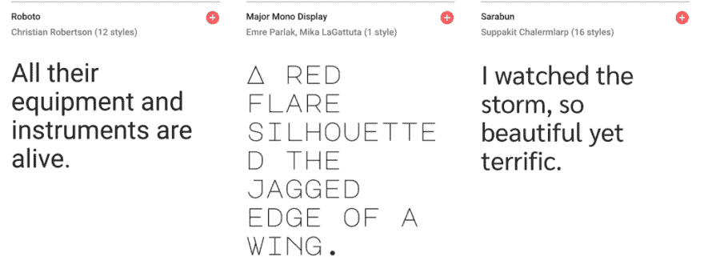
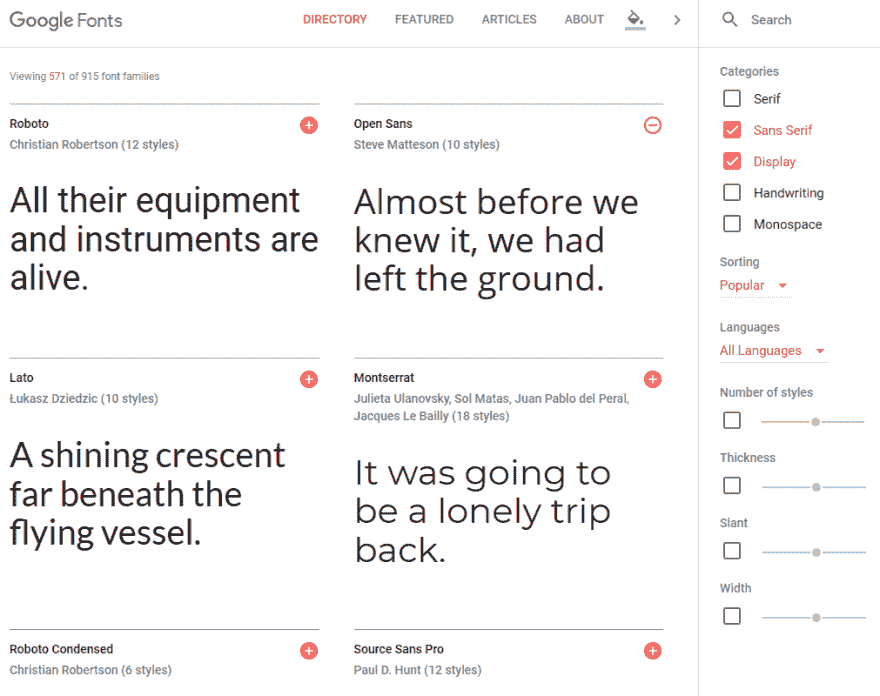
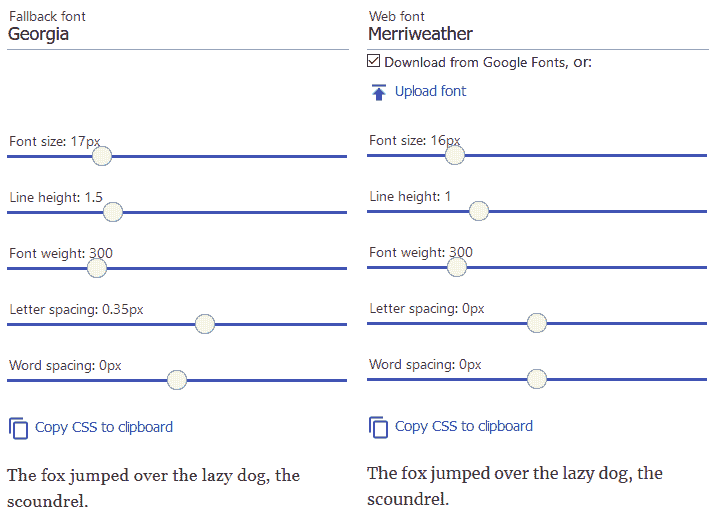
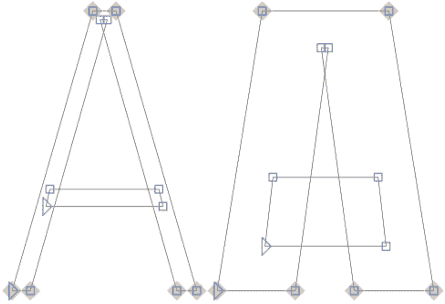

# 如何在 CSS 中使用 web 字体

> 原文：<https://dev.to/bnevilleoneill/how-to-use-web-fonts-in-css-4b2o>

[](https://res.cloudinary.com/practicaldev/image/fetch/s--qPU-stdh--/c_limit%2Cf_auto%2Cfl_progressive%2Cq_auto%2Cw_880/https://cdn-images-1.medium.com/max/1024/1%2AqQPAMr_eVqnutHKhlYoT2A.png)

在早期，设计者局限于流行的系统字体，如 Arial、Helvetica、Verdana 和 Times New Roman。只有使用图像替换或插件(如 Flash)时，才可能使用可靠的自定义字体。

1997 年发布的 Internet Explorer 4.0 引入了对 web 字体的基本支持。然而，跨浏览器技术用了十多年才由 [@font-face](https://developer.mozilla.org/en/docs/Web/CSS/@font-face) 标签实现。新的开源字体的可用性也防止了不愿意允许无限制使用商业字体的供应商的法律问题。

在本教程中，我们将讨论向网页添加自定义字体的各种技术和最佳实践。*但是首先……*

[](https://logrocket.com/signup/)

### 你真的需要网页字体吗？

仅仅因为你*可以*给每一页添加几十种字体并不意味着你应该这样做！

*   设计师建议节约使用字体，每个文档只使用一到两种字体
*   自定义字体通常需要几百 Kb。添加的越多，页面权重越大，页面性能越差。这在移动设备和较慢的网络上尤其成问题
*   每个网站都使用标准操作系统字体的日子已经一去不复返了，比如 Helvetica 字体或泰晤士新罗马字体——*不使用它们的理由越来越少了*

操作系统字体是免费的，可以显著提高性能。每个平台提供的字体各不相同，但是可以指定回退以及 serif、sans-serif、monospace、草书、fantasy 和 system-ui 的通用字体系列名称，例如

```
body {
  font-family: Arial, Helvetica, sans-serif;
} 
```

如果 Web 应用程序使用标准的系统字体，它们可能会感觉更自然。例如，在[GitHub.com](https://github.com/)实现的以下堆栈针对 Mac OS、iOS、Windows、Linux 和 Android 平台上可用的系统字体:

```
body {
  font-family: -apple-system, BlinkMacSystemFont, "Segoe UI", Roboto, Helvetica, Arial, sans-serif, "Apple Color Emoji", "Segoe UI Emoji", "Segoe UI Symbol";
} 
```

Medium.com 的和 T2 的管理面板的
也使用了类似的变化

```
body {
  font-family: -apple-system,BlinkMacSystemFont,"Segoe UI",Roboto,Oxygen-Sans,Ubuntu,Cantarell,"Helvetica Neue",sans-serif;
} 
```

如果一个栈需要在一个样式表中有几个声明，那么使用一个 CSS 预处理程序，比如 Sass:

```
$font-stack: "Segoe UI",Roboto,Ubuntu,sans-serif;
body {
  font-family: $font-stack;
} 
```

CSS 自定义属性:

```
:root {
  font-stack: "Segoe UI",Roboto,Ubuntu,sans-serif;
} 
```

或者引用本地字体的@font-face 声明:

 `jsx
body {
font-family:var(—font-stack)；
}

```
@font-face {
  font-family: fontstack;
  font-style: normal;
  font-weight: 300;
  src: local("Segoe UI"),local("Roboto"),local("Ubuntu");
}

body {
  font-family: fontstack, sans-serif;
} 
```

或者引用本地字体的@font-face 声明:

```
@font-face {
  font-family: fontstack;
  font-style: normal;
  font-weight: 300;
  src: local("Segoe UI"),local("Roboto"),local("Ubuntu");
}

body {
  font-family: fontstack, sans-serif;
} 
```

### 使用网络字体库

如果一种系统字体让你的营销经理畏缩不前，那么有几个存储库提供大量的开源字体，这些字体由内容交付网络(CDN)提供。常见选项包括:

*   Google Fonts: [https://fonts.google.com/](https://fonts.google.com/)
*   字库:[https://fontlibrary.org/](https://fontlibrary.org/)
*   土坯边缘:[https://edgewebfonts.adobe.com/](https://edgewebfonts.adobe.com/)

Google Fonts 是最常用的，它提供了可搜索列表、重量和样式定制选项，以及加载时间估计。

[](https://res.cloudinary.com/practicaldev/image/fetch/s--7zFEQDk0--/c_limit%2Cf_auto%2Cfl_progressive%2Cq_auto%2Cw_880/https://cdn-images-1.medium.com/max/1011/0%2A-RQmgjGc-WrTbA34) 

<figcaption>谷歌字体</figcaption>

要在页面中嵌入字体，在 HTML 头中使用标准标签，例如:

```
<link href="https://fonts.googleapis.com/css?family=Open+Sans" rel="stylesheet"> 
```

该字体将与您自己的样式表并行下载和处理。

或者，可以使用 CSS @ import:

```
@import url('https://fonts.googleapis.com/css?family=Open+Sans'); 
```

但是这会阻止进一步处理样式表，直到字体样式被解析。

然后可以在任何 CSS 声明中设置 web 字体，例如:

```
body {
  font-family: "Open Sans", sans-serif;
} 
```

可以对 URL API 进行进一步的优化，例如请求多个系列:

```
https://fonts.googleapis.com/css?family=Inconsolata|Droid+Sans 
```

不同重量和款式:

```
https://fonts.googleapis.com/css?family=Inconsolata:500,700
https://fonts.googleapis.com/css?family=Roboto:bolditalic 
```

或者将字体限制为已知的字母——也许是标识或标题，例如:

```
https://fonts.googleapis.com/css?family=Inconsolata&text=hello 
```

更多信息，请参考[谷歌字体 API](https://developers.google.com/fonts/docs/getting_started) 入门。

### 使用自己的字体文件

任何字体文件都可以在你的网页中使用，但是要检查你是否得到了字体所有者的许可。所有现代浏览器都支持 WOFF 格式。 [WOFF2](https://en.wikipedia.org/wiki/Web_Open_Font_Format) 提供 30%的典型压缩节省，但不支持 Internet Explorer。对于较老或较模糊的应用程序，可以选择 TTF、EOT 或 SVG。

字体松鼠 web 字体生成器提供了一个简单的工具来上传一个或多个字体，调整设置，并下载包含转换后的字体和 CSS 代码的工具包。

[](https://res.cloudinary.com/practicaldev/image/fetch/s--MFHx62ie--/c_limit%2Cf_auto%2Cfl_progressive%2Cq_auto%2Cw_880/https://cdn-images-1.medium.com/max/755/0%2AXVhgXztAM2X6BlnP) 

<figcaption>字体松鼠网页字体生成器工具</figcaption>

默认情况下，它提供了 WOFF2 字体、WOFF 回退和适当的 CSS @font-face 设置，例如:

```
@font-face {
  font-family: 'mytypeface';
  src: url('mytypeface-webfont.woff2') format('woff2'),
       url('mytypeface-webfont.woff') format('woff');
  font-weight: normal;
  font-style: normal;
}

body {
  font-family: mytypeface, serif;
} 
```

### 疯狂和疯狂

下载 web 字体可能需要几秒钟，尤其是在速度较慢的设备或网络上。浏览器可以选择:

1.  显示无样式文本的闪烁(FOUT)。立即使用第一个可用的回退。加载后，它将被 web 字体替换。IE、Edge 18 及以下版本，以及 Firefox 和 Opera 的旧版本都使用这一过程
2.  显示不可见文本的闪烁(FOIT)。在加载 web 字体之前，不会显示任何文本。这一过程在所有现代浏览器中使用，通常在返回到回退之前等待 3 秒钟

可以控制浏览器字体渲染过程的某些方面。

### 用字体显示设置字体-flash 收藏夹

属性允许你定义在基于 Firefox、Safari 和 Chromium 的浏览器中使用哪个进程。选项:

*   **auto** :浏览器的默认行为。这是最简单的选择，但可能无法提供最佳的阅读体验
*   **block** :有效 FOIT——文字可能长达三秒不可见。没有字体交换，但它会让网站感觉更慢，因为文本不是立即可用的
*   **交换**:有效 font 使用第一个回退，直到网络字体可用。文本可以没有任何延迟地阅读，但是如果没有有效地管理，字体交换效果可能会不和谐
*   **回退**:FOIT 和 FOUT 之间的一种折衷——文本在短时间内(通常为 100 毫秒)不可见，然后使用第一种回退，直到网络字体可用。尽管文本在页面加载时是可读的，但是字体交换仍然是个问题
*   **可选**:与 fallback 相同，只是不会发生字体交换。只有在初始阶段可用时，才会使用 web 字体。在下载和缓存 web 字体时，第一页面视图可能会显示备用字体。后续页面视图将使用 web 字体。如果 web 字体和 fallback 相似，这可能是一个合理的选择，但是，在这种情况下，web 字体真的有必要吗？

示例:

```
@font-face {
  font-family: 'mytypeface';
  src: url('mytypeface-webfont.woff2') format('woff2'),
       url('mytypeface-webfont.woff') format('woff');
  font-weight: normal;
  font-style: normal;
  font-display: swap;
} 
```

不同的字体可以使用不同的设置。例如，正文文本可以使用**交换** (FOUT)，这样就可以立即阅读，而菜单和标题文本使用* *块** (FOIT)。

### 用 JavaScript 执行 FOUT

当使用来自诸如 Google Fonts 等存储库的字体时，字体显示属性可能是未定义的或自动的(尽管正在考虑对 API 进行更改)。在大多数浏览器中，文本在几秒钟内是不可见的。

为了实现类似 FOUT 的加载，有几个库，如 [Typekit webfontloader](https://github.com/typekit/webfontloader) 使用 JavaScript 来控制字体的加载方式。大多数遵循相同的过程，并且可以用几行代码复制。首先，一个系统后备被定义为 CSS 中的主要字体:

```
body {
  font-family: Georgia, serif;
} 
```

然后使用 JavaScript 来获取 web 字体，并在 HTML `<body>`标签下载完
后添加一个新的类(比如 wt-active)

```
(() => {
// load Google font
  let font = document.createElement('link');
  font.rel = 'stylesheet';
  font.href = 'https://fonts.googleapis.com/css?family=Merriweather';
  font.onload = () => document.body.classList.add('wf-active');
  document.head.appendChild(font);
})(); 
```

当`wt-active`类出现时，进一步的 CSS 声明用 web 字体覆盖默认的后备字体:

```
body.wf-active {
  font-family: Merriweather;
} 
```

### 有效 FOUT 回流

当回退字体和 web 字体明显不同时，未设置样式的文本闪烁可能会造成不协调，并导致明显的布局重排。像[字体样式匹配器](https://meowni.ca/font-style-matcher/)这样的工具可以通过为回退字体和/或网页字体设置适当的粗细、行高和间距来帮助最小化这种影响。

[](https://res.cloudinary.com/practicaldev/image/fetch/s--9GHhfqRU--/c_limit%2Cf_auto%2Cfl_progressive%2Cq_auto%2Cw_880/https://cdn-images-1.medium.com/max/722/0%2AIB4L2lZKTR1WS6vE)T3】字体样式匹配器

无论加载字体需要多长时间，由此产生的替换都会减少阅读正文时出现的问题:

[](https://res.cloudinary.com/practicaldev/image/fetch/s--i35XX8rF--/c_limit%2Cf_auto%2Cfl_progressive%2Cq_auto%2Cw_880/https://cdn-images-1.medium.com/max/700/0%2AoA2SBOwcFOILSxBe) 

<figcaption>最小化字体切换效果</figcaption>

### 处理字体粗细和样式

每个字体文件都有自己的粗细(粗细)、风格(斜体倾斜)、拉伸和变体。如果您在 CSS 中进行调整而没有加载相关的字体，浏览器将尝试自己的插值。渲染速度会变慢，字体看起来会更差，可读性会受到影响，或者宽度会有很大的不同，会破坏布局，例如:

```
/* load font with a weight of 300 */
@import url('https://fonts.googleapis.com/css?family=Open+Sans:300')
body {
  font-family: "Open Sans", serif;
}
/* but use a weight of 600 - do not do this! */
strong {
  font-weight: 600;
} 
```

解决方案是为你需要的每种粗细和样式加载一个单独的字体文件，然后相应地显式设置所有样式，例如

```
/* load font with weights of 300 and 600 */
@import url('https://fonts.googleapis.com/css?family=Open+Sans:300,600');
/* weight 300 for all elements */
* {
  font-weight: 300;
}
body {
  font-family: "Open Sans", serif;
}
/* weight 600 for bold elements */
h1, h2, h3, strong {
  font-weight: 600;
} 
```

然而，为每种不同的粗细和风格加载单独的字体文件很快变得没有必要了…

### 可变字体

OpenType 1.8 在 2016 年引入了可变字体。可变字体不是为同一字样的每个变体创建多个文件，而是沿一个轴定义最小和最大矢量限制，例如

[](https://res.cloudinary.com/practicaldev/image/fetch/s--YuKSmGn7--/c_limit%2Cf_auto%2Cfl_progressive%2Cq_auto%2Cw_880/https://cdn-images-1.medium.com/max/445/0%2ABv809lyETqRCL9_D) 

<figcaption>可变字体宽度轴矢量限制</figcaption>

这两个极端之间的任何字体粗细现在都可以插值。根据字体，您可以调整字样的各个方面，包括:

#### 重量

使用
可以在 1 到 1000 之间设置字体的粗细

```
font-weight: 400;
/* or */
font-variation-settings: 'wght' 400; 
```

#### 宽度

字体可以拉伸以产生压缩或扩展的变化。100%通常被认为是默认值，相应地，对于更窄或更宽的宽度，范围高于或低于该值:

```
font-stretch: 80%;
/* or */
font-variation-settings: 'wdth' 80; 
```

#### 斜体

因为标准字符和斜体字符可能不同，所以斜体轴可以打开或关闭:

```
font-style: italic;
/* or */
font-variation-settings: 'ital' 1; 
```

#### 偏

斜体字*或斜体字*与斜体的不同之处在于，字体不变，但可以在 0 到 20 度的轴上变化:

```
font-style: oblique 10deg;
/* or */
font-variation-settings: 'slnt' 10; 
```

在[浏览器支持](https://caniuse.com/#feat=variable-fonts)变得更加广泛之前，你不太可能在存储库中找到可变字体。资源文件可以在【v-fonts.com】的、[的](https://www.axis-praxis.org/specimens/)和[的](https://play.typedetail.com/)字体游乐场等地点找到。

可变字体文件可以使用@font-face 加载，具有 woff2-variations 格式和允许的范围，例如:

```
@font-face {
  font-family: 'MyVariableFont';
  src: 'myvariablefont.woff2' format('woff2-variations');
  font-weight: 200 800;
  font-stretch: 75% 125%;
  font-style: oblique 0deg 20deg;
} 
```

然后可以在任何选择器中使用多个 CSS 属性设置特定的样式:

```
p {
  font-family: 'MyVariableFont';
  font-weight: 300;
  font-stretch: 100%;
  font-style: oblique 0deg;
} 
```

或者速记[字体-变化-设置](https://developer.mozilla.org/en-US/docs/Web/CSS/font-variation-settings)属性:

```
p {
  font-family: 'MyVariableFont';
  font-variation-settings: 'wght' 300, 'wdth' 100, 'slnt' 0;
} 
```

可变字体支持可以用 CSS @supports 查询来测试，例如:

```
p {
  font-family: FallbackFont;
}
@supports (font-variation-settings: 'wght' 300) {
  p {
    font-family: 'MyVariableFont';
    font-variation-settings: 'wght' 300, 'wdth' 100, 'slnt' 0;
  }
} 
```

这使得为旧的浏览器加载标准的单一样式字体文件成为可能，并且当支持可变字体时，可以添加更多的样式。不幸的是，大多数浏览器会下载所有字体，这抵消了单个可变字体文件的任何性能优势。

### 结论

在过去的十年里，网络字体彻底改变了网站的排版方式。设计者受到的限制更少，可以实现在所有主流设备和浏览器上工作的字体。

然而，字体下载权重，网站性能，以及管理无样式或不可见文本的 flash 仍然是问题。标准的操作系统字体应该是你首先考虑的。

可变字体是未来的趋势。这些提供了多种变化，潜在的新的基于字体的效果，减少页面重量，简化开发。这是一个令人兴奋的发展，但要警惕有限的浏览器支持。

* * *

### Plug: [LogRocket](https://logrocket.com/signup/) ，一款适用于网络应用的 DVR

[](https://logrocket.com/signup/)

<figcaption>[https://logrocket.com/signup/](https://logrocket.com/signup/)</figcaption>

LogRocket 是一个前端日志工具，可以让你回放问题，就像它们发生在你自己的浏览器中一样。LogRocket 不需要猜测错误发生的原因，也不需要向用户询问截图和日志转储，而是让您重放会话以快速了解哪里出错了。它可以与任何应用程序完美配合，不管是什么框架，并且有插件可以记录来自 Redux、Vuex 和@ngrx/store 的额外上下文。

除了记录 Redux 操作和状态，LogRocket 还记录控制台日志、JavaScript 错误、堆栈跟踪、带有头+正文的网络请求/响应、浏览器元数据和自定义日志。它还使用 DOM 来记录页面上的 HTML 和 CSS，甚至为最复杂的单页面应用程序重新创建像素级完美视频。

免费试用。

* * *

帖子[如何在 CSS 中使用网络字体](https://blog.logrocket.com/how-to-use-web-fonts-in-css-a0326f4d6a4d/)最先出现在[博客](https://blog.logrocket.com)上。`