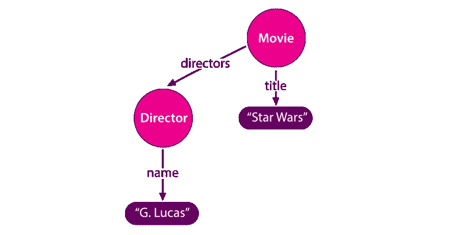
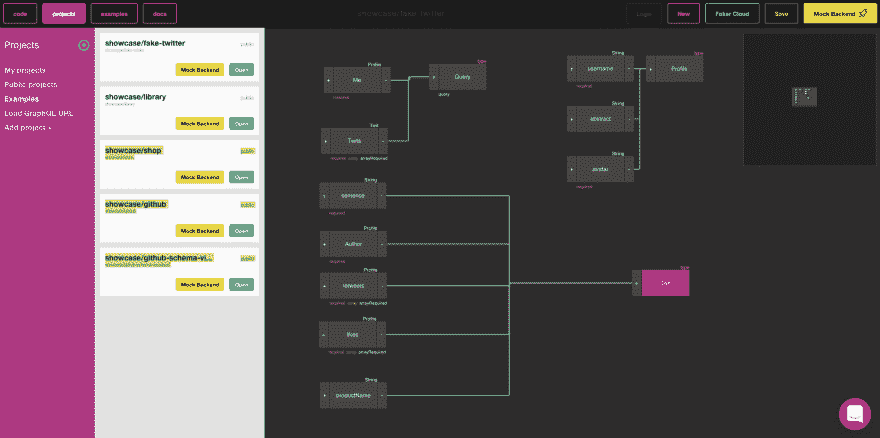

# 如何可视化你的 GraphQL 模式？

> 原文：<https://dev.to/graphqleditor/how-to-visualize-your-graphql-schema-3hk3>

GraphQL 是你今年必须学习的一项技术，以跟上前端和后端发展的步伐。现在休息是最受欢迎的选择，但这很快就会改变。如果你还没有考虑转换到 GraphQL，现在正是时候:)

## 了解你的图式

#### 什么是 GraphQL 模式，为什么了解它如此重要？

GraphQL 模式是 GraphQL 项目的核心。GraphQL 模式嵌套在您的 GraphQL 服务器中，定义了客户端可用的每一项功能。每个模式的主要元素是`type`,它允许建立不同类型之间的关系，定义允许在服务器上执行的 GraphQL 操作(查询和变异)等等。

为了更容易理解服务器可以执行的操作，GraphQL 定义了一种通用模式语法，称为 SDL(模式定义语言)。SDL 定义了项目的元素，即`type` :

```
type  Movie  {  title:  String  Director:  Director  }  type  Director  {  name:  String  movies:  [Movie]  } 
```

Enter fullscreen mode Exit fullscreen mode

或者`query`(向服务器请求数据)和`mutation`(操纵数据):

```
type  Query{  getMovies:  [Movie]  getDirectors:  [Director]  } 
```

Enter fullscreen mode Exit fullscreen mode

```
type  Mutation  {  addMovie(title:  String,  director:  String)  :  Movie  } 
```

Enter fullscreen mode Exit fullscreen mode

因此，正如您所看到的，模式确实是任何 GraphQL 项目的核心，了解什么是什么以及在哪里可以找到它是很重要的。大而复杂的模式真的很难理解。我们以 GitHib schema 为例，它有 **9182** 行代码！真的很难理解...幸运的是，图表正在帮助我们！

## 可视化是关键

图形是一种抽象数据类型。它的结构由一组有限的顶点、节点或链接在一起的点组成。图表是塑造应用程序背后逻辑的一个很好的工具，因为它们非常适合任何 it 项目，在这一点上，我们可以同意在理解模式方面，图表比代码更容易理解。

[](https://res.cloudinary.com/practicaldev/image/fetch/s--SmkhgtKx--/c_limit%2Cf_auto%2Cfl_progressive%2Cq_auto%2Cw_880/https://thepracticaldev.s3.amazonaws.com/i/sdxz9zfiw0h9arstp785.png)

#### 将模式代码转化为图形

那么，我们如何把我们的模式代码变成一个可视化的图形呢？这比你想象的要简单。我们将使用 [GraphQL 编辑器](https://graphqleditor.com)。

你所需要做的就是从 URL 中加载你的模式(你也可以建立一个新的模式(使用代码或可视化编辑器),如下所示...

[](https://res.cloudinary.com/practicaldev/image/fetch/s--hzjnUtTe--/c_limit%2Cf_auto%2Cfl_progressive%2Cq_auto%2Cw_880/https://thepracticaldev.s3.amazonaws.com/i/li2iy3dytieuli0m8k34.png)

...就是这样！

如果你给编辑器提供了一个有效的模式，它会自动把它的代码变成一个可视化的图形。很酷，对吧？

[](https://res.cloudinary.com/practicaldev/image/fetch/s--vMNMLEHO--/c_limit%2Cf_auto%2Cfl_progressive%2Cq_auto%2Cw_880/https://thepracticaldev.s3.amazonaws.com/i/gnm02slv896l84n5ronp.png)

PS:

原文章发布在 GraphQL 编辑博客-[https://blog.graphqleditor.com/visualize-your-schema/](https://blog.graphqleditor.com/visualize-your-schema/)

这里是 GraphQL 编辑器应用的链接，以防你想尝试一下-
[https://app.graphqleditor.com/showcase/fake-twitter/](https://app.graphqleditor.com/showcase/fake-twitter/)