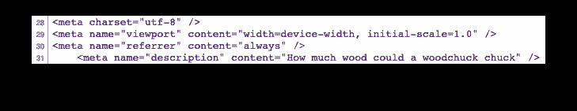
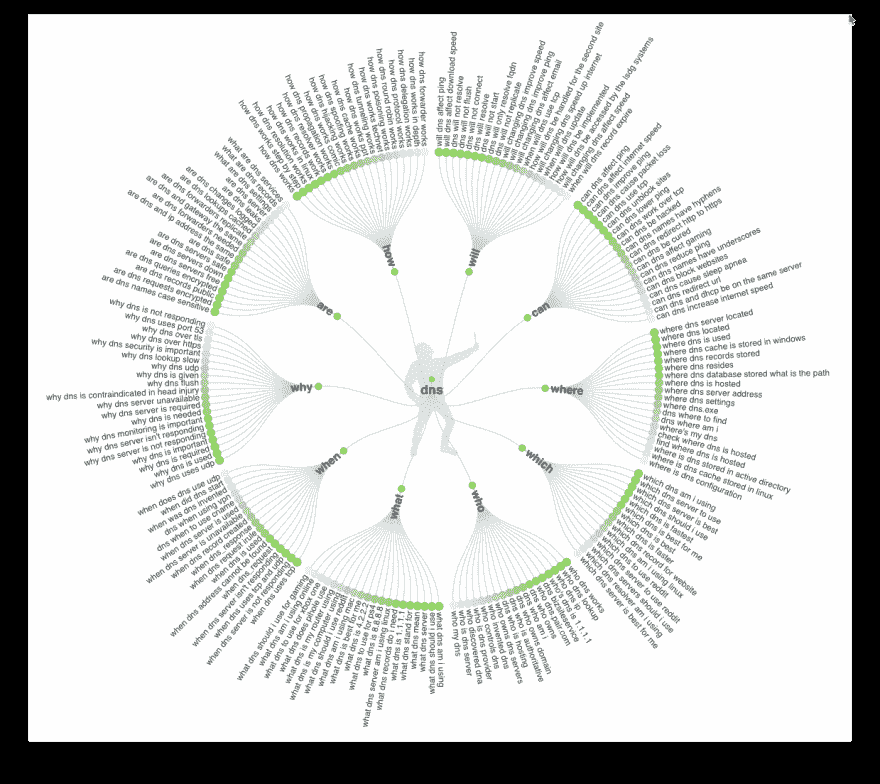

# 如何写一个伟大的技术博客排名

> 原文：<https://dev.to/theblairwitch/how-to-write-a-great-technical-blog-that-ranks-1hn8>

你可以成为一名伟大的开发者，也可能成为一名优秀的作家...但这并不意味着你的博客在搜索引擎上排名很高。后者需要大量的实践、用户研究，最重要的是...反复试验。

在我教你如何写出在搜索引擎上排名靠前的技术博客之前...你需要知道这个:

这个博客不会让你成为一个伟大的技术作家，也不会给你一个模板，让你的目标搜索词排名更好。我也不会讨论链接建设或推广，这取决于你。

我要做的是教你如何微调你的博客主题，使它们有潜力排名良好；如何研究所说的主题；以及如何以符合搜索者意图的方式撰写主题的指南。

## 搜索者意图

[搜索者意图](https://moz.com/blog/google-search-intent-content)是什么？现在你的世界里唯一最重要的东西。搜索者的意图是搜索引擎查询背后的驱动力。这可能是一个需要解决的问题，对一个主题的好奇，对验证的寻求...我是说，想想吧。你为什么使用谷歌和其他搜索引擎？

如果你真的不知道，那就看看[你的活动](https://myactivity.google.com/)。

现在取一个你最近的搜索查询，再次输入到你的浏览器中。你最后点击了十个链接中的哪一个？(提示:如果你在同一台设备上，它将是紫色的)。你为什么点击那个链接？你在那里找到你的答案了吗？还是你点了不止一个？

希望你运气好，不用点击任何东西，就能从[特色片段](https://moz.com/blog/ranking-zero-seo-for-answers)中收集到答案...你真幸运。

这是因为为该特色片段排序的页面简洁而准确地解决了用户意图。

在上面的例子中，我想知道土拨鼠能扔掉多少木头。我甚至不需要向下滚动到搜索结果，因为特色片段已经为我用粗体显示了答案。

当你写你自己的技术博客时，你需要把搜索者的意图放在你头脑的最前面...实际上，在你文章的最前面。大多数特色片段从折叠上方的文本中获取内容——这是当您加载页面而无需滚动时在视窗内的内容。

自己运行几个搜索，看看特色片段内容来自哪里。它最有可能在页面的顶部，在一个短的段落中。

现在，你为什么要这样回答用户意图呢？如果他们能从搜索结果页面得到答案，为什么他们会点击你网站的链接呢？这难道不违背更好的搜索引擎排名背后的整个动机吗？

我的意思是，你对 SEO 感兴趣的全部原因是因为你想要网站流量...

因为如果你在写一个技术博客，十有八九你的目标搜索者需要的不仅仅是一句话的答案。

> 把有特色的片段看作是你向搜索者展示你有答案的机会，你是这个主题的权威，他们应该点击你的链接(而不是排名第一的页面)来了解更多。

现在，特色片段是 SEO 的终极目标...为了达到这个目标，你首先需要在搜索结果页面上排名第 1、2、3、4、5 位。要做到这一点，你还需要简明扼要地回答搜索者的意图，然后快速预览搜索者如果继续阅读将会学到的所有其他伟大的东西。

如果你以前涉足过 SEO 领域，你现在可能会对着电脑大喊“不，那不对！谷歌只会显示元描述，所以页面内容无关紧要！”

谢天谢地，事情发生了变化...

如果您对此不熟悉，meta 标签是 HTML 元素，您可以将它放在包含页面标题、描述和关键字的每个页面的标题中。元关键词已经被弃用，但是元描述也正在被淘汰。

不相信我？搜索一些东西，可能是一个问题，然后查看排名靠前的页面的来源。元描述是否包含您在搜索结果页面上看到的相同文本？很有可能，两者会有所不同。

**搜索结果描述:**

**元描述:**

在过去的几年里，Google 不再仅仅依赖元描述来进行页面描述。相反，它抓取页面内容，并使用文本片段为页面生成自己的描述。您还会注意到搜索查询在描述中用粗体显示。

因此，你的博客上的折叠内容对于更好的排名以及高点击率是至关重要的。

至此，你已经理解了搜索者的意图，你已经掌握了现代 SEO 实践，希望齿轮开始转动，你已经准备好开始写作了。

## 选择一个题目

先从选题开始。这其实是最难、最长的一步，慢慢来，不要操之过急。

你不应该凭空扯出你的话题，这个话题应该是有“需求”的。或者正如我们之前提到的，搜索者应该向他们的搜索引擎询问你的话题。

如果你是为了工作而写作，检查你的支持系统。没有吗？检查你得到客户反馈的地方。

已经有话题了？太好了，让我们来测试一下。

你只需要一个词，或者几个词，比如:

*   域名服务器(Domain Name Server)

*   故障转移不起作用

*   辅助 DNS

*   DNS 未解析

我为一家 [DNS 托管公司](https://constellix.com/)工作，所以当我为我们的网站写技术博客和文章时，我将使用我自己工作中的例子。

## 确保你的想法还没有实现

用谷歌快速搜索你的主题，它不一定是一个完整的句子，甚至是一个问题。如果你使用了一个以上的单词，请用引号括起来。已经有博客、文章或论坛解释你在寻找什么了吗？

既然我们在谈论技术内容，论坛通常是你的金矿。在这里你可以发现人们在用他们自己的话谈论你的话题。阅读问题和评论，因为你通常会发现这个问题有多种提问方式，或者至少有其他类似问题的链接。

> 论坛是你最有价值的资源，因为你会发现人们在用你从未想到过的词语谈论你的话题，或者以那种顺序放在一起。

把它们写下来，因为这就是你的搜索意图。

如果你的回答是肯定的，那么你的话题已经有内容了？那也许你不应该写这个...开个玩笑！首先，问自己这三个问题:

1.  它们是好文章吗？你需要阅读多篇文章才能完整回答你的问题吗？这可能是一个机会，让你把几篇文章结合在一起，做一个很棒的博客。

2.  前五个来源是维基百科，一个新闻机构，ServerFault(最近两到三年内)，还是另一个权威来源？这不包括其他提供商或个人/技术博客。Reddit 也不算。如果你说是，那么也许你应该选择另一个话题。

3.  你是否看到了各种各样关于你的话题的文章，而这些文章彼此之间完全不相关？也许你需要对你的话题进行更多的微调...

如果你通过了所有三个问题，仍然觉得你有一个强有力的话题，让我们开始吧！因为在这一点上，你知道你的主题很受欢迎，需要答案，而且没有人像你一样写得如此透彻。

你对第一个问题的回答是否定的吗？没有。我的主题没有任何内容。

这可能意味着没有足够多的人谈论它，或者没有足够好的文章来回答这个问题。

更可怕...这也可能意味着没人关心你的话题。

让我们通过做一些关键词研究来快速排除它。我推荐使用[回答公众](https://answerthepublic.com/)，这是一个免费的关键词可视化工具，向你展示与你的主题相关的关键词和问题。还有主页上那个气恼的男人让我咯咯直笑。

如果您搜索“DNS ”,您会看到类似这样的内容:

分支和子分支越多，你的话题就越受欢迎。如果你没有看到很多，也许他们没有索引它...也可能你的题目很烂(开个玩笑！).

你必须在这里做出决定，要么坚持你可能不受欢迎的话题...或者从新开始。由你决定。

## 给你的话题指明方向

现在你有了你的主题，你需要把它精简成你可以写的东西。因为现在，你只有一个没有方向的概念。

再做一些关键词研究吧！将你的答案放在公共结果中，放大每个分支。

我通常关注“如何”和“什么”分支。在这里，你可以找到用户正在搜索的关于该主题的最基本、最普遍的问题。这些查询还应该让您了解用户希望如何应用这个概念，并为您提供有价值的用例作为示例。

让我们看看“如何”分支。从最暗的查询开始(绿点越暗，查询越受欢迎)，在这种情况下，“DNS 如何工作”是最受欢迎的搜索查询。

现在，沿着列表往下看，您会注意到大多数问题都围绕着 DNS 查找过程。有道理，很混乱。

但是这些问题已经通过许多渠道得到了详细的回答。甚至维基百科和 ICANN 都有关于 DNS 查找过程的文章，这些来源很难被超越。

在这种情况下，由于 DNS 是一个非常受欢迎的话题，我会远离“如何”和“什么”的问题，并转移到不太受欢迎的话题。

避开在“哪个”或“为什么”分支中找到的固执己见的查询也是一个好主意。

所以我们来看看有更高搜索排名机会的东西。切换到不太受欢迎的分支，如“将”和“可以”。在这里，您会看到不太常见的查询，如:

*   DNS 会影响 ping/速度/下载速度吗(通常围绕公共 DNS，不是一个 DNS 托管公司感兴趣的事情)

*   更改 DNS 会影响电子邮件吗

*   DNS 不会解析(仍然太笼统)

*   DNS 名称可以有连字符吗(题外话...提出域名注册的东西)

*   DNS 能把 HTTP 重定向到 HTTPS 吗(哦看！我们已经是这方面的第一名)

这里有一些坚实的博客想法...但请记住，它们还需要与我们的目标行业相关(在本例中，将是托管 DNS)。

这意味着，远离公共 DNS、私有 DNS 和一般的系统管理故障排除问题。

现在有一些例外。如果有你想进入的行业，或者有轻微的话题重叠...继续研究这些话题。只要运用你最好的判断力，如果你觉得你快成功了，你可能真的成功了。

## 调研时间！

至此，你有了话题，有了方向。现在你需要做你的尽职调查，找出所有已经写的关于这个话题的东西。

你可以在以后写文章时使用这些信息。你可以解释你感兴趣的/相关的/必要的东西...或者引用并链接。由你决定。

通常，我会引用并链接我认为相关的内容，但在本文中没有必要。我解释一些重要的东西，比如定义或过程，然后链接到我的出处。

> 使用内联链接来保持文章的整洁和可读性，不要说“多读一些”，这会影响文章的流畅。

迷茫？不要担心，我将带您浏览一个示例主题/博客。

让我们以“改变域名系统会影响电子邮件”为题。谷歌一下，你会看到来自托管公司、Quora、论坛和更多托管服务的结果。

如果你看到很多公司/提供商或论坛在某个查询中排名靠前，不要气馁。通常，这意味着只要你的内容对搜索者来说更有价值，你也有机会排名靠前。

只要你看不到明显权威的、不可否认的第三方来源(如维基百科或被创建为该主题权威的组织)在所有前五名中的排名...你有机会排名很好。

即使排名前五的位置都被占据了，如果你能写一篇真正全面的、经过充分研究的文章，讨论相关话题和可信来源的链接，你仍然有机会。

> 这是你成为你的主题权威来源的黄金机会。

去看前五个结果，阅读文章，做笔记。写下用户问的确切问题(如果是论坛的话)，记下答案，以及任何你觉得有趣的事情。

如果你经常看到一个类似的短语，谷歌一下，这可能是一个相关的话题，你可以在以后触及甚至写下。

此时，你应该有足够的信息开始写作。如果你没有...也许你需要回到你的关键词研究，找到另一个方向与你的主题一起前进。

### 研究提示

当你在 ServerFault、Reddit、Spiceworks 或任何其他论坛上阅读答案时，请自行判断。如果有很多支持票，以及使用该解决方案的人的评论，我会相信这个答案。但是如果它看起来可疑，我会避开使用这个答案作为来源(无论你是否引用它)。

这同样适用于维基百科。如果有引用，就跟着引用，确保可信。

> 底线是，如果它看起来像只鸭子，走路像只鸭子，嘎嘎叫像只鸭子....如果你有一丝一毫，它可能是一只鸭子...不要在你的博客中使用它，因为它可能是一只鸭子。

有更好的消息来源，我保证！如果不是，那么你可以成为那个来源，只要你确信你的信息是真实的和有帮助的。

## 言归正传(我是说写作)

首先，表扬一下自己，因为你已经完成了所有的艰苦工作。现在你所要做的就是把你的乱七八糟的研究和引用变成有凝聚力的东西。

请记住，你可以做多份草稿，你第一次写的不会是你最终要发表的东西...没关系。

这是我写技术博客时遵循的一种模板:

最后写标题。当你写标题的时候...至少写三个。

用一个两到三句话的段落开始你的博客，介绍文章将要涵盖的内容。这是你回答用户意图的地方，也是你最想在特色片段中展示的地方。保持简洁。同样，您也可以在最后做这件事。

如果你的博客回答了一个问题，重申它。并以不同的方式迭代多次。一定要确保你问问题的方式和用户一样。如果你能复制并粘贴一个真实用户的问题就更好了。您可以用项目符号对其进行格式化，如下所示:

*   如何将流量从一台服务器转移到另一台服务器？

*   如何将用户从关闭的资源中重定向出来？

*   能否将流量从一个入站 ISP 转移到另一个 ISP？

然后，我会解释/定义任何与主题相关的术语。如果我正在写一篇关于如何设置故障转移的博客，我会解释什么是故障转移，并链接到任何相关的文章或教程。

不要害怕使用图表，只要列举你从哪里得到它。谷歌图片不算！找到原始来源，并给予他们信任。

现在你可以进入你的博客了。如果你正在解释一个过程，例如:如何做某事，或者一个故障排除过程...使用标题来表示步骤。

例如，为每一步使用 H2 标题并编号，比如:“#2 检查计算机是否插上电源”。

这就引出了我们的下一个技巧...使用标题！我使用一个 [Wordpress 插件](https://wordpress.org/plugins/easy-table-of-contents/)根据标题为每个博客生成一个目录。标题也可以把你的内容分成容易理解的小部分，让长文章(技术博客经常这样)更容易阅读，不那么吓人。所以养成使用标题的习惯，这会让你的生活和你的读者的体验变得更容易！

随意使用列表(无序的和有序的，都可以被 Google 索引并显示在特色片段中)、重要内容的块引用(尽管是单句)和图片。

### 如果你遇到了障碍...

也许文字并不是向读者传达你想表达的意思的正确方式。尝试其他类型的媒体，如图形、流程图、视频或 GIF。

休息一下。如果你发现自己一遍又一遍地删除和重写一些东西，你需要休息一下。它会在你最意想不到的时候来到你身边。

回到你的关键词研究，看看是否有一个相关的话题可以和当前的话题一起讨论。

招募一个测试版读者，或者我亲切地称他们为“小白鼠”，来阅读你所拥有的并给你反馈。试着不要抗拒负面的批评，毕竟，你确实问过他们的意见。听一听，消化一下。如果对你没用，那就随它去吧。

## 包装完毕

技术写作应该是技术人写的，像你；没有实际经验的雇佣文案。这是你的媒介，你的机会来分享你的经历，谈论你感兴趣的事情，并教育他人。好好利用。