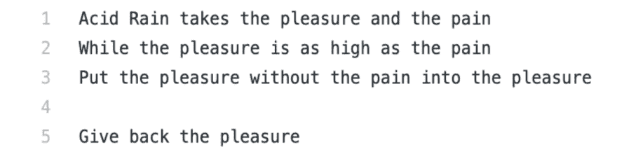
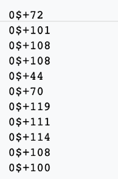
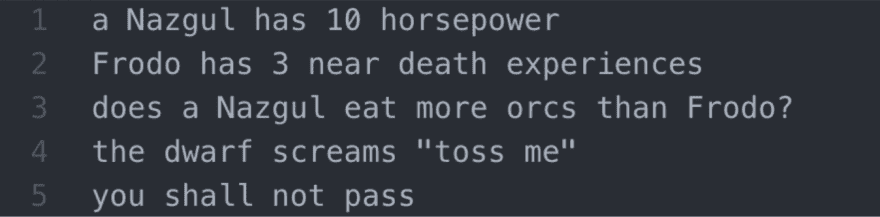
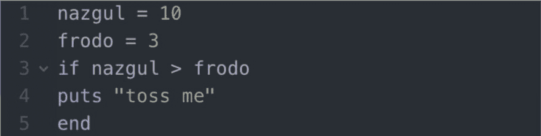
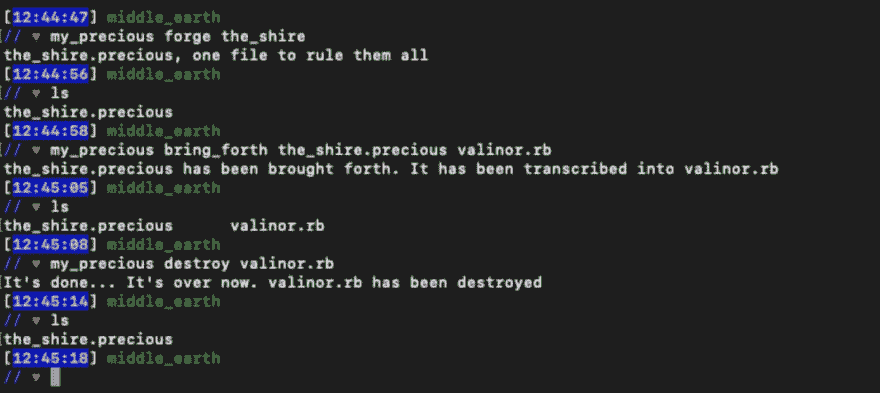
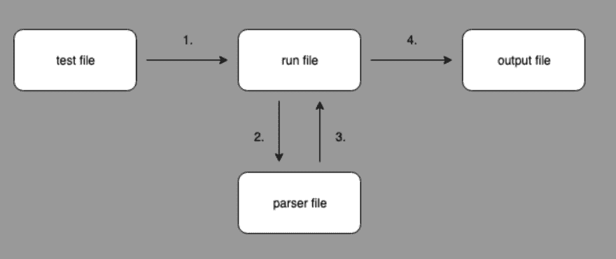
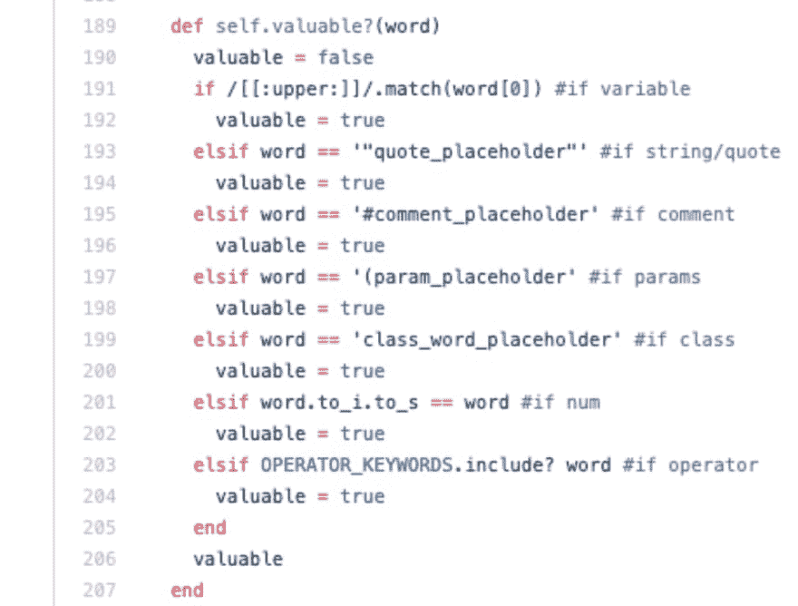
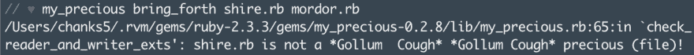
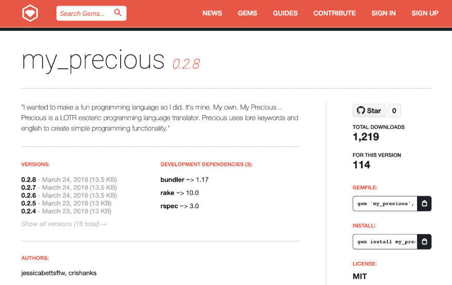

# 如何编写编程语言

> 原文：<https://dev.to/crishanks/how-to-write-a-programming-language-3e6f>

# 引擎盖下

你有没有发现自己在写代码的时候想知道到底发生了什么？编程*真的*是怎么工作的？为了拉开至少一层窗帘，[杰西卡·贝茨](https://dev.to/jessicabetts)和我基于《指环王》的传说创造了我们自己的深奥的编程语言，名为 My_Precious。创建编程语言有许多不同的方法。

# 什么是深奥的编程语言？

Esolangs.org 将深奥的编程语言定义为“一种计算机编程语言，旨在实验怪异的想法，难以编程，或作为一个笑话，而不是为了实际用途。”

例子包括 Kaiser Ruby 和$:

深奥的编程语言本质上是一种新的、创造性的编写代码的方式，其目的是为了有趣，而不是直观、高效或特别实用。

# [My_Precious](https://rubygems.org/gems/my_precious)

My_Precious 是一个 gem，它使用英语和指环王的关键字编写在一个我们定义为. Precious 的文件中，然后被翻译成实际可用的 Ruby 代码。

My_Precious 是一块宝石，用户可以在其中:

1.  使用 LOTR 传说关键字生成一个. precious 文件

2.  翻译用。珍贵的文件，并将其输出到一个. rb 文件

3.  删除文件

# 工作原理

My_Precious 本质上是这样工作的:

1.  用户创建一个测试文件

2.  测试文件被传递到运行文件中

3.  运行文件打开测试文件，并将其传递给解析器

4.  解析器梳理每一行代码，并将其翻译成 Ruby

5.  解析器将翻译后的代码返回到运行文件

6.  运行文件将代码写入输出文件

# 计划阶段

开始的时候，重要的是*找到你热爱的事情*。为什么要创造一种深奥的编程语言？你想取笑编码的某个方面吗？你认为做某事有更好的方法吗？你想挑战自己，创造一些技术吗？我们想做一些有趣的事情，巩固当前的 Ruby 知识，并扩展我们对编程语言实际工作方式的理解。

接下来，*选择一个大小适合你的目的的域名*。My_Precious 需要足够大，能够处理英语，但又足够适合拥有众所周知且令人难忘的关键字。(一些极简语言只有 8 个字符)。所以，我们选择了魔戒。

最后，*决定你项目的范围*。你是在解释这种语言还是在翻译它？我们选择翻译成 Ruby。它更熟悉，也稍微简单一些。

# 创造语言

## 解析器

解析器是 My_Precious 的心脏；最重要的文件。在解析器中，我们定义将被映射到编程功能的关键字或字符。例如，`Precious`是`true`的关键字。`You shall not pass`是`end`的关键字，用于循环、条件、函数声明等。

解析器解析每一行编写的代码，保留已建立的关键字，并将它们输出到一个. rb 文件。本质上是我们的翻译。

## 运行文件

为了分离功能，我们创建了一个运行文件。它的工作是检查。precious 扩展，打开一个. precious 文件，将文件传递给解析器，抓取返回的翻译，将翻译写入一个. rb 文件。解析器文件应该只需要担心解析。

## 测试文件

测试文件是一个. precious 文件，用于编写 My_Precious 代码。它用于确保解析器正确地将您的代码翻译成 Ruby。它测试解析器中定义的每个关键字。

## 输出文件

这是一个. rb 文件，翻译将被写入其中。您可以将这里的结果与测试文件中的输入进行比较。

# 发布你的语言

Ruby Gems 是开源的，应用广泛。我们选择让 My_Precious 成为一个可下载的宝石，这样任何人都可以对它做出贡献，并且更容易立即下载和使用它。

# 界面

你希望用户如何与你的语言互动？我们选择使用命令行界面(CLI)。CLI 是很好的工具，它允许用户在终端中输入命令。CLI 使 My_Precious 更加直观和用户友好，允许灵活性(用户可以命名自己的输入和输出文件)，并使我们可以轻松地实现干净的错误处理，包括输出错误消息和指令。

# 玩得开心，*珍贵*！

创建一门深奥的编程语言有时会令人望而生畏。记得选择一个你能真心支持的领域，一个你充满热情的领域。一次做一个手术，庆祝这些胜利。

一定要下载 [My_Precious](https://rubygems.org/gems/my_precious) 试试看。

也请查看[文档](https://github.com/jessicabettsftw/my_precious)！