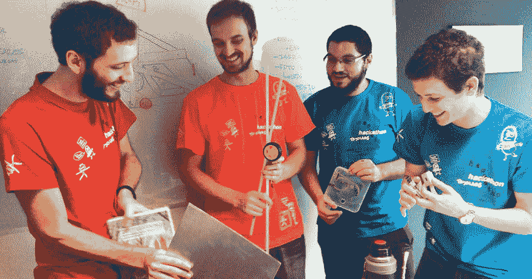
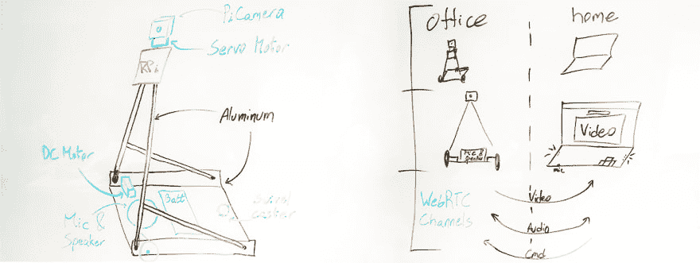

# 我们如何使用物联网和计算机视觉为远程工作人员构建一个替代机器人

> 原文：<https://dev.to/tryolabs/how-we-built-a-stand-in-robot-for-remote-workers-using-iot-and-computer-vision-350b>

卢卡斯·米科尔。文章最初发表于[这里](https://tryolabs.com/blog/hackathon-robot-remote-work-iot-computer-vision/)。

Tryolabs 的客户和合作伙伴遍布全球，我们一直有远程协作的文化。我们习惯于无论在哪里都参加会议，使用工具如 [Slack](https://slack.com/) 、 [Google Hangouts](https://hangouts.google.com/webchat/start) 和 [Zoom](https://zoom.us/) 。一个甜蜜的结果是一个慷慨的在家工作政策，允许我们随时在家工作。

问题是，远程工作会让我们错过会议之外的所有乐趣。让一个机器人在办公室代表我们，向我们展示我们不在的时候发生了什么，这不是很酷吗？

作为一群计算机视觉、物联网和全栈专家，我们对这个想法非常感兴趣，并开始了一项任务，创造一个可以从家里远程控制的机器人，并向我们展示办公室发生的事情。

我们在 2018 年的 Tryolabs 黑客马拉松上面对这一挑战，只有三条规则:

1.  ⏰完成项目的时间:48 小时
2.  👫团队成员人数:4 人
3.  提供☕️咖啡:无限量

[](https://res.cloudinary.com/practicaldev/image/fetch/s--vSczhLan--/c_limit%2Cf_auto%2Cfl_progressive%2Cq_auto%2Cw_880/https://thepracticaldev.s3.amazonaws.com/i/id9qrvvxuhmu5c689gvp.jpg) 
*黑客马拉松团队:华金、布拉乌利奥、哈维尔、卢卡斯。*

## 建造微型机器人的硬件

这一切都始于迷你机器人机械结构的设计，它出现在办公室，而远程工作人员却没有。

要拥有一个可以在办公室里轻松移动的机器人，它必须是可移动的、稳定的，小到可以穿过门，并且大到不会被在办公室工作的团队监督和践踏。

在选定这一款之前，我们对其结构设计进行了多次迭代:

[](https://res.cloudinary.com/practicaldev/image/fetch/s--R4zlkEzK--/c_limit%2Cf_auto%2Cfl_progressive%2Cq_auto%2Cw_880/https://thepracticaldev.s3.amazonaws.com/i/5zsada03krxrn07lbe1b.jpg) 
*在黑客马拉松期间绘制的草图，用于定义机器人的主要硬件组件及其与远程工作人员的通信。*

我们选择铝作为组件的主要材料，因为它重量轻、坚固、便宜。

一旦我们确定了设计并选择了材料，我们就切下铝部件并用小螺钉将它们组装在一起。由于我们必须使用办公室和附近商店里的可用工具，这是一个相当即兴和幽默的过程。我们用厚厚的书来塑造铝和太阳镜作为安全眼镜，同时钻进组件，只是为了给你一个想法。🙈

我们选定的主要硬件组件有:

*   构建结构骨架的多层铝板
*   螺丝
*   拉斯贝里皮
*   皮卡梅拉
*   1 伺服电机 SG90
*   控制电机的 h 桥
*   2 DC 汽车公司
*   两个轮子
*   旋转脚轮
*   电线
*   电力银行

## 使机器人能够实时通信

当我们中的一些人继续在硬件上工作并组装部件时，团队的其他人开始构建控制上述所有组件的软件。

### 实现 WebRTC

机器人软件的目的是使远程工作人员和办公室团队之间能够进行实时交流。换句话说，机器人需要能够从办公室向远程工作的人传输视频和音频，反之亦然。

在评估解决这个问题的各种方法时，我们遇到了 [WebRTC](https://webrtc.org/) ，它有望成为我们正在寻找的工具:

> WebRTC 是远程呈现、内部通信、VoIP 软件的理想之选，因为它有一个非常强大的标准和现代协议，该协议具有许多功能，并兼容各种浏览器，包括 Firefox、Chrome、Opera 等。
> 
> UV4L 流服务器的 WebRTC 扩展允许来自音频、视频和数据源的多媒体内容按照 WebRTC 协议的定义进行实时流传输。

具体来说，我们使用了包含在 [UV4L](https://www.linux-projects.org/uv4l/) 中的 [WebRTC 扩展](https://www.linux-projects.org/uv4l/webrtc-extension/)。这个工具允许我们在机器人和远程工作人员的计算机之间建立双向通信，并且延迟极低。

在启用 WebRTC 扩展的情况下运行 UV4L 服务器，我们能够从 RaspberryPi 提供 web 应用程序，然后从远程工作人员的浏览器简单地访问它，建立实时双向通信；太神奇了！

这使我们能够为从 PiCamera 到浏览器的视频建立一个单向通道，为音频建立一个双向通道，并为从浏览器向机器人发送命令建立一个额外的单向通道。

### 构建 UI 来管理通信

为了让远程工作人员能够以用户友好的方式查看数据和发送命令，我们研究了如何将这些功能集成到可访问的实用前端中。

受 UV4L 项目中的 [web 应用示例](https://www.linux-projects.org/uv4l/tutorials/custom-webapp-with-face-detection/)的启发，我们将上述数据通道集成到一个基本但实用的前端中，包括以下组件:

*   *index . html:*html 5 页面，其中包含 UI 元素(主要是*视频)*以显示传入的流和*** canvas*以显示姿态估计关键点
*   *main.js:* 定义由用户动作触发的回调，如“开始流”、“加载网络”、“切换姿态估计”等
*   *signaling . js:*通过 WebSocket 实现 [WebRTC 信令协议](https://www.linux-projects.org/webrtc-signalling/)

[https://www.youtube.com/embed/ecI1tK6ILns](https://www.youtube.com/embed/ecI1tK6ILns)
*黑客马拉松期间的延时拍摄。*

## 遥控机器人的动作

为了处理机器人从远程工作人员那里收到的移动命令，我们开发了一个用 Python 编写的控制器，它像系统服务一样运行。该服务通过以下方式翻译控制机器人电机的命令:

*   将连接到 H 桥车轮电机的引脚设置为[高或低](https://learn.sparkfun.com/tutorials/raspberry-gpio/python-rpigpio-api)
*   为伺服系统建立 [PWM 频率和占空比](http://abyz.me.uk/rpi/pigpio/python.html#hardware_PWM)，调整摄像机的方向

下面是控制器类的一个片段:

```
class MotorsWheels:

    def __init__(
            self, r_wheel_forward=6, r_wheel_backward=13, l_wheel_forward=19, l_wheel_backward=26):
                self.r_wheel_forward = r_wheel_forward
                ...
                GPIO.setmode(GPIO.BCM)
        GPIO.setup(r_wheel_forward, GPIO.OUT)
                GPIO.setup(r_wheel_backward, GPIO.OUT)
                ...
                # Turn all motors off
        GPIO.output(r_wheel_forward, GPIO.LOW)
        GPIO.output(r_wheel_backward, GPIO.LOW)

    def _spin_right_wheel_forward(self):
        GPIO.output(self.r_wheel_forward, GPIO.HIGH)
        GPIO.output(self.r_wheel_backward, GPIO.LOW)

    def _stop_right_wheel(self):
        GPIO.output(self.r_wheel_backward, GPIO.LOW)
        GPIO.output(self.r_wheel_forward, GPIO.LOW)

    def go_fw(self):
        self._spin_left_wheel_forward()
        self._spin_right_wheel_forward()

class ServoCamera:
    CENTER = 40000
    UP_LIMIT = 80000
    DOWN_LIMIT = 30000
    STEP = 5000

    def __init__(self, servo=18, freq=50):
        self.servo = servo
        self.freq = freq
        self.pi = pigpio.pi()

        self.angle = self.CENTER
        self._set_angle()

    def _set_angle(self):
        self.pi.hardware_PWM(self.servo, self.freq, self.angle)

    def up(self):
        if self.angle + self.STEP < self.UP_LIMIT:
            self.angle += self.STEP
            self._set_angle()

    def down(self):
        if self.angle - self.STEP > self.DOWN_LIMIT:
            self.angle -= self.STEP
            self._set_angle() 
```

因此，我们能够控制机器人，让它在办公室中“行走”，并使远程员工能够通过机器人看到他们的团队并接近他们。

然而，这对我们热情的团队来说还不够，我们继续追求最终目标:拥有一个自主机器人。

## 给机器人添加计算机视觉

我们想，如果机器人能够识别人，并对他们的手势和动作做出反应(并以这种方式拥有一定的个性)，这不是很棒吗？

最近发布的一个名为 [PoseNet](https://github.com/tensorflow/tfjs-models/tree/master/posenet) 的项目迅速浮出水面。它以一个[“机器学习模型”的形式出现，该模型允许在浏览器中进行实时的人体姿态估计“](https://medium.com/tensorflow/real-time-human-pose-estimation-in-the-browser-with-tensorflow-js-7dd0bc881cd5)。所以，我们对此进行了更深入的研究。

神经网络的性能令人震惊，当我们在浏览器中运行 TensorFlowJS 时，它真的很有吸引力。通过这种方式，我们能够获得比从 RaspberryPi 运行它更高的准确性和 FPS 率，并且比在第三个服务器上运行它的延迟更短。

受到黑客马拉松参数的影响，我们浏览了该项目的文档和演示 web 应用程序的源代码。一旦我们确定了需要哪些文件，我们就导入它们，并立即将这些功能集成到我们的 web 应用程序中。

我们编写了一个基本的`detectBody`函数，用这些参数来推断调用`net.estimateMultiplePoses`的姿态估计关键点:

```
async function detectBody(canvas, net) {
    if (net){
        var ctx = canvas.getContext('2d');
        var imageElement = ctx.getImageData(0, 0, canvas.width, canvas.height);

        var imageScaleFactor = 0.3;
        var flipHorizontal = false;
        var outputStride = 16;
        var maxPoseDetections = 2;
        var poses = await net.estimateMultiplePoses(
            imageElement,
            imageScaleFactor,
            flipHorizontal,
            outputStride,
            maxPoseDetections
        )
        return poses;
    } 
```

表示`detectBody`以每秒 3 次的速度被调用来刷新姿态估计关键点。

然后，我们修改了一些 util 函数，以便打印检测到的身体关键点，并在视频上方绘制其骨架，实现了如下演示:

[https://www.youtube.com/embed/3DhSR67Uj4Q](https://www.youtube.com/embed/3DhSR67Uj4Q)
*索莱达和卢卡斯炫耀姿态检测算法。*

这是一个非常快速的概念验证，增加了一个奇妙的功能，极大地扩展了我们机器人的潜在能力。

如果你想知道这个模型在引擎盖下是如何工作的，你可以在这里阅读更多[。](https://medium.com/tensorflow/real-time-human-pose-estimation-in-the-browser-with-tensorflow-js-7dd0bc881cd5)

## 结果

48 小时和未知数量的咖啡导致了一个迷你机器人的建造，它能够在办公室里行走，使远程工作者和他们的办公室同事之间能够进行实时通信，甚至能够运送 LP。😜

[https://www.youtube.com/embed/ujTBNP5BuRQ](https://www.youtube.com/embed/ujTBNP5BuRQ)
*替身机器人在办公室里行走，由一名远程工作人员控制。*

[https://www.youtube.com/embed/lKbGat8Bfus](https://www.youtube.com/embed/lKbGat8Bfus)
*在浏览器中显示远程工作人员如何控制机器人的界面。*

我们设法构建了硬件，实现了通信软件，并使用计算机视觉构建了一个附加功能的概念验证，这有助于机器人与人的交互。未来的增强可能包括[物体检测](https://tryolabs.com/blog/2017/08/30/object-detection-an-overview-in-the-age-of-deep-learning/)功能，这将允许机器人在没有人类帮助的情况下识别物体并与它们互动，例如使用我们的开源计算机视觉工具包 [Luminoth](https://github.com/tryolabs/luminoth) 。

尽管我们的原型制作时间通常超过两天，但这个黑客马拉松项目反映了我们在 Tryolabs 的工作方式。我们经常使用最先进的技术构建原型和解决方案，以增强运营和组织流程。

考虑为您的企业配备机器人？与我们联系吧！