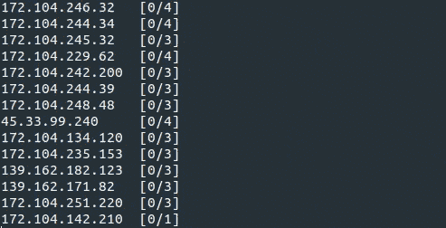

# 我们如何为汽车市场创建多站点设置:第 2 部分

> 原文：<https://dev.to/codicacom/how-we-created-a-multi-site-setup-for-a-vehicle-marketplace-part-2-57kp>

*这篇文章最初发表在 [Codica 博客](https://www.codica.com/blog/multisite-vehicle-marketplace/)上。*

今天，我们想为您提供文章的第二部分，致力于为[多厂商汽车市场](https://www.codica.com/case-studies/multi-vendor-vehicle-marketplace/)创建多站点设置。在这里，我们将讨论诸如**测试**和**部署**这样的挑战。

如果你错过了第一部分，为了方便起见，这里有[链接](https://dev.to/codicacom/how-we-created-a-multi-site-setup-for-a-vehicle-marketplace-part-1-224b)。

让我们开始吧，看看我们遇到了什么困难。

## 测试

**目标:为 89 个网站提供高质量和及时的测试**

考虑到网站数量稳步增长的事实，我们明白唯一有效的选择是自动化测试。它比手工测试更省时，并且易于维护，因为我们有一个单一的代码库。

自动化测试的第一步是创建测试用例，因为我们没有网站维护的文档。

一段时间后，我们意识到测试用例不能覆盖所有的项目需求，然后我们决定利用下面的工具和实践。

### 存储库配置的 CI

最初，我们的目标是找到一种方法来跟踪创建的测试及其执行。为了实现这一点，我们求助于配置到 GitLab repo 的[持续集成](https://docs.gitlab.com/ee/ci/),该 repo 跟踪创建的测试。如果自动化在您的工作流程中是必不可少的，那么使用持续集成可能会变得非常有益。

因此，它向我们展示了代码审查是积极地还是消极地执行，这给了我们一个机会来避免耗时的任务，并在重复的操作上花费更少的时间。

### 红宝石

RSpec 指的是 Ruby 的行为驱动开发。它提供了一个在网站上追踪顾客行为的机会。检查什么有效，什么无效是最重要的。我们的开发测试多种语言和货币，这为跟踪市场工作能力和检查设置性能提供了机会。

[Capybara](https://github.com/teamcapybara/capybara) 是一个 web 应用的测试框架。它显然与 RSpec 合作，作为其附加产品。在这个工具的帮助下，我们进行综合测试，模拟真实用户如何与应用程序交互。我们可以用几行代码描述授权场景，然后 gem 为测试调试提供了不同的简便方法。

在这里你可以看到水豚如何与 RSpec 合作:

```
describe "the sign-in process", type: :feature do
  before: each do
    User.make(email: 'user@example.com', password: 'password')
  end

  it "signs me in" do
    visit '/sessions/new'
    within("#session") do
      fill_in 'Email', with: 'user@example.com'
      fill_in 'Password', with: 'password'
    end
    click_button 'Sign in'
    expect(page).to have_content 'Success'
  end
End 
```

Enter fullscreen mode Exit fullscreen mode

使用 RSpec 和 Capybara，我们可以运行每 5 分钟 120 次自动化测试的系统**。**

## 部署

**挑战:多站点设置的高效部署**

最省时的解决方案是创建自动化部署脚本。尽管站点的数量在增加，但我们希望推进部署过程。让我们检查一下我们是如何实现这个目标的。

**第一步。16 个网站:Capistrano**

首先，我们使用了[Capistrano gem](https://github.com/capistrano/capistrano)——一个用于构建自动化部署脚本的框架。过了一段时间，平台越做越大，达到了 13-16 家网站的数量。随后，一次性部署更多站点变得相当耗时，我们决定采用 **Mina** 。

**第二步。40 网站:米娜**

当网站数量达到 40 个时，每个站点部署需要 2-3 分钟，这太多了。为了得到您的指导，整个平台部署花了 2 个小时。它促使我们转向 Mina T1——一个部署者和服务器自动化工具。

在该工具的帮助下，我们在每个站点只花了 40-90 秒就完成了部署。与此同时，网站数量增长到 80+。这就是我们决定将部署并行化为几个流以提高时间效率的原因。

**第三步。80 多个网站:Mina-multideploy**

过了一段时间，我们意识到我们需要一个并行部署工具，因为网站的数量在不断增长。因此，我们为并行部署构建了 [Mina-multideploy](https://github.com/codica2/mina-multideploy) 。这个工具在许多服务器上运行 [Mina](https://github.com/mina-deploy/mina) 。

现在，在[并行 gem](https://github.com/grosser/parallel) 的帮助下，部署在几个流中执行。这给了我们一个同时访问 89 个网站的机会。因此，整个平台的部署大约需要 10 分钟。

Mina-multideploy 的工作原理:

[](https://res.cloudinary.com/practicaldev/image/fetch/s--KRFyVRye--/c_limit%2Cf_auto%2Cfl_progressive%2Cq_66%2Cw_880/https://thepracticaldev.s3.amazonaws.com/i/eoo1pifx6dnomez7oas7.gif)

在这里，您可以看到每个步骤达到的部署性能(平均时间)。一种改进

| 工具 | 平均部署时间 |
| --- | --- |
| 卡皮斯特拉诺宝石 | 120-180 秒/站点 |
| 迈纳 | 40-90 秒/站点 |
| 米娜-多部门 | 8-12 秒/站点(10-15 分钟/平台) |

## 结论

在这里，我们向您展示了文章的第二部分，涵盖了[市场开发](https://www.codica.com/services/online-marketplace-development/)的挑战，如**测试**和**部署**。第三(最后)部分即将到来，我们将告诉你关于**增加新网站**和**监测**挑战。

敬请关注，点击此处阅读全文:[我们如何为汽车市场创建多站点设置](https://www.codica.com/blog/multisite-vehicle-marketplace/)。