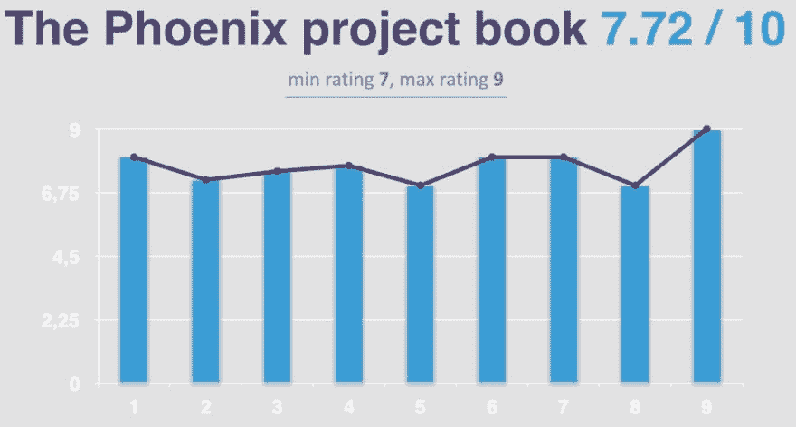
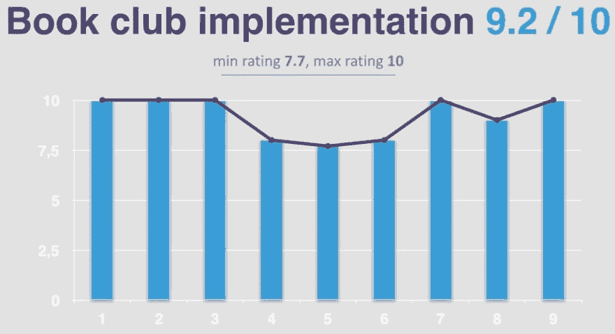
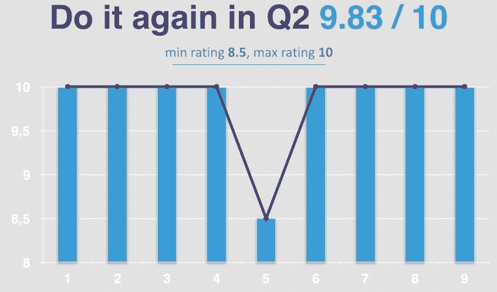

# 我们如何在工程团队中实施读书俱乐部的理念

> 原文：<https://dev.to/nikola/how-we-implemented-the-book-club-idea-in-our-engineering-team-2pn1>

*最初发表于[我的博客](http://www.nikola-breznjak.com/blog/books/implemented-book-club-idea-engineering-team/)。*

## TL；速度三角形定位法(dead reckoning)

在这篇文章中，我将向你展示:

*   我们如何在工程团队中实施读书俱乐部的理念
*   我们读什么书
*   我们有多喜欢它，
*   分享一些心得、评论和(我经常在我的博文中)引用

那些对一些数据指标感兴趣的人，可以滚动到文章末尾，在引号后面:)

## 我们读了什么书？

我们读了吉恩·金、凯文·贝尔和乔治·斯帕福德写的《凤凰计划:一部关于它的小说，DevOps，帮助你的企业赢得胜利》。可以说，这是一本每个人都应该读的书。

这本书真的很棒，这是亚马逊的评分:

如果你出于某种原因不信任亚马逊，这里有 [Goodreads 评分](https://www.goodreads.com/book/show/17255186-the-phoenix-project):

在 Goodreads 上，来自近 1.9 万张投票的`4.25 out of 5`评分是很高的。

## 我们是怎么做到的？

我们 1 月 21 日开始读这本书，3 月 11 日读完。因此，在 6 周的时间里，我们每周阅读大约 50 页，然后在我们的移动开发团队会议上讨论。

如果你想知道的话，每个工作日只有 10 页。如果你感兴趣的话，这里有一篇关于每年阅读 30 本书背后的数学原理的短文。

## 我们学到了什么？

我们了解到有 4 种类型的工作:

*   商业项目
*   内部项目
*   变化
*   计划外工作

我们学习了一些新短语，如 FUBAR 和 MOADF，我们还了解到**每个人都需要空闲时间**，因为如果没有人有空闲/松弛时间，WIP(在制品)就会卡在系统中等待。

此外，我们了解到，只有当人们知道目标是什么时，让整个公司为相同的共同目标一起工作才行得通。因此，公开 OKRs/KPI/yoursversionofgoaltracking 并由每个部门和他们的团队成员设置是很好的。

## 该书引发了哪些讨论

这本书也引发了一些激动人心的讨论:

*   我们如何到达[单件流](https://www.kaizenworld.com/kaizen/one-piece-flow.html)
*   如何处理计划外的工作
*   当被要求在星期五部署某样东西时该怎么做
*   我们的瓶颈是什么
*   我们的在制品看起来怎么样
*   我们过去使用了什么票务管理系统等等。

## 我们不太喜欢的东西

有些事情我们不喜欢:

*   结局太随遇而安了；我们期待《权力的游戏》会有更多的结局
*   比尔的妻子
*   布伦特太现实了，给我们几个人可怕的倒叙
*   比尔没有尊重开发人员。我引用:
    *   “开发商——我都忘了他们有多古怪。对我来说，他们更像独立音乐人，而不是工程师。”

## 字符

说到角色，似乎我们都喜欢埃里克这个角色，这个角色可以被描述为博士和杰克·斯派洛的混合体。他们也非常了解流程和 IT，而且不仅会上网。

因为每部好的小说都必须有一个反派人物，这部小说也不例外。我们喜欢莎拉最终得到了她应得的东西。我们甚至考虑过谁将在“凤凰计划”电影中扮演这个角色。以下是提到的几个选项:

## 有些语录

像往常一样，在我的博文中，这里有一些我们喜欢的引用:

*   “在代码投入生产之前，实际上不会产生任何价值，因为它只是滞留在系统中的 WIP。”
*   “他是公司里公认的最有趣的旅伴之一。他的支出报告的规模证明了这一点。”
*   "实践创造习惯，习惯创造对任何过程或技能的掌握."
*   “美好的一天感觉就像我的员工对我们将要开出的佣金支票的金额感到恐慌”
*   “我已经意识到，让人们给你诚实的反馈是一种难得的礼物。”
*   “你需要把一切都纳入版本控制。一切。不仅仅是代码，而是构建环境所需的一切。然后，您需要自动化整个环境创建过程。您需要一个部署管道，在那里您可以创建测试和生产环境，然后完全按需将代码部署到其中。这就是减少设置时间和消除错误的方法，这样您就可以最终跟上变化发展的速度。”
*   “开发商——我都忘了他们有多古怪。对我来说，他们更像独立音乐人，而不是工程师。”
*   “任何不熟悉实际运营业务的 IT 系统的首席运营官都只是一套空衣服，依靠其他人来完成他们的工作。”
*   "有效管理的信息技术是公司业绩的重要预测指标."
*   "分析公司 IDC 表示，全球有 1100 万开发人员和 700 万运营人员。"
*   “说实话是爱的表现。隐瞒真相是一种仇恨的行为。或者更糟，冷漠。”
*   “在这个竞争激烈的时代，游戏的名称是快速上市和快速失败。”
*   转过身来，他说，“在任何工作系统中，理论上的理想状态是单件流，最大化生产量，最小化差异。你可以通过不断减少批量来达到这个目的。“你正在做完全相反的事情，延长 Phoenix 的发布间隔，增加每个版本的功能数量。您甚至失去了控制从一个版本到下一个版本的差异的能力。”

# 给我看数据！

所以，看起来我们确实很喜欢它，也很开心，但是你怎么衡量呢？

这是我们喜欢这本书的程度，从 1 到 10 分:

有趣的是，iOS 开发者使用浮点数，而 Android 开发者使用整数。💪

这是我们对书友会活动的喜爱程度，评分范围为 1-10:

最后，这是我们希望在 Q2 再做一次的可能性，等级从 1 到 10:

我保证我不是故意把这张图设计成这样，但它看起来确实有点酷。😂

# 结论

我们喜欢这个实验，并将继续做下去。我希望你觉得它很有价值，并且你可能也想在你的团队中尝试一下。如果你有任何问题，请在评论区提问。

对于那些已经在你的工程组织中开展读书俱乐部的人，有一个问题，你读过什么书？