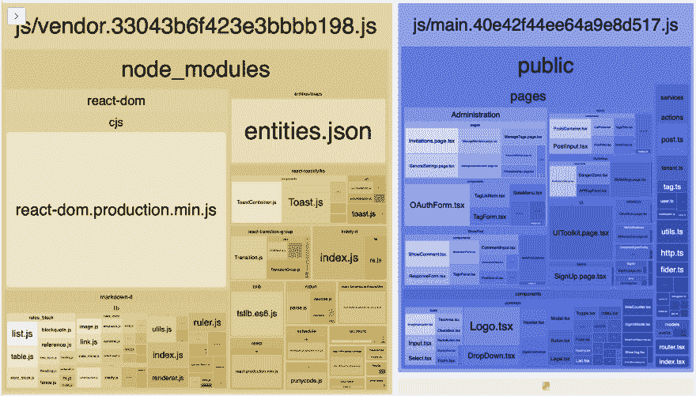
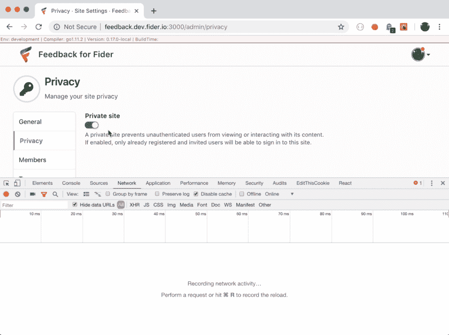

# 我们如何将最初的 JS/CSS 大小减少 67%

> 原文：<https://dev.to/goenning/how-we-reduced-our-initial-jscss-size-by-67-3ac0>

我们一直致力于减少发送给所有 Fider 用户的字节数。作为一个用 React 构建的 web 应用程序，我们主要关注 JS 和 CSS。在这篇文章中，我们分享了我们的学习，一些概念和建议，告诉你如何在你的 web 应用程序中做同样的事情。

Fider 是用 React 和 Webpack 在前端构建的，所以下面的主题对于使用相同堆栈的团队来说非常有用，但是这些概念也可以应用于其他堆栈。它也是开源的，所以你可以看到请求和源代码:[https://github.com/getfider/fider](https://github.com/getfider/fider)

### 目录

*   [Webpack 捆绑包分析器](#webpack-bundle-analyzer)
*   [内容哈希长期缓存](#long-term-caching-with-content-hash)
*   [普通捆绑包](#the-common-bundle)
*   [路由级代码拆分](#code-splitting-on-route-level)
*   [按需加载外部依赖关系](#loading-external-dependencies-on-demand)
*   [字体牛逼树抖](#font-awesome-and-tree-shaking)
*   [从大 NPM 套餐切换到小套餐](#switching-from-big-to-small-npm-packages)
*   [优化主包至关重要](#optimising-the-main-bundle-is-crucial)
*   [TSLib(仅限打字稿)](#tslib-(typescript-only))

## Webpack 捆绑包分析器

webpack-bundle-analyzer 是一个 webpack 插件，可以为你的所有包生成一个交互式的可缩放的树形图。这对我们理解每个包中包含哪些模块至关重要。您还可以看到每个包中最大的模块。

如果你不知道根本原因，你如何解决？

这是这个插件将为你生成的一个例子。

[](https://res.cloudinary.com/practicaldev/image/fetch/s--DaWgImak--/c_limit%2Cf_auto%2Cfl_progressive%2Cq_auto%2Cw_880/https://thepracticaldev.s3.amazonaws.com/i/542svannylp9o1tvsts3.png)

您是否注意到了供应商包中巨大的 **entities.json** ？这是分析您的包内容的一个很好的起点。

## 内容哈希长期缓存

长期缓存是告诉浏览器长时间缓存文件的过程，比如 3 个月甚至 1 年。这是一个重要的设置，以确保回访用户不需要反复下载相同的 JS/CSS 文件。

浏览器将基于文件的完整路径名缓存文件，因此如果您需要强制用户下载您的包的新版本，您需要重命名它。幸运的是，webpack 提供了一个特性来生成带有动态名称的包，从而迫使浏览器只下载新文件。

我们之前已经在我们的 webpack 配置上使用了 **chunkhash** 很长时间。在 99%的情况下，您需要长期缓存，最佳选择是使用 **contenthash** ，这将基于其内容生成一个哈希。

这种技术并没有减少包的大小，但是它确实有助于减少用户下载我们的包的次数。如果包没有改变，不要强迫用户再次下载它。

要了解更多信息，请访问官方文档[https://webpack.js.org/guides/caching/](https://webpack.js.org/guides/caching/)

## 普通捆绑

对于许多团队来说，将所有的 NPM 包组合成一个单独的包已经是很长时间的实践了。这在与长期缓存结合使用时非常有用。

NPM 软件包比我们的应用程序代码变化更少，所以如果没有任何变化，我们不需要强迫用户下载你所有的 NPM 软件包。这通常被称为**供应商捆绑包**。

但是我们可以把这种做法更进一步。

您自己的代码也很少更改，那怎么办？也许你有一些基本的组件，如按钮、网格、开关等。已经创建了一段时间，并且已经有一段时间没有改变了。

这是一个很好的**公共包**的候选者。你可以看看这个 [PR #636](https://github.com/getfider/fider/pull/636) ，在这里我们基本上把一些特定文件夹中的所有模块移动到一个公共包中。

这将确保，除非我们改变我们的基本组件，否则用户不需要重新下载它。

## 路由级代码拆分

代码拆分是目前的热门话题。这已经存在一段时间了，但是工具和框架已经有了很大的发展，以至于现在进行代码分割变得更加简单。

很常见的情况是，应用程序推送一个大的包，其中包含渲染应用程序中任何页面所需的所有 JS/CSS，即使用户只是在查看主页。我们不知道用户是否会访问站点设置页面，但我们已经为此推送了所有代码。Fider 已经这样做了很长时间，我们现在已经改变了它。

代码分割的思想是生成多个更小的包，通常每个路由一个包，以及一个主包。我们发送给所有用户的唯一包是主包，它将异步下载所有需要的包来呈现当前页面。

这看起来很复杂，但是多亏了 React 和 Webpack，这不再是火箭科学了。对于那些使用 React <= 16.5, we recommend [react-loadable](https://github.com/jamiebuilds/react-loadable) 的。如果你已经在 React 16.6 上，那么你可以使用 React.lazy()，这是这个版本的一个新增功能。

*   在这个 PR 里你可以发现 [@cfilby](https://github.com/cfilby) (谢谢！)用 react-loadable 向 Fider 添加了代码拆分: [PR #596](https://github.com/getfider/fider/pull/596)
*   在我们迁移到 React 16.6 之后，我们用 React.lazy 和 suspension 替换了这个外部包: [PR #646](https://github.com/getfider/fider/pull/646)

我们还遇到了一些罕见的事件，用户在下载异步包时遇到了问题。关于如何在 React lazy 失败时重试的潜在解决方案已记录在[中](https://dev.to/goenning/how-to-retry-when-react-lazy-fails-mb5)。

根据[安东的评论](https://dev.to/thekashey/comment/7b04)，你也可以考虑使用[可加载](https://github.com/smooth-code/loadable-components/)。

## 按需加载外部依赖

通过使用 Webpack Bundle Analyzer，我们注意到我们的供应商 Bundle 拥有 react-toastify 的所有内容，这是我们使用的烤面包机库。这通常是可以的，除了 95%的 Fider 用户永远不会看到烤面包机信息。我们展示烤面包机的地方很少，所以**如果每个用户不需要 30kB 的 JavaScript，我们为什么要推给他们**？

这是一个与上面类似的问题，除了我们不再谈论路由，这是一个在多条路由中使用的功能。你能在特性层面上进行代码分割吗？

是的，你可以！

简单来说，你要做的就是从静态导入切换到动态导入。

```
// before
import { toast } from "./toastify";
toast("Hello World");

// after
import("./toastify").then(module => {
  module.toast("Hello World");
}); 
```

Enter fullscreen mode Exit fullscreen mode

Webpack 将单独捆绑 toastify 模块及其所有 NPM 依赖项。然后**浏览器将仅在需要 toast 时下载该包**。如果你已经配置了长期缓存，那么在第二次烤面包机调用时，它就不必再下载了。

下面的视频展示了它在浏览器上的样子。

[](https://res.cloudinary.com/practicaldev/image/fetch/s--LnNZ4Tya--/c_limit%2Cf_auto%2Cfl_progressive%2Cq_66%2Cw_880/https://thepracticaldev.s3.amazonaws.com/i/5e9iv6ja04jwrvjg3g9d.gif)

你可以在 [PR #645](https://github.com/getfider/fider/pull/645) 上看到这是如何实现的细节

## 字体牛逼，树摇

树抖动是从一个模块中只导入你需要的东西并丢弃其余的过程。在生产模式下运行 webpack 时，这是默认启用的。

使用 Font Awesome 的常用方法是导入一个外部字体文件和一个 CSS，该 CSS 将该字体上的每个字符(图标)映射到一个 CSS 类。结果是，即使我们只使用图标 A、B 和 C，我们也迫使浏览器下载这种外部字体和 600+图标的 CSS 定义。

谢天谢地，我们找到了 **react-icons** ，这是一个 NPM 软件包，有所有免费的字体，棒极了(还有其他图标软件包！)并以 ES 模块格式导出为 React 组件。

然后您可以**只导入您需要的图标**，webpack 将从捆绑包中移除所有其他图标。结果呢？我们的 CSS 已经比现在的 **~68kB 小了**。更不用说我们再也不需要下载外部字体了。这一改变是 Fider 上 CSS 尺寸减小的最大原因。

想知道怎么做吗？看看这个 [PR #631](https://github.com/getfider/fider/pull/631)

## 从大 NPM 包切换到小

> “NPM 就像一个装满积木的乐高商店，你可以随便挑一个你喜欢的。您不需要为您安装的软件包付费，但是您的用户需要为它添加到您的应用程序中的字节大小付费。明智地选择。”-[@ goening](https://dev.to/goenning)

在使用捆绑包分析器时，我们发现仅 markdown-it 一项就消耗了我们供应商捆绑包的大约 40%。然后，我们决定去 NPM 购物，寻找一个替代的 markdown 解析器。我们的目标是找到一个更小、维护更好并且拥有我们需要的所有特性的包。

我们一直在使用[bundlephobia.com](https://bundlephobia.com/)在安装之前分析任何 NPM 软件包的字节大小。我们已经从 markdown-it 切换到 marked，这**以最小的 API 变化从我们的供应商包**中减少了大约 63kB。

好奇吗？查看 [PR #643](https://github.com/getfider/fider/pull/643) 。

你也可以在 bundlephobia 上比较这两个包:

*   [https://bundlephobia.com/result?p=marked@0.5.2](https://bundlephobia.com/result?p=marked@0.5.2)
*   [https://bundlephobia.com/result?p=markdown-it@8.4.2](https://bundlephobia.com/result?p=markdown-it@8.4.2)

在添加大包装之前，请三思。你真的需要吗？你的团队能实现一个更简单的替代方案吗？如果没有，你能找到另一个用更少字节做同样工作的包吗？最终，您仍然可以添加 NPM 包并异步加载它，就像我们对上面提到的 react-toastify 所做的那样。

## 优化主包至关重要

假设您有一个应用程序正在按路径进行代码拆分。它已经在生产中运行，您提交了对仪表板路由组件的更改。您可能认为 Webpack 只会为包含仪表板路由包生成一个不同的文件，对吗？

实际上并不是这样。

如果您的应用程序中发生了其他变化，Webpack 将会**始终**重新生成主包。原因是主包是指向所有其他包的指针。如果另一个包的散列已经改变，主包必须改变它的内容，以便它现在指向仪表板包的新散列。有道理？

因此，如果你的主包不仅包含指针，还包含许多常见的组件，如按钮、开关、网格和标签，你基本上是在强迫浏览器重新下载没有改变的东西。

使用 webpack bundle analyzer 了解主包中的内容。然后，您可以应用我们上面提到的一些技术来减小主包的大小。

## TSLib(仅限打字稿)

将 TypeScript 代码编译成 ES5 时，TypeScript 编译器还会向输出的 JavaScript 文件发出一些 helper 函数。这个过程确保我们在 TypeScript 中编写的代码与不支持 ES6 特性(如类和生成器)的旧浏览器兼容。

这些辅助函数非常小，但是当有许多类型脚本文件时，这些辅助函数将出现在每个使用非 ES5 代码的文件上。Webpack 将无法对它进行树抖动，最终的包将包含多次出现的完全相同的代码。结果呢？稍微大一点的包裹。

谢天谢地，这有一个解决方案。有一个名为 **tslib** 的 NPM 包，包含了 TypeScript 所需的所有助手函数。然后，我们可以告诉编译器从 tslib 包中导入助手函数，而不是将其发送到输出 JavaScript 文件。这是通过在 **tsconfig.json** 文件上设置 **importHelpers: true** 来完成的。不要忘记用 **npm 安装 tslib—保存**来安装 ts lib。

仅此而已！

这可以从捆绑包中减少的字节数将取决于非 ES5 文件的数量，如果大多数组件都是类，那么这对于 React 应用程序来说可能是很多的。

## 下一个十亿用户

你准备好迎接下一个十亿用户了吗？想想你的应用程序的所有潜在用户，他们目前正努力在低成本设备和较慢的网络上使用它。

减少我们的包的字节大小对我们的应用程序的性能有直接的影响，并且可以帮助我们使它更容易被每个人访问。希望这篇文章能对你的旅程有所帮助。

感谢您的阅读！