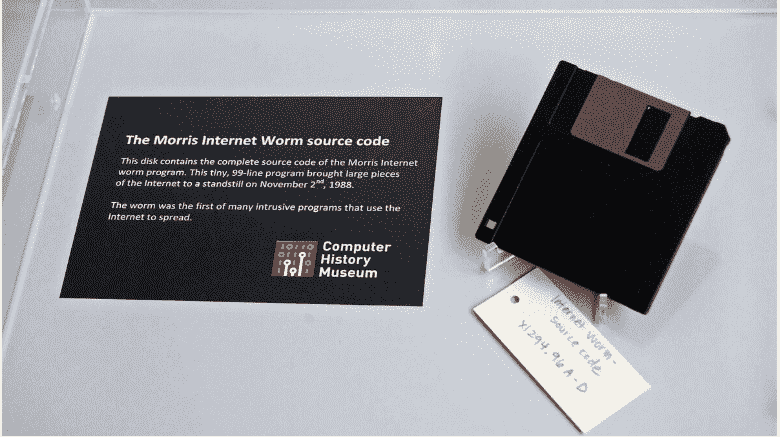

# 在云出现之前，后期制作 RTM 是如何处理 bug 的？

> 原文：<https://dev.to/thefern/how-were-bugs-handled-post-production-rtm-before-the-cloud-57dc>

我正在听 Changelog 播客 [277](https://changelog.com/podcast/277) ，这是关于 Visual Studio 代码的故事。我开始思考软件工程团队是如何在发布到制造阶段(RTM)之后，在云之前，在 git 存储库之前，或者在任何其他类型的可下载补丁之前处理 bug 的。

如果你在这样的团队中，我很想听听。我很想知道 CD 的 rom 安装程序是否在交付时就考虑了补丁，甚至是软盘安装程序。或者提供了另一个完整的安装程序，而不是一个补丁。

*   你最难忘的 bug 是什么？
*   代价最大的错误是什么？
*   补丁是如何交付的？