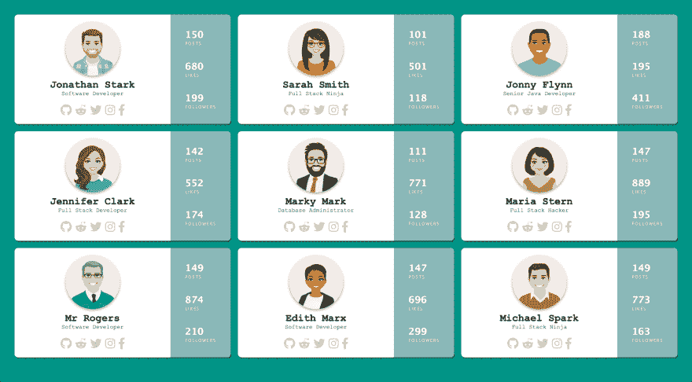

# 普通 JavaScript 和 Vue 中的 HTML 模板标签

> 原文：<https://dev.to/therealdanvega/html-template-tag-in-vanilla-javascript-and-vue-5eoo>

在过去的几个月里，我围绕 VueJS 和普通 JavaScript 写了大量的文档、教程和练习。举个例子，我是 [Tech Elevator](https://www.techelevator.com/) 的课程开发员，这是一个编程训练营，在 14 周内教学生如何编程。考虑到这一点，所有的内容都是面向初学者的，但也是为每个人准备的。

我最近在做一些关于 Fetch API 的教程和练习，我想做一个很好的例子，展示如何从本地文件中读取一些 JSON 数据，然后将它添加到页面中。在一个简单的例子中，我将只使用一个 [createElement](https://developer.mozilla.org/en-US/docs/Web/API/Document/createElement) 和 [createTextNode](https://developer.mozilla.org/en-US/docs/Web/API/Document/createTextNode) 并将项目添加到 DOM 中。

在一个更复杂的例子中，涉及到更多的标记，创建元素、节点以及处理属性和类会变得非常麻烦。在这种情况下，一个很好的解决方案是内容元素模板。我也意识到很多开发人员(初学者和老手)可能不知道这是什么或者为什么我们会使用它。

在本文中，我将看看 HTML &普通 JavaScript 中的`<template>`标签。当你知道为什么这个标签存在时，它可能更有意义为什么它被用在 Vue 单个文件组件中。

## 内容元素模板

你可以像看待其他模板一样看待 HTML 中的`<template></template>`标签。模板是一个模子或图案，它给你一个创造其他东西的起点。MDN 文档将 HTML 内容模板定义为:

> HTML 内容模板(`<template>`)元素是一种用于保存客户端内容的机制，该内容在页面加载时不会呈现，但随后可能会在运行时使用 JavaScript 进行实例化。
> 
> 可以把模板想象成一个内容片段，它被存储起来供文档中的后续使用。虽然解析器在加载页面时会处理`<template>`元素的内容，但它这样做只是为了确保这些内容是有效的；但是，不会呈现元素的内容。

这听起来很简单，但是如果它不完全有意义，也不要担心。我们将看一个实际的例子，希望它能为我们澄清一切。

## HTML 内容模板演示

我将展示如何在普通 JavaScript 中使用`<template></template>`标签的内容放在一起。如果你想查看这个演示的源代码，你可以在 [Github](https://github.com/cfaddict/html-template-article) 上找到。我们将构建一个基于一些 JSON 数据加载用户卡列表的页面，最终看起来像这样。

[](https://res.cloudinary.com/practicaldev/image/fetch/s--hXRekWPm--/c_limit%2Cf_auto%2Cfl_progressive%2Cq_auto%2Cw_880/https://thepracticaldev.s3.amazonaws.com/i/q3ltgmipwmj4fvb4uttn.png)

### Markup

正如我之前所说，这个项目的目标是从 JSON 文件中读入一些用户数据，然后将用户信息写入页面。当您必须一个接一个地创建元素并将它们添加到页面中时，这变得非常麻烦。

更好的方法是构建标记和 CSS 的外观，然后将标记包装在模板标签中。下面的 HTML 是我最后得到的。当我完成时，我只是在标记周围添加一个`<template></template>`标签，并给它一个 id。

```
<template id="user-card-template">
<div class="user">
    <div class="profile">
        
        <h2></h2>
        <span class="title"></span>
        <div class="social">
            <a href="https://www.github.com" target="_blank"><i class="fab fa-github fa-2x" target="_blank"></i></a>
            <a href="https://www.reddit.com" target="_blank"><i class="fab fa-reddit-alien fa-2x"></i></a>
            <a href="https://www.twitter.com" target="_blank"><i class="fab fa-twitter fa-2x"></i></a>
            <a href="https://www.instagram.com" target="_blank"><i class="fab fa-instagram fa-2x"></i></a>
            <a href="http://www.facebook.com" target="_blank"><i class="fab fa-facebook-f fa-2x"></i></a>
        </div>
    </div>
    <div class="stats">
        <div class="posts">
            <h3></h3>
            <span>Posts</span>
        </div>
        <div class="likes">
            <h3></h3>
            <span>Likes</span>
        </div>
        <div class="followers">
            <h3></h3>
            <span>Followers</span>
        </div>
    </div>
</div>
</template> 
```

### JavaScript

现在我有了我的标记，是时候看看 JavaScript 了。我有一个名为`users.json`的 JSON 文件，其中有一个由 9 个用户组成的数组，如下所示。

```
{ 
    "id": 1,
    "fullname": "Jonathan Stark",
    "title": "Software Developer",
    "avatar": "img/user_1.png",
    "social": {
        "github": "github_username",
        "reddit": "reddit_username",
        "twitter": "twitter_username",
        "instagram": "instagram_username",
        "facebook": "facebook_username"
    },
    "stats": {
        "posts": "150",
        "likes": "680",
        "followers": "199"
    }
} 
```

第一步是读入 JSON，为此我们将使用 Fetch API。如果你以前用过 fetch，这并不新鲜。

```
fetch('users.json') 
.then((response) => {
  return response.json();
})
.then((users) => {
  // we have an array of users
})
.catch((err) => console.error(err)); 
```

现在我们有了一组用户，我们可以开始使用我们的模板了。首先，我们需要检查用户的浏览器是否支持 HTML 内容模板标签。只要您使用的是现代浏览器[，它就应该支持它](https://caniuse.com/#feat=template)，但最好的做法是进行这项检查。

```
if('content' in document.createElement('template')) {

});
} else {
    console.error('Your browser does not support templates');
} 
```

现在我们知道浏览器支持这个特性，我们需要得到一个对父容器的引用，我们将把每个用户卡附加到这个父容器，在这个例子中，它是带有用户 id 的元素。然后我们将迭代数组中的每个元素。

```
if('content' in document.createElement('template')) {
    const container = document.getElementById('users');
    users.forEach((user) => {

    });
} else {
    console.error('Your browser does not support templates');
} 
```

在用户阵列的每次迭代中，我们将创建模板的副本(克隆)。我们这样做的方法是获取对元素的引用，获取内容(模板标签中的内容)，然后克隆它。我们将 true 传递给 cloneNode 方法，这样我们就可以使用深度克隆来获取所有的子节点。

```
const tmpl = document.getElementById('user-card-template').content.cloneNode(true); 
```

从那里，我们可以简单地查询特定元素的模板，并将其内容设置为我们从用户数组中读取的值。在大多数情况下，我只是设置元素的内部文本。最后，我们使用对容器元素的引用，并将模板标签中的所有内容添加到页面中。

```
fetch('users.json') 
.then((response) => {
  return response.json();
})
.then((users) => {
  if('content' in document.createElement('template')) {
    const container = document.getElementById('users');
    users.forEach((user) => {
      const tmpl = document.getElementById('user-card-template').content.cloneNode(true);
      tmpl.querySelector('h2').innerText = user.fullname;
      tmpl.querySelector('.title').innerText = user.title;
      tmpl.querySelector('img').setAttribute("src",user.avatar);
      tmpl.querySelector('.posts h3').innerText = user.stats.posts;
      tmpl.querySelector('.likes h3').innerText = user.stats.likes;
      tmpl.querySelector('.followers h3').innerText = user.stats.followers;
      container.appendChild(tmpl);
    });
  } else {
    console.error('Your browser does not support templates');
  }
})
.catch((err) => console.error(err)); 
```

### 条件句

写完这篇文章后，我的朋友托德问了我一个很好的问题。

> 托德夏普@ recursivecodes[@ therealdanvega](https://twitter.com/therealdanvega)大文章丹。模板支持条件句吗？如果用户没有这些链接会怎么样？2019 年 1 月 26 日下午 15:35[](https://twitter.com/intent/tweet?in_reply_to=1089184943673090048)[](https://twitter.com/intent/retweet?tweet_id=1089184943673090048)0[](https://twitter.com/intent/like?tweet_id=1089184943673090048)1

我们在这里所做的是克隆模板标签内的标记。因为这是普通的标记，所以我们可以对它做任何我们想做的事情。假设一些用户在所有社交网络上都有账户，而一些用户没有。

```
"social": {
  "github": "github_username",
  "reddit": "reddit_username",
  "twitter": "twitter_username",
  "instagram": "instagram_username",
  "facebook": "facebook_username"
} 
```

```
"social": {
  "github": "github_username",
  "reddit": "reddit_username",
  "twitter": "twitter_username"
} 
```

我们在这里可以做的是迭代我们支持的所有已知社交网络，如果 users.social 对象没有那个键，那么我们将从 DOM 中删除那个元素。同样，我们在这里使用的是普通元素，所以我们可以将可见性设置为隐藏或完全删除它们。在这种情况下，我们想要删除它，因为如果只是隐藏它，那么在某些情况下我们会有这个空白空间，这看起来不太好。

```
// this is a list of social networks we display under a users profile
const socialLinks = ['github','reddit','twitter','instagram','facebook']
// iterate over that list and check to see if they have an account on that network
socialLinks.forEach((social) => {
  // if they don't have a link in the JSON data hide that link & icon
  if(!user.social.hasOwnProperty(social)) {
    tmpl.querySelector(`.${social}`).remove();
  }
}); 
```

### 普通 JavaScript 总结中的 HTML 模板

这就是在标记中创建模板、克隆它并向其中添加数据所需要的全部内容。我会提到这一点，因为知道这一点很重要，但是如果您采用这种方法查看源代码，您将只能看到模板代码。这意味着，如果你有数据需要写到搜索引擎友好的页面上，这可能不是一个好的解决方案。

## Vue 中的模板标签

现在我们知道了`<template></template>`标签是什么，这应该更能理解 Vue 用它来做什么。如果你在 Vue 中创建了一个新的单个文件组件，你将会得到如下代码。

```
<template>
    <div id="users">
        <!-- markup here -->
    </div>
</template>

<script>
    // js here
</script>

<style>
    /* css here */
</style> 
```

现在应该很清楚为什么我们需要在模板标签中有一个顶级元素了。Vue 将把模板标签中的所有内容编译到虚拟 DOM 中。Vue 文档将模板语法描述为:

> Vue.js 使用基于 HTML 的模板语法，允许您以声明方式将呈现的 DOM 绑定到底层 Vue 实例的数据。所有 Vue.js 模板都是有效的 HTML，可以被符合规范的浏览器和 HTML 解析器解析。
> 
> 在幕后，Vue 将模板编译成虚拟 DOM 渲染函数。结合反应系统，Vue 能够智能地计算出要重新渲染的组件的最小数量，并在应用程序状态改变时应用最小数量的 DOM 操作。
> 
> 如果您熟悉虚拟 DOM 概念，并且更喜欢 JavaScript 的强大功能，那么您也可以直接编写呈现函数来代替模板，并提供可选的 JSX 支持。

## 结论

如果你以前从未使用过`<template></template>`标签，我希望你今天学到了一些新东西。请随时询问关于本文或我构建的演示的任何问题。