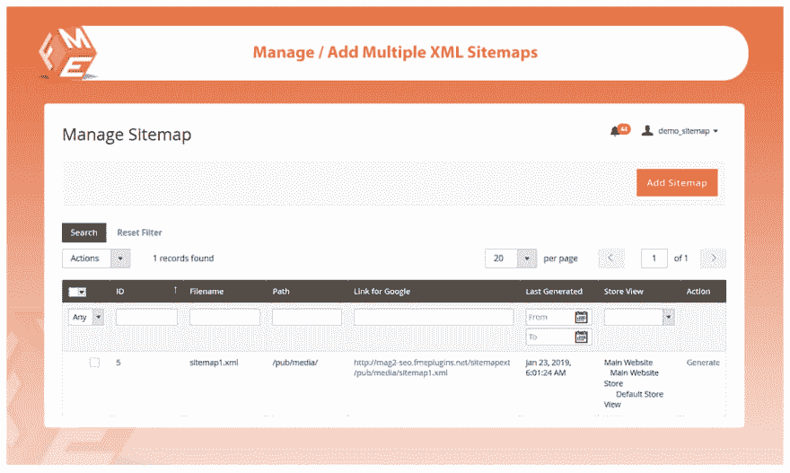

# Magento 2 的 HTML 和 XML 站点地图生成器

> 原文：<https://dev.to/alexbry08549483/html-xml-sitemap-generator-for-magento-2-156h>

**Magento 2 站点地图扩展**允许用户生成 SEO 优化的 XML 和 HTML 站点地图。您可以使用这个扩展生成无限数量的站点地图。
**创建多个 Magento 2 XML Sitemap**
用 XML Sitemap Magento 2 扩展你可以生成多个 XML Sitemap 并提交给 Google 网站管理员工具来获得索引。您可以配置以下类型的 URL。
产品
类别
CMS 页面
附加链接
通过向 Robot.txt 文件添加新的站点地图 URL，自动向 Robots.txt 添加站点地图 URL
。这允许搜索引擎更快更准确地索引。

使用 CronJob 自动添加新网址到 Magento 网站地图
你可以通过设置 Cronjob 自动更新你的网站地图。
每天、每周或每月运行 cron job
错误电子邮件设置——如果在网站地图生成期间服务器中断，将自动发送电子邮件通知。

**强大的关键功能**

1.  生成多个网站地图
2.  包括所有或选定的产品、类别。、CMS 等网址。
3.  配置优先级和更改频率以及其他详细信息
4.  设置 Cronjob 以自动向站点地图添加新产品
5.  按字母顺序和 URL 类型对 URL 进行分类
6.  包括所有或选定的产品、类别、CS 和其他

**完整的细节和现场演示 [magento 2 html 网站地图](https://marketplace.magento.com/fme-advanced-sitemap-generator.html)** 

[T22】](https://res.cloudinary.com/practicaldev/image/fetch/s--OMN55g4e--/c_limit%2Cf_auto%2Cfl_progressive%2Cq_auto%2Cw_880/https://thepracticaldev.s3.amazonaws.com/i/qnbhl4e9rre21vacy7fe.png)