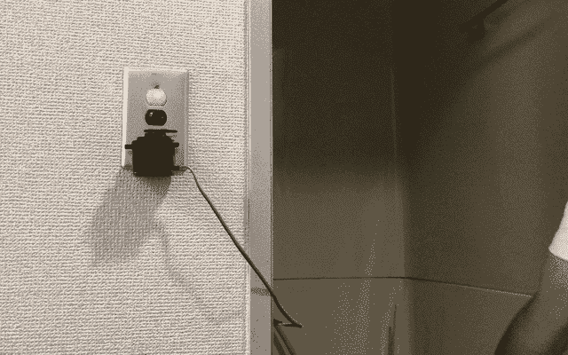
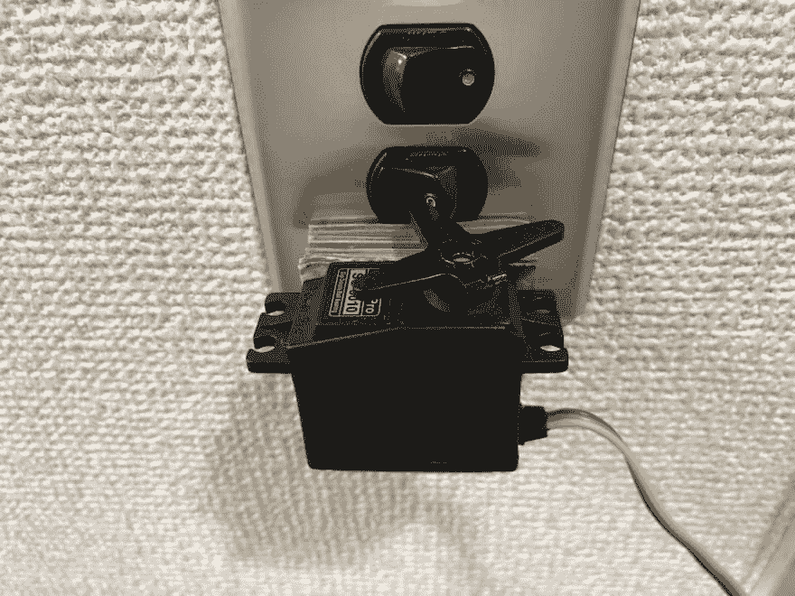
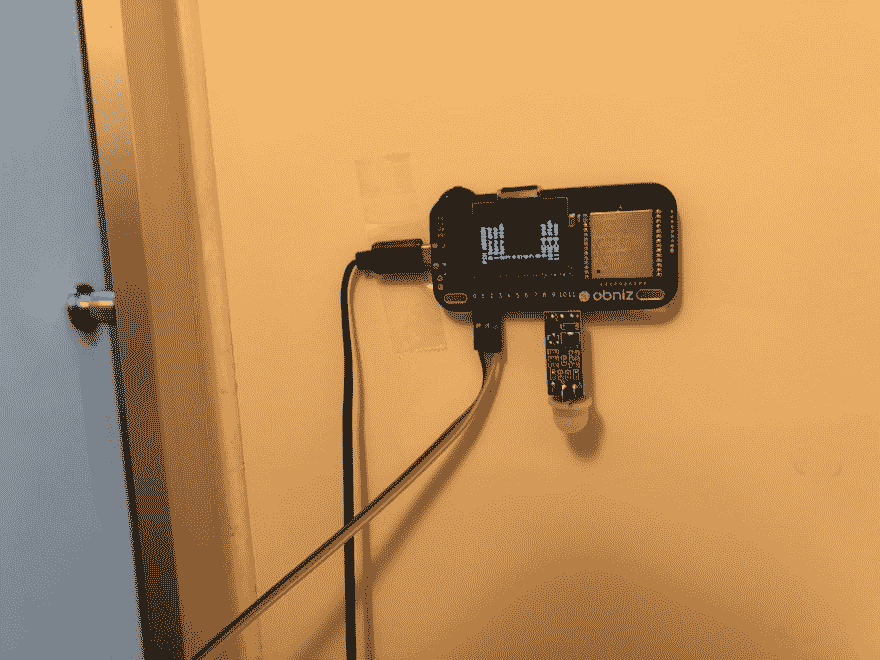
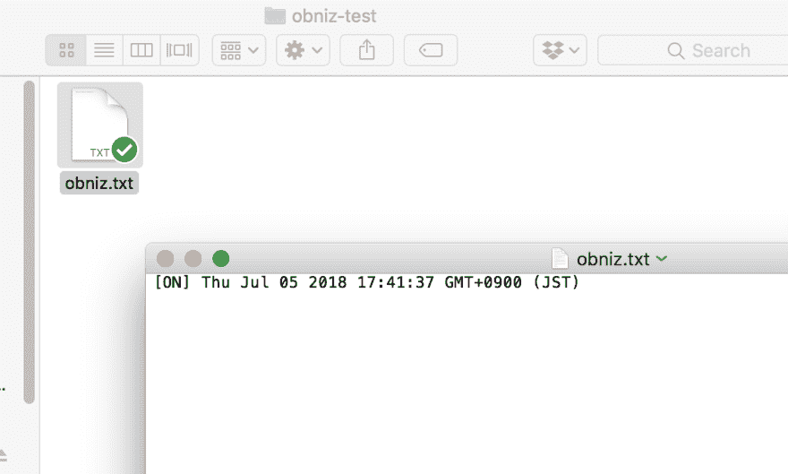

# 人体探测和时间记录灯

> 原文：<https://dev.to/obniz_io/human-detect-and-time-record-lamp-4p67>

# 人体探测和时间记录灯

## 这是什么

家庭物联网套件示例

这让你的房间灯更加智能。当它侦测到有人时会自动开启。它还在 Dropbox 的一个文件中记录了时间。

# 材料

*   奥布尼斯
*   obniz 的电源
*   PIR 传感器(物联网家用套件)
*   伺服电机(物联网家用套件)
*   步伐
*   首先，将伺服电机连接到墙上的开关上。

连接方式取决于您的交换机。

并将 PIR 传感器和伺服电机连接到 obniz。然后接通电源。

编写并运行一个程序。这个示例程序有一个手动方法。
向左转动开关，你的伺服会移动。
调整示例程序上的值以正确工作。

并请指定 dropbox API 密钥。你可以看到如何上课。

我们来测试一下。

当你靠近一个传感器时，你的伺服会移动。你会在你的 dropbox 上看到一个包含时间的文件。

这一次我使用 HTML，但是 nodejs 会更有效。它坚持不懈地工作。

此外，您可能希望自动关闭或将更多信息记录到文件中。似乎很有趣

## 程序

[https://obniz.io/explore/33](https://obniz.io/explore/33)