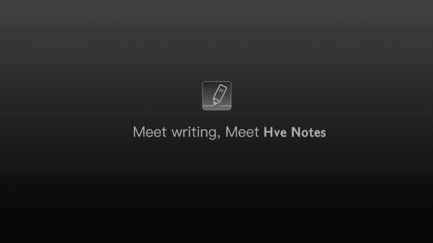
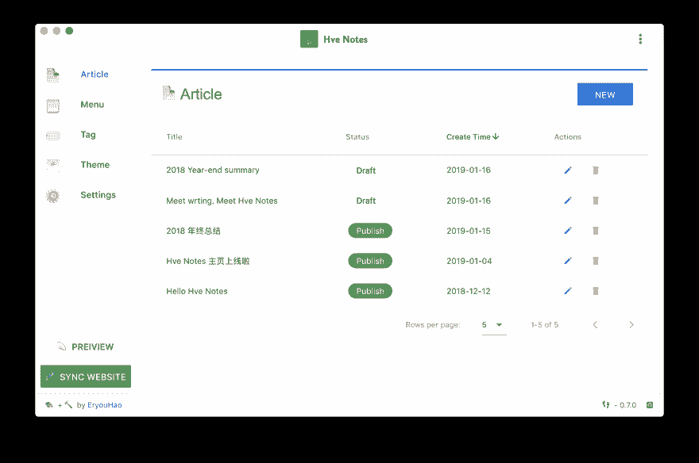

# 一个静态的博客写作客户端

> 原文：<https://dev.to/eryouhao/hve-notes---a-static-blog-writing-client-3o87>

也许你用过静态博客构建工具，如 **Hexo** 、 **Jekyll** 、 **Hugo** 等。不得不承认，他们很优秀。以前用过 **Hexo** ，个人感觉不够方便，体验不够好。所以我写了这样一个工具，希望你也喜欢。

这个应用是由 **Vue.js** 和**电子**开发的。

Github: [Hve Notes](https://github.com/hve-notes/hve-notes)
首页: [Hve Notes(首页只有中文，但应用支持英文和中文)](http://hvenotes.fehey.com)T5】Authoer:[二友号](https://github.com/EryouHao)

✍️ **Hve Notes** 一个静态博客写作客户端。你可以用它来记录你的生活，心情，知识，笔记和想法...

## 特性👇

📝你可以使用最酷的 **Markdown** 语法来快速创建

🌉您可以在文章中的任何位置插入图片和文章封面图表

🏷️你可以给文章加标签和分组

📋您可以自定义菜单，甚至创建外部链接菜单

💻你可以在 **Windows** 或者 **MacOS** 上使用这个客户端

🌎你可以使用 **Github 页面**或**编码页面**向世界展示未来将支持更多平台

💬您可以简单地配置和访问 [Gitalk](https://github.com/gitalk/gitalk) 或 [DisqusJS](https://github.com/SukkaW/DisqusJS) 评论系统

🇬🇧你可以用简体中文或者英文

🌁您可以使用应用程序中的任何默认主题或任何第三方主题

🌱当然 **Hve 注意到**还很年轻，有很多缺点，但是请相信它会继续前进🏃

将来，它一定会成为你形影不离的伙伴

充分发挥你的才能！

😘尽情享受~