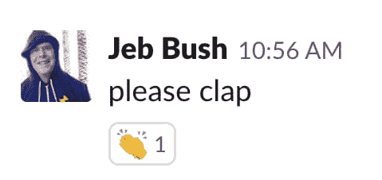
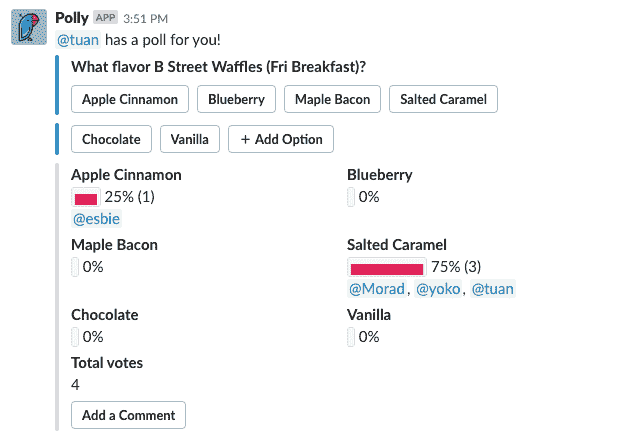
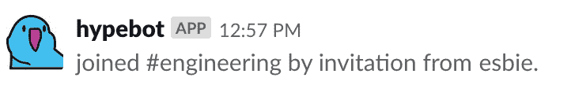
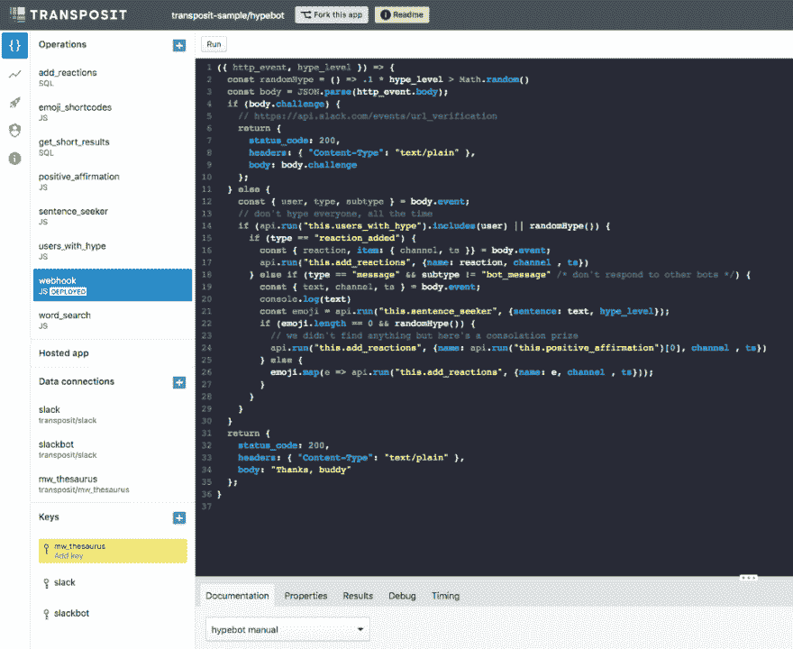
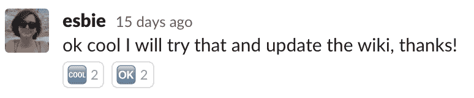
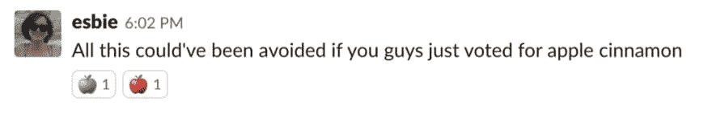

# Hypebot 是炒作的人，从来没有让我失望

> 原文：<https://dev.to/transposit/hypebot-is-the-hype-man-who-never-lets-me-down-5bfm>

莎拉·布朗写的

### 炒作的诞生

现在是我们公司 hackweek 的中期，而我的 hackweek 项目却无法运行。我正试图将[矮人要塞发布说明](http://www.bay12games.com/dwarves/)转换成表情符号，但是我不断达到速度限制——可能更有害的是——没有矮人的表情符号🤷。在一项关于我们为办公室买什么口味的华夫饼的民意调查中，我的人数远远超过了其他人。

<figure> 

<figcaption>咸焦糖阴谋</figcaption>

</figure>

我知道我必须做什么:放弃我的 hackweek 项目，写一个投票给苹果肉桂的 slackbot。不幸的是，Slack API 不允许机器人点击按钮😒。我改变了策略，创造了 **hypebot** ，一个对我在 slack 中所说的一切做出强烈反应的机器人。

段誉也是，因为他渴望炒作。

### 炒作-周期

Hypebot 使用 Slack 的[事件订阅 api](https://api.slack.com/events-api) 构建，后端运行在[转置](https://www.transposit.com/)上。你可以在这里查看 hypebot 的所有代码:【https://console.transposit.com/t/transposit-sample/hypebot T4】

<figure> 

<figcaption>换位控制台</figcaption>

</figure>

当 hypebot 从 Slack 接收到一个消息事件时，它将字符串拆分成离散的单词，并在同义词库中查找每个单词。然后，在数百个同义词的武装下，它将每个单词与所有潜在的 Slack 表情符号进行比较。当它找到匹配时，它会做出反应。这样，炒作周期就完成了。

在 Transposit 中实现这一点意味着我不需要部署自己的服务器，Transposit 使得在进行 API 调用时跟踪 bot OAuth 范围变得容易。没有基础设施；没有 auth 纯炒作。

### 更上一层楼

炒作列车并没有在这里结束。我有即将到来的 hypebot 帖子，关于我们如何解决当事情过热时的性能问题，以及我们如何修改 hypebot，以便他最终在 Slack 应用程序目录上首次亮相。当然，如果你太兴奋而不能等待，那么继续 [fork hypebot on Transposit](https://console.transposit.com/t/transposit-sample/hypebot?readme=true) 来构建你自己的 slackbot。

遗憾的是，hypebot 不能通过 api 给一个中等大小的帖子添加掌声(相信我，我已经检查过了)，所以你只能用传统的方法:🙏👏

* * *