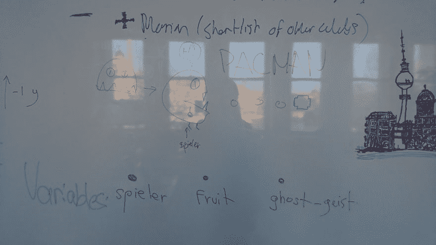
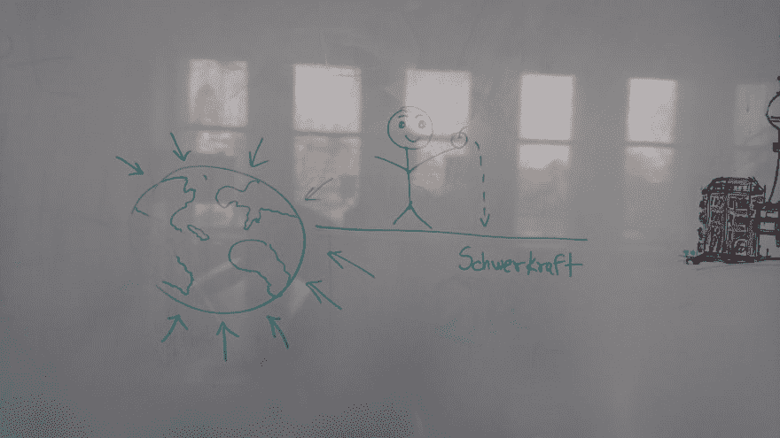
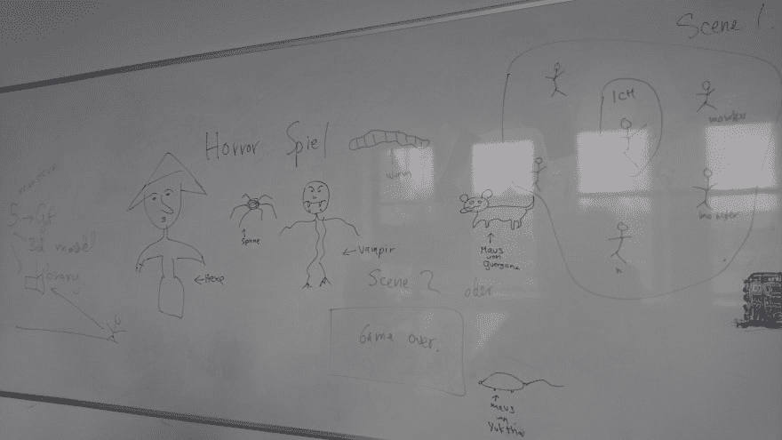
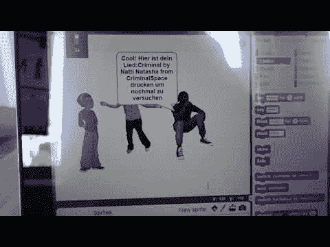
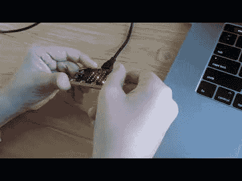
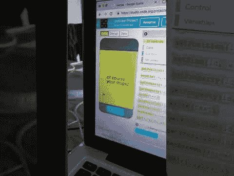
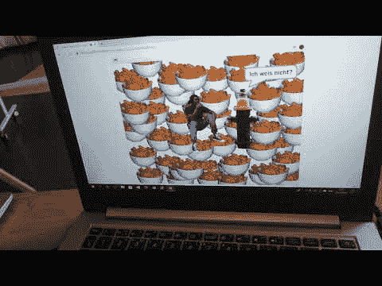
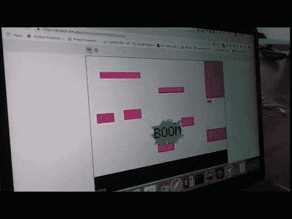

# 我是创意编码老师！

> 原文：<https://dev.to/guergana/i-am-creative-coding-teacher-1nbg>

我一直想写这个帖子很久了。今天，在柏林美丽的春天即将来临的阳光下走了很长一段路后，我终于有了灵感。

我当老师已经 5 个月了。起初，我认为我无法与孩子们相处，不知道如何去做，部分原因是我自己是一个非常叛逆的学生，即使在研究生院也是如此(害怕恶报)，还因为我害怕在公共场合讲话，这两件事对教师来说并不太好。😅*自嘲持续一会儿*...事实上，到目前为止，这不仅是一次美妙的经历，而且我还发现我在这方面并不差，和孩子们一起工作很有趣。

我在一所名为 [Bit & Byte](https://www.bitbyte.lt/en) 的儿童创意编码学校教书，这个项目最初来自立陶宛，现在已经扩展到柏林，希望很快会征服全世界，哈哈哈。这些课程从 Scratch 的块编程，到创建交互式 VR 和 AR 体验，到设计和原型制作移动应用程序，以及编写 Microbit 和 Makey-Makey 之类的物理板...你说吧。

如果我是个孩子，我会很高兴去上这些课。(作为一个幼稚的成年人让我更加享受它们)。

我最喜欢的一部分是在白板上涂鸦和画图表。我开始认为我的人生使命是成为一名电子白板画家。

自己看:

这里还有一些我的学生们的奇妙创作的视频:

从 Spotify 获取歌曲，并让角色随着歌曲起舞:

微型机器人上的一个类似吃豆人的游戏:

一个应用原型:

在 Scratch 中的一个笑话叙述:

最后但同样重要的是，我的一个学生几周前给我看了一个他在课外根据他所学开发的游戏:

这是给学生上课的最大回报之一，看到他们学以致用。