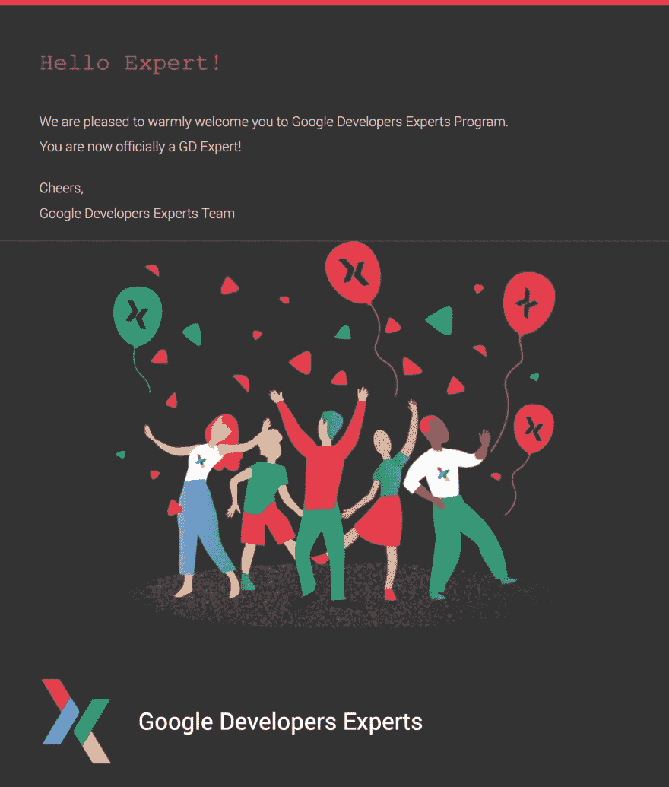
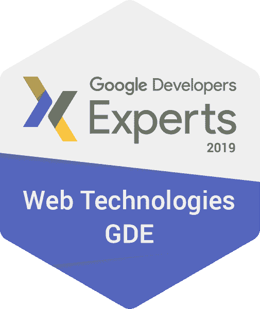
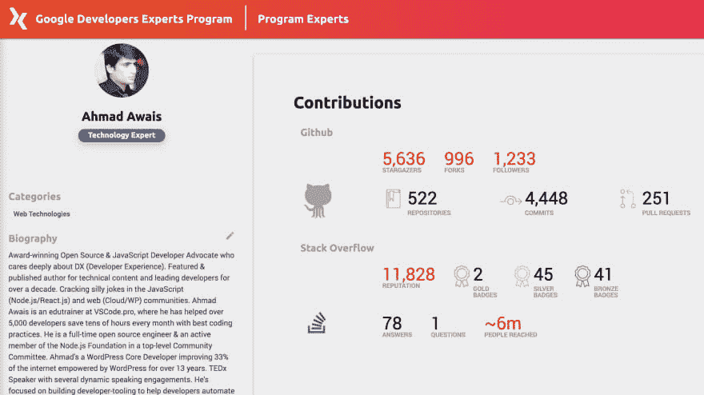

# 我现在是网络技术方面的谷歌开发者专家！

> 原文：<https://dev.to/mrahmadawais/i-am-now-a-google-developers-expert-in-web-technologies-1l47>

在认可了我作为 web 技术专家的开源工作之后，Google 欢迎我加入 Google 开发者专家计划。你可以想象，我很高兴赢得这个荣誉。

呜呜呜。🎉🎉🎉

T3】

## 😇故事是这样的...

早在 2017 年，我就和谷歌开发者关系团队一起合作，共同开发了几个开源项目。从那以后，我有机会和网络行业最优秀的工程师一起工作。

> #### 专家计划
> 
> 一项全球计划，旨在表彰一项或多项谷歌技术领域的专家和思想领袖。这些专业人士积极贡献和支持世界各地的开发者和初创企业生态系统，帮助他们构建和推出高度创新的应用。
> 
> #### 资格标准
> 
> *   Become an expert in the subject field.
> *   Be able to express clearly and provide meaningful suggestions to others.
> *   pass
>     *   Become an influential and recognized speaker at large and small technical conferences, showing the ongoing activities in the ecosystem of start-ups and developers.
>     *   Create high-quality technical content, including: tutorials, code examples, educational books, blog posts and videos.
>     *   Guide technology entrepreneurs to design, develop and distribute their products.

这基本上就是我如何从几个谷歌人那里得到邀请，并最终通过谷歌开发者专家面试程序的。你首先会被谷歌推荐，然后通过公平的面试过程进行审查。

## 徽章🎖

我是开源& JavaScript 的开发者拥护者。你会发现我提倡所有的东西。这些年来，我已经开发了 [170 多个开源项目](https://ahmadawais.com/2018-open-source/)，这些项目现在被[数百万开发者](https://ahmadawais.com/1-million-developers-using-shades-of-purple-theme/)使用。

所以，我采访了一个网络 GDE 和一个谷歌人——剩下的，就像他们说的，是历史了。你可以在这里阅读更多关于过程[的信息。作为一种认可，谷歌开发专家还会获得一枚徽章。我得到了一个网络技术。](https://developers.google.com/programs/experts/)

🙌你好。如果你想更好地了解我，请查看我最新的 [2018 年回顾→](https://ahmadawais.com/2018-year-in-review/)

## 🦊下一步是什么？

很大程度上，一切照旧。我热爱开源，开发者是我的人。我将继续做我作为开发者倡导者所做的事情。建设社区和帮助开发者。

✅:我非常渴望与 chrome V8 引擎背后的开发团队和 Speed/Perf 团队一起工作，他们致力于让每个人都能更方便地访问网络，尤其是下一个十亿用户。

🚀对于我在渐进式 Web 应用程序和 JavaScript SEO 问题上的工作来说，GDE 计划的成员资格是一种变相的祝福，我非常想解决这些问题，因为我在通过服务人员提供离线支持的 JAMstack 应用程序上工作。与使用 Chrome 42 的移动首次测试有关(我猜)。

🤙我将发布七个非常棒的开源软件(有些相互关联),我已经工作了很长时间了。这是我非常乐意分享的东西。

🗣️:今年我已经计划好了几次演讲。通过 GDE 项目，我将有更多的机会在一些地方会议上发言——尤其是关于 PWAs 和 JAMstack 的 web 性能。手指交叉。

> 如果你正在策划一个与开发者有关的活动，你想让我谈谈尖端网络？然后继续，阅读[想让我说话的页面并与我联系](https://ahmadawais.com/want-me-to-talk-at-your-event/)。

和平！✌️

在 Twitter 上关注 Ahmad Awais @MrAhmadAwais