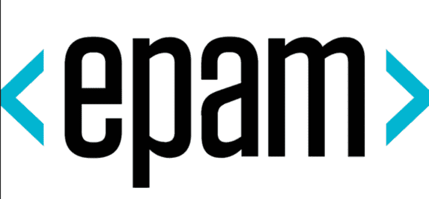
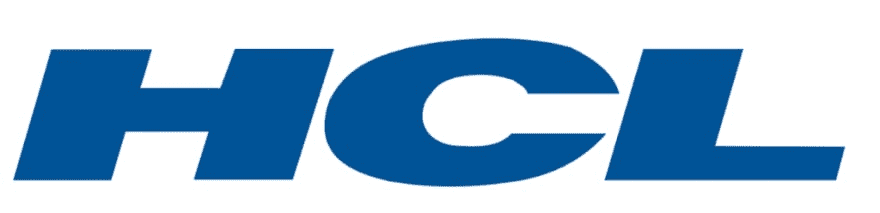
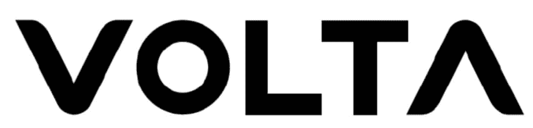

# 我问了 12 位软件工程师如何被他们的公司录用，以下是他们的回答…

> 原文：<https://dev.to/lexjacobs/i-asked-12-software-engineers-how-to-get-hired-at-their-companies-and-heres-what-they-said-30ip>

#### 旧金山一次软件工程后端招聘“速配”式活动的教训

### 总结

我觉得每个公司都有自己的理想之路，可以让自己被公司录用。如果今晚有一个主要收获，我会说硅谷/湾区的创业空间似乎强调他们后端职位的优先经验。如果你不知道如何获得最初的经验，我昨晚不止一次听到的建议是，或许可以去一家更大的科技公司实习或当学徒。

但是不要气馁！从我自己和我的许多同事的经历来看，从新兵训练营毕业后立即被一家创业公司聘用是可能的，就像我在 2014 年做的那样。

* * *

我不确定我的各种在线工程活动与什么关键词搜索重叠，但这是我第二次获得 HackerX 招聘活动的免费门票。

<figure>

<figcaption>hacker x logo</figcaption>

</figure>

我第一次没有参加，因为我没有寻找额外的工作，也几乎再次拒绝了这个活动，直到我看到他们欢迎被动的求职者。虽然我目前对自己在教学、指导、个人项目和学习方面的工程平衡非常满意，但我觉得更多地了解该行业目前招聘的角色类型是有价值的。

在赞助公司的简短介绍之后，晚会的“速配”部分开始了。当我排在下一个开始我的第一次 5 分钟采访的时候，我意识到了这种情况的荒谬，并迅速想出如何让这个晚上既有趣又有知识性。我想到了我的学生，想知道我能给我的学生和学员带回什么有用的东西。我的脑海中浮现出下面这个问题，在接下来的晚上，我一直在问这个问题:

> “[…快速个人介绍]。如果你可以对你招聘的职位的理想员工进行逆向工程，你会引导候选人从学习之路的一开始就收集哪些技能和经验？软硬兼施。”

以下是我所学到的东西的总结，由我采访过的公司整理而成。许多公司也分享了他们对新兵训练营毕业生的看法，因为我介绍自己是目前新兵训练营学生的技术导师/助教。

<figure> 

<figcaption>游戏机标识</figcaption>

</figure>

#### 游戏机

*   申请前最有用的技能:学习如何设计分布式计算。在学习这种技能时，人们应该记住的主要问题是:“它能伸缩吗？到几百万？”了解如何制作简单快速的应用程序。
*   这个人要找的“独角兽”应该是数据库方面的专家，同时也能解决软件和硬件层面的问题。出问题时能处理好的人。也在寻找能消除忙碌的人。能够自动完成重复性任务的人。
*   寻找在构建弹性应用程序方面有经验的人。系统能处理故障吗？
*   最重要的软技能:协作。这在整个行业中都是有用的。你能有效地评论别人的作品吗？相反，你能优雅地接受反馈吗？
*   最有用的软技能:捍卫你的设计的能力。如果你不能从头到尾清晰而有逻辑地描述你的设计，它很可能是行不通的。

<figure>

<figcaption>eatsa logo</figcaption>

</figure>

#### Eatsa

*   重视具有不同技能背景的候选人，这是新兵训练营毕业生的常见情况，因为他们来自各种不一定是技术背景。他们发现新的视角甚至比拥有计算机科学大学学位的人更有用。
*   鼓励多面手申请，但也希望看到深度的证据。这可以简单到清楚你喜欢在栈的哪个部分工作。
*   为了实践可能对该公司的后端职位有用的技能，构建 API 将是很好的准备，因为它提供了难度的良好平衡，还允许快速迭代开发。希望看到能够相对快速地产生结果的工程师。
*   了解专业工程团队和 scrum 如何工作。他们认为，许多没有工程团队经验的初级候选人不知道如何利用 stand up 这个机会来揭露阻挡者并作为一个团队工作。
*   理想的工作经历:与初创公司合作。

<figure> 

<figcaption>boxbot 标志</figcaption>

</figure>

#### boxsbot

*   有用的硬技能:学习你所在的主要技术市场正在积极开发的流行框架/结构，如果有的话。例如:在湾区，他们非常依赖脸书反应生态系统。
*   一家初创公司通常没有时间重新发明轮子，所以他们寻求找到精通本地开发的流行框架和库的工程师。
*   他们提到了另一个例子，如果你在西雅图，学会严重依赖 AWS 基础设施。
*   框架/库推荐:React/Rails。
*   对新兵训练营学生的感觉:他们有呼吸，但没有深度。
*   申请这家公司之前推荐的中间步骤:学习硬技能，包括部署数据库框架，如 GraphQL

<figure> 

<figcaption>thredUp 标志</figcaption>

</figure>

#### ThredUp

*   有用的硬技能:移动和全栈。在 iOS 上使用 Objective-C/swift。使用 android 的所有 Java，下一步走向 Kotlin。
*   寻求具有完整堆栈经验的申请人，包括 Ruby on Rails 和 React 的高级技能。
*   软技能:强大和跨合作。快速移动的能力。发货能力，即使以后需要修复。不要寻找那些不必要地推迟生产的超级一丝不苟的编码员。
*   申请这家公司之前推荐的中介步骤:他们有优秀的申请人在网飞工作或实习过一段时间。
*   根据他们分发的工程 101 文件，他们重视:寻求快速影响的人/让我们作为一个公司学习的优雅解决方案/偿还技术债务/可以在不确定性中茁壮成长的人/设计和构建解决方案以满足客户需求的动力/关注团队效率、未来速度、未来能力或可扩展性的更清洁的实施

<figure> 

<figcaption>epam 标志</figcaption>

</figure>

#### epam

*   给所有应聘者的建议:先了解一家公司及其文化。
*   他们如何审查他们的工程师:初始技能匹配→技术面试→公司文化匹配面试

<figure> 

<figcaption>hcl 标志</figcaption>

</figure>

#### HCL

*   软技能:学习新技能的能力和良好的团队合作精神。
*   硬技能:被认为非常不重要，因为他们为许多不同的项目提供工程服务。

<figure>

<figcaption>eatsa logo</figcaption>

</figure>

#### Eatsa(第二次对话)

*   硬技能:全栈。了解 React 很好，但他们也希望后端申请者熟练掌握 Python/Ruby。
*   关于新兵训练营毕业生的想法:60%的新兵训练营毕业生除了 React 等最新的前端库之外并不强大。
*   回复这家公司前推荐中介步骤:实习经历。他们提到了一些提供实习或学徒的公司，如 dropbox、lyft 或谷歌。去一家大公司，花些时间发展你的技能，因为像这样的小公司没有培训。
*   在此申请之前，推荐的行业经验:1 年
*   推荐的投资组合项目:航运代码的证据。新兵训练营项目可能令人印象深刻，但没有显示出发布生产代码的证据。
*   面试技巧:数据结构/算法/大 O 符号。

<figure> 

<figcaption>volta 标志</figcaption>

</figure>

#### 伏打

*   关于新兵训练营毕业生的想法:他们可能了解最新的技术，但这并不重要。他们想要有建筑和商业逻辑经验的申请人。
*   学习可以让初创公司尽可能长时间保持小规模和精益的工具，例如学习 faas(功能即服务)，如 aws lambda。
*   了解如何避免给服务器带来瓶颈，例如卸载静态资产。
*   使他们成为优秀候选人的其他因素是什么:在 medium 上写技术博客文章并积极为开源做贡献的申请人。