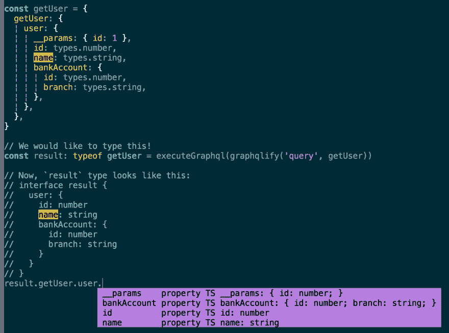

# 我已经创建了一个微型库，可以从 TypeScript 创建 GraphQL 查询，而不会丢失类型信息

> 原文：<https://dev.to/acro5piano/i-created-a-tiny-library-that-create-graphql-query-from-typescript-2mg7>

我创建了一个小小的实验图书馆。

[https://github.com/acro5piano/typed-graphqlify](https://github.com/acro5piano/typed-graphqlify)

从 TypeScript 的类似类型定义的文件创建 GraphQL 查询字符串。
我想用 TypeScript + GraphQL 来减少痛苦。

[](https://res.cloudinary.com/practicaldev/image/fetch/s--p3H5Plm4--/c_limit%2Cf_auto%2Cfl_progressive%2Cq_auto%2Cw_880/https://qiita-image-store.s3.amazonaws.com/0/103885/cce5a0fe-f3ed-cc6a-c217-420993388828.png)

# 动机

我们都知道 GraphQL 非常棒，它解决了我们在 REST API 中遇到的许多问题，比如过蚀刻和欠蚀刻。但是在 TypeScript 中开发 GraphQL API 有时有点痛苦。为什么？我们来看看平时要做的例子。

当我们使用 Apollo 等 GraphQL 库时，我们要这样定义查询及其接口:

```
interface GetUserQueryData {
  getUser: {
    id: number
    name: string
    bankAccount: {
      id: number
      branch: string
    }
  }
}

const query = graphql(gql`
  query getUser {
    user {
      id
      name
      bankAccount {
        id
        branch
      }
    }
  }
`)

apolloClient.query<GetUserQueryData>(query).then(data => ...) 
```

Enter fullscreen mode Exit fullscreen mode

这太痛苦了。

最大的问题是我们代码库中的冗余，这使得事情很难保持同步。为了给我们的实体添加一个新的字段，我们必须关心 GraphQL 和 TypeScript 接口。如果我们做错了，类型检查也不起作用。

typed-graphqlify 基于十几个月来在 TypeScript 中使用 GraphQL APIs 进行开发的经验，来解决这个问题。主要思想是通过使用类似 GraphQL 的对象和一点 helper 类来定义模式，从而只有一个真实的来源。包括 graphql-tag 或 Fragment 在内的附加特性可以通过其他工具实现，如 Apollo。

我知道一些将 GraphQL 模式转换为类型脚本的工具，如 Apollo-CLI、graphql-code-generator 和 graphqlgen。

但是，它需要模式更新，并且不能从实际查询中定义可选查询。
至少在我的特定用例中，`typed-graphqlify`更有用。

# 如何使用

安装它:

```
yarn add typed-graphqlify 
```

Enter fullscreen mode Exit fullscreen mode

首先，定义类似 GraphQL 的 JS 对象:

```
import { graphqlify, types } from 'typed-graphqlify'

const getUserQuery = {
  getUser: {
    user: {
      __params: { id: 1 },
      id: types.number,
      name: types.string,
      bankAccount: {
        id: types.number,
        branch: types.optional.string,
      },
    },
  },
} 
```

Enter fullscreen mode Exit fullscreen mode

注意，我们使用我们的`types`助手来定义结果中的类型。

然后，用`graphqlify` :
将 JS 对象转换成 GraphQL (string)

```
const gqlString = graphqlify('query', getUserQuery)

console.log(gqlString)
// =>
//   query getUser {
//     user(id: 1) {
//       id
//       name
//       bankAccount {
//         id
//         branch
//       }
//     }
//   } 
```

Enter fullscreen mode Exit fullscreen mode

最后，执行 GraphQL:

```
import { executeGraphql } from 'some-graphql-request-library'

// We would like to type this!
const result: typeof getUser = await executeGraphql(gqlString)

// As we cast `result` to `typeof getUser`,
// Now, `result` type looks like this:
// interface result {
//   user: {
//     id: number
//     name: string
//     bankAccount: {
//       id: number
//       branch?: string
//     }
//   }
// } 
```

Enter fullscreen mode Exit fullscreen mode

# 特性

*   嵌套查询
*   输入变量、参数
*   查询和变异
*   可选类型

# 示例

基本查询

```
query  getUser  {  user  {  id  name  }  } 
```

Enter fullscreen mode Exit fullscreen mode

```
graphqlify('query', {
  getUser: {
    user: {
      id: types.number,
      name: types.string,
    },
  },
}) 
```

Enter fullscreen mode Exit fullscreen mode

基本突变

```
mutation  updateUser($input:  UserInput!)  {  updateUser(input:  $input)  {  id  name  }  } 
```

Enter fullscreen mode Exit fullscreen mode

```
graphqlify('mutation', {
  __params: { $input: 'UserInput!' },
  updateUser: {
    __params: { input: '$input' },
    id: types.number,
    name: types.string,
  },
}) 
```

Enter fullscreen mode Exit fullscreen mode

更多的例子和文档，请看看 github repo:[https://github.com/acro5piano/typed-graphqlify](https://github.com/acro5piano/typed-graphqlify)

# 待办事宜

*   [x]可选支持
*   [ ]枚举支持

# 感谢

受到...启发

*   [https://github.com/kadirahq/graphqlify](https://github.com/kadirahq/graphqlify)
*   [https://github.com/19majkel94/type-graphql](https://github.com/19majkel94/type-graphql)