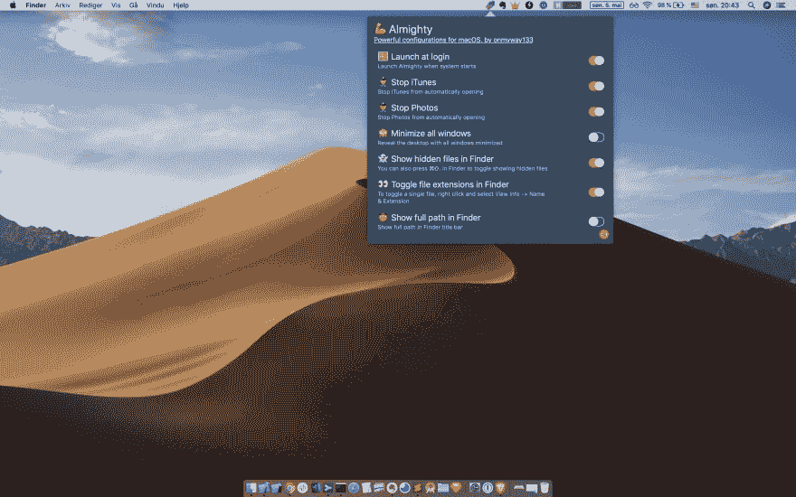

# 我正在为 macOS 推出功能强大的配置

> 原文：<https://dev.to/onmyway133/i-m-launching-almighty-powerful-configurations-for-macos-4oci>

产品搜寻[https://www.producthunt.com/posts/almighty](https://www.producthunt.com/posts/almighty)T2【gum road】https://gumroad.com/l/lbZCs[T4【产品搜寻】](https://gumroad.com/l/lbZCs)

* * *

嗨，我很高兴宣布我的下一个 macOS 应用程序。全能是一个方便易用的 macOS 菜单栏应用程序，展示了强大的配置为您的 mac。这简化了繁琐的设置，并允许我们只能通过冗长的苹果脚本或命令行才能实现的奇妙控制

有许多功能，而且列表还在增长

🌅登录时启动
👻在 Finder 中显示隐藏文件
🖼将截图保存到下载文件夹(默认截图保存在桌面)
🛑停止 macOS 发布通知(停止安装 macOS 新的主要版本的警告)
🚫停止 macOS 软件更新通知
🙈最小化所有窗口(显示最小化所有窗口的桌面)
👮‍♀️停止 iTunes(阻止 iTunes 自动打开)
👀在 Finder 中切换文件扩展名(默认情况下， 某些文件扩展名被隐藏)
👮停止照片(阻止照片自动打开)
🤠在 Finder 中显示完整路径(在 Finder 标题栏中显示完整路径)
🎃隐藏桌面图标(隐藏所有桌面图标可见性)
🌃启动屏保(启动你的默认屏保)
🏖清除剪贴板(清除剪贴板中的所有项目)
☀️保持 macOS 清醒(防止 macOS 进入睡眠模式)
🌙请勿打扰(连接外部屏幕时打开“请勿打扰”模式，这是为了避免演示时出现不想要的通知)
⌨️锁定键盘(禁用内置键盘进行清洁。 屏幕和触摸板功能正常。对于带有 HID 驱动键盘的机器，这可以锁定键盘但不能解锁)

如果您在打开全能时收到“已损坏且无法打开”的警告，您可以按照[https://www . IOT gadgets . com/2018/09/how-to-fix-application-is-damaged-and-cant-be-open-error-in-MAC OS-mojave-and-high-Sierra/](https://www.iotgadgets.com/2018/09/how-to-fix-application-is-damaged-and-cant-be-opened-error-in-macos-mojave-and-high-sierra/)禁用看门人

更多功能即将推出，欢迎任何建议

原帖[https://github.com/onmyway133/blog/issues/240](https://github.com/onmyway133/blog/issues/240)