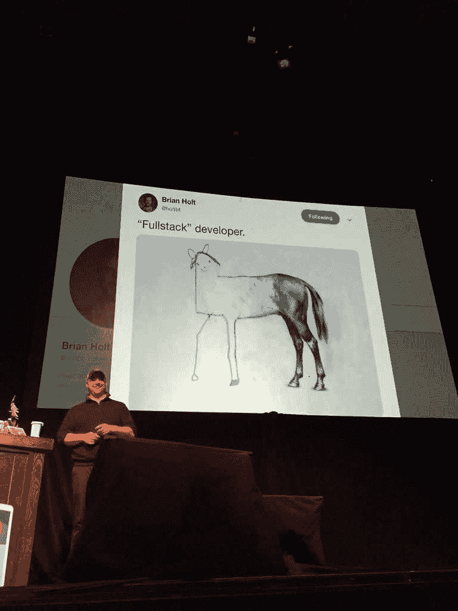

# 对不起，但是这个“满栈”迷因让我真的很生气/难过

> 原文：<https://dev.to/cubiclebuddha/i-m-sorry-but-this-full-stack-meme-makes-me-really-mad-sad-35hi>

上面的迷因可能会通过将“全栈开发”描绘成一匹马的图画来给它们蒙上阴影，但是只画出了后端。如果你正在建立一个团队，你更愿意拥有上面那个迷因形象，还是只了解系统一部分的开发人员？

就我个人而言，我会毫不犹豫地接受这个迷因形象。如果他们有兴趣的话，我也会选择“部分堆栈”开发(如下所述)。

我是说我明白了。这是一个有趣的迷因，但是我们需要更少的墙和更多的桥。太多时候，经理们站在诸如“没有全栈开发人员”之类的陈腐想法后面，然后强迫团队结构阻止好的、快速的对话。听着，我们的用户不关心我们的架构，他们关心的是端到端的代码工作。我更希望管理者和领导者转变他们的思维，或者至少接受快乐、自主团队的概念。

我认为“全栈开发”的最佳理由是，最健康的团队充满了同理心的人，他们愿意设身处地为他们团队的任何成员着想(不管他们擅长什么)，以便他们可以了解他们队友的挑战。这是一个很好的方法来确保:

*   通过移情提高团队士气
*   领域知识转移
*   更好的估计，因为每个人对堆栈的每一层都非常熟悉
*   必要时，人们可以帮忙

现代 web 开发正在努力推动“全栈团队”而不是“全栈开发人员”如果有一个像我这样的形象，它会是一匹马，大部分肋骨和腹部都被阴影笼罩。我不是 CSS 专家，也不是 SQL 大师。每个人都有自己的长处和短处，但是整个团队应该是完全自主和高效的。我是认真的。团队的每个成员都是有价值的。

我知道我不应该为这件事如此烦恼，但我确实如此。如果说我从佛教学者那里学到了什么，我用它来研究这个博客...那就是[你不应该对自己的情绪做出判断](https://dev.to/cubiclebuddha/go-home-4-techniques-that-help-you-to-leave-work-at-work-42h0)———你应该接受它们。我接受这样一个事实，我曾经被那些没有真正像团队一样运作的团队伤害过。我不想等 2 周，让后端开发人员给我一个新的 API，这样我就可以开始我的 UI 任务了。让我们一起研究 API 和 UI。

你怎么想呢?你的公司是否对分裂的 UI/后端团队施加了太多压力？他们是否对全筹码团队施加了太多压力？有没有其他方法来保持高度的协作和同理心？

———————
如果你喜欢这篇文章，可以考虑阅读:
[回家:帮助你下班的 4 个技巧](https://dev.to/cubiclebuddha/go-home-4-techniques-that-help-you-to-leave-work-at-work-42h0)
或
[佛法如何敏捷](https://cubiclebuddha.com/samsara-5-agile-techniques-to-end-suffering-and-increase-learning/)
或
[10+在喧闹的办公室里找到宁静的小贴士](https://dev.to/cubiclebuddha/10-tips-to-find-peace-in-a-loud-office-1429)