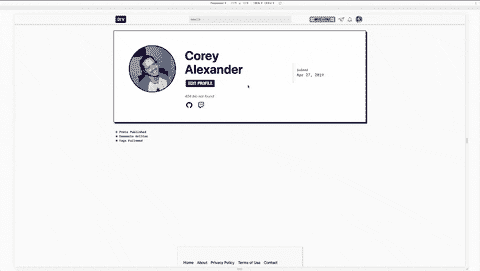

# 我打开了一个 PR，将 Twitch 直播添加到 Dev.to

> 原文：<https://dev.to/coreyja/i-opened-a-pr-that-adds-twitch-live-streaming-to-dev-to-2l0c>

本月初，Ben 发表了一篇帖子，表示有兴趣在 Dev.to 中添加一些实时流集成！

 [## 开发特色理念:自助直播

### 本哈尔彭 4 月 4 日 192 分钟阅读

#discuss #meta #opensource #contributorswanted](/devteam/dev-feature-idea-self-serve-live-broadcasting-5bli)

我一直对编码流感兴趣，认为这是一个非常酷的想法！我喜欢有一个编码和开发人员关注的流可以生存和被发现的地方的想法。所以我开了一期 Github 来入门！

# [# 2317](https://github.com/thepracticaldev/dev.to/issues/2317)

 **[coreyja](https://github.com/coreyja)** posted on [<time datetime="2019-04-06T00:27:18Z">Apr 06, 2019</time>](https://github.com/thepracticaldev/dev.to/issues/2317)

在@ benhalpern[https://dev . to/dev team/dev-feature-idea-self-serve-live-broadcasting-5 bli](https://dev.to/devteam/dev-feature-idea-self-serve-live-broadcasting-5bli)的这篇文章之后，我把这里作为一个讨论的地方

我想公开讨论这个问题，并弄清楚在要构建的开发中可能会涉及哪些特性。我也愿意在这个项目上工作，并为此做出贡献，这似乎是一个好的开始！

**您的功能请求是否与某个问题相关？请描述一下。**我以前尝试过几次直播编码，但感觉从来没有一个好的平台适合开发者关注的直播。

**描述您想要的解决方案**我认为最好的开始方式可能是嵌入一个或多个流媒体平台，如 Twitch 和 Youtube Live。最初帖子中的大多数评论者似乎认为嵌入是一个好的起点。

这就提出了一个问题，如何处理 Ben 在原始帖子中提到的聊天，即 dev.to 有一些内部聊天架构构建。这是一个潜在的解决方案，但意味着每个流可能需要管理两个聊天。主要的流平台 chat 和 dev.to chat 另一个解决方案是完全嵌入一个流平台，包括 chat。Twitch(1)和 Youtube Live (2)都支持这种行为。这种方法的一个缺点是，它使得开发社区更难直接调节。

restream.io 确实提供了一些聊天整合工具，但我不太了解他们的产品或如何与他们集成。

**描述您考虑过的替代方案**一个替代方案是原生托管直播平台。我承认我在这个领域没有太多的经验，但是我觉得这是一个需要构建和维护的大量工作，这与当前的开发产品和(未受教育的)假定基础设施无关。然而，原生版本可能会使聊天问题变得更容易，因为拥有原生聊天功能已经是一个巨大的优势了！

(1)[https://dev.twitch.tv/docs/embed/everything/](https://dev.twitch.tv/docs/embed/everything/)(2)[https://support.google.com/youtube/answer/2524549?hl=en](https://support.google.com/youtube/answer/2524549?hl=en)

[View on GitHub](https://github.com/thepracticaldev/dev.to/issues/2317)

今天呢...请击鼓...

我为此打开了 MVP PR！它肯定没有一个超级完美的用户界面，但我认为这是一个好的开始！

这是一个展示基本嵌入的 PR(抱歉我在制作 GIF 时没有流，所以嵌入有点无聊)

这是我打开的 PR！我会喜欢一些如何完成最后几个用户界面位的输入！

# [ 嵌入抽动直播流 #2591](https://github.com/thepracticaldev/dev.to/pull/2591) 

 **[coreyja](https://github.com/coreyja)** posted on [<time datetime="2019-04-28T02:47:19Z">Apr 28, 2019</time>](https://github.com/thepracticaldev/dev.to/pull/2591)

## 这是什么类型的公关？(勾选所有适用选项)

*   [x]功能

## 描述

<g-emoji class="g-emoji" alias="tada" fallback-src="https://github.githubassets.cimg/icons/emoji/unicode/1f389.png">🎉</g-emoji>这个 PR 目前是把 Twitch 直播嵌入 Dev.to 的 MVP！<g-emoji class="g-emoji" alias="tada" fallback-src="https://github.githubassets.cimg/icons/emoji/unicode/1f389.png">🎉</g-emoji>

### 概述

它为`Twitch Username`添加了一个新的配置文件字段。当这个被添加或更新时，我们在 Twitch 中为这个用户名订阅 webhooks。当流的状态改变时，webhooks 会告诉我们。Dev.to 记录这个状态并显示用户的流状态(目前非常少)

有一个新的页面，你可以为开发者用户观看 Twitch 流，其中嵌入了完整的 Twitch 体验，包括视频和聊天。

#### UI

这个部分的 UI 非常小。有一个页面显示了嵌入 Twitch 的用户流。这是一个页面上没有其他内容的直接嵌入，我不认为它看起来像这样不好。

显示用户当前是否在线的唯一 UI 是 Twitch 社交图标。如果用户指定了他们的流媒体用户名，我劫持了现有的 twitch 图标，它现在将链接到新的 Twitch 嵌入页面。如果您也在线，您的社交图标将显示为绿色。

注册这个的用户界面同样是最小的。Twitch 用户名只有一个新的个人资料字段

待办事宜 <g-emoji class="g-emoji" alias="pencil2" fallback-src="https://github.githubassets.cimg/icons/emoji/unicode/270f.png">✏️</g-emoji> :

*   [ ]创建一个位置来查看当前正在流式传输的所有用户
*   [ ]决定最终用户界面以指示流状态

#### 认证

Twitch 目前没有用户认证，因为我们所需要的(webhooks 和嵌入)不需要用户认证。然而，这可能会比简单地输入您的用户名带来更好的 UX，所以我仍然想考虑我们是否应该为此使用 oauth

待办事宜 <g-emoji class="g-emoji" alias="pencil2" fallback-src="https://github.githubassets.cimg/icons/emoji/unicode/270f.png">✏️</g-emoji> :

*   [ ]对 OAuth 做出最终决定

#### 抽动 API

这需要用 Twitch 创建一个帐户，并获得 API 令牌。必要的 ENV 变量被添加到 Envfile 中，示例 config！

Twitch API 通过使用这些 ENV 变量来创建`tokens`来工作，这些变量随每个认证请求一起传递。这个 PR 使用 Rails 缓存来存储这些令牌，直到它们过期，并在过期时刷新它们。这些令牌目前正在创建 webhooks 的过程中使用！

待办事宜 <g-emoji class="g-emoji" alias="pencil2" fallback-src="https://github.githubassets.cimg/icons/emoji/unicode/270f.png">✏️</g-emoji> :

*   [x]为生产创建 Twitch 令牌
*   [ ]设置 Heroku 调度程序任务，为每个人注册 webhooks
*   [ ]对 webhook 验证逻辑进行实时测试

## 相关车票&单据

我为这个专题做的一期:[https://github.com/thepracticaldev/dev.to/issues/2317](https://github.com/thepracticaldev/dev.to/issues/2317)

## 手机&桌面截图/录音(如有 UI 改动)

在这张 GIF 中，我假装 DB 值，说我正在流得到绿色的抽动图标。这就是为什么当我访问这个页面时，我实际上没有一个实时流可以观看。

## 添加到文档中？

*   [ ]文档开发到
*   [ ]自述文件
*   [ ]不需要文档

## 哪个 gif 最能描述这次公关或者给你的感觉？

[View on GitHub](https://github.com/thepracticaldev/dev.to/pull/2591)