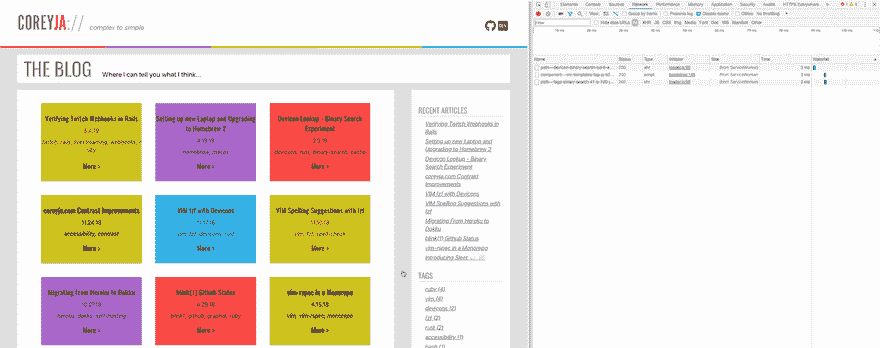

# 我把我的博客移植给了盖茨比🎉

> 原文：<https://dev.to/coreyja/i-ported-my-blog-to-gatsby-4l9d>

*最初发布在[coreyja.com](https://coreyja.com/ported-blog-to-gatsby/)(在那里你也可以看到这个盖茨比的网站！)*

几年来，我一直使用中间人 ruby 框架来构建我的静态博客网站。我最初选择中间人，因为它与 Rails 环境非常相似，我在这方面更有经验。这无疑帮助我快速起步！

但我会碰到中间人的一些粗糙的边缘。其中一个根本问题是，中间人是一个稍微老化的框架，社区支持开始有点缺乏。另一个大的相关缺点是 Javascript 依赖于链轮资产管道。由于 Javascript 社区使用了大量优秀的软件包，当您被绑定到资产管道时，您可能会失去使用这些开源软件的能力。

## 盖茨比很适合这些缺口

Gatsby 是一个围绕 React 和 GraphQL 构建的静态站点创建者，到目前为止我真的很喜欢它。《开箱即用的盖茨比》中有一些很棒的东西，但当你开始添加不同的插件时，它真的会大放异彩。我开始使用 [Gatsby 博客模板](https://github.com/gatsbyjs/gatsby-starter-blog)，它已经附带了一些插件设置和配置！

## 渐进式网络应用

我非常希望我的博客能够成为一个进步的网络应用。关于 PWA，我没有太多东西想用在我的博客上，但是有一个小特性对我来说非常重要，那就是在你的 web 清单中有一个主题颜色的能力，它允许移动浏览器对浏览器进行主题化，以匹配你的站点配色方案

Gatsby 让 PWA 所需的`manifest.json`设置变得非常简单，下面是我目前使用的配置:

```
{
    resolve: `gatsby-plugin-manifest`,
    options: {
        name: `Coreyja Blog`,
        short_name: `coreyja Blog`,
        start_url: `/`,
        background_color: `#aa66cc`,
        theme_color: `#aa66cc`,
        display: `minimal-ui`,
        icon: `content/assets/favicon.svg`
    }
} 
```

## 缓存和离线支持

这是我以前的博客上没有的 PWA 功能，当我发现我在《盖茨比》中几乎可以免费获得它时，我真的很兴奋！使用博客模板，我的博客已经设置好了，可以使用服务人员来缓存我的所有资产，并为已经缓存的页面添加离线支持。

我真的很兴奋能测试出来，同时注意到另一个很酷的特性！我在开发工具中玩了一会儿，意识到只要将鼠标悬停在我的博客卡上，就会触发下一页的网络请求。原来 Gatsby 在用户实际点击链接之前就预加载了链接，以使加载体验更快！

[](https://res.cloudinary.com/practicaldev/image/fetch/s--YTphaCAk--/c_limit%2Cf_auto%2Cfl_progressive%2Cq_66%2Cw_880/https://coreyja.com/preloading-bbda8b64404109881074c291bba2b69e.gif)

## 反应成分

有点令人惊讶的是，我已经写了这么久，甚至没有提到 React 组件！React 似乎像风暴一样席卷了整个世界，但我以前没有机会真正使用它。由于这是我现有博客的一个端口，我已经有了现有的页面样式和 HTML 结构，幸运的是这些已经被分解成组件了！

我真的很喜欢尝试反应世界！我知道我仅仅触及了表面，因为我的组件都不是非常具有交互性的。但是即使对于我非常简单的组件，我也喜欢 React 组件的编写和结构。

这有点与我习惯的模式相反，但是 React(通过 JSX)推动你混合你的风格、HTML 内容和 Javascript 功能。这个想法是，这三个组成了你的组件的整体，因此应该生活在一起！奇怪的是，使用 HTML `style`标签向我的站点添加样式是一种解放，而不用总是担心创建一个类来保存我想要添加的样式。我没有内联我的全部风格，所以我在 SCSS 的文件中保留了一些。然而，我使用了 CSS 模块的新概念来保持它们的独立性。最基本的想法是，你可以编写你的 css，使用任何对你最有意义的类，而不用担心名字冲突或特殊性战争。然后当你想使用这些样式时，你把你的 css 文件导入到你的 JSX 组件中，有一些幕后的魔法把一些唯一的标识符添加到你的 css 类中以防止它们相互冲突。我喜欢 css 的这种方法，因为它使我不必担心手动命名空间，因为这是由软件处理的。

## 包装完毕

这是一篇有点长的漫无边际的帖子，但是我想在我记忆犹新的时候写一些关于这个端口和迁移的东西！有相当多的话题我没有涉及到，比如在 Gatsby 中使用 GraphQL 有多酷，但是可以在一些后续的帖子中涉及到！

当我移植的时候，我确实丢失了一两个小的特性，但是更多的是因为我没有重新实现它们，而不是因为框架的限制或者其他什么！请继续关注未来关于这方面的帖子！