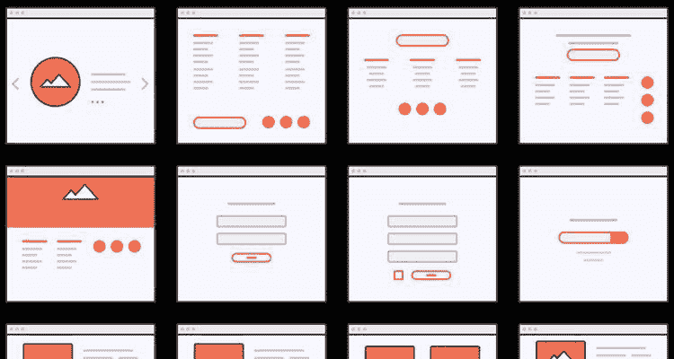
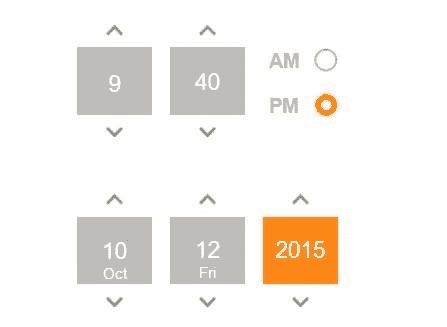
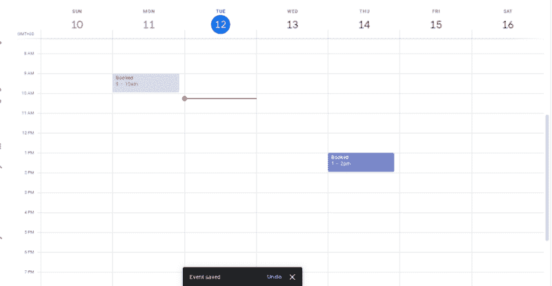

# 我低估了 UI/UX 设计师的责任

> 原文：<https://dev.to/eddymens/i-underestimated-the-responsibilities-of-uiux-designers-ick>

# 我低估了 UI/UX 设计师的责任

**我的初步看法**

很久以来，我一直认为 UI/UX 设计师的工作是确保产品外观整洁并尽可能提供最佳体验。这仍然是事实，但我
从未考虑过获得最佳效果所需的工作深度。

**一个恰当的例子**

我发现自己正在为一个应用程序的预订功能开发 API，我的大多数
工作都受到了该应用程序模型的影响，不像大多数预订都是
预先创建了可供用户选择的时间段，这是一种有
的开放和关闭时间，这意味着用户可以选择开放和关闭时间之间的任何
开始关闭时间。这个
在模型上被描绘成一个简单的时间选择器。对我来说，我只是继续
创建一个端点来接受预订，交叉检查以防止重叠，然后
继续。从前端的角度来看，事情并不完全好。你看，如果
用户被允许选择他们喜欢的时间，他们可能会在每次有重叠时收到
错误消息，直到他们最终选择了一个空闲时间
范围，这不是最好的体验。下一个最好的解决方案是用可用的时隙填充
时间选择器，这里的挑战是我们可能会以
滚动大量时隙结束。

**啊啊的时刻**

这让我思考，为什么这不能很好地到位，我的意思是作为一名
开发者，你唯一不得不跳过的时候是当你试图模仿
一些自然世界的场景，你知道像计算月经周期、
时区等等。有点不对劲。它花了一段时间，但它击中了我，这是
不是实现它的设计，这不是一个时间选择器的问题，
这是一个最好用类似显示日历的东西来解决的问题。所有
预定的时间都被展开并显示在日历上，这自然会显示出
未预定的时间段，然后用户可以选择空时间段。简单干净。

**最后的想法和我的新观点**

之后我一直在想的一件事是，如果我是一名 UI/UX 设计师，我该如何在项目进入实施阶段之前把它做好？我如何
学习这些东西？当然，对于上述情况，我会花时间
了解可用的输入以及何时最好地使用它们。但是 UI/UX 的其他
方面呢？有时候，知道最佳选择的唯一方法是
不仅要考虑配色方案、用户流，还要考虑
方面，如**数据流**和* *及时性。* *最常见的数据流形式
是空状态和数据溢出(何时分页)，那么
那么长的可用时间段列表呢，用户需要多长时间才能找到
最佳选择时间，或者服务器需要多长时间才能在
选择日期时返回完整的时间列表，以及如何避免返回列表的整个过程？
用数据填充设计或模拟揭示了许多可能被
忽略的东西，这些东西只有在实现过程中才会被发现，因为这通常是
测试数据通过产品的唯一时间。想象一下，在设计阶段忘记给电话号码添加国家代码，而在实现 SMS 时才意识到需要添加国家代码。

随着我不断思考，我越来越清楚，一个更好的用户界面/UX 应该考虑到应用程序从开发到成长的整个生命周期。沿途考虑快乐、悲伤、失败、成功的道路。仅仅通过颜色和产品流程来思考
是不够的。UI/UX
设计师的工作是在
实施之前通过想象将产品带入生活。这也是我从来没有深入思考过的事情，也许很多人已经知道了，但是我从来没有想过。