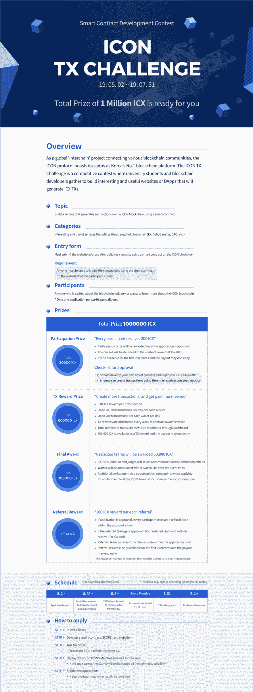

# [ICON]总奖金约为 40 万美元的 TX 挑战赛-区块链开发大赛

> 原文：<https://dev.to/ico_ndev/icon-about-400k-total-prize-tx-challenge-blockchain-development-contest-5b7l>

官方:[https://www.icondev.io/blog/icon-tx-challenge/?_icondev](https://www.icondev.io/blog/icon-tx-challenge/?_icondev)

## 面向全球参与者的公告

ICON 基金会举办 ICON TX(交易)挑战赛，旨在保护和支持区块链开发者，以改善区块链生态系统。

## 竞赛概述

作为一个连接各个区块链社区的全球“链间”项目，ICON protocol 利用著名的加密货币 ICX，成为朝鲜第一大区块链平台。ICON TX 挑战赛是一项竞赛，国内外大学生和区块链开发者齐聚一堂，构建网站或 DApps，生成 ICON TX。如果您对区块链技术和加密货币平台感兴趣，请参加“ICON TX 挑战赛”!

## 竞赛日程

1.  使用图标协议制定智能合同(分数)
2.  使用完成的分数开发生成 TXs 的服务(DApps 或网页)
3.  通过生成交易赢得交易奖励，通过改善 DApps 和服务赢得最终赢家奖励

## 谁应该参加

世界各地的未来区块链和加密货币专家

## 如何申请

1.  阅读图标活动页面上的竞赛详情和发展提示。
    *   常见问题:[https://docs . Google . com/spreadsheets/d/1 huc 91j 2 FCR 1 qkk 1 bas 7 imamtvbjuvjgtt-9 sstqp 5 em/edit # GID = 1609039611](https://docs.google.com/spreadsheets/d/1Huc91J2fcR1qKk1bas7iMaMtvBJuvjGtt-9SsTQp5eM/edit#gid=1609039611)
    *   电报频道:[https://t.me/icondevs](https://t.me/icondevs)

3.  使用 ICON 协议开发区块链智能合同(SCORE)。
    1.  使用 T 型熊开发
    2.  请求和接收测试 ICX
        *   测试 http://bit.ly/2vIwvJv[ICX](http://bit.ly/2vIwvJv)
    3.  使用测试 ICX 在测试网上测试分数
4.  传播和审核完成的分数
    *   如果审核通过，分数被分配到主网
    *   清单:[https://www.icondev.io/docs/audit-checklist](https://www.icondev.io/docs/audit-checklist)
5.  使用分数开发产生 TXs (TX)的服务(DApps 或网站)。
6.  通过输入审计分数(智能合同)地址、DApp/服务网页链接、服务简介(用户界面手册等)完成申请流程。)，您的姓名、电子邮件和联系方式。
    *   申请表:[https://docs . Google . com/forms/d/e/1 faipqlsehudr _ 899 l 9 naq 6 zpt 2y 96 BD 6-xjhte 2 WLM 8 xyx 8 gyyz 11kw/view form](https://docs.google.com/forms/d/e/1FAIpQLSeHUdr_899L9NaQ6zpt2y96BD6-xjHTE2wlM8XYx8gyyz11Kw/viewform)
7.  每天用分数生成 TX(TX)领取 TX 奖励，通过改进 DApps 或服务入选最终获奖团队。
    *   每支队伍最高可获得 60，000 ICX！(=参与奖+ TX 奖励+最终奖)
    *   包括参与奖、TX 奖和最终获奖者奖在内的所有奖励都将支付给合同所有者(合同部署的钱包)
    *   如果合同地址变更，请联系 support@iconloop.com

## 竞赛期

*   2019.05.02 开始申请
*   TX 计数从 2019.06.03 开始
*   申请和 TX 计数于 2019.07.31 结束

从 2019.05.02 开始接受申请，直至活动结束。

已完成申请的团队的 TX 奖励将于 2019 年 6 月 3 日开始。

## 奖励和福利

### 总奖金:100 万 ICX(约 40 万美元，价值可能会有变化)

### 50，000 ICX 参与奖

分数审核批准后确认参赛的每支队伍 200 ICX(适用于前 250 支队伍)

### 60 万 ICX TX 奖励

在活动期间，每 TX 支付 0.01 ICX，每天最高可达 20，000 TX

1.  TX 奖励每周发放，发放到个人钱包。
2.  每个钱包最多可接受 200 TX
3.  活动期间，每位参与者每天最多可获得 200 ICX
4.  每位参与者最多可获得 10，000 ICX = 200 ICX x 50 天(大约。事件持续时间)

### 30 万 ICX 终审奖

根据 ICON 基金会的评估标准，包括完整性、商业价值、技术性、区块链效用等，总共将选出 6 个团队。对 DApps 的评价将基于他们在比赛结束时的状态。

1.  活动结束后两周内完成获奖者的评选和颁奖
2.  被选中的 6 支队伍各获得 50，000 ICX
3.  额外福利:实习机会，申请 ICON 韩国办公室职位的额外加分，团队选择性投资机会

### 50，000 ICX 的竞赛贡献奖励将于稍后公布

### 注意

*   参与奖仅适用于前 250 支队伍，奖金可能提前结束高达 600，000 ICX 作为 TX 奖励，奖金可能提前结束
*   申请前，请查看活动网页通知中有关活动进度、奖励金额、奖励标准和规定的详细信息。

## 事件的目标

对于那些想要使用区块链技术实现他们的想法或体验新技术的人来说，存在技术和成本障碍，例如时间、TX 和服务器托管成本。因此，ICON Foundation 为您提供了一个绝佳的机会来验证您自己的 DApp 理念，并在大约两个月的时间里通过运营和技术支持学习新技术。主要目的是满足公众对区块链技术的需求，并让尽可能多的人体验 DApp 开发环境。此外，这将展示 ICON mainnet 的稳定性和 TX 处理性能。请保持关注，不要犹豫参与！

## 与发展有关的材料

### 开发材料:

*   开发者中心文档(英文):[https://www.icondev.io/docs](https://www.icondev.io/docs)
*   贾斯汀博客链接(英文):[https://www.icondev.io/page/tutorials](https://www.icondev.io/page/tutorials)
*   脸书集团教程(Youtube 和博客)(韩语):[https://www . Facebook . com/groups/divento icon/learning _ content/](https://www.facebook.com/groups/DiveintoICON/learning_content/)
*   视频教程(韩语):[https://www.youtube.com/icondevelopers](https://www.youtube.com/icondevelopers)

### 问题和答案:

*   开发者中心论坛(英语):[https://www.icondev.io/discuss](https://www.icondev.io/discuss)
*   https://www.facebook.com/groups/DiveintoICON/

## 申请和查询

*   登记表:[http://bit.ly/2PPARYx](http://bit.ly/2PPARYx)
*   询问:support@iconloop.com