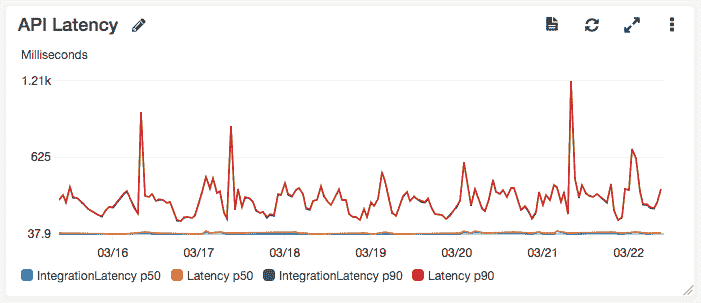

# 在单一 API 中识别服务边界

> 原文：<https://dev.to/paulswail/identifying-service-boundaries-in-a-monolithic-api-laa>

自从我[部署 API Gateway 作为我的遗留 API](https://winterwindsoftware.com/serverless-migration-journal-part3/) 的代理以来，已经过去了一个多星期。到目前为止，一切都很平静。😀

本周早些时候，我对我的 monolithic Express.js API 代码库进行了分析，目的是识别服务边界，以帮助我将相关的路由逻辑地分组到它们自己的服务中，并选择首先迁移有意义的服务。

下面列出了我在离散服务方面的想法。针对每个服务，我指定了该服务当前依赖的下游资源，以及它使用的任何特定的 MongoDB 集合(表)。

*特别感谢[崔琰](https://twitter.com/theburningmonk)这里是我非常倚重的[文章](https://blog.binaris.com/how-to-migrate-existing-monoliths-to-serverless/)和优秀的[生产就绪无服务器课程](https://bit.ly/production-ready-serverless)。*

### 认证

注册、登录、授权和用户档案管理。这些路由的实现使用 PassportJS，并且相对复杂。下游资源:MongoDB(集合:用户，会话)，邮戳。

### 客户账户管理

创建客户帐户，向帐户添加用户，更改帐户设置，关闭帐户。下游资源:MongoDB(集合:CustomerAccounts，Users)。

### 访客简介

记录访问者的活动，获取访问者的个人资料，给访问者附上注释。最终用户门户和现有的事件跟踪服务都使用它。下游资源:MongoDB(集合:访问者、通知)。

### 访客搜索

搜索访问者。下游资源:MongoDB(收藏:访问者)。

### 举报

针对特定帐户的按需/预定报告，针对 Mongo 运行查询并返回 JSON 或 HTML 响应。每周的活动邮件报告是这里的主要内容。下游资源:MongoDB(收藏:访问者)。

### 事件指标

在帐户仪表板页面中显示与访问者活动相关的汇总指标。这只是一个单一的`/all`路由，它调用现有的 Lambda 并执行 2 个 Mongo 计数查询。下游资源:现有的 Lambda(来自事件跟踪服务)、MongoDB(集合:访问者)。

### 活动通知(内部)

这有几个由 Lambda 轮询作业触发的路由。当前的实现从 MongoDB 获取通知记录，每当保存访问者配置文件时都会保存这些记录。然后，它为每个人生成电子邮件，并使用邮戳发送通知电子邮件。由于这是一个仅供内部使用的 API，而不需要 API 网关端点，这可能会完全重构，让访问者配置文件更新将事件推送到 SNS，然后 Lambda 处理程序被触发来发送电子邮件。下游资源:MongoDB(集合:通知，访客)，邮戳。

### 前端 UI

HTML-服务路线。虽然大部分前端是 AngularJS 单页面应用程序，但令人烦恼的是，有几个页面仍然使用 Express 中的服务器端渲染，我需要迁移到 Lambda 或更新前端，使这些页面也成为 SPA 的一部分。下游资源:MongoDB(集合:用户)

我还发现了几个已经废弃的 API 路径，可以直接终止。✂️

## 从哪里开始？

所以需要迁移的服务相当多。其中许多只有 1 或 2 条路线，但每条路线的复杂程度不同:一些是基本的 CRUD，而另一些则执行更复杂的编排。

我想从较简单的路线开始，这些路线风险相对较低，但仍然有很大的流量。检查完每一项后，我想从*事件度量*服务开始:

*   用户一打开门户网站的主页，它就会被大量点击。
*   它是只读的，所以我不需要担心损坏数据。
*   它目前使用 Redis Elasticache 来缓存结果，我认为我可以在这里很好地交换 API 网关缓存。

但是在我开始实施新的事件度量服务之前，我需要解决一些跨领域的问题:

1.  **测试和 CI/CD** —我希望每个新迁移的路由在部署到实际使用之前通过集成和验收测试。我计划用 AWS CodePipeline/CodeBuild 建立一个管道。
2.  **认证&授权** —几乎所有的 API 路由都要求调用者通过认证，并拥有特定账户的授权。这目前由 Express 应用程序中的中间件管理，它使用 MongoDB 中的 Users 表来存储用户配置文件和凭证。虽然我还不想将登录 API 路径迁移到 Lambda，但我确实需要一种方法来验证 API 请求中的 auth 令牌，并检查数据库中用户的授权级别。我有几个选择，可能是使用一个 [API 网关 Lambda 授权器](https://docs.aws.amazon.com/apigateway/latest/developerguide/apigateway-use-lambda-authorizer.html)，使用一个所有 Lambda 路由功能都可以使用的共享中间件库，或者甚至可能是这两种方法的组合。

我将在接下来的几篇文章中深入探讨这两个领域，敬请关注。

## 监控潜伏期

在结束之前，我想谈一谈我上周忽略的关于延迟的运营问题(感谢[凯尔·加尔布雷斯](https://twitter.com/kylegalbraith)为[指出了这一点](https://dev.to/kylegalbraith/comment/9hco))。具体来说，还没有迁移到 Lambda 的客户端 API 请求现在有了一个额外的网络跳转。以前，请求路径是:

*浏览器- > ELB(美东-1)——>EC2(美东-1)*

然而现在是:

*浏览器->API GW(edge)——>ELB(美东-1)——>EC2(美东-1)*

在 [serverless-aws-alerts 插件](https://github.com/ACloudGuru/serverless-plugin-aws-alerts)为我自动创建的 CloudWatch 仪表盘中，我可以看到所有通过 API 网关的请求的 p90 延迟。

我并不太担心这些延迟，但我确实希望改善它们，因为我用 Lambda 函数替换了对传统 ELB 的请求，并开始利用 API Gateway 的缓存功能。我的 API 网关实例是边缘优化的，这一事实将有所帮助，因为我的大多数客户都在西欧。(我最初选择在 us-east-1 建设基础设施，希望借此征服北美市场，现在看来有点愚蠢😞)

展望未来，虽然上图描述了聚合级别的延迟，但我希望看到每个迁移到 Lambda 的新端点的延迟和错误的更细粒度的每路径指标。为此，我将在迁移过程中试用[桑德拉](https://thundra.io/)，因为最近的一次演示给我留下了深刻的印象。

## 下一步

我接下来要做的是:

1.  放置 CI/CD 管道和测试框架，从开发->试运行->生产
2.  实施认证和授权中间件，并在虚拟路线上进行测试
3.  为我确定为第一个要迁移的微服务的事件度量路线实施 Lambda

一如既往，如果你对我的决定有任何问题或建议，我很乐意倾听。

✉️ *如果你想在这一系列准备就绪后尽快获得未来的更新，并且**访问我用来跟踪我在这个项目中执行的所有任务的 Trello 板**，你可以[在这里订阅](https://winterwindsoftware.com/serverless-migration-journal/#signup)。*

* * *

您还可能会喜欢:

*   [担心无服务器带走](https://winterwindsoftware.com/concerns-that-serverless-takes-away/)
*   [“无服务器”的不同定义](https://winterwindsoftware.com/serverless-definitions/)
*   [无服务器词汇表](https://winterwindsoftware.com/serverless-glossary/)

*原载于 winterwindsoftware.com*。