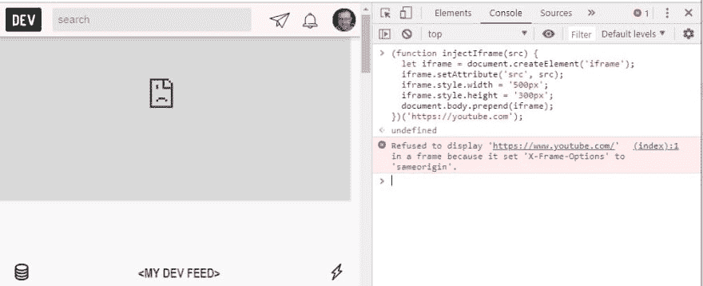
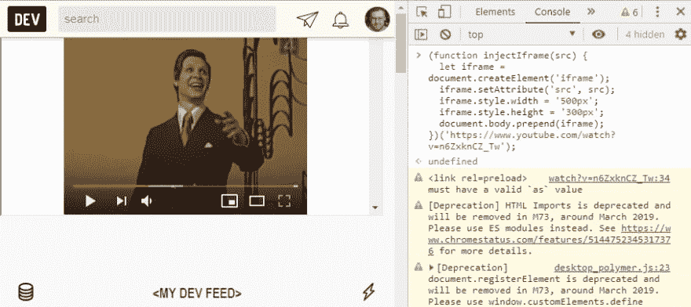

# iframe 无处不在

> 原文：<https://dev.to/karataev/iframes-everywhere-3dd3>

有多少次你在一个随机的网站上，想在当前的网站上看你最喜欢的 youtube 视频？我想这从未发生过😀。你刚刚打开了一个新标签，在浏览器的 url 输入中输入了 youtube。

但最近我开发了 chrome extension，并在当前打开的网站中通过 iframe 注入第三个网站时遇到了问题。

打开浏览器的开发工具，执行下面的代码:

```
(function injectIframe(src) {
  let iframe = document.createElement('iframe');
  iframe.setAttribute('src', src);
  iframe.style.width = '500px';
  iframe.style.height = '300px';
  document.body.prepend(iframe);
})('https://youtube.com'); 
```

Enter fullscreen mode Exit fullscreen mode

您的尝试将失败，并显示消息
`Refused to display 'https://www.youtube.com/' in a frame because it set 'X-Frame-Options' to 'sameorigin'.` 
[](https://res.cloudinary.com/practicaldev/image/fetch/s--V9WtjPKp--/c_limit%2Cf_auto%2Cfl_progressive%2Cq_auto%2Cw_880/https://thepracticaldev.s3.amazonaws.com/i/uiukwssaxmmgq00rqmca.jpg)

这是因为 youtube.com 将头`X-Frame-Options`设置为`sameorigin`，这阻止了在 iframe 中加载网站。YouTube 不想在其他网站上展示它的内容，这是一个合理的决定。

## 浏览器扩展拯救

但是有一种方法可以绕过这些安全限制。你将不得不使用一个浏览器扩展，它对客户机-服务器交互有更多的访问权限。扩展可以截取服务器的响应，修改它的头，并提供修改后的响应，而不限制浏览器的头。

我们将使用 [webRequest](https://developer.chrome.com/extensions/webRequest) API 来修改响应头。这里是扩展代码:

```
function stripHeaders(headers) {
  return headers.filter(header => {
    let headerName = header.name.toLowerCase();
    return !(headerName === 'content-security-policy' || headerName === 'x-frame-options');
  })
}

chrome.webRequest.onHeadersReceived.addListener(
  function(details) {
    return {
      responseHeaders: stripHeaders(details.responseHeaders)
    };
  }, {
    urls: ["<all_urls>"]
  }, ["blocking", "responseHeaders"]); 
```

Enter fullscreen mode Exit fullscreen mode

[这里的](https://github.com/karataev/iframes-welcome-extension)是想自己试试的话，带全扩展码的回购。

我们开始吧🌟
[T3】](https://res.cloudinary.com/practicaldev/image/fetch/s--WYoONiWh--/c_limit%2Cf_auto%2Cfl_progressive%2Cq_auto%2Cw_880/https://thepracticaldev.s3.amazonaws.com/i/yjqpv8rsonp063zgb38a.jpg)

与网站沙盒中的普通 javascript 相比，P.S .扩展具有超强的能力。明智地使用它们，不要安装扩展你不信任❗