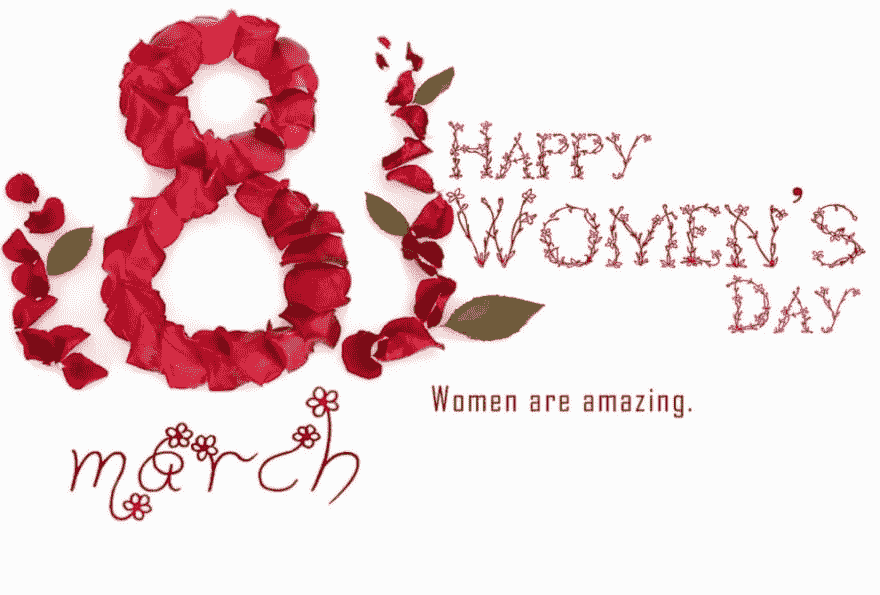

# 我是 Nguyen Quoc Tuan，一个越南开发者，我支持女性开发者。

> 原文：<https://dev.to/weekendnguyen/im-nguyen-quoc-tuan-a-vietnamese-developer-and-i-support-women-devs-5509>

## 我要倡导男女平等！

在成为开发者方面，女性也和男性一样伟大。在我的公司，我已经看到了很多优秀的女性开发人员。他们在处理我们项目中的问题时帮助了我很多，他们的指导和想法也很棒，很容易让我们了解。

## 我希望将来在技术社区和工作场所看到更多的女性开发者

在我的国家，许多人认为女性没有能力学习和成为一名开发者。他们通常告诉他们的女儿，开发人员是男人的工作，而不是女人的，只是男人应该做这样的工作。所以，我希望这些想法在不久的将来会改变。

## # shecodedaily #快乐#国际#妇女节