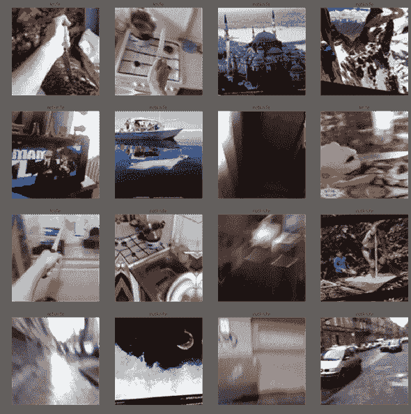
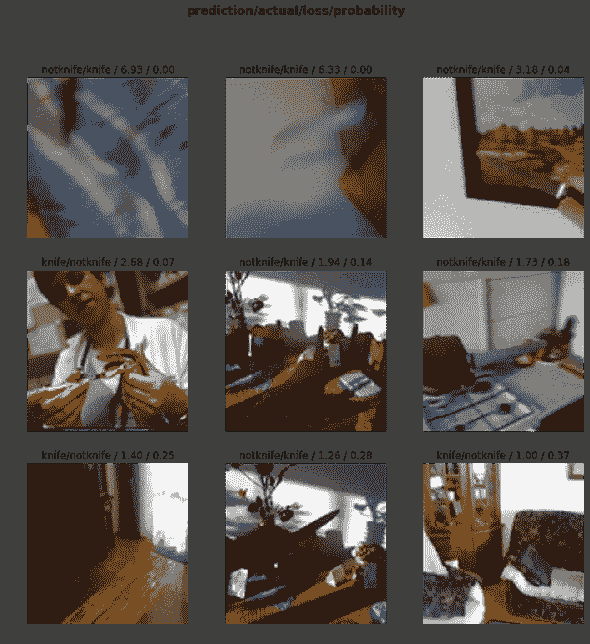
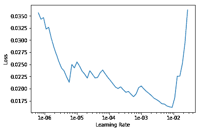

# 机器学习中的图像分类

> 原文：<https://dev.to/ruairidhwm/image-classification-in-machine-learning-36hi>

# 用人工智能识别刀具

为了一个有趣的挑战，我开始学习一点人工智能和机器学习。我一直在快速学习优秀的[。AI](https://www.fast.ai/) 课程。这是一系列免费带你从零到英雄学习机器的视频。

作为我学习过程的一部分，我想使用我自己的数据集。我花了几天时间来选择一个问题，但我的标准是:

*   免费提供的数据集
*   可以用于社会公益
*   对于我的第一次尝试来说并不过分复杂

因此，在搜索 Kaggle 和互联网寻找一个很酷的数据集后，我偶然发现了一个包含正面和负面例子的数据库。手里拿着我的数据集，是时候开始工作了！

## 社会好

不幸的是，持刀犯罪在英国是一个严重的问题。在截至 2018 年 3 月的一年中，英格兰和威尔士大约有[40100 起涉及刀具或利器的犯罪](https://researchbriefings.parliament.uk/ResearchBriefing/Summary/SN04304)。

我认为，通过能够识别图像中的刀具，可能会在犯罪检测和减少方面有潜在的应用，并将人工智能应用于一些社会公益。

## 法

### 数据结构化

首先，我整理了我的数据，并将我所有的图片放入一个文件夹中，命名模式为:

`knife_1.bmp` `notknife_1.bmp`

数字是连续的:所以刀 _1，刀 _2，等等。

## 跑步 Jupyter 笔记本

Jupyter 笔记本是运行这些数据集的事实上的工具，我没有偏离这一点。

首先，我将我的笔记本设置为自动更新，并加载了我的 FastAI 库:

```
!pip install --upgrade fastai
%reload_ext autoreload
%autoreload 2
%matplotlib inline
from fastai.vision import *
from fastai.metrics import error_rate 
```

接下来，我导入我的数据，以便我的模型可以轻松地访问它:

```
path = Path('/data/')
knives = fnames = get_image_files(path)
print(knives[:5]) 
```

我打印了五个文件名，以检查它们是否被有效地导入:

```
[PosixPath('/data/notknife_3198.bmp'), PosixPath('/data/notknife_2790.bmp'), PosixPath('/data/notknife_2296.bmp'), PosixPath('/data/notknife_8269.bmp'), PosixPath('/data/notknife_5795.bmp')] 
```

接下来，我创建了一个正则表达式模式，从我们的每个文件名中获取标签，以便能够将它们分类为刀或者不是刀:

```
pat = r'/([^/]+)_\d+.bmp$' 
```

然后我利用 FastAI 的一个功能，将我们的图像以一种适合计算机视觉的格式捆绑在一起:

```
data = (ImageDataBunch
        .from_name_re(path,
                      knives,
                      pat,
                      ds_tfms=get_transforms(),
                      size=224,
                      bs=64)
    .normalize(imagenet_stats)) 
```

正如你在上面看到的，我们有访问数据的路径，我们的训练集是以`knives`的形式，然后我们通过应用我们的正则表达式来确保它们是有效的，我们将图像的大小调整为统一的 224(乘数为 7，这对于后面的 RestNet 数据来说是最佳的)，然后我们将数据集归一化。

为了检查这一切是否如我们所料，我输出了 4 行图像以及两个预期的标签:`knife, notknife` :

```
data.show_batch(rows=4)
print(data.classes) 
```

作为输出，我得到以下内容:

[](///static/69992fa808771be822b2fb5a553b3ffc/4a38b/output_1.png)

太好了，我得到了我想要的图像，并且它们被正确地标记了。现在是时候开始训练我的模型了。

## 训练模型

为此，我使用卷积神经网络或 CNN，并针对 resnet50 进行训练，正如其名称所暗示的那样，resnet 50 是一个 50 层残差网络。这使得我们可以使用迁移学习，即利用存储在一个模型中的知识，并将其应用到另一个模型中。本质上，这是我们模型的起点。

使用快速。AI 这个极其简单:

```
learn = create_cnn(data, models.resnet50, metrics=error_rate)
learn.fit_one_cycle(4)
learn.save('knives-stage-1') 
```

正如您在上面看到的，我们正在创建 CNN，从我们提供的数据和从 resnet 推断的模型中创建一个学习者对象。我们使用不同的学习率来训练模型。

一旦完成，这可能需要一段时间！我们最终会得到这样的结果:

| 世 | 火车 _ 损失 | 有效 _ 损失 | 错误率 |
| --- | --- | --- | --- |
| one | 0.158432 | 0.063633 | 0.020894 |
| Two | 0.020894 | 0.034570 | 0.012119 |
| three | 0.040913 | 0.019557 | 0.006268 |
| four | 0.025303 | 0.017205 | 0.005433 |

如你所见，我们从较高的错误率开始，逐渐将其从 98%的准确率降低到 99.5%。

所以这已经很棒了！但是我们能做得更好吗？让我们找出我们的模型在哪里变得混乱。

## 识别模型错误

```
interp = ClassificationInterpretation.from_learner(learn)
interp.plot_top_losses(9) 
```

通过运行上面的程序，我要求 FastAI 解释结果并显示前 9 个不正确的猜测，返回结果如下:

[](///static/7f1eddde08ccec14aae393b2c29a39f2/caaab/incorrect_first.png)

嗯。所以用我们人类的眼睛看它是有意义的。这个女人对付蛇的工具看起来很像一把刀，右上角的图像对比度很差，所以很难识别刀刃。

很好，那么让我们找出错误率开始上升的地方，看看我们是否可以改进:

```
learn.lr_find()
learn.recorder.plot() 
```

这将呈现以下图表:

[](///static/a12bde094637db5efb74a8cc521f07a9/276eb/learning_chart.png)

因此，在错误率再次达到峰值之前，我们可以看到图表右侧有一个强烈的下降，因此，让我们校准我们的模型，以使用从下降顶部开始到结束之间的数据。

```
learn.fit_one_cycle(10, max_lr=slice(1e-03,1e-02))
learn.save('knives-stage-2') 
```

在这里，我们运行十个周期(或时期)的训练，并对数据进行切片以符合上述图表。

然后，我们会收到以下内容:

| 世 | 火车 _ 损失 | 有效 _ 损失 | 错误率 |
| --- | --- | --- | --- |
| one | 0.031050 | 0.018738 | 0.005433 |
| Two | 0.029380 | 0.040244 | 0.009611 |
| three | 0.040095 | 0.028016 | 0.005015 |
| four | 0.027003 | 0.022205 | 0.004597 |
| five | 0.025842 | 0.010071 | 0.001672 |
| six | 0.024286 | 0.039495 | 0.009193 |
| seven | 0.012359 | 0.008150 | 0.002507 |
| eight | 0.004851 | 0.006673 | 0.001254 |
| nine | 0.003144 | 0.005253 | 0.001672 |
| Ten | 0.002792 | 0.004225 | 0.001672 |

因此，我们可以看到第二遍的错误率低得多，并且在最后会有一组特别好的结果。训练完成时，我们已经达到了惊人的 *99.84%* 准确率！

下一步，我将把这个模型封装在一个 API 中，这样你就可以上传图片，并可靠地获知是否有刀。我可以想象这对于执法或安全特别有用，但这里使用的技术可以很容易地应用于任何主题。

## 结论

希望你会发现这是一篇信息丰富的阅读，并尝试使用相同的技术来生成自己的计算机视觉应用程序。

这是我第一次深入研究这项技术，所以我确信在我的过程或解释中会有错误。如果您发现任何问题或认为有进一步改进的方法，请联系我们。我很想听听！