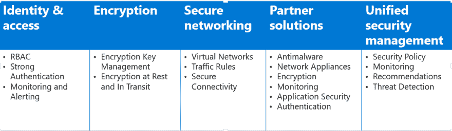
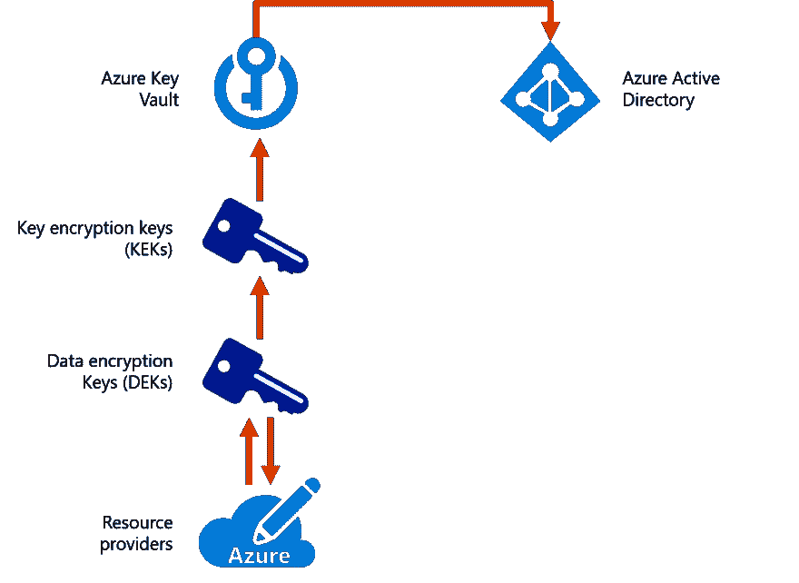

# 实施安全数据解决方案

> 原文：<https://dev.to/cheahengsoon/implement-secure-data-solutions-341g>

**Azure 安全频谱**

**加密**

*   加密将纯文本数据(明文)转换成看似随机且无意义的东西(密文)的过程

*   解密
    将密文转换回明文的过程

*   对称加密用于加密大量数据

    *   对称密钥用于加密数据
    *   必须使用相同的密钥来解密数据

**静态加密**

*   数据持久化时的加密(或编码)
    *   非常常见的安全需求是在数据保存到磁盘时随时使用秘密加密密钥对数据进行加密
*   当攻击者对服务器的机器、存储或驱动器拥有完全访问权限时，可防止他们访问敏感数据
*   Azure 中的静态加密设计使用对称加密:
    *   对称加密密钥用于在数据写入存储时对其进行加密
    *   当数据准备在存储器中使用时，使用相同的加密密钥来解密该数据
    *   数据可以被分区，并且不同的密钥可以用于每个分区
    *   密钥存储在具有访问控制策略的安全增强位置
    *   数据加密密钥通常使用非对称加密进行加密，以进一步限制访问

【Azure 服务的静态加密

*   Azure 存储
    *   所有存储服务(Blob、队列、表、文件)的数据都在服务器端自动加密
    *   密钥由服务管理
*   Azure SQL 数据库
    *   默认情况下，所有新数据库都启用透明数据加密(TDE)
    *   在 Azure 密钥库中支持客户管理的 2048 位密钥
*   天蓝色宇宙数据库
    *   备份和媒体附件存储在 Blob 存储中
    *   固态硬盘上的数据库会自动加密