# 逐步实现模型:CSS 布局

> 原文：<https://dev.to/dceddia/implementing-a-mockup-css-layout-step-by-step-3ag0>

[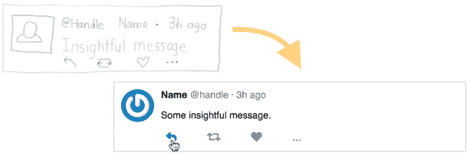](https://res.cloudinary.com/practicaldev/image/fetch/s--i5PFxfVI--/c_limit%2Cf_auto%2Cfl_progressive%2Cq_auto%2Cw_880/https://daveceddia.cimg/css-layout-header.png)

对于很多人来说，创建布局是前端开发中最难的部分之一。

你可以花*个小时*尝试随机的 CSS 属性，从堆栈溢出中复制粘贴，并希望偶然发现那个*神奇的组合*会产生你想要的布局。

如果你通常的策略是以逐项的方式进行布局——把 A 放在这里的*上，现在 A 在它的位置上，我想把 B 放在那里的*上……嗯，这是一条注定失败的路线。CSS 的工作原理不像 Sketch 或者 Photoshop。**

 **在这篇文章中，我想向你展示一种整体布局的方法，这是一个需要解决的内聚性问题。

我们将从头到尾看一个小例子，我会一路解释所有的 CSS 所以即使你不知道或不记得`position`和`display`是如何工作的，或者你分不清`align-items`和`justify-content`，你也会从中有所收获。

我们还将在这里使用普通的 HTML 和 CSS，所以你不需要了解任何关于 React/Vue/Angular/CSS-in-JS 甚至 JavaScript 的知识。

听起来不错吧？让我们开始吧。

## 一个小的布局例子

在这篇文章中，我们将复制一些看起来像推文的东西:

[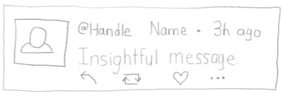](https://res.cloudinary.com/practicaldev/image/fetch/s--Rdql3UzX--/c_limit%2Cf_auto%2Cfl_progressive%2Cq_auto%2Cw_880/https://daveceddia.cimg/tweet-sketch.jpg)

无论你是从这样的草图开始，还是从一个像素完美的模型开始，有一些东西开始都是一个好主意。

当你在头脑中设计 CSS 布局的同时，不试图在浏览器中胡乱拼凑时，它会进行得更顺利。你绝对*能*达到那个水平！但是如果你正在读这篇文章，我会假设你还没有到*:)*

 *## 第一步:识别棋子

在我们编写任何 HTML 或 CSS 之前，我们将突出显示这个布局的各个部分:

[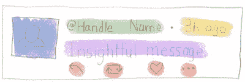](https://res.cloudinary.com/practicaldev/image/fetch/s--Scw2f3f2--/c_limit%2Cf_auto%2Cfl_progressive%2Cq_auto%2Cw_880/https://daveceddia.cimg/tweet-highlighted.jpg)

当用 CSS 布局时，我发现按照行和列来考虑很有帮助。所以你要么让元素在页面上一个接一个地向下排列，要么让一系列元素从左到右排列。从行和列的角度考虑，可以很好地映射到 CSS 给我们的两种布局技术:Flexbox 和 Grid。

不过，这种布局看起来并不像行和列。左边有一张图片，右边是一堆乱七八糟的东西。

## 第二步:在东西周围画方框

让我们在元素周围画一些方框，看看我们是否能把它变成一些行和列的外观。我们将在流向相同的部分周围放置方框。

[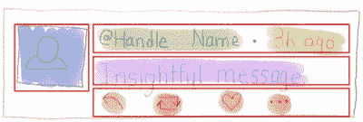](https://res.cloudinary.com/practicaldev/image/fetch/s--HyMfqXbw--/c_limit%2Cf_auto%2Cfl_progressive%2Cq_auto%2Cw_880/https://daveceddia.cimg/tweet-first-level-layout-boxes.jpg)

你用 HTML 放在页面上的每个元素基本上都是矩形。当然，有时它们有圆角，或者它们是圆形，或者奇异的 SVG 形状……通常你不会真的*看到页面上的*一堆矩形。但是你可以在一个物体周围画一个边界框。所以把所有东西想象成长方形会有帮助。

我提到矩形是因为如果你有一组需要对齐的项目——比如第一行有名称/@handle/Time 或者最后一行有图标——你可以出于样式的目的将它们放在一个盒子里，这样更容易排列它们。

如果我们在这里停下来，用 HTML 编码，我们会得到这样的结果:

```
<article>
  
  <div>
    <span>@handle</span>
    <span>Name</span>
    <span>3h ago</span>
  </div>
  <p>
    Some insightful message.
  </p>
  <ul>
    <li><button>Reply</button></li>
    <li><button>Retweet</button></li>
    <li><button>Like</button></li>
    <li><button>...</button></li>
  </ul>
</article> 
```

你会看到这样的东西(这里有一个[沙箱](https://codesandbox.io/embed/wo6wvvynlw)):

[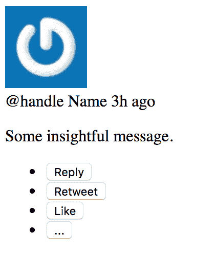](https://res.cloudinary.com/practicaldev/image/fetch/s--hs40kjjw--/c_limit%2Cf_auto%2Cfl_progressive%2Cq_auto%2Cw_880/https://daveceddia.cimg/tweet-default-layout.png)

…这与我们想要的相差甚远。但是！所有的内容都在那里。一些元素群甚至朝着正确的方向流动。

你可以这样做，这种布局甚至在没有进一步样式化的情况下也能表达重点，这是 HTML 的一个很好的目标。

### 关于语义 HTML 的一个注记

你可能想知道为什么我选择了那些特殊的元素——`article`、`p`等等。为什么不把一切都变成`div`？

为什么会这样…

```
<article>
  
  <div>
    <span/>
    <span/>
    <span/>
  </div>
  <p> ... </p>
  <ul>
    <li>
      <button> ... </button>
    </li>
  </ul>
</article> 
```

而不是这个？

```
<div>
  
  <div>
    <div/>
    <div/>
    <div/>
  </div>
  <div> ... </div>
  <div>
    <button> ... </button>
  </div>
</div> 
```

嗯，HTML 元素的名称实际上是有意义的，使用语义上与它们所代表的事物相匹配的元素是一个好主意。

这对人类有好处，就像程序员试图破译代码，而观众使用辅助技术，如屏幕阅读器。这对搜索引擎也有好处，他们正试图破译页面*的含义*，这样他们就可以~~展示相关广告，并通过帮助搜索者找到他们想要的东西~~赚一大笔钱。

标签代表一种类似文章的东西，如果你足够仔细地看，一条推文有点像一篇文章。

一个`p`标签代表一个段落，tweet 的文本有点像一个段落。

`ul`标签表示一个无序的列表(与有序的或编号的列表相反)，在这种情况下，它保存了一个您可以采取的行动的列表。

HTML 元素的语义以及在特定情况下使用哪些特定的元素……并不简单。但是在大多数情况下，一个语义元素——即使是一个关系非常松散的元素——也比仅仅表示“一个划分”的`div`要好。

### 元素的默认样式

是什么让它看起来是这样的？为什么有些元素在自己的行上，而有些元素并排出现？

[](https://res.cloudinary.com/practicaldev/image/fetch/s--hs40kjjw--/c_limit%2Cf_auto%2Cfl_progressive%2Cq_auto%2Cw_880/https://daveceddia.cimg/tweet-default-layout.png)

这是因为应用于元素的*默认样式*而发生的，它将我们带到 CSS 知识的第一点:*内联*与*块*元素。

**内联元素**将在一行中相互挤压(如果需要，还会换行，就像句子中的单词一样)。根据默认的浏览器样式，A `span`、a `button`和 a`img`都是行内元素。

**块状元素**则喜欢独来独往。就控制台输出而言，您可以认为 block 元素前后都有一个`\n`换行符。就像一个`console.log("\ndiv\n")`。`article`、`div`、`li`、`ul`和`p`标签是块级元素。

在上面的例子中，注意头像是如何在它自己的行上的，即使`img`标签是内联的？那是因为它下面的`div`是块元素。

然后，注意@句柄、名称和时间都在一行上。这是因为它们在`span`标签内，这些标签是内联的。

这三个在“有见地的消息”之外的单独一行，因为(a)它们在一个`div`中，后面会有一个换行符，以及(b)标签`p`是*也是*一个块元素，所以它也会强制一个换行符。(尽管你看不到两个换行符，原因和 HTML 合并相邻空格的原因一样)。

如果你仔细观察，你会注意到“有见地的信息”上下的空间比头像和它下面的手柄/名字/时间之间的空间*大*。这个空间也由默认样式控制:`p`标签有顶部和底部的**边距**。

您还会注意到按钮列表上的项目符号，并且项目符号列表是缩进的。这也是默认的样式。我们一会儿就把它关掉。

## 第三步:更多盒子

我们希望将头像图像安排在左边，其他的都放在右边。鉴于您对内联元素和块元素的了解，您可能会认为您可以像`span`一样将右侧的内容包装在内联元素中。

不过，这没用。内联元素不会阻止其内部的块元素换行。

为了按照我们想要的方式排列元素，我们需要更强大的东西，比如 Flexbox 或 Grid layout。我们将使用 flexbox 解决这个问题。

### Flexbox 的工作原理

CSS“flex”布局可以将项目排列成行*或*列。这是一个一维布局系统。为了有交替的行和列(就像在我们的 tweet 设计中)，我们需要添加一些包装器元素来翻转方向。

[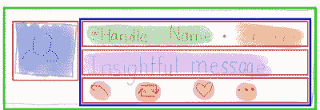](https://res.cloudinary.com/practicaldev/image/fetch/s--6aodLOvK--/c_limit%2Cf_auto%2Cfl_progressive%2Cq_auto%2Cw_880/https://daveceddia.cimg/tweet-all-layout-boxes.jpg)

您可以通过设置属性`display: flex;`来打开容器的 flex 布局。容器本身将会是一个块级元素(所以它会有自己的行)，容器内的元素*将会变成“flex items”——这意味着它们不再是内联的或者块的；它们由 flex 容器控制。*

 *在我们的例子中，我们将有几个相互嵌套的 flex 容器，这样我们可以将它们中的一些排列成行，一些排列成列。

我们将外部包装(绿色框)排列成列，然后蓝色框将被排列成行，每个红色框将再次成为列。

[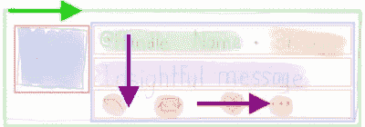](https://res.cloudinary.com/practicaldev/image/fetch/s--tX0E05BW--/c_limit%2Cf_auto%2Cfl_progressive%2Cq_auto%2Cw_880/https://daveceddia.cimg/tweet-layout-arrows.jpg)

### 为什么是 Flexbox 而不是 Grid？

我在这里使用 flexbox 而不是 CSS Grid 有几个原因。我认为 flexbox 更容易学习，而且比 grid 更适合小型布局。Flexbox 特别适合于那些*主要是行*或者*主要是列*的布局。

另一件需要知道的重要事情是，即使 Grid 比 Flexbox 更新，Grid 也不会取代 Flexbox。它们都非常适合不同类型的布局，了解这两种布局是有好处的。在某些布局中，你甚至可以同时使用两者——比如，Grid 用于布局页面，Flexbox 用于页面中的联系人表单。

我知道，我知道……在网络开发的其他领域,“新的热点”总是取代“旧的和失败的”,但是 CSS 不是这样工作的。Flexbox 和 Grid 愉快地共存。

用 CSS 解决问题通常不止一种方法！

### 步骤四:应用 Flexbox

好了，现在我们有了一个计划，让我们应用一些风格。我已经将左侧的内容包装在一个`div`中，并为大多数元素赋予了一个`class`以使它们更容易被 CSS 锁定。

```
<article class="tweet">
  
  <div class="content">
    <div class="author-meta">
      <span class="handle">@handle</span>
      <span class="name">Name</span>
      <span class="time">3h ago</span>
    </div>
    <p>
      Some insightful message.
    </p>
    <ul class="actions">
      <li><button>Reply</button></li>
      <li><button>Retweet</button></li>
      <li><button>Like</button></li>
      <li><button>...</button></li>
    </ul>
  </div>
</article> 
```

([这里是代码沙箱](https://codesandbox.io/s/0y98qov0rn))

视觉上看还是老样子。

[](https://res.cloudinary.com/practicaldev/image/fetch/s--hs40kjjw--/c_limit%2Cf_auto%2Cfl_progressive%2Cq_auto%2Cw_880/https://daveceddia.cimg/tweet-default-layout.png)

这是因为`div`除了是块元素(如果没有的话引入一个换行符)之外，在其他方面是不可见的。当您需要包含其他元素的东西，并且没有更语义化的选项时，`div`是一个很好的包装器。

这是我们的第一个 CSS 代码，我们将它放在文档的`head`标签内的`style`标签中:

```
.tweet {
  display: flex;
} 
```

这是朝着正确方向迈出的一步！我们使用一个**类选择器**来定位*所有元素*和`tweet`类。我们只有一个这样的元素，但是如果我们有十个，它们现在都是 flex 容器了。

CSS 中的前导`.`意味着它是一个类选择器。为什么是一个`.`？我不知道。你只需要记住这一点。

[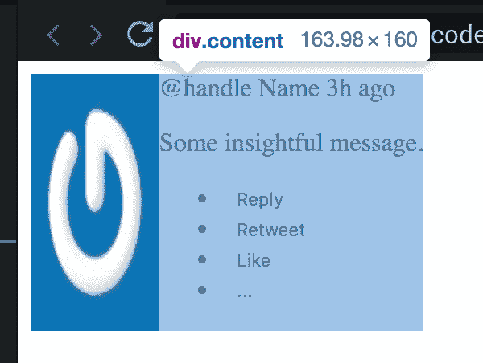](https://res.cloudinary.com/practicaldev/image/fetch/s--brwm_taj--/c_limit%2Cf_auto%2Cfl_progressive%2Cq_auto%2Cw_880/https://daveceddia.cimg/tweet-display-flex.png)

现在内容在头像的右边……但是图像扭曲得很奇怪。

这是因为，默认情况下，flex 容器将:

*   并排排列其项目
*   使它们仅与它们包含的内容一样宽，并且
*   根据最高的一个设置他们所有的高度。

我们可以用`align-items`属性控制它们的垂直对齐。

```
.tweet {
  display: flex;
  align-items: flex-start;
} 
```

默认的`align-items`是`stretch`，但是设置为`flex-start`会把它们推到顶部，*和*会让项目控制它们自己的高度。

### 方向:行还是列？

顺便说一下，flex 容器的默认方向是`flex-direction: row;`。是的，它被称为“行”，尽管，取决于你如何看待它，你可能倾向于称之为 2 列。相反，把它想象成一排*并排的*物品，这样会更有意义。

有点像这幅花瓶的图片。或者两张脸。随便啦。

[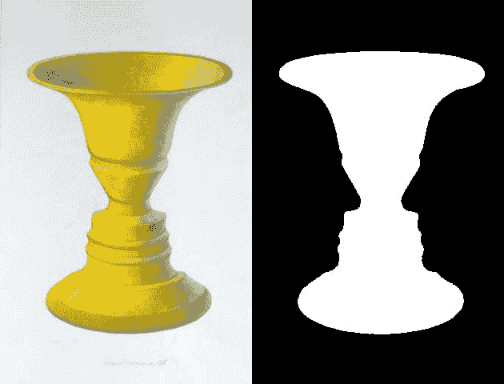](https://res.cloudinary.com/practicaldev/image/fetch/s--51ZLGAHm--/c_limit%2Cf_auto%2Cfl_progressive%2Cq_auto%2Cw_880/https://daveceddia.cimg/Rubins-vase.jpg) 
[百科](https://en.wikipedia.org/wiki/Rubin_vase)

### 内容要多占空间

flex 项目只占据它们需要的水平空间，但是我们希望`content`区域占据尽可能多的宽度。

为此，我们将对`content` div 应用`flex: 1;`属性。(因为它有一个类，我们将使用另一个类选择器！)

```
.content {
  flex: 1;
} 
```

我们还会在头像和内容之间添加一些空间，给头像一点空白:

```
.avatar {
  margin-right: 10px;
} 
```

[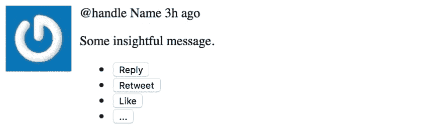](https://res.cloudinary.com/practicaldev/image/fetch/s--62CVR8Bi--/c_limit%2Cf_auto%2Cfl_progressive%2Cq_auto%2Cw_880/https://daveceddia.cimg/tweet-with-avatar-margin.png)

看起来好一点了！

### 边距与填充

那么…为什么是`margin`而不是`padding`？为什么把它放在头像的右边，而不是内容的左边？

一般来说:把页边距放在右边和底部，而不是左边和顶部。

至少对于像英文这样的布局，东西是从右到左、从上到下流动的，所以在某种意义上，每个元素都“依赖于”它左边的元素，或者它上面的元素。

在 CSS 中，每一项的位置都会受到它“之前”的位置的影响。(至少在你开始跟`position: absolute`和朋友乱搞之前)

### 分离顾虑

从技术上讲，在这种情况下，我们在哪里&如何放置`avatar`和`content`之间的间隙并不重要。空间就是空间，没有国界可以干涉(`padding`进入国界之内；`margin`走到外面)。

但是就可维护性而言，就你如何从组织的角度考虑这些元素而言，这确实很重要。

我试着把每个元素看作一个独立的东西，就像拥有一个只做一件事的 JavaScript 函数一样:如果每件事只有一项工作要做，那么编写代码就更容易，出错时调试也更容易。

如果我们在`content`的左边增加了页边空白，然后有一天决定删除`avatar`，我们就会剩下那个空间。我们必须找出是什么造成了额外的空间(周围的`tweet`？那`content`？)并摆脱它。

或者，如果`content`有左边距，我们决定用一些*其他*的东西替换`content`，我们需要记住*把空格加回*到任何取代它的地方。

好吧，关于 10 像素说了很多。将页边距放在右边和底部。让我们回到造型上来。

### 删除列表样式

`ul`无序列表和里面的`li`列表条目在左边有一堆空格和项目符号。我们不想要这些。

无序列表有很多我们可以关闭的左填充。让我们也让它成为一个 flex 容器，这样按钮将并排排列(在一行中，记住…默认情况下用`flex-direction: row`)

列表项有一个显示项目符号的`disc`的`list-style-type`，我们可以通过设置`list-style: none;`来关闭它(`list-style`是一个*速记属性*，它同时设置多个其他属性，包括`list-style-type`)。

```
.actions {
  display: flex;
  padding: 0;
}
.actions li {
  list-style: none;
} 
```

[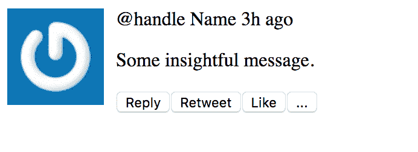](https://res.cloudinary.com/practicaldev/image/fetch/s--CEtbVKJo--/c_limit%2Cf_auto%2Cfl_progressive%2Cq_auto%2Cw_880/https://daveceddia.cimg/tweet-actions-display-flex.png)

`.actions`选择器只是另一个类选择器。那里没什么特别的。

然而，`.actions li`选择器说“所有的`li`元素*都在具有类`actions`的*元素内”。它是一个类选择器(`.actions`)和一个元素选择器(`li`)的组合。

用这样的空格分隔选择符*可以缩小每个选择符的选择范围*。CSS 实际上以相反的顺序读取选择器。它会“找到页面上所有的`li`”然后“现在只把目标放在类为`actions`的元素中的`li`”。你可以用任何一种方式考虑它，你会得到同样的结果。(在 StackOverflow 上有更多关于其背后的推理

### 摊开按钮

我们可以用几种方式展开按钮。

一种是通过设置伸缩项的*对齐方式*。您可能对几乎所有富文本编辑器顶部的这些按钮都很熟悉:

[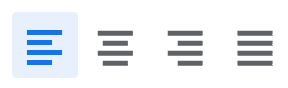](https://res.cloudinary.com/practicaldev/image/fetch/s--fCXXj3Ws--/c_limit%2Cf_auto%2Cfl_progressive%2Cq_auto%2Cw_880/https://daveceddia.cimg/justify-buttons.png)

它们将文档中的内容左对齐、居中对齐、右对齐或全角对齐。

在 flexbox 中，你可以用`justify-content`属性来做这件事。当你在`flex-direction: row`(默认设置，也是我们目前使用的设置)时，`justify-content`会左右移动项目。默认为`flex-start`(所以所有东西都挤到左边)。如果我们将`justify-content: space-between`设置在`.actions`上，它会将它们均匀分布在整个宽度上，就像这样:

[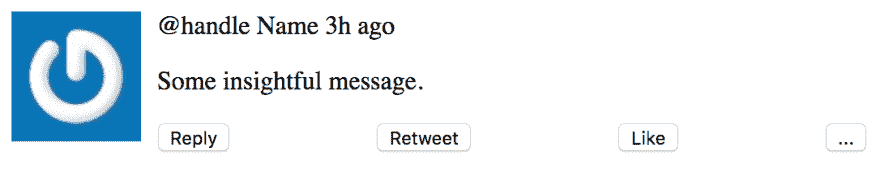](https://res.cloudinary.com/practicaldev/image/fetch/s--ysp4Y0oZ--/c_limit%2Cf_auto%2Cfl_progressive%2Cq_auto%2Cw_880/https://daveceddia.cimg/tweet-justify-content-space-between.png)

然而，这并不是我们想要的。如果它们不横跨整个宽度会更好。所以把那个拿出来。

相反，我们可以对每个列表项应用右边距来隔开它们。让我们也给整个推文一个边界，这样我们就可以知道发生了什么。`1px solid #ccc`将使其宽度为 1 个像素，为实线(而不是虚线)和灰色。

```
.tweet {
  display: flex;
  align-items: flex-start;
  border: 1px solid #ccc;
}
.actions li {
  list-style: none;
  margin-right: 30px;
} 
```

现在看起来是这样的:

[](https://res.cloudinary.com/practicaldev/image/fetch/s--50EFrPXs--/c_limit%2Cf_auto%2Cfl_progressive%2Cq_auto%2Cw_880/https://daveceddia.cimg/tweet-bordered-buttons-spaced.png)

按钮看起来更好，但是边框强调了这样一个事实:所有东西都紧靠着那个`tweet`容器的边缘。我们用`padding`给它留点空间吧。

```
.tweet {
  display: flex;
  align-items: flex-start;
  border: 1px solid #ccc;
  padding: 10px;
} 
```

现在推文有了一些填充，但也有一些额外的空间来自某处。如果我们在浏览器的开发者工具中突出显示这些元素，您会注意到`p`和`ul`元素上下的边距(在 Chrome devtools 中，边距为橙色，填充为绿色):

[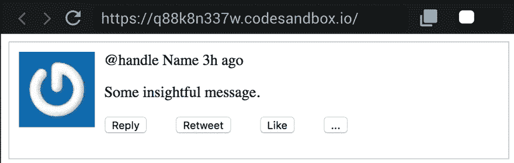](https://res.cloudinary.com/practicaldev/image/fetch/s--4auJh5FI--/c_limit%2Cf_auto%2Cfl_progressive%2Cq_66%2Cw_880/https://daveceddia.cimg/tweet-showing-padding.gif)

有趣的是，上下两行之间的页边距*是一样的——没有对折！这是因为 CSS **垂直折叠边距**。当两个边缘像这样上下接触时，较大的一个获胜。阅读更多关于[在 CSS-Tricks](https://css-tricks.com/what-you-should-know-about-collapsing-margins/) 的利润率下降。*

对于这个布局，我将手动更改右边三个元素的边距:`.author-meta`、`p`和`ul`。对于一个真实的网站布局，你可以考虑引入一个 [CSS 重置](https://bitsofco.de/a-look-at-css-resets-in-2018/)，给你一个跨不同浏览器的公共起点。

```
p, ul {
  margin: 0;
}
.author-meta, p {
  margin-bottom: 1em;
} 
```

用逗号`,`分隔选择器是一种将一组属性同时应用于多个选择器的方法。所以`p, ul`表示“所有的`p`元素，以及所有的`ul`元素”。这是两者的结合。

我们在这里还使用了一个新的单元，即`1em`中的`em`。一个`em`等于以像素为单位的正文字体大小。默认的字体大小是`16px` (16 像素高)，所以在我们的例子中是`1em == 16px`。随着字体大小的改变，`em`的比例也随之改变，所以`1em`是一种很好的方式来表达“我希望文本下面的边距与文本一样高，不管它是什么。”

现在我们有了这个:

[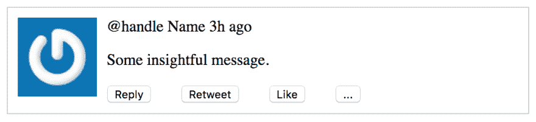](https://res.cloudinary.com/practicaldev/image/fetch/s--HWMYK7z7--/c_limit%2Cf_auto%2Cfl_progressive%2Cq_auto%2Cw_880/https://daveceddia.cimg/tweet-margins-fixed.png)

现在让我们把图像缩小一点，把它变成一个圆形。我们将它设为 48px，和 Twitter 使用的大小一样。

```
.avatar {
  margin-right: 10px;
  width: 48px;
  border-radius: 50%;
} 
```

属性让我们把盒子的角变圆，有几种方法可以指定它的值。如果你想要一个小半径，你可以在`px`或`em`或其他单位中给它一个数字。下面是`border-radius: 5px`的例子:

[](https://res.cloudinary.com/practicaldev/image/fetch/s--LLomCzdl--/c_limit%2Cf_auto%2Cfl_progressive%2Cq_auto%2Cw_880/https://daveceddia.cimg/border-radius-5px.png)

如果我们将边框半径设置为宽度和高度的一半(本例中为 24px ),我们将得到一个圆形。但更简单的方法是将其设置为`50%`，它将计算出正确的大小来制作一个圆，而无需我们提前知道确切的大小。而且，额外的是，如果后来尺寸变了，我们根本不需要去碰`border-radius`！

[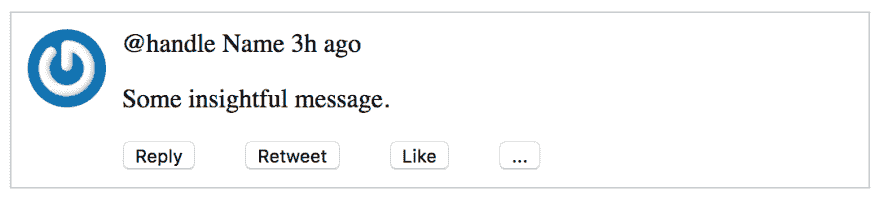](https://res.cloudinary.com/practicaldev/image/fetch/s--TKqM3fWC--/c_limit%2Cf_auto%2Cfl_progressive%2Cq_auto%2Cw_880/https://daveceddia.cimg/tweet-round-avatar.png)

## 画出其余的猫头鹰

我们还可以做一些修改来润色最终产品。

我们将字体设置为 Helvetica(Twitter 使用的那个)，将字体大小降低一点，将名称加粗，并且，嗯，颠倒“@handle Name”(在 HTML 中)的顺序，因为它在 Twitter :D 上看起来不是这样

```
.tweet {
  display: flex;
  align-items: flex-start;
  border: 1px solid #ccc;
  padding: 10px;
  /* 
    Change the font and size.
    Setting it on .tweet changes it for all child elements.
    (except the buttons. buttons are weird)
  */
  font-family: Helvetica, Arial, sans-serif;
  font-size: 14px;
}

.name {
  font-weight: 600;
}

.handle,
.time {
  color: #657786;
} 
```

使用`font-weight: 600;`和`font-weight: bold;`一样，有些字体有很多不同的粗细，你可以指定从 100 到 900(最细到最粗)。`normal`(默认)与 400 相同。

*顺便说一下* … CSS 技术上不允许注释像 JS 和其他语言那样以`//`开头。`//`风格可以在一些浏览器中工作，但是并不是对所有浏览器都安全。用 C 风格的`/* */`包围你的评论，你就万事俱备了。

还有一个小技巧:我们将通过使用一个**伪元素**在“句柄”和“时间”之间添加一个凸点。因为 dot 是纯风格的，所以用 CSS 来做是有意义的，不会把 HTML 弄得一团糟。

```
.handle::after {
  content: " \00b7";
} 
```

`::after`部分创建了一个伪元素，它被放在`.handle`内部，但是在它的末尾(“在内容之后”)。你也可以使用`::before`。`content`属性可以设置为任何文本，包括 Unicode 字符。你可以随意设计伪元素，和其他元素一样。它们可以方便地用于徽章、通知指示器或其他小装饰品。

### 图标按钮

我们还要做一件事，就是用图标代替按钮。我们将在`head`标签中添加字体 Awesome:

```
<link
  rel="stylesheet"
  href="https://use.fontawesome.com/releases/v5.8.1/css/all.css"
  integrity="sha384-50oBUHEmvpQ+1lW4y57PTFmhCaXp0ML5d60M1M7uH2+nqUivzIebhndOJK28anvf"
  crossorigin="anonymous"
/> 
```

然后用这个替换动作`ul`，其中每个按钮都有一个图标和一些隐藏的文本:

```
<ul class="actions">
  <li>
    <button>
      <i
        class="fas fa-reply"
        aria-hidden="true"
      ></i>
      <span class="sr-only">Reply</span>
    </button>
  </li>
  <li>
    <button>
      <i
        class="fas fa-retweet"
        aria-hidden="true"
      ></i>
      <span class="sr-only">Retweet</span>
    </button>
  </li>
  <li>
    <button>
      <i
        class="fas fa-heart"
        aria-hidden="true"
      ></i>
      <span class="sr-only">Like</span>
    </button>
  </li>
  <li>
    <button>
      <span aria-hidden="true">...</span>
      <span class="sr-only">More Actions</span>
    </button>
  </li>
</ul> 
```

字体 Awesome 是一种图标字体，它使用`i`“italic”标签来显示图标。因为它是一种字体，所以应用于文本的 CSS 属性(如`color`和`font-size`)也适用于图标。

在这里，我们添加了一些小的调整，使按钮可以访问:

*   属性告诉屏幕阅读器忽略图标。
*   `sr-only`类由 Font Awesome 提供。它在视觉上隐藏了应用它的元素，同时让屏幕阅读器可以访问它们。

这是 Marcy Sutton 关于创建可访问图标按钮的精彩免费课程。

现在，我们将为按钮添加一点样式——移除边框，给它们更好的颜色，并稍微放大字体。我们还将设置`cursor: pointer`,它将鼠标光标变成你通常在链接上看到的“手”。最后，`.actions button:hover`将鼠标悬停在按钮上，并将它们涂成蓝色。

```
.actions button {
  border: none;
  color: #657786;
  font-size: 16px;
  cursor: pointer;
}
.actions button:hover {
  color: #1da1f2;
} 
```

以下是最终风格的推文:

[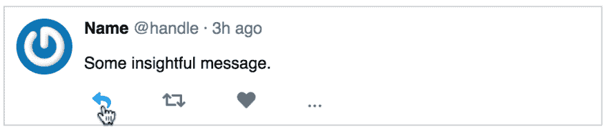](https://res.cloudinary.com/practicaldev/image/fetch/s--_avwgN8S--/c_limit%2Cf_auto%2Cfl_progressive%2Cq_auto%2Cw_880/https://daveceddia.cimg/tweet-finished-hover-button.png)

如果你想亲自体验一下，这里有一个代码沙箱。

## 如何更好地掌握 CSS

提高你的 CSS 技能最重要的事情就是练习。

挑选你喜欢的现有网站，然后复制它们。设计师和艺术家称之为“复制作品”。我写了一篇关于如何学习使用版权作品的文章，这些原则同样适用于 CSS。

选择看起来有趣的布局，有点超出你的舒适区。用 HTML 和 CSS 重新创建它们。当你陷入困境时，使用浏览器的开发工具来检查现有的网站，找出它们的窍门。起泡，冲洗，重复:)

[实现一个模型:一步一步的 CSS 布局](https://daveceddia.com/implement-a-design-with-css/)最初发表在[我的博客](https://daveceddia.com)上。****