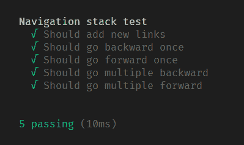

# 用 JavaScript 实现浏览器的后退和前进按钮

> 原文：<https://dev.to/thamaraiselvam/implementing-backward-and-forward-buttons-of-browser-in-javascript-1d52>

一直在思考**栈数据结构**的实时例子，在 StackOverflow 上发现[这个问题](https://stackoverflow.com/questions/1313788/how-does-the-back-button-in-a-web-browser-work)。

> 浏览页面的历史以类似堆栈的形式保存

我在 JavaScript 上实现了同样的功能。我花了 30 分钟才完成

我有两个栈**前向栈，后向栈**和一个变量来保存当前状态。

```
this.forwardStack = [];
this.backwardStack = [];
this.currentURL = ''; 
```

#### 问题解决方案

*   当用户第二次访问 URL 时，将当前 URL 推入后退状态。
*   如果点击了后退按钮，则将当前 URL 推入前进堆栈，从后退堆栈中弹出最后一个 URL，并设置为当前状态
*   如果点击了前进按钮，则将当前 URL 推入后退堆栈，并从前进堆栈中弹出最后一个 URL，并设置为当前状态

我把这个问题分成三个任务，比如，

*   添加新 URL
*   倒退
*   前进

##### 添加新的网址

```
addNewURL(url) {
    if (this.currentURL) {
        this.backwardStack.push(this.currentURL);
    }
    this.currentURL = url;
} 
```

如果用户第一次访问 URL，则将它添加到 **CurrentURL** ，如果第二个 URL 进入，则将当前 URL 推入反向堆栈并替换当前 URL。

##### 向后走

```
goBackward() {
    if (!this.backwardStack.length) {
        return;
    }

    this.forwardStack.push(this.currentURL);
    this.currentURL = this.backwardStack.pop();
} 
```

点击后退按钮，将当前 URL 推入前向堆栈，并从后向堆栈弹出最后一个 URL，使其成为当前 URL，如果堆栈为空，则返回。

##### 前进

```
goForward() {
    if (!this.forwardStack.length) {
        return;
    }

    this.backwardStack.push(this.currentURL);
    this.currentURL = this.forwardStack.pop();
} 
```

点击向前按钮，将当前 URL 推入向后堆栈，并从向前堆栈弹出最后一个 URL，使其成为当前 URL，如果堆栈为空，则返回。

万岁！

就这样，我们用 JavaScript 实现了浏览器的后退和前进按钮。

我也为此编写了一个测试用例。

[](https://res.cloudinary.com/practicaldev/image/fetch/s--ht8c1aNS--/c_limit%2Cf_auto%2Cfl_progressive%2Cq_auto%2Cw_880/https://cdn.hashnode.com/res/hashnode/image/upload/v1555409385757/CWv73o8JP.png)

这里是 [Github Repo](https://github.com/thamaraiselvam/NavigationStack) 的完整源代码。

这篇发表在[的文章讲述了一个故事](https://hashnode.com/post/implementing-backward-and-forward-buttons-of-browser-in-javascript-cjujn789z001cnrs1yyc2q06w)，我喜欢听到你们的反馈，如果我有任何错误，请不要忘记纠正我。