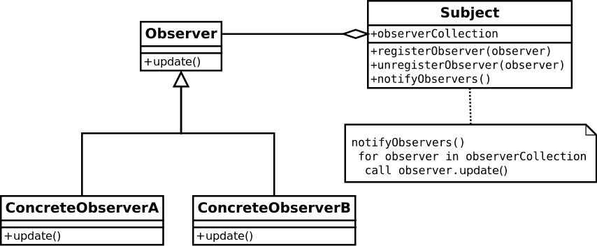

# 在 JavaScript 中实现观察者模式

> 原文：<https://dev.to/nishanbajracharya/implementing-the-observer-pattern-in-javascript-5heh>

 

<figcaption>无耻地借用维基百科</figcaption>

观察者模式是一种设计模式，它观察一个实体，并在发生变化时通知所有订阅者。它非常容易理解，并且在一个实体的变化需要触发许多事件时非常有效。

#### 观察者模式是如何工作的？

观察者模式是两个元素的组合，一个**主题，**和一个**观察者**。主体跟踪实体的值，观察者监听主体跟踪的变化。

当主体跟踪的实体发生变化时，主体会将变化通知给观察者。一个主题可以有许多观察者，在这种情况下，它会将实体中的变化通知给所有的观察者。当主题通知观察者时，观察者可以订阅触发事件。

#### 那么如何在 JavaScript 中实现观察者模式呢？

让我们从主体开始，它或者被称为**可观察的**。该主题包含一个**状态**和一个**观察器集合**，当状态改变时它会通知观察器。

该主题提供了注册和取消注册观察者的方法以及通知所有观察者的方法。