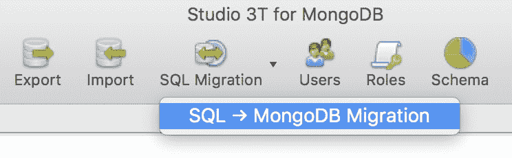
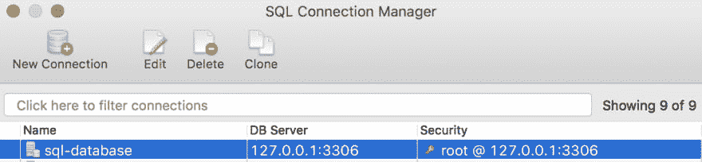
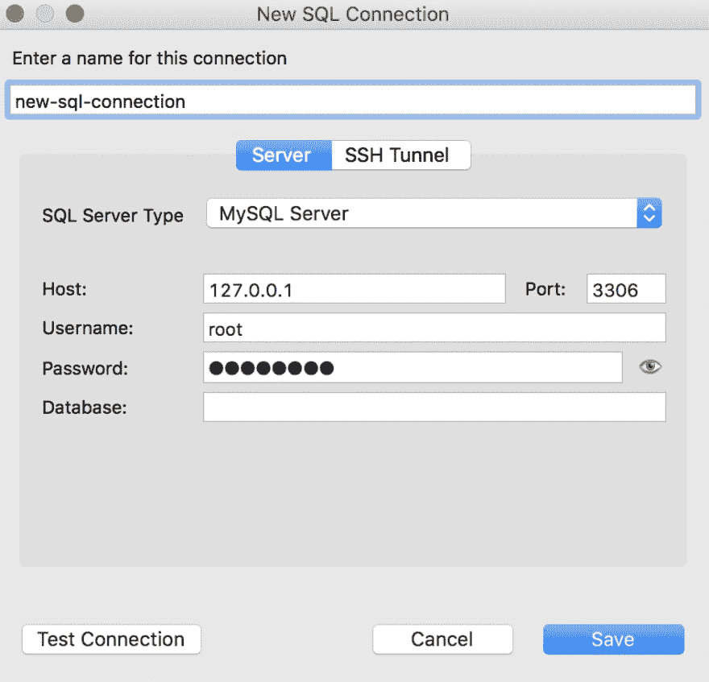
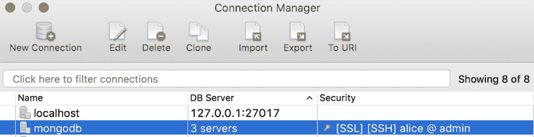
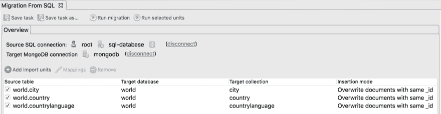
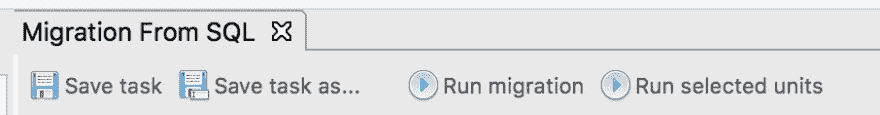
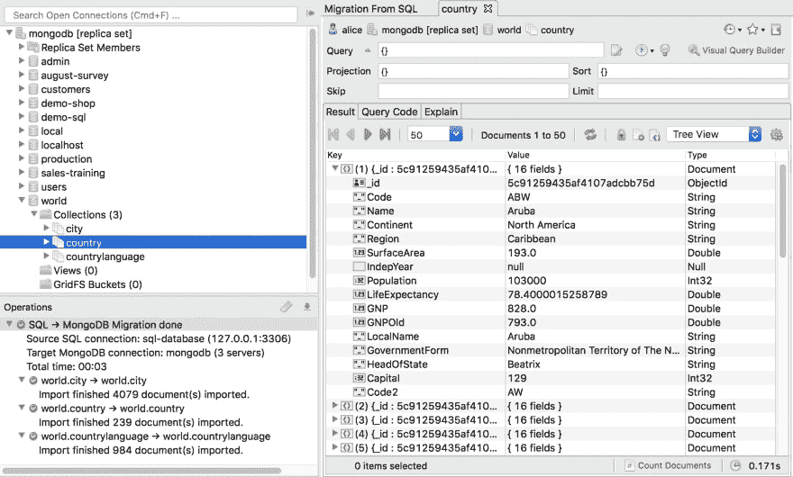

# 分 5 步将 MySQL 导入 MongoDB(加上 SQL Server、PostgreSQL、Oracle)

> 原文：<https://dev.to/kathrynvargas/import-mysql-to-mongodb-in-5-steps-plus-sql-server-postgresql-oracle-40mn>

在本教程中，我们将向您展示使用 [Studio 3T](https://studio3t.com/) 及其新的 [SQL 迁移](https://studio3t.com/knowledge-base/articles/sql-to-mongodb-migration/)特性将整个 SQL 数据库导入 MongoDB 的最快方法。

## 你需要什么

1.  您的 SQL 数据库连接详细信息。我们将在本教程中使用 MySQL，但 SQL Server、PostgreSQL 和 Oracle 也受支持。

2.  对 SQL 迁移的访问。Studio 3T 提供 30 天免费试用[这里](https://studio3t.com/download/)。

为了说明一个简单的 SQL 数据库导入，我们将使用公开可用的 [world](https://dev.mysql.com/doc/world-setup/en/world-setup-installation.html) 数据库，它包含三个表:

*   城市
*   国家
*   乡村语言

我们将把每个 SQL 表导入到一个 MongoDB 集合中，这意味着我们的目标数据库中应该有三个新集合。

## 1–打开 SQL 迁移

点击工具栏中的 **SQL 迁移> SQL - > MongoDB 迁移**。

## 2–选择源 SQL 连接

点击**点击此处连接到服务器**打开 SQL 连接管理器。

### 打开保存的连接

如果您已经保存了一个连接，从列表中选择您的源 SQL 连接(我们将使用 **sql-database** )。

### 创建新的连接

要创建一个新的 SQL 连接，点击**新建连接**，在**服务器**和 **SSH** 选项卡下输入连接详情，然后点击**保存**。

## 3–选择您的目标 MongoDB 连接

像步骤 2 一样，点击**点击这里连接到服务器**选择一个现有的 MongoDB 连接或者[创建一个新的](https://studio3t.com/knowledge-base/articles/connect-to-mongodb/#create-a-new-connection-e-g-connect-to-mongodb-localhost)。

这里我们将选择 **mongodb** 作为我们的目标连接。这是创建三个集合的地方。

## 4–选择 SQL 源表

Studio 3T 将它们称为“导入单元”，但是导入单元仅仅意味着 SQL 源表。

点击**添加导入单位**。

我们将选择三张**世界**牌桌—`city`、`country`和`countrylanguage`—为每张牌桌创建一个集合。

默认情况下，Studio 3T 会将每个表映射到一个同名的集合。

点击**确定**。这三个表都应该出现在概览中。

## 5–运行 SQL 导入

是时候运行 SQL 导入了。点击**运行迁移**。

在左下角的操作窗口中跟踪您的导入。

仔细检查**世界**数据库是否被导入到连接树中(左上角)。

最后，双击一个集合(如上面突出显示的`country`)来检查数据是否正确(确实如此！)

## 下一步

**world** 数据库非常简单——不需要一对一或一对多的表关系——所以默认映射对于这次导入就足够了。

但是，请注意，SQL 迁移让您可以完全控制这些映射。了解如何[将多个 SQL 表合并到一个 MongoDB 集合中](https://dev.to/kathrynvargas/how-to-merge-multiple-sql-tables-into-one-mongodb-collection-50d8/),了解如何使用 SQL 迁移进行更复杂的导入。

如果您同时使用 MongoDB 和 SQL， **Studio 3T** 使得用 SQL 查询 MongoDB[和在两个数据库之间轻松迁移数据成为可能。](https://studio3t.com/knowledge-base/articles/sql-query/)[试用一下，免费 30 天](https://studio3t.com/download/)。